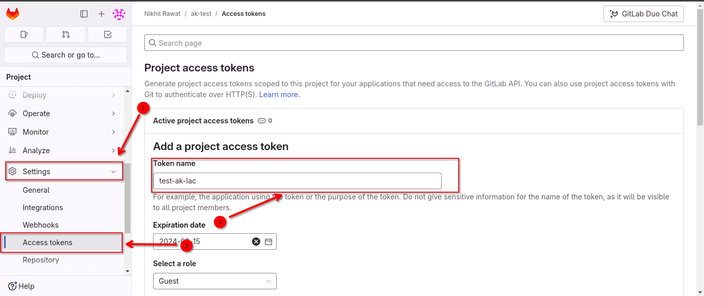
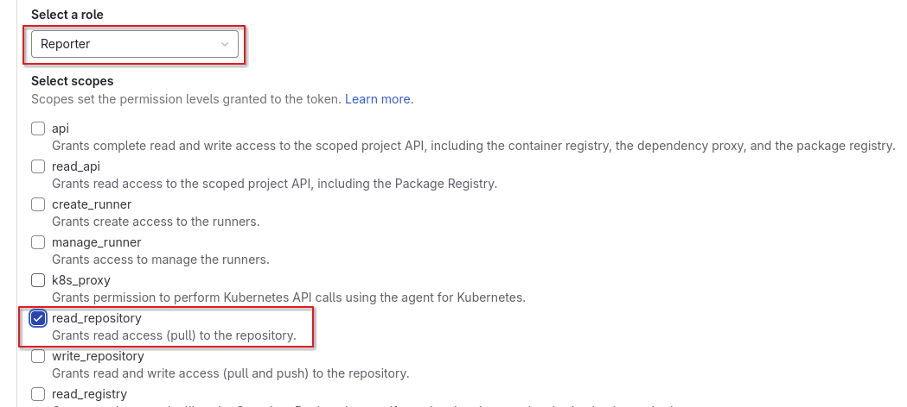
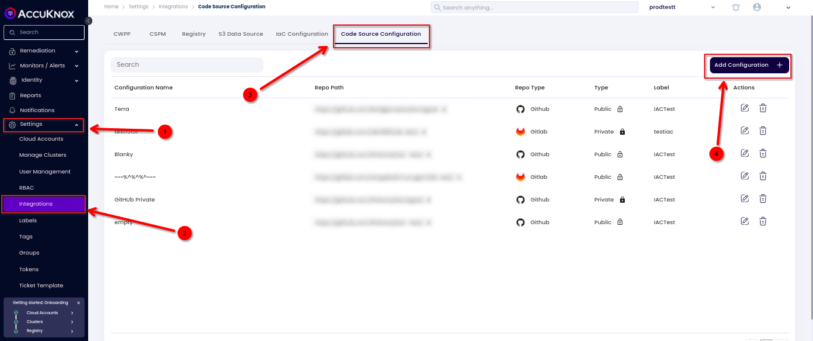
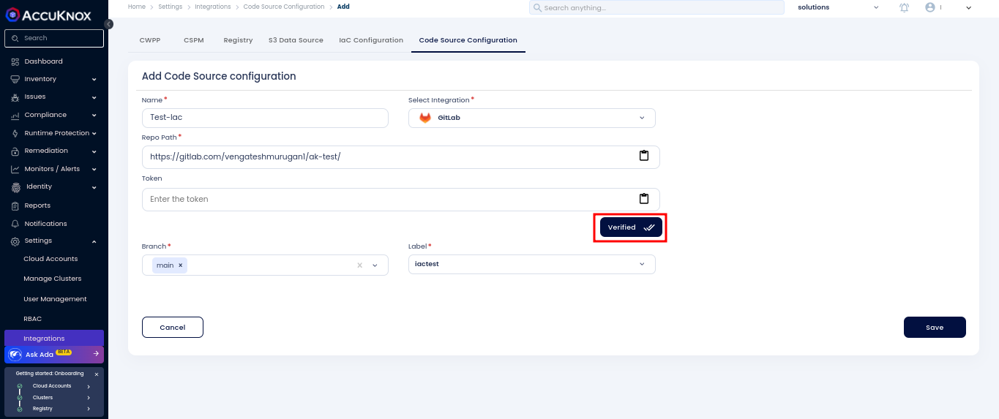
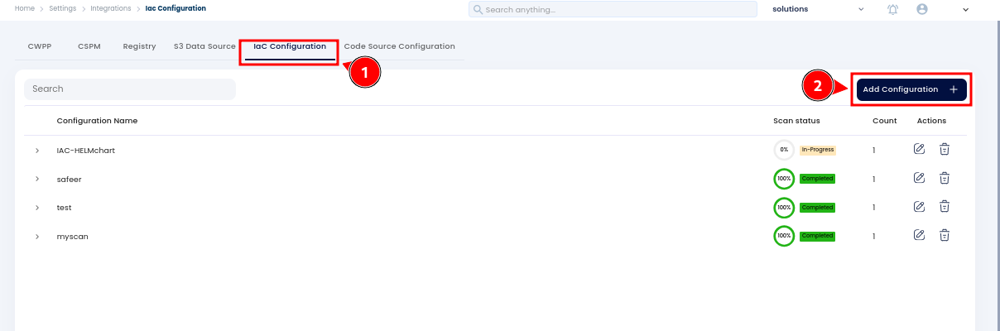
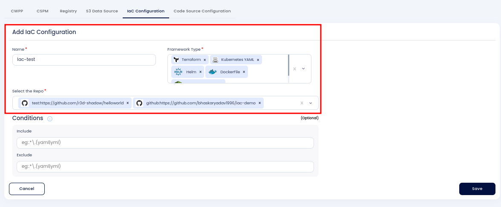
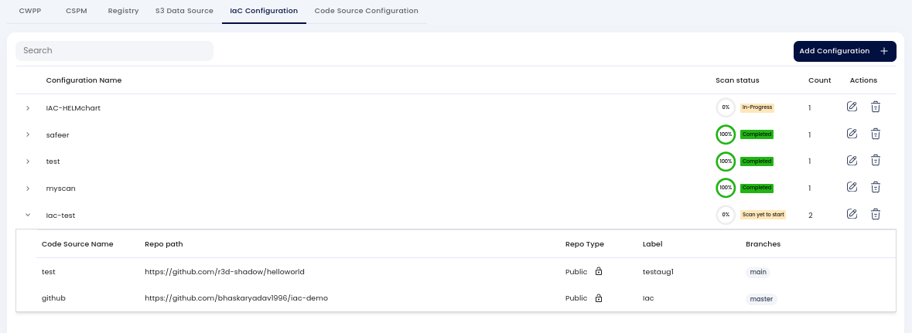
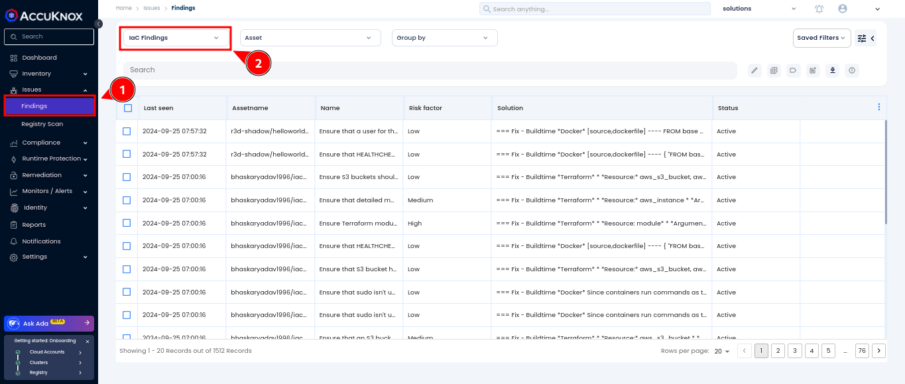

# GitLab IaC Scan via Accuknox

This guide demonstrates how to secure a CI/CD pipeline in GitLab using Accuknox to enhance security for Infrastructure as Code (IaC). We will identify code vulnerabilities and send the results to AccuKnox for analysis and remediation.

## **Prerequisites**

1. **Public Repository**:
    - You only need the repository URL containing the IaC files.

2. **Private Repository**:
    - Go to your GitLab repository Navigate to `Settings > Access Tokens` to get the token.
    

    - Add a new token with `read_repository` as the scope and assign the role as `Reporter`.
    

## **Configuring Code Source in Accuknox**

1. Go to `Settings > Integration > Code Source Configuration` on the Accuknox platform.

2. Enter the repository path:

    - **Public Repository**: No token is needed.

    - **Private Repository**: Enter the previously created access token.

3. Click on `Test` to verify the configuration and ensure there are no errors.

4. Select the branch type and label.

5. Save the configuration.

## **Setting Up IaC Configuration**

1. Navigate to the `IaC Configuration` tab.

2. Click on `Add Configuration`.

1. Fill in the following details:

    - **Integration Name**: Provide a name for this integration.

    - **Framework Type**: Select the file types you want to scan in the repository (e.g., Terraform, Helm, Dockerfile).

2. Select the repository from the dropdown menu that you previously added.

1. Under the conditions which is an Optional field, you can **include** or **exclude** specific files from the scan.

2. Save the configuration.

## **Viewing and Managing IaC Findings on Accuknox**

1. On the Accuknox platform, navigate to `Issues > Findings`.

2. Select the findings type as `IaC Findings`.

3. Add the appropriate labels to filter and view the specific IaC findings.

