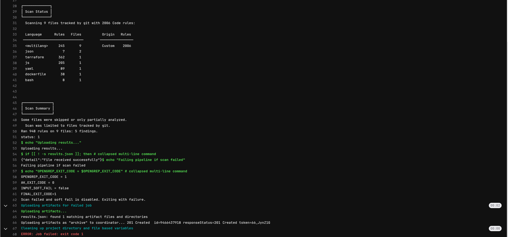
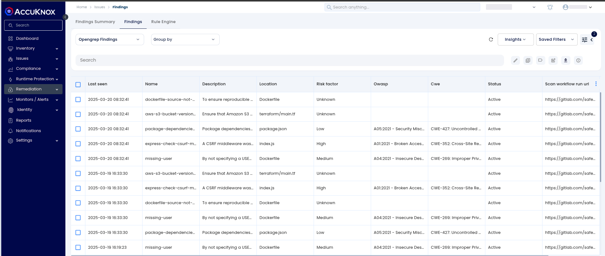
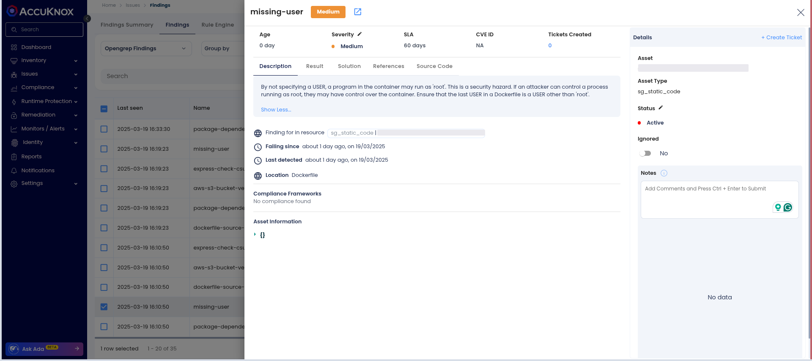
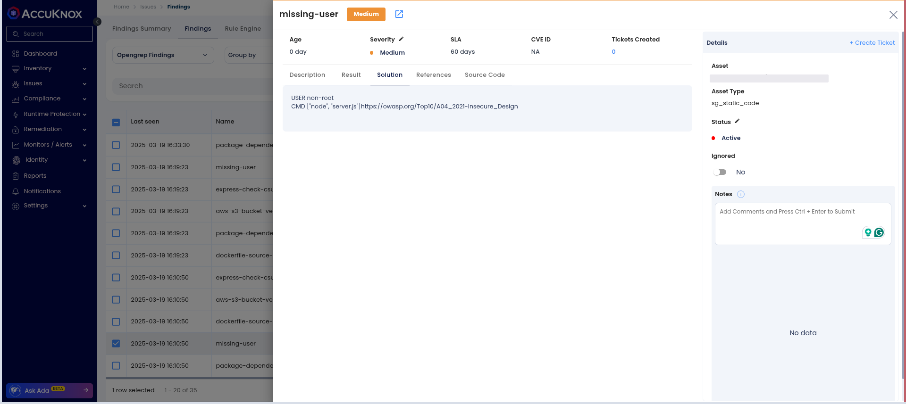
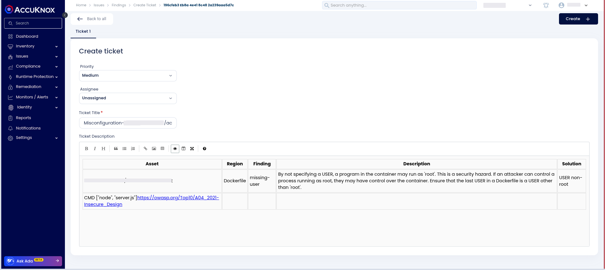

# Integrating SAST with AccuKnox in a GitLab CI/CD Pipeline

This guide demonstrates how to integrate SAST scanning into a GitLab CI/CD pipeline and forward the results to AccuKnox for security analysis and remediation.

### Prerequisites

- GitLab repository with CI/CD enabled

- AccuKnox SaaS account

### Integration Steps

#### Step 1: Generate AccuKnox API Token

Log in to AccuKnox, navigate to **Settings > Tokens**, and create an API token for forwarding scan results. For detailed instructions, refer to the documentation on [**Creating Tokens**](https://help.accuknox.com/how-to/how-to-create-tokens/?h=token "https://help.accuknox.com/how-to/how-to-create-tokens/?h=token").

#### Step 2: Configure GitLab CI/CD Variables

Define the following environment variables in GitLab under **Settings > CI/CD > Variables**, refer to [**How to Create CI/CD Variables in GitLab**](https://docs.gitlab.com/ee/ci/variables/ "https://docs.gitlab.com/ee/ci/variables/")**.**

- **ACCUKNOX_TOKEN**: AccuKnox API token for authorization.

- **ACCUKNOX_TENANT**: Your AccuKnox tenant ID.

- **ACCUKNOX_ENDPOINT**: The AccuKnox API URL (e.g., [cspm.demo.accuknox.com](http://cspm.demo.accuknox.com/ "http://cspm.demo.accuknox.com/")).

- **ACCUKNOX_LABEL**: The label for your scan.

### Inputs for AccuKnox SAST Action

| **Parameter**        | **Description**                                                                 | **Default Value**              |
|----------------------|---------------------------------------------------------------------------------|--------------------------------|
| `STAGE`              | Specifies the pipeline stage.                                                   | `test`                         |
| `SOFT_FAIL`          | Do not return an error code if vulnerabilities are found.                      | `true`                         |
| `UPLOAD_ARTIFACT`    | Uploads scan results to AccuKnox CSPM.                                         | `true`                         |
| `ACCUKNOX_TOKEN`     | Token for authenticating with the CSPM panel.                                  | **N/A (Required)**             |
| `ACCUKNOX_TENANT`    | The ID of the tenant associated with the CSPM panel.                           | **N/A (Required)**             |
| `ACCUKNOX_ENDPOINT`  | The URL of the CSPM panel to push the scan results to.                         | `cspm.demo.accuknox.com`       |
| `ACCUKNOX_LABEL`     | Label created in AccuKnox SaaS for associating scan results.                   | **N/A (Required)**             |

#### Step 3: Define GitLab CI/CD Pipeline

Create a new pipeline configuration in `.gitlab-ci.yml` with the following setup:

```yaml
include:
  - component: $CI_SERVER_FQDN/accu-knox/scan/sast-scan@2.0.0
    inputs:
      STAGE: test
      SOFT_FAIL: false
      ACCUKNOX_TOKEN: ${ACCUKNOX_TOKEN}
      ACCUKNOX_TENANT: ${ACCUKNOX_TENANT}
      ACCUKNOX_ENDPOINT: ${ACCUKNOX_ENDPOINT}
      ACCUKNOX_LABEL: ${ACCUKNOX_LABEL}
```

### Pipeline Execution

#### Before AccuKnox Integration

Initially, there are no security checks in place, and even if Opengrep is integrated, vulnerabilities might go unnoticed as they must be reviewed manually within the pipeline.

#### After AccuKnox Integration

With AccuKnox integrated, scan results are automatically forwarded for risk assessment and remediation.



### Viewing Results in AccuKnox

1.  Log in to **AccuKnox SaaS**.

2.  Navigate to **Issues > Findings > Opengrep Findings**.


3.  Select a vulnerability to inspect details.


4.  Apply fixes based on recommendations in the **Solutions** tab.


5.  Generate an issue ticket for tracking the fix.


6.  Review Updated Results

    - After fixing the vulnerability, rerun the workflow.

    - Navigate to the AccuKnox SaaS dashboard and verify that the vulnerability has been resolved.

### Conclusion

Integrating SAST with AccuKnox in GitLab CI/CD enhances security by automating vulnerability detection and remediation. This setup ensures centralized monitoring, early detection, and actionable insights, strengthening code quality and security throughout the development lifecycle.
