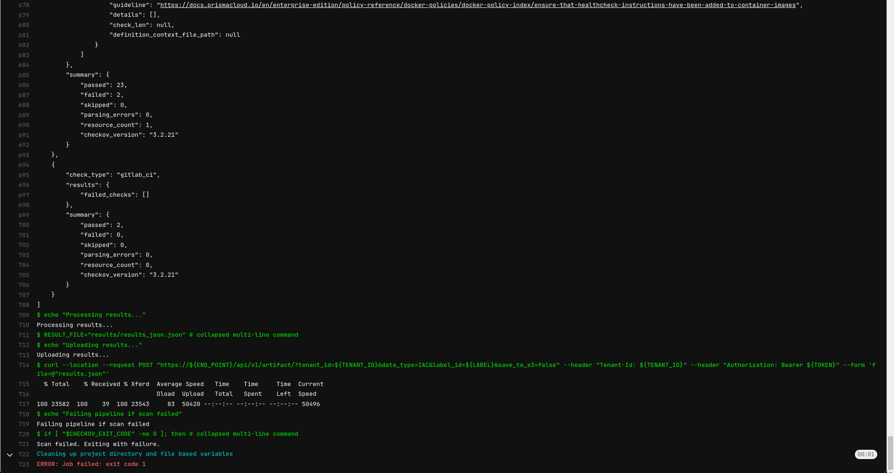
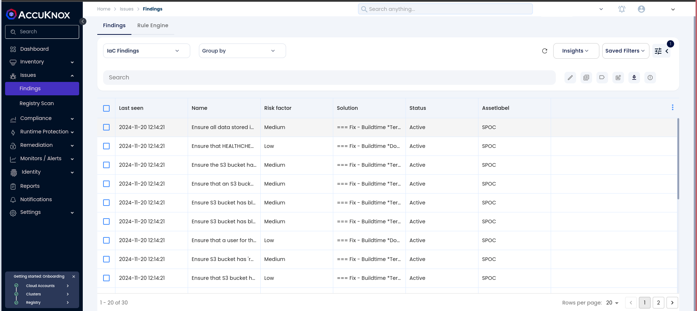
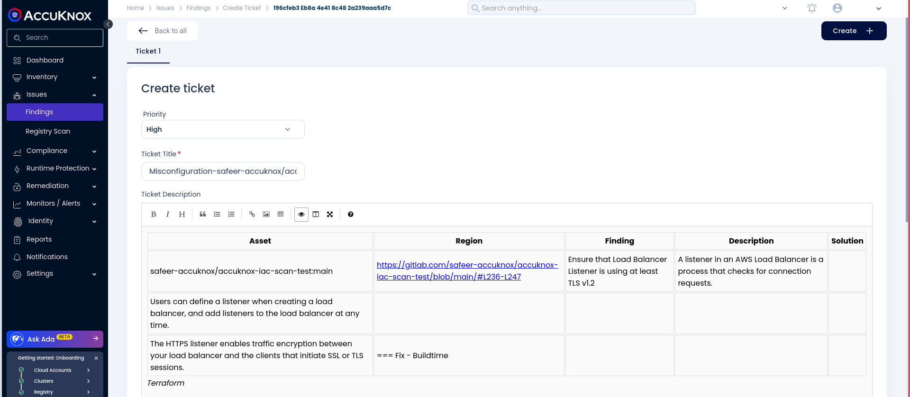

# Integrating IaC with AccuKnox in a GitLab CI/CD Pipeline

This guide demonstrates how to integrate Infrastructure as Code (IaC) security into a GitLab CI/CD pipeline using AccuKnox. We will implement automated checks to identify configuration vulnerabilities in your IaC templates and send the results to AccuKnox for thorough analysis and remediation. This approach ensures your infrastructure is resilient and aligns with security best practices, effectively minimizing deployment risks.

## **Pre-requisites**

- GitLab Access

- AccuKnox UI Access

## **Steps for Integration**

**Step 1**: Log in to Accuknox Navigate to Settings and select Tokens to create a token for forwarding scan results to Accuknox SaaS. Additionally tenant ID can also be found there which would be helpful for later use.



**Step 2**: Copy the token and create a GitLab CI/CD masked variable for the token to be used in the pipeline.



**Step 3**: In order to create a label Go to Accuknox > Settings > Labels and create a label, this label is needed to be configured in the pipeline configuration later.


**Step 4**: Set Up GitLab CI/CD Pipeline

Create a new pipeline in your GitLab project, and add the following YAML configuration. Update the variables and configurations to match your own project values.

```yaml
stages:
  - scan
  - process
  - deploy

variables:
  GITLAB_SERVER_URL: 'https://gitlab.com'
  GITLAB_REPOSITORY: 'nikhil120/ak-test'  # Update to your GitLab repository
  CSPM_URL: 'cspm.demo.accuknox.com'      # Replace with your CSPM endpoint
  TENANT_ID: '000'                        # Set your unique tenant ID
  ACCUKNOX_API_TOKEN: $ACCUKNOX_API_TOKEN # Ensure this environment variable is set

clone_repo:
  stage: scan
  script:
    - apt-get update
    - apt-get install -y python3 python3-venv python3-pip jq
    - python3 -m venv venv
    - source venv/bin/activate
    - pip install --upgrade pip
    - pip install checkov
    - git clone https://gitlab.com/${GITLAB_REPOSITORY}.git AccuKnox_Iac
    - checkov -d AccuKnox_Iac --output json > checkov_report.json || true
  artifacts:
    paths:
      - checkov_report.json

process_report:
  stage: process
  script:
    - echo "Setting up the environment"
    - apt-get update
    - apt-get install -y python3 python3-venv python3-pip jq
    - echo "Checkov scan complete."
    - ls -al
    - echo "Manipulating JSON report..."
    - |
      # Define repo and branch variables (set these appropriately)
      REPO_LINK="https://gitlab.com/${GITLAB_REPOSITORY}"
      BRANCH_NAME="main"  # GitLab predefined variable for branch name

      # Check if the report is empty or not and manipulate JSON
      if [ -s checkov_report.json ]; then
        jq --arg repoLink "$REPO_LINK" --arg branch "$BRANCH_NAME" \
           '. += [{"details": {"repo": $repoLink, "branch": $branch}}]' \
           checkov_report.json > temp.json && \
        mv temp.json checkov_report.json
      else
        echo "[]" > checkov_report.json  # Initialize an empty array if the file is empty
        jq --arg repoLink "$REPO_LINK" --arg branch "$BRANCH_NAME" \
           '. += [{"details": {"repo": $repoLink, "branch": $branch}}]' \
           checkov_report.json > temp.json && \
        mv temp.json checkov_report.json
      fi
  artifacts:
    paths:
      - checkov_report.json

push_report:
  stage: deploy
  image: curlimages/curl:latest
  script:
    - echo "Uploading checkov_report.json to CSPM endpoint...."
    - |
      curl --location --request POST "https://${CSPM_URL}/api/v1/artifact/?tenant_id=${TENANT_ID}&data_type=IAC&label_id=iactest&save_to_s3=false" \
      --header "Tenant-Id: ${TENANT_ID}" \
      --header "Authorization: Bearer ${ACCUKNOX_API_TOKEN}" \
      --form "file=@checkov_report.json"
  dependencies:
    - process_report
```

!!! info note "**Configuration Notes:**"

    -   **GITLAB_REPOSITORY**: Replace this with the path to your GitLab repository in the format `username/repository-name`.Replace with your actual GitLab repository path.

    -   **CSPM_URL**: Set this to your specific AccuKnox CSPM endpoint URL.

    -   **TENANT_ID**: Set your tenant ID here.

    -   **ACCUKNOX_API_TOKEN**: Ensure this variable is stored securely in GitLab CI/CD settings.

    -   **LABEL_ID**: Customize this label to identify the scan report (e.g. "iac-test"). This label helps categorize and retrieve reports within Accuknox CSPM.

## **Initial CI/CD Pipeline Without AccuKnox IaC Scan**

Initially, the CI/CD pipeline does not include the AccuKnox IaC scan. When changes are pushed to the repository, no infrastructure security checks are performed, potentially allowing misconfigurations or vulnerabilities in the IaC code.

## **CI/CD Pipeline After AccuKnox IaC Scan Integration**

Once the AccuKnox IaC scan is integrated into the CI/CD pipeline, every push triggers an IaC security scan. This scan identifies potential security vulnerabilities or misconfigurations in the infrastructure code, enhancing security prior to deployment. The findings are then sent to the AccuKnox platform.



## **View Results in AccuKnox SaaS**

**Step 1**: After the pipeline completes, navigate to the Accuknox SaaS dashboard.

**Step 2**: Go to **Issues** > **Findings** and select **IaC Findings** to see identified vulnerabilities.


**Step 3**: Click on a vulnerability to view more details and follow the instructions in the **Solutions** tab.


**Step 4**: For unresolved vulnerabilities, create a ticket in your issue tracking system.


**Step 5**: After fixing the vulnerabilities, rerun the GitLab CI/CD pipeline and verify that the issues have been resolved in the AccuKnox dashboard.

## **Conclusion**

By integrating Checkov for IaC scanning with AccuKnox in a GitLab CI/CD pipeline, you strengthen the security of your infrastructure code. This integration allows for early detection and remediation of misconfigurations and vulnerabilities in the development lifecycle, ensuring a more secure deployment environment.
