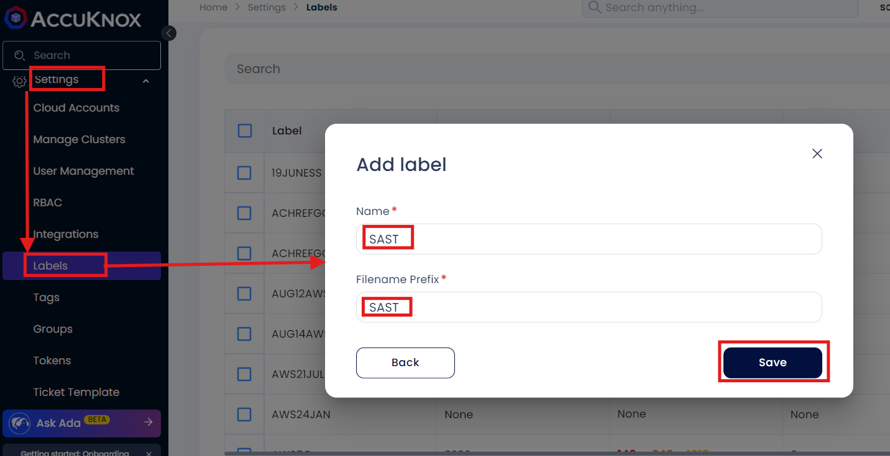
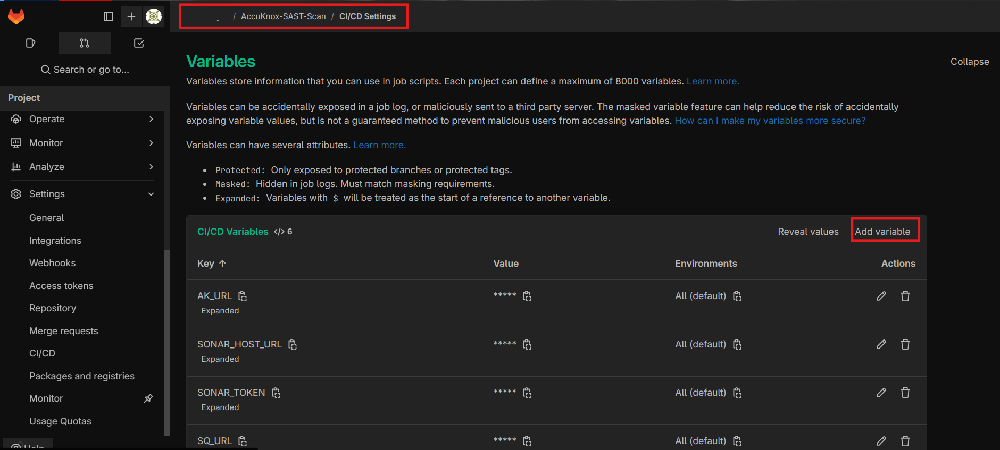
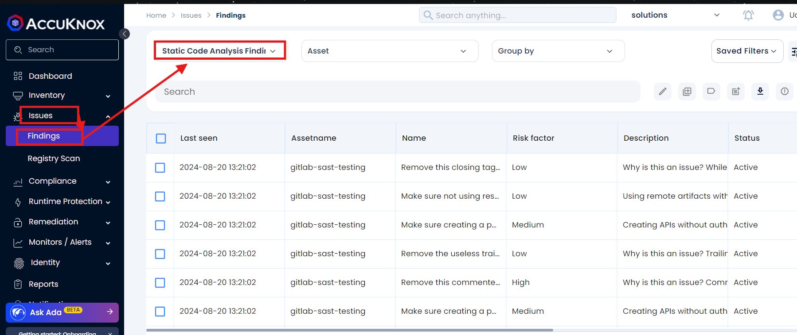
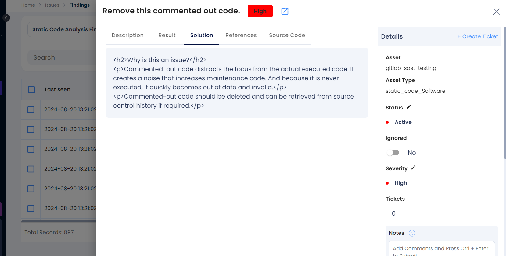
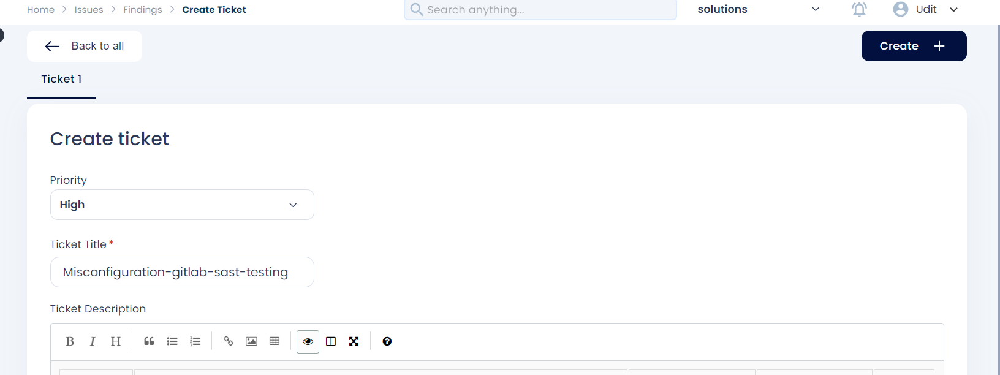

# Integrating SonarQube SAST with AccuKnox in a GitLab CI/CD Pipeline

This guide demonstrates how to incorporate AccuKnox into a CI/CD pipeline using GitLab to enhance security. We'll use SonarQube SAST scanning to identify code vulnerabilities and send the results to AccuKnox for further analysis and remediation.

## Pre-requisites

- GitLab Access

- AccuKnox Platform Access

- SonarQube Access

## Steps for Integration

**Step 1**: Log in to AccuKnox Navigate to Settings and select Tokens to create an AccuKnox token for forwarding scan results to SaaS. For details on generating tokens, refer to [How to Create Tokens](https://help.accuknox.com/how-to/how-to-create-tokens/?h=token "https://help.accuknox.com/how-to/how-to-create-tokens/?h=token").

**Step 2:** Configure GitLab CI/CD Variables. For details on configuring variables, refer to [How to Create CI/CD Variables in GitLab](https://docs.gitlab.com/ee/ci/variables/ "https://docs.gitlab.com/ee/ci/variables/").

1. **ACCUKNOX_TOKEN**: AccuKnox API token for authorization.

2. **ACCUKNOX_TENANT**: Your AccuKnox tenant ID.

3. **ACCUKNOX_ENDPOINT**: The AccuKnox API URL (e.g., [cspm.demo.accuknox.com](http://cspm.demo.accuknox.com/ "http://cspm.demo.accuknox.com")).

4. **ACCUKNOX_LABEL**: The label for your scan.

5. **SONAR_TOKEN**: Your SonarQube API token.

6. **SONAR_HOST_URL**: The URL of your SonarQube server.

7. **SONAR_PROJECT_KEY**: The project key for your SonarQube project.

**Step 3:** Set Up GitLab CI/CD Pipeline

Create a new pipeline in your GitLab project with the following YAML configuration:

```yaml
sonarqube-check:
  image:
    name: sonarsource/sonar-scanner-cli:latest
    entrypoint: [""]
  variables:
    SONAR_USER_HOME: "${CI_PROJECT_DIR}/.sonar"
    GIT_DEPTH: "0"
    SONAR_TOKEN: ${SONAR_TOKEN}
    SONAR_HOST_URL: ${SONAR_HOST_URL}
    SONAR_PROJECT_KEY: ${SONAR_PROJECT_KEY}
  cache:
    key: "${CI_JOB_NAME}"
    paths:
      - .sonar/cache
  script:
    - sonar-scanner -Dsonar.qualitygate.wait=true -Dsonar.host.url=$SONAR_HOST_URL -Dsonar.projectKey=$SONAR_PROJECT_KEY -Dsonar.token=$SONAR_TOKEN -Dsonar.sources=. \
  allow_failure: true

include:
  - component: $CI_SERVER_FQDN/accu-knox/scan/sast-scan@1.1
    inputs:
      STAGE: test
      SONAR_TOKEN: ${SONAR_TOKEN}
      SONAR_HOST_URL: ${SONAR_HOST_URL}
      SONAR_PROJECT_KEY: ${SONAR_PROJECT_KEY}
      ACCUKNOX_TOKEN: ${ACCUKNOX_TOKEN}
      ACCUKNOX_TENANT: ${ACCUKNOX_TENANT}
      ACCUKNOX_ENDPOINT: ${ACCUKNOX_ENDPOINT}
      ACCUKNOX_LABEL: ${ACCUKNOX_LABEL}
    needs:
      - job: sonarqube-check
```

## Initial CI/CD Pipeline Without AccuKnox Scan

Initially, the CI/CD pipeline does not include the AccuKnox scan. Vulnerabilities in the code could go unnoticed without security checks.

## CI/CD Pipeline After AccuKnox Integration

After integrating AccuKnox into the pipeline, pushing changes triggers the SonarQube scan, and results are sent to AccuKnox. AccuKnox helps identify potential code vulnerabilities.




## View Results in AccuKnox SaaS

**Step 1**: After the workflow completes, navigate to the AccuKnox SaaS dashboard.

**Step 2**: Go to **Issues** > **Findings** and select **SAST Findings** to see identified vulnerabilities.



**Step 3**: Click on a vulnerability to view more details.



**Step 4**: Fix the Vulnerability

Follow the instructions in the Solutions tab to fix the vulnerability



**Step 5**: Create a Ticket for Fixing the Vulnerability

Create a ticket in your issue-tracking system to address the identified vulnerability.



**Step 6**: Review Updated Results

- After fixing the vulnerability, rerun the GitLab CI/CD pipeline.

- Navigate to the AccuKnox SaaS dashboard and verify that the vulnerability has been resolved.

## Conclusion

By integrating SonarQube SAST with AccuKnox in a GitLab CI/CD pipeline, you enhance the security of your codebase. This integration helps detect and address potential vulnerabilities early in the development lifecycle, ensuring a secure deployment environment.
