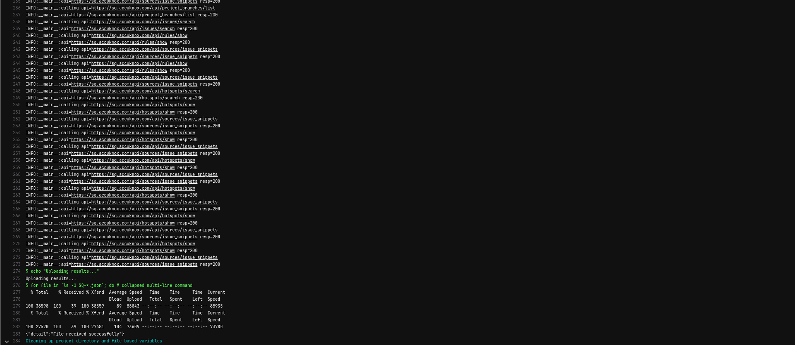
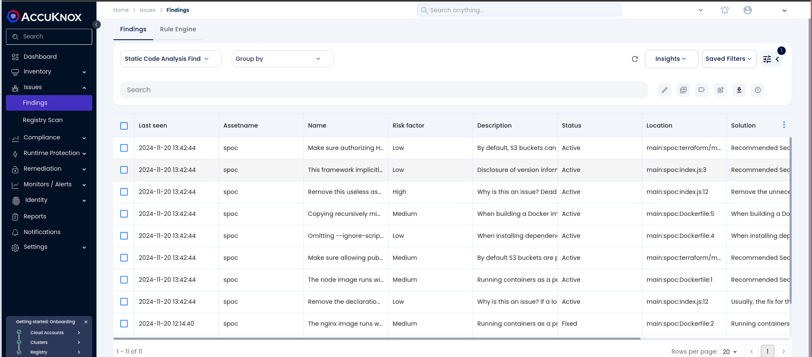

# Integrating SonarQube SAST with AccuKnox in a GitLab CI/CD Pipeline

## Introduction

This guide demonstrates how to incorporate AccuKnox into a CI/CD pipeline using GitLab to enhance security. We'll use SonarQube SAST scanning to identify code vulnerabilities and send the results to AccuKnox for further analysis and remediation.

## Pre-requisites

- **GitLab Access**
- **AccuKnox UI Access**
- **SonarQube Access**

## Steps for Integration

### Step 1: Log in to AccuKnox

- Navigate to **Settings** and select **Tokens** to create an AccuKnox token for forwarding scan results to SaaS.


- Go to **AccuKnox > Settings > Labels** and create a label. This label will be used in the GitLab pipeline YAML file.



### Step 2: Create GitLab CI/CD Variables

- Copy the AccuKnox token and create a GitLab CI/CD masked variable for it.

- Additionally, create variables for the **tenant ID**, **AccuKnox URL**, **SonarQube token**, and the **SonarQube project URL**.



### Step 3: Set Up GitLab CI/CD Pipeline

Create a new pipeline in your GitLab project with the following YAML configuration:

```yaml
stages:
  - sonarqube-check
  - fetch-report
  - upload-report

sonarqube-check:
  stage: sonarqube-check
  image:
    name: sonarsource/sonar-scanner-cli:latest
    entrypoint: [""]
  variables:
    SONAR_USER_HOME: "${CI_PROJECT_DIR}/.sonar"  # Defines the location of the analysis task cache
    GIT_DEPTH: "0"  # Ensures all branches are fetched, required by the analysis task
  cache:
    key: "${CI_JOB_NAME}"
    paths:
      - .sonar/cache
  script:
    - sonar-scanner -Dsonar.qualitygate.wait=true || true
  allow_failure: true
  rules:
    - if: $CI_COMMIT_REF_NAME == 'main' || $CI_PIPELINE_SOURCE == 'merge_request_event'

fetch-report:
  stage: fetch-report
  image: docker:latest
  services:
  - docker:dind
  dependencies:
    - sonarqube-check
  script:
    - |
      docker run --rm \
        -e SQ_URL=$SQ_URL \
        -e SQ_AUTH_TOKEN=$SONAR_TOKEN \
        -e REPORT_PATH=/app/data/ \
        -e SQ_PROJECTS="^gitlab-sast-testing$" \
        -v $PWD:/app/data/ \
        accuknox/sastjob:latest
  artifacts:
    paths:
      - SQ-*.json
    expire_in: 1 hour  # Optional: Set expiration time for artifacts

upload-report:
  stage: upload-report
  image: curlimages/curl:latest
  dependencies:
    - fetch-report
  script:
    - |
      for file in `ls -1 SQ-*.json`; do
        curl --location --request POST "<https://$AK_URL/api/v1/artifact/?tenant_id=$TENANT_ID&data_type=SQ&save_to_s3=false>" \
          --header "Tenant-Id: $TENANT_ID" \
          --header "Authorization: Bearer $TOKEN" \
          --form "file=@\"$file\""
      done
```

## Initial CI/CD Pipeline Without AccuKnox Scan

Initially, the CI/CD pipeline does not include the AccuKnox scan. Vulnerabilities in the code could go unnoticed without security checks.

## CI/CD Pipeline After AccuKnox Integration

After integrating AccuKnox into the pipeline, pushing changes triggers the SonarQube scan, and results are sent to AccuKnox. AccuKnox helps identify potential code vulnerabilities.

## View Results in AccuKnox SaaS

1. **Access the Dashboard:** After the pipeline completes, navigate to the AccuKnox SaaS dashboard.

2. **View Findings:** Go to **Issues > Findings** and select **SAST Findings** to see identified vulnerabilities.


3. **Analyze and Fix Vulnerabilities:** Click on a vulnerability to view more details and follow the instructions in the **Solutions** tab.


4. **Create a Ticket:** For unresolved vulnerabilities, create a ticket in your issue tracking system.


5. **Re-run the Pipeline:** After fixing the vulnerabilities, rerun the GitLab CI/CD pipeline and verify that the issues have been resolved in the AccuKnox dashboard.

## Conclusion

By integrating SonarQube SAST with AccuKnox in a GitLab CI/CD pipeline, you enhance the security of your codebase. This integration helps detect and address potential vulnerabilities early in the development lifecycle, ensuring a secure deployment environment.
