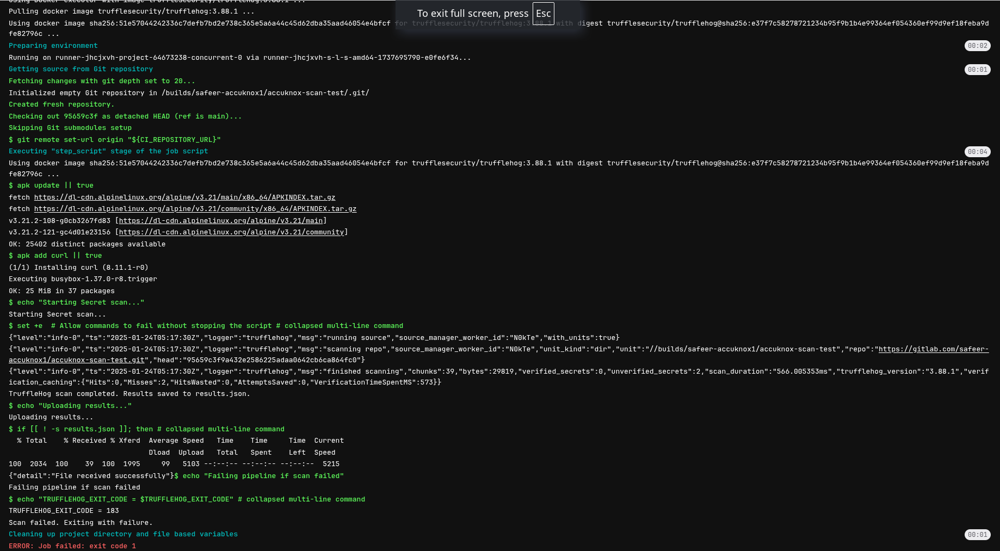
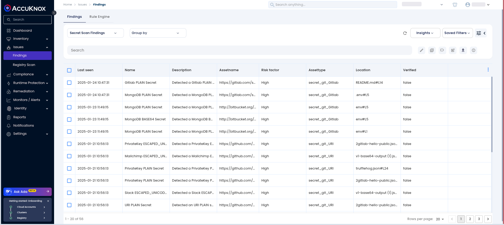
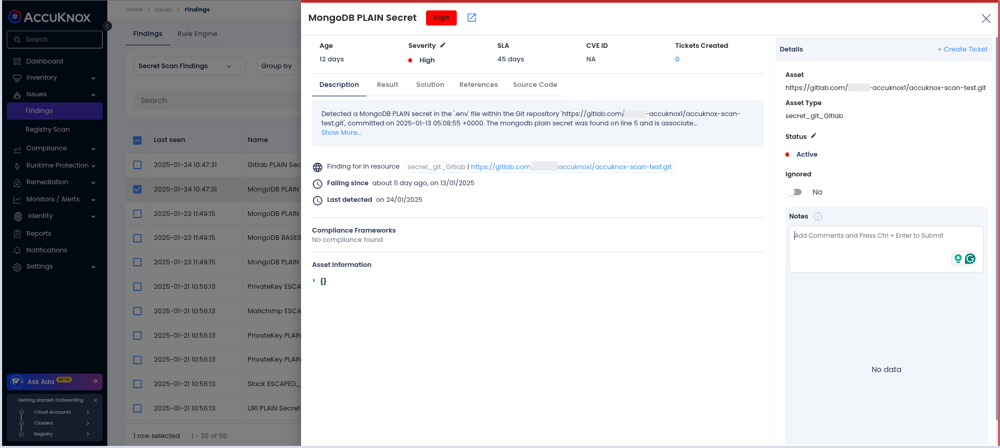
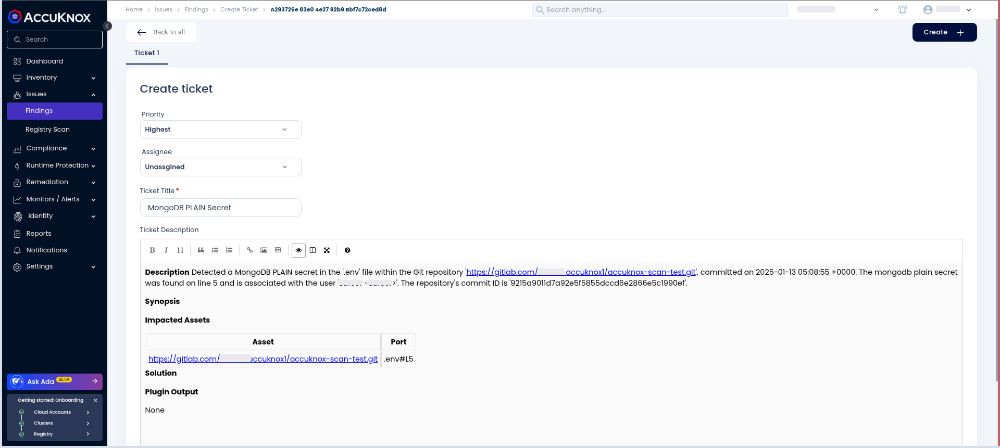

# Gitlab Secret Scan

This guide walks you through integrating AccuKnox Secret Scanning into your GitLab CI/CD pipeline to improve code security. The integration helps identify hard-coded secrets and sensitive data in your repositories, with scan results uploaded to the AccuKnox SaaS platform for analysis and remediation.

## Pre-requisites

- GitLab Access

- AccuKnox Platform Access

## Steps for Integration

**Step 1**: Log in to AccuKnox Navigate to Settings and select Tokens to create an AccuKnox token for forwarding scan results to SaaS. For details on generating tokens, refer to [How to Create Tokens](https://help.accuknox.com/how-to/how-to-create-tokens/?h=token "https://help.accuknox.com/how-to/how-to-create-tokens/?h=token").

**Step 2:** Configure GitLab CI/CD Variables. For details on configuring variables, refer to [How to Create CI/CD Variables in GitLab](https://docs.gitlab.com/ee/ci/variables/ "https://docs.gitlab.com/ee/ci/variables/").

1.  **ACCUKNOX_TOKEN**: AccuKnox API token for authorization.

2.  **ACCUKNOX_TENANT**: Your AccuKnox tenant ID.

3.  **ACCUKNOX_ENDPOINT**: The AccuKnox API URL (e.g., [cspm.demo.accuknox.com](http://cspm.demo.accuknox.com/ "http://cspm.demo.accuknox.com/")).

4.  **ACCUKNOX_LABEL**: The label for your scan.

**Step 3**: Set Up GitLab CI/CD Pipeline

Create a new pipeline in your GitLab project with the following YAML configuration:

```yml
include:
  - component: $CI_SERVER_FQDN/accu-knox/scan/secret-scan@main
    inputs:
      STAGE: test
      INPUT_SOFT_FAIL: false
      ACCUKNOX_TOKEN: ${ACCUKNOX_TOKEN}
      ACCUKNOX_TENANT: ${ACCUKNOX_TENANT}
      ACCUKNOX_ENDPOINT: ${ACCUKNOX_ENDPOINT}
      ACCUKNOX_LABEL: ${ACCUKNOX_LABEL}
```

## Impact of AccuKnox Secret Scanning Integration

### Before Integration

Your pipeline might not perform secret scanning, potentially exposing sensitive data in your code.

### After Integration

AccuKnox Secret Scanning will run on every push, detecting hard-coded secrets and sensitive information. The findings are sent to AccuKnox for review and remediation. Only the scan results are uploaded, not the sensitive data.



## View Results in AccuKnox SaaS

**Step 1**: Navigate to the Accuknox SaaS dashboard after the pipeline completes.

**Step 2**: Go to **Issues** > **Findings** and select **Secret Scan Findings** to see identified vulnerabilities.



### Step 3: Review Detected Secrets

Examine the list of identified hardcoded secrets and sensitive information.



### Step 4: Address Findings

For each finding, create a task in your issue-tracking system, advising secret rotation and the use of a secure secret management solution. Once resolved, mark the issue as fixed in the AccuKnox platform.



## Conclusion

Integrating AccuKnox Secret Scanning into your GitLab CI/CD pipeline ensures a proactive security measure against hardcoded secrets. This helps mitigate risks early in development and guarantees that sensitive information is properly protected, enhancing the overall security of your codebase.
