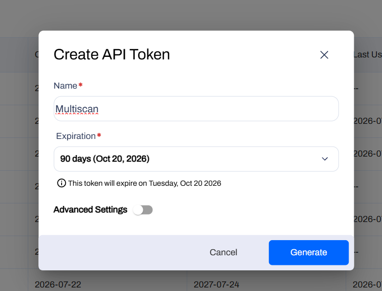
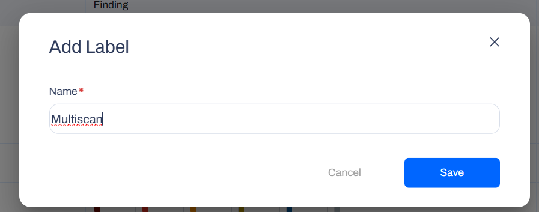
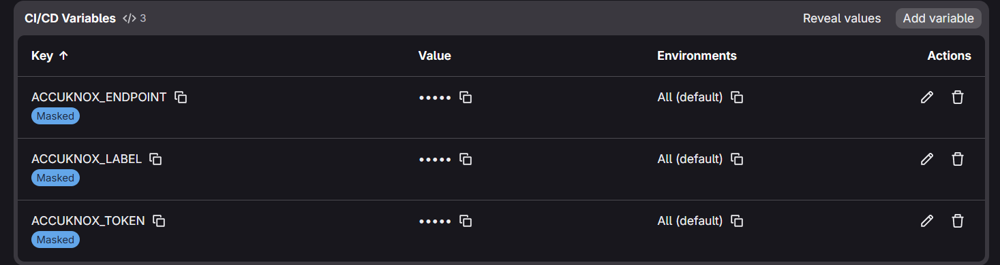
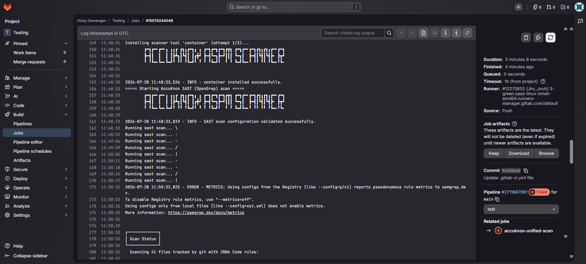
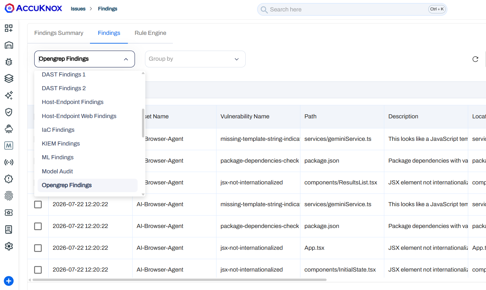

# Running Unified Scans with AccuKnox in a GitLab CI/CD Pipeline

## Overview

This guide demonstrates how to integrate the **AccuKnox Unified Scan** component into a GitLab CI/CD pipeline. Unlike the individual per-scan GitLab components, Unified Scan runs any combination of ASPM scans, SAST, SCA, Secrets, IaC, ML, and SBOM, from a single component, and forwards the results to AccuKnox for centralized security analysis and remediation.

## Prerequisites

- A GitLab repository with CI/CD enabled.
- An AccuKnox SaaS account.

## Integration Steps

**Step 1: Generate an AccuKnox API Token**

1. Log in to AccuKnox and navigate to **Settings → Tokens**.
2. Create an API token for forwarding scan results.



**Step 2: Create an AccuKnox Label**

Navigate to **Dashboard → Labels** and create a label, you'll use this value for the `ACCUKNOX_LABEL` CI/CD variable.



**Step 3: Configure GitLab CI/CD Variables**

Define the following variables under **Settings → CI/CD → Variables**:

| Variable | Description |
|----------|-------------|
| `ACCUKNOX_TOKEN` | AccuKnox API token for authorization |
| `ACCUKNOX_ENDPOINT` | The AccuKnox API URL (for example `cspm.demo.accuknox.com`) |
| `ACCUKNOX_LABEL` | The label created above |



!!! note
    The Unified Scan component reads these three variables automatically from the environment. Do not pass them as component inputs in your pipeline.

### Inputs for AccuKnox Unified Scan

| Parameter | Description |
|-----------|-------------|
| `SCAN_TYPE` | Comma or space separated list of scans to run: `sast`, `sca`, `secret`, `iac`, `ml`, `sbom`. Required. |
| `STAGE` | Pipeline stage in which the scan job runs. |
| `SOFT_FAIL` | Do not fail the job if a scan finds issues (applies to all scans). |
| `SAST_SEVERITY` | SAST: comma-separated severities to report (`LOW`, `MEDIUM`, `HIGH`, `CRITICAL`). |
| `SCA_COMMAND` | SCA: command text (for example `fs .`). |
| `SECRET_COMMAND` | Secret: base command (for example `git file://.`). |
| `ML_COMMAND` | ML: command text (for example `scan -p . -r json`). |
| `SBOM_SCAN_TYPE` | SBOM: target type, `image` or `filesystem`. |
| `SBOM_IMAGE_REF` | SBOM: registry image reference (required when `SBOM_SCAN_TYPE` is `image`). |
| `SBOM_SCAN_PATH` | SBOM: filesystem path (used when `SBOM_SCAN_TYPE` is `filesystem`). |
| `SBOM_PROJECT_NAME` | SBOM: AccuKnox project name. Required for `sbom`. |
| `ACCUKNOX_TOKEN` | Token for authenticating with the AccuKnox Console. Provide as a CI/CD variable. |
| `ACCUKNOX_ENDPOINT` | URL of the AccuKnox Console to push results to. |
| `ACCUKNOX_LABEL` | Label in AccuKnox SaaS for associating scan results. |

**Step 4: Define the GitLab CI/CD Pipeline**

Create (or update) `.gitlab-ci.yml` at the root of your repository:

```yaml
stages:
  - test

variables:
  GIT_DEPTH: 0

include:
  - component: $CI_SERVER_FQDN/accu-knox/accuknox-code-analysis/unified-scan@~latest
    inputs:
      SCAN_TYPE: "sast, sca, secret, iac, ml, sbom"
      SOFT_FAIL: true
      SAST_SEVERITY: "HIGH,CRITICAL"
      SBOM_SCAN_TYPE: "filesystem"
      SBOM_SCAN_PATH: "."
      SBOM_PROJECT_NAME: "my-project"
```

Only the inputs relevant to the scans listed in `SCAN_TYPE` are used, everything else is ignored, so pipelines can stay minimal.

## Example Configurations

Each block below is a complete `.gitlab-ci.yml`. All examples assume `ACCUKNOX_TOKEN`, `ACCUKNOX_ENDPOINT`, and `ACCUKNOX_LABEL` are already configured as CI/CD variables.

### 1. SAST

```yaml
stages:
  - test

include:
  - component: $CI_SERVER_FQDN/accu-knox/accuknox-code-analysis/unified-scan@~latest
    inputs:
      SCAN_TYPE: "sast"
      SAST_SEVERITY: "HIGH,CRITICAL"
      SOFT_FAIL: true
```

### 2. SCA

```yaml
stages:
  - test

include:
  - component: $CI_SERVER_FQDN/accu-knox/accuknox-code-analysis/unified-scan@~latest
    inputs:
      SCAN_TYPE: "sca"
      SCA_COMMAND: "fs ."
      SCA_SEVERITY: "HIGH,CRITICAL"
      SOFT_FAIL: true
```

### 3. Secret Scan

Secret scanning reads git history, set `GIT_DEPTH: 0` since GitLab clones shallow by default.

```yaml
stages:
  - test

variables:
  GIT_DEPTH: 0

include:
  - component: $CI_SERVER_FQDN/accu-knox/accuknox-code-analysis/unified-scan@~latest
    inputs:
      SCAN_TYPE: "secret"
      SECRET_COMMAND: "git file://."
      SOFT_FAIL: true
```

### 4. IaC Scan

```yaml
stages:
  - test

include:
  - component: $CI_SERVER_FQDN/accu-knox/accuknox-code-analysis/unified-scan@~latest
    inputs:
      SCAN_TYPE: "iac"
      IAC_DIRECTORY: "."
      SOFT_FAIL: true
```

### 5. ML Static Scan

```yaml
stages:
  - test

include:
  - component: $CI_SERVER_FQDN/accu-knox/accuknox-code-analysis/unified-scan@~latest
    inputs:
      SCAN_TYPE: "ml"
      ML_COMMAND: "scan -p . -r json"
      SOFT_FAIL: true
```

### 6. SBOM

!!! note
    **Prerequisite: create a Project.** To tie SBOM data to the right entity, create a **Project** in the AccuKnox Console first. Go to **SBOM → Projects → New Project**, and choose **Container** as the classifier for an image SBOM, or **Application** for a filesystem SBOM.

```yaml
stages:
  - test

include:
  - component: $CI_SERVER_FQDN/accu-knox/accuknox-code-analysis/unified-scan@~latest
    inputs:
      SCAN_TYPE: "sbom"
      SBOM_SCAN_TYPE: "filesystem"
      SBOM_SCAN_PATH: "."
      SBOM_PROJECT_NAME: "my-project"
      SOFT_FAIL: true
```

For an **image** SBOM, set `SBOM_SCAN_TYPE: "image"` and `SBOM_IMAGE_REF` instead (pull or build the image earlier in the pipeline):

```yaml
stages:
  - test

include:
  - component: $CI_SERVER_FQDN/accu-knox/accuknox-code-analysis/unified-scan@~latest
    inputs:
      SCAN_TYPE: "sbom"
      SBOM_SCAN_TYPE: "image"
      SBOM_IMAGE_REF: "registry.example.com/app:latest"
      SBOM_PROJECT_NAME: "my-project"   # required for SBOM
      SOFT_FAIL: true
```

### 7. Unified Scan, All Scans in One Job

```yaml
stages:
  - test

variables:
  GIT_DEPTH: 0

include:
  - component: $CI_SERVER_FQDN/accu-knox/accuknox-code-analysis/unified-scan@~latest
    inputs:
      SCAN_TYPE: "sast, sca, secret, iac, ml, sbom"
      SOFT_FAIL: true
      SAST_SEVERITY: "HIGH,CRITICAL"
      SBOM_SCAN_TYPE: "filesystem"
      SBOM_SCAN_PATH: "."
      SBOM_PROJECT_NAME: "my-project"
```

## Pipeline Execution

**Before AccuKnox Integration**

Initially, there are no centralized security checks in place, and even where individual scans are integrated, vulnerabilities can go unnoticed since they must be reviewed manually within pipeline logs.

**After AccuKnox Integration**

With Unified Scan integrated, results from every selected scan type are automatically forwarded to AccuKnox for centralized risk assessment, prioritization, and remediation tracking.



## Viewing Results in AccuKnox

**Step 1**: Log in to the AccuKnox SaaS dashboard.

**Step 2**: Go to **Issues → Findings** and select the finding type that matches the scan you ran (for example, Opengrep Findings for SAST, or the equivalent view for SCA, Secret, IaC, or ML). For SBOM, go to **SBOM → Projects** and open the project named in `SBOM_PROJECT_NAME`.



**Step 3**: Click on a finding to see the full detail.


**Step 4**: Fix the finding using the instructions in the Solutions tab, or use Ask AI for a suggested fix.

**Step 5**: Create a ticket in your issue tracking system to assign and track the fix.

**Step 6**: Review the updated results. After the fix ships, rerun your GitLab pipeline, then check the AccuKnox SaaS dashboard to confirm the finding is resolved.

## Conclusion

Integrating Unified Scan with AccuKnox in GitLab CI/CD consolidates SAST, SCA, Secrets, IaC, ML, and SBOM scanning into a single component. You get centralized monitoring, early detection across the full application security surface, and actionable findings you can act on before code ships.
