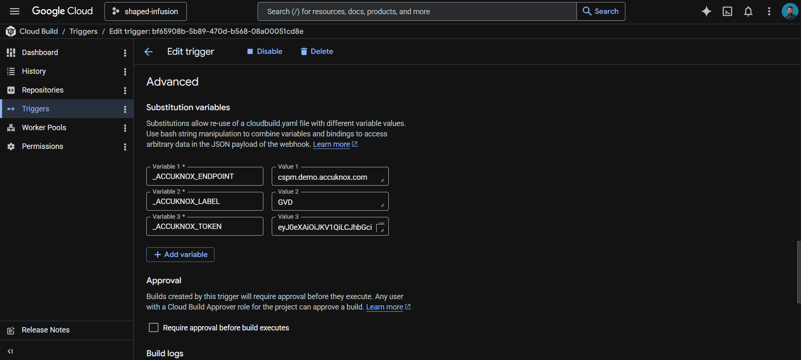
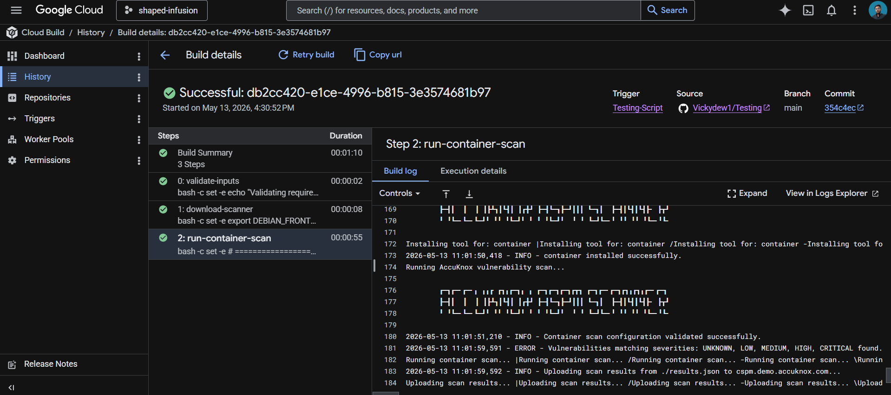
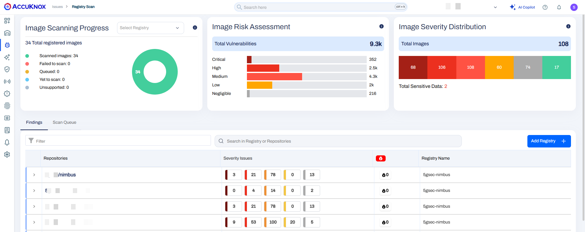
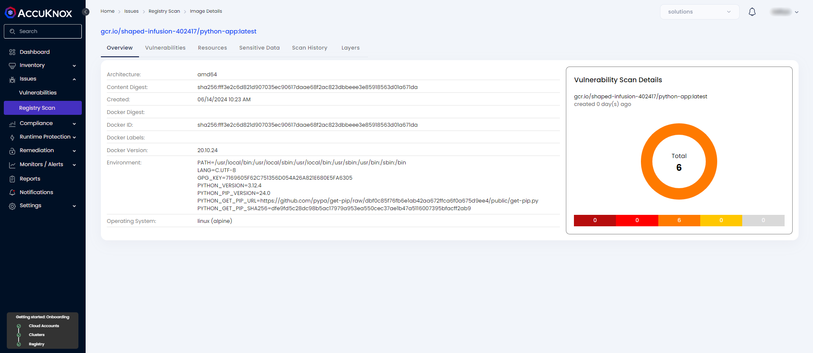
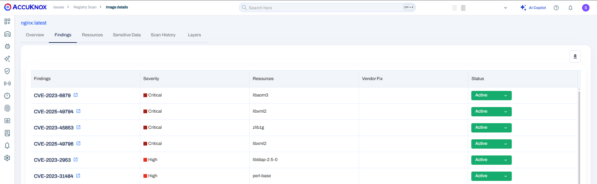
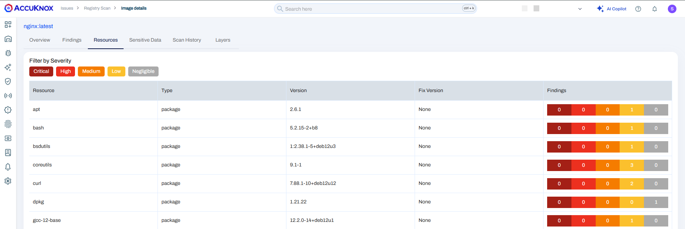
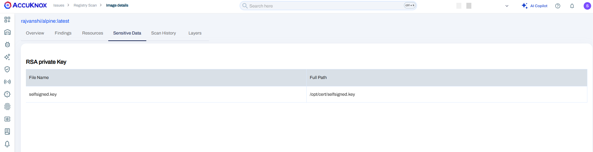
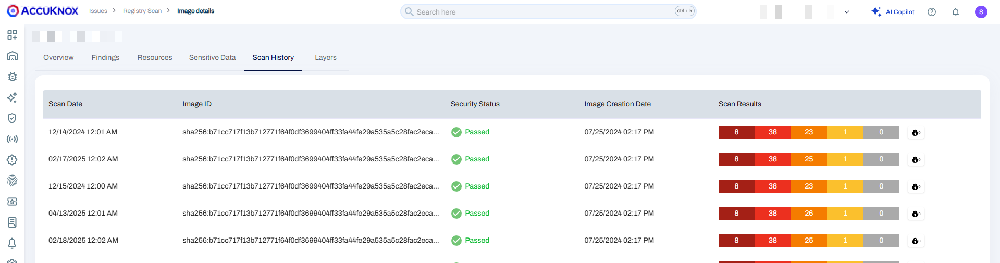

# Google Cloud Build Container Scan

Integrate AccuKnox container image scanning into Google Cloud Build to catch vulnerabilities in your Docker images before they ship to production. The pipeline builds your image, scans it with the AccuKnox ASPM Scanner CLI, optionally generates a CycloneDX SBOM, and uploads findings directly to your AccuKnox CSPM panel.

## **Prerequisites**

- GCP project with Cloud Build enabled

- AccuKnox SaaS access with permission to generate tokens

- A repository with a Dockerfile at the root (or a path you specify)

- A Cloud Build trigger pointing at the repository

## **Steps for integration**

### **Step 1: Generate an AccuKnox token**

Log in to AccuKnox SaaS. Navigate to **Settings**, then **Tokens** and create a new token.


Save these three values for use in Step 3:

| **Field** | **Where to find it** |
|---|---|
| Endpoint | Your AccuKnox CSPM URL, for example, `cspm.demo.accuknox.com` |
| Token | The token string shown after creation |
| Label | Any descriptive string you choose |

### **Step 2: Add the cloudbuild.yaml to your repository**

Drop the following file at the root of your repository as `cloudbuild.yaml`. The AccuKnox credentials come from the Cloud Build trigger config (Step 3). The image-specific values (name, tag, Dockerfile path, severity, SBOM options) are edited directly in step 3 of the YAML.

```yaml
# =============================================================================
# AccuKnox Container Scan - Google Cloud Build Pipeline
# Builds the image, runs a vulnerability scan, and optionally generates an SBOM.
# =============================================================================

steps:

  # ---------------------------------------------------------------------------
  # Step 1: Validate required AccuKnox inputs (fail fast)
  # ---------------------------------------------------------------------------
  - id: validate-inputs
    name: ubuntu:24.04
    entrypoint: bash
    env:
      - ACCUKNOX_ENDPOINT=${_ACCUKNOX_ENDPOINT}
      - ACCUKNOX_TOKEN=${_ACCUKNOX_TOKEN}
      - ACCUKNOX_LABEL=${_ACCUKNOX_LABEL}
    args:
      - -c
      - |
        set -e
        echo "Validating required inputs..."
        if [ -z "$$ACCUKNOX_ENDPOINT" ] || [ -z "$$ACCUKNOX_TOKEN" ] || [ -z "$$ACCUKNOX_LABEL" ]; then
          echo "ERROR: _ACCUKNOX_ENDPOINT, _ACCUKNOX_TOKEN, and _ACCUKNOX_LABEL must be set!"
          exit 1
        fi
        echo "All required inputs present."

  # ---------------------------------------------------------------------------
  # Step 2: Download the AccuKnox ASPM Scanner CLI
  # ---------------------------------------------------------------------------
  - id: download-scanner
    name: ubuntu:24.04
    entrypoint: bash
    args:
      - -c
      - |
        set -e
        export DEBIAN_FRONTEND=noninteractive
        apt-get update -qq
        apt-get install -y -qq --no-install-recommends curl ca-certificates

        echo "Downloading AccuKnox ASPM Scanner v0.14.2..."
        curl -sSL https://github.com/accuknox/aspm-scanner-cli/releases/download/v0.14.2/accuknox-aspm-scanner \
          -o /workspace/accuknox-aspm-scanner
        chmod +x /workspace/accuknox-aspm-scanner
        echo "Scanner downloaded to /workspace/accuknox-aspm-scanner"

  # ---------------------------------------------------------------------------
  # Step 3: Build the image, run vulnerability scan, optionally run SBOM scan
  # docker.io is installed because the scanner runs Trivy in --container-mode.
  # ---------------------------------------------------------------------------
  - id: run-container-scan
    name: ubuntu:24.04
    entrypoint: bash
    env:
      - ACCUKNOX_ENDPOINT=${_ACCUKNOX_ENDPOINT}
      - ACCUKNOX_TOKEN=${_ACCUKNOX_TOKEN}
      - ACCUKNOX_LABEL=${_ACCUKNOX_LABEL}
    args:
      - -c
      - |
        set -e

        # ====================================================================
        # Container scan configuration — edit these values as needed
        # ====================================================================
        IMAGE_NAME="my-app"                                # image name (without tag)
        TAG="latest"                                       # image tag
        DOCKERFILE_CONTEXT="Dockerfile"                    # path to Dockerfile
        SEVERITY="UNKNOWN,LOW,MEDIUM,HIGH,CRITICAL"        # severities to report
        SOFT_FAIL="true"                                   # true to keep pipeline green on findings
        GENERATE_SBOM="false"                              # true to also run an SBOM scan
        PROJECT_NAME=""                                    # required when GENERATE_SBOM=true
        # ====================================================================

        # Install ca-certificates (HTTPS upload) and docker CLI (--container-mode)
        export DEBIAN_FRONTEND=noninteractive
        apt-get update -qq
        apt-get install -y -qq --no-install-recommends ca-certificates docker.io

        # Pin Docker client API to match the Cloud Build host daemon (Docker 20.10).
        export DOCKER_API_VERSION=1.41

        cd /workspace

        # Validate project_name if SBOM generation is enabled
        GENERATE_SBOM="$${GENERATE_SBOM,,}"
        GENERATE_SBOM=$(echo "$$GENERATE_SBOM" | tr -d ' \t\r\n')
        if [ "$$GENERATE_SBOM" = "true" ] && [ -z "$$PROJECT_NAME" ]; then
          echo "ERROR: PROJECT_NAME is required when GENERATE_SBOM is true!"
          exit 1
        fi

        # Build the image
        echo "Building Docker image $$IMAGE_NAME:$$TAG from context $$DOCKERFILE_CONTEXT ..."
        docker build -t "$$IMAGE_NAME:$$TAG" -f "$$DOCKERFILE_CONTEXT" .

        # Save the image to a tarball that the in-container scanner can read.
        # Cloud Build's in-step container cannot see the host docker daemon,
        # but /workspace is mounted into the container, so a tarball works.
        echo "Saving image to /workspace/image.tar for scanning..."
        docker save "$$IMAGE_NAME:$$TAG" -o /workspace/image.tar

        # Pre-create results file with permissive perms (scanner writes from inside a container)
        touch /workspace/results.json
        chmod 666 /workspace/results.json

        # Install the container scanning tool
        echo "Installing container scan tool..."
        /workspace/accuknox-aspm-scanner tool install --type container

        # Resolve soft-fail flag
        SOFT_FAIL="$${SOFT_FAIL,,}"
        SOFT_FAIL=$(echo "$$SOFT_FAIL" | tr -d ' \t\r\n')
        SOFT_FAIL_ARG=""
        if [ "$$SOFT_FAIL" = "true" ]; then
          SOFT_FAIL_ARG="--softfail"
        fi

        # Build the --command string (scan the tarball, not the registry)
        CMD="image --input /workspace/image.tar"
        if [ -n "$$SEVERITY" ]; then
          CMD="$$CMD --severity $$SEVERITY"
        fi

        # ---- Vulnerability scan ----
        # Local scanner reads the tarball directly from /workspace.
        # We intentionally skip --container-mode here because the in-container
        # scanner cannot read /workspace files in Cloud Build.
        echo "Running AccuKnox vulnerability scan..."
        /workspace/accuknox-aspm-scanner scan \
          $$SOFT_FAIL_ARG \
          --keep-results \
          container \
          --command "$$CMD"

        cp /workspace/results.json /workspace/results-vuln.json

        # ---- SBOM scan (optional, second run) ----
        if [ "$$GENERATE_SBOM" = "true" ]; then
          echo "Running AccuKnox SBOM scan..."
          /workspace/accuknox-aspm-scanner scan \
            $$SOFT_FAIL_ARG \
            --keep-results \
            --project-name "$$PROJECT_NAME" \
            container \
            --command "$$CMD" \
            --generate-sbom

          cp /workspace/results.json /workspace/results-sbom.json
        fi

# =============================================================================
# Substitutions (only AccuKnox credentials — set these in the trigger UI)
#   _ACCUKNOX_ENDPOINT  -> accuknox_endpoint  (required)
#   _ACCUKNOX_TOKEN     -> accuknox_token     (required)
#   _ACCUKNOX_LABEL     -> accuknox_label     (required, e.g. "container-myapp")
# =============================================================================
substitutions:
  _ACCUKNOX_ENDPOINT: ""
  _ACCUKNOX_TOKEN: ""
  _ACCUKNOX_LABEL: ""

options:
  logging: CLOUD_LOGGING_ONLY
  machineType: E2_HIGHCPU_8

timeout: 1800s
```

Before committing, edit the configuration block in step 3 of the YAML to match your image:

| **Variable** | **What to set** |
|---|---|
| `IMAGE_NAME` | The image name without a tag, for example, `my-app` |
| `TAG` | The image tag, for example, `latest` or `v1.2.3` |
| `DOCKERFILE_CONTEXT` | Path to your Dockerfile, default is `Dockerfile` |
| `SEVERITY` | Comma-separated severities to report. Default reports all: `UNKNOWN,LOW,MEDIUM,HIGH,CRITICAL` |
| `SOFT_FAIL` | `true` to keep the pipeline green on findings, `false` to fail the build |
| `GENERATE_SBOM` | `true` to also run a second scan that produces a CycloneDX SBOM, `false` to skip |
| `PROJECT_NAME` | Required only when `GENERATE_SBOM=true`. Used as the SBOM entity in AccuKnox CSPM. |

Commit and push the file to your repository.

### **Step 3: Configure the Cloud Build trigger**

Open Cloud Build in the GCP console. Create or edit a trigger pointing at your repository.

Under **Configuration**, select **Cloud Build configuration file** and point it at `cloudbuild.yaml`.

Under **Advanced**, then **Substitution variables**, add the three AccuKnox credentials:

| **Variable name** | **Value** |
|---|---|
| `_ACCUKNOX_ENDPOINT` | Your CSPM endpoint, for example, `cspm.demo.accuknox.com` |
| `_ACCUKNOX_TOKEN` | The token from Step 1 |
| `_ACCUKNOX_LABEL` | A label of your choice, for example, `container-myapp` |



These values live in the trigger config rather than the YAML, which keeps your token out of git history.

Save the trigger. The next push to the watched branch runs the pipeline.

## **How the pipeline works**

| **Step** | **Purpose** |
|---|---|
| 1. validate-inputs | Fails the build in under a second if any AccuKnox credential is missing. Saves a wasted scanner download. |
| 2. download-scanner | Fetches the AccuKnox ASPM Scanner v0.14.2 binary into `/workspace`, which persists across Cloud Build steps. |
| 3. run-container-scan | Builds the Docker image, exports it as a tarball, installs the scanning tool locally, scans the tarball, and uploads findings to AccuKnox CSPM. If `GENERATE_SBOM=true`, a second scan produces a CycloneDX SBOM. |



## **Vulnerability scan vs SBOM**

The pipeline can produce two different output files. They serve different purposes:

| **Output** | **What it contains and when to use it** |
|---|---|
| `results-vuln.json` | List of CVEs found in the image, with severity, affected package, and fixed version. Produced on every run. Use for vulnerability management and remediation prioritization. |
| `results-sbom.json` | CycloneDX SBOM listing every component in the image. Only produced when `GENERATE_SBOM=true`. Use for supply chain compliance (SLSA, EO 14028, NIST SSDF) and dependency auditing. |

SBOM generation runs as a separate scan because the AccuKnox CLI does not produce both outputs in a single pass. The second run adds about 30 seconds. For regulated environments where SBOMs are required, enable it. For pure vulnerability detection, leave it off.

## **Viewing results**

Open the AccuKnox CSPM panel. Filter findings by the label you set in `_ACCUKNOX_LABEL`. Each vulnerability finding includes the CVE ID, affected package and version, severity, fixed version (when available), and a link to the upstream advisory. SBOM data shows up under the project name set in `PROJECT_NAME`.

## **Before the AccuKnox scan**

Without container scanning in your pipeline, vulnerable base images, unpatched OS packages, and dependencies with known CVEs ship to production unchecked. A 6-month-old Node.js base image typically contains dozens of high-severity CVEs. Most teams discover this only after a security audit, or worse, after exploitation.

## **After AccuKnox scan integration**

Once the pipeline above is wired up, every push triggers a build, scan, and upload. Vulnerabilities in OS packages, language dependencies, and the base image surface in your AccuKnox CSPM panel within minutes. Findings include severity, fix availability, and remediation guidance. Critical issues can fail the build by setting `SOFT_FAIL` to `false` in step 3 of the YAML.


### **View Results Under AccuKnox SaaS**

**Step 1**: Once the scan is complete, the user will be able to go into the AccuKnox SaaS and navigate to **Issues** → **Registry Scan** where they can find their repository name and select it to see the findings associated with it.



**Step 2**: After clicking on the image name, the user will be able to see the metadata for the image that was built during the workflow execution.



**Step 3**: In the **Vulnerabilities** section, the user can see the image-specific vulnerabilities in a list manner that contains relevant information. These findings will also be available in **Issues** → **Vulnerabilities** section where the user can manage these findings with others as well.



**Step 4**: The **Resources** section contains information about packages and modules that were used to build the code base into a container image.



**Step 5**: The **Sensitive Data** section contains information about any secrets or credentials that might be exposed in the image.



**Step 6**: The user can see the scan history of every scan that happened while pushing any changes to the repo.



## **Conclusion**

Google offers a complete ecosystem for CI/CD that includes Google Cloud Build, Google Cloud Registry, Google Cloud Repository, and Google Secret Manager. AccuKnox container scanning brings several benefits to the mix:

- Image scanning in a CI/CD pipeline stops vulnerable images from reaching a registry.

- With inline scanning, image contents like proprietary source code or leaked credentials stay in your pipeline. Only the report from the analysis is sent to AccuKnox.

- From AccuKnox SaaS, users can view the vulnerabilities and mitigate the CRITICAL/HIGH vulnerabilities.

- Once the issues are fixed, users can trigger the scan again and observe the changes in the vulnerabilities to make sure the fixed image gets to the registry.

AccuKnox container scanning also integrates seamlessly with most CI/CD pipeline tools, including Jenkins, GitHub, GitLab, Azure Pipelines, AWS CodePipelines, etc.

- - -
[SCHEDULE DEMO](https://www.accuknox.com/contact-us){ .md-button .md-button--primary }
