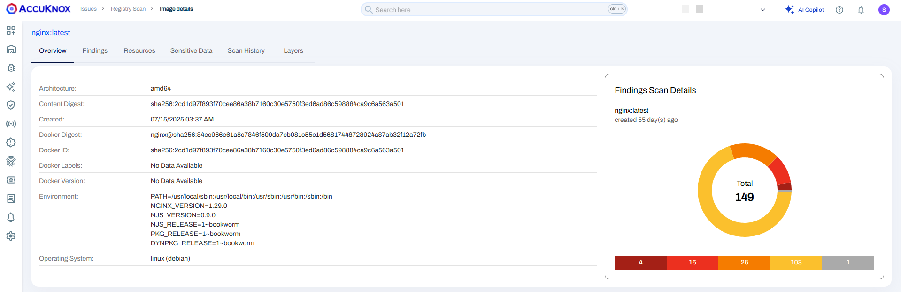
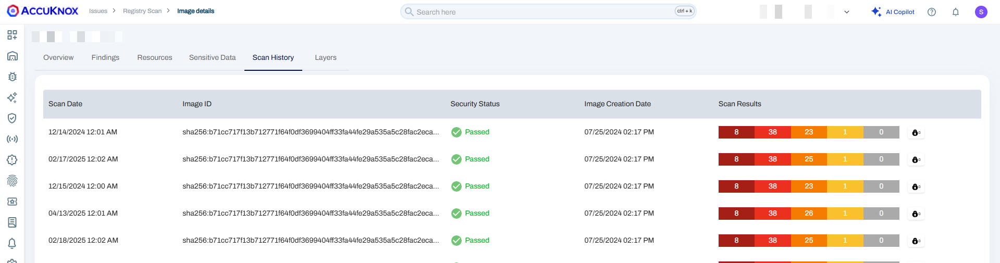

To demonstrate the benefits of integrating AccuKnox into a CI/CD pipeline using Google Cloud Build to enhance security, let's consider a specific case involving a container image with known vulnerabilities. By incorporating AccuKnox scanning into the pipeline, we can identify and resolve these vulnerabilities before deploying the image. The detailed example below outlines this process by comparing the scenarios before and after the inclusion of AccuKnox, as evidenced in the Cloud Build logs.


## **Scenario Before Integrating AccuKnox**

**Context**: We initially used an outdated base image (```python:3.6-alpine```) with many known security vulnerabilities in the Dockerfile, unintentionally introducing security weaknesses into the Container image.

**Dockerfile Example**

```sh
FROM python:3.6-alpine
# Further configuration and setup of the image
```

**Hypothetical Cloud Build Log - Pre AccuKnox Scan**

```sh
Building Docker image...
Successfully built d0c92993ff32
Successfully tagged gcr.io/PROJECT_ID/IMAGE_NAME:latest
The push refers to repository [gcr.io/PROJECT_ID/IMAGE_NAME:latest]
Image pushed successfully.
```

Before using AccuKnox, our container image was sent to the registry without any vulnerability checks. This oversight could allow vulnerable images to be deployed, opening up potential security risks.

## **Scenario After Integrating AccuKnox**

**Enhancing the Google Cloud Build workflow**: We added a step to run the AccuKnox vulnerability scan on the newly built Container image

**Updated Google Cloud build Workflow Snippet (Incorporating AccuKnox Scan)**

```yaml
 # Step 1: Scan the container image with AccuKnox and save the report
  - name: 'accuknox/accuknox-container-scan'
    args: [
      'image',
      '--format', 'json',
      '--output', '/workspace/accuknox-report.json',
      '${_IMAGE_URL}:${_IMAGE_TAG}'
    ]
    id: 'accuknox-container-scan'
  # Step 2: Upload the AccuKnox report to Cloud Storage
  - name: 'gcr.io/cloud-builders/gsutil'
    args: ['cp', '/workspace/accuknox-report.json', 'gs://BUCKET_NAME/accuknox-report.json']
    waitFor: ['accuknox-container-scan']
  # Step 3: Print the AccuKnox container scan results
  - name: 'ubuntu'
    entrypoint: 'cat'
    args: ['/workspace/accuknox-report.json']
    waitFor: ['accuknox-container-scan']
  # Step 4: Access the secret using gcloud and save it to a file
  - name: 'gcr.io/cloud-builders/gcloud'
    entrypoint: 'bash'
    args: [
      '-c',
      "gcloud secrets versions access latest --secret=accuknox_token --format='get(payload.data)' | tr '_-' '/+' | base64 -d > /workspace/decrypted-data.txt"
    ]
    id: 'access-secret'
  # Step 5: Forward the logs to the SaaS platform using curl
  - name: 'gcr.io/cloud-builders/curl'
    entrypoint: 'bash'
    args:
      [
        '-c',
        'curl --location --request POST "https://${_CSPM_URL}/api/v1/artifact/?tenant_id=${_TENANT_ID}&data_type=TR&save_to_s3=false" --header "Tenant-Id: ${_TENANT_ID}" --header "Authorization: Bearer $(cat /workspace/decrypted-data.txt)" --form "file=@/workspace/accuknox-report.json"'
      ]
    waitFor: ['access-secret']
    id: 'forward-result-to-accuknox-saas'
  # Step 6: If there are critical vulnerabilities, stop deployment
  - name: 'bash'
    entrypoint: 'bash'
    args:
      [
        '-c',
        'if grep -q "CRITICAL" /workspace/accuknox-report.json; then echo "AccuKnox Scan has halted the deployment because it detected critical vulnerabilities"; exit 1; else exit 0; fi'
      ]
    waitFor: ['forward-result-to-accuknox-saas']
# Define substitutions
substitutions:
  _IMAGE_URL: 'gcr.io/PROJECT_ID/IMAGE_NAME'
  _IMAGE_TAG: 'latest'
  _CSPM_URL: 'cspm.demo.accuknox.com'
  _TENANT_ID: 'TENANT_ID'
```

**Google Cloud Build Logs - Post AccuKnox Integration**

```sh
Pulling image: accuknox/accuknox-container-scan
Using default tag: latest
latest: Pulling from accuknox/accuknox-container-scan
Image built successfully: accuknox-container-scan:latest
Scanning IMAGE_NAME:latest with AccuKnox...
AccuKnox Scan has halted the deployment because it detected critical vulnerabilities
```

AccuKnox carefully analyzed the image and found critical and high-severity vulnerabilities. Based on these findings, the workflow stopped and prevented the vulnerable image from being deployed.


### **Remediation and Rescan**

**Fortifying the Dockerfile**: After seeing the vulnerabilities, we updated the Dockerfile to use a newer, more secure base image (```python:3.12-alpine3.20```) instead, to fix the security issues.

**Dockerfile Post-Update**

```sh
FROM python:3.12-alpine3.20
# Additional image enhancements and setup
```

**Google Cloud Build Log - After Remediation**

```sh
Step #6: Already have image (with digest): gcr.io/cloud-builders/docker
Step #6: Using default tag: latest
Step #6: The push refers to repository [gcr.io/PROJECT_ID/IMAGE_NAME]
Step #6: e6186d22a913: Preparing
Step #6: 26c23c05c010: Preparing
Step #6: dca0954f6f4a: Preparing
Step #6: 0fff41d85627: Preparing
Step #6: cd8444199228: Preparing
Step #6: caa01d103c54: Preparing
Step #6: 02f2bcb26af5: Preparing
Step #6: 02f2bcb26af5: Waiting
Step #6: e6186d22a913: Pushed
Step #6: 0fff41d85627: Pushed
Step #6: dca0954f6f4a: Pushed
Step #6: 26c23c05c010: Pushed
Step #6: caa01d103c54: Pushed
Step #6: cd8444199228: Pushed
Step #6: 02f2bcb26af5: Pushed
Step #6: latest: digest: sha256:0cb41e89c1b8daef61a837d281107dcbdfa88b584e7f0ebbb36414fc8a3f3aee size: 1788
Finished Step #6
PUSH
Pushing gcr.io/PROJECT_ID/IMAGE_NAME:latest
The push refers to repository [gcr.io/PROJECT_ID/IMAGE_NAME]
latest: digest: sha256:0cb41e89c1b8daef61a837d281107dcbdfa88b584e7f0ebbb36414fc8a3f3aee size: 1788
DONE
```

After addressing the vulnerabilities, the AccuKnox scan approved the updated image, allowing it to be safely pushed to the registry. This example highlights the importance of including vulnerability scanning in the pipeline. It prevents insecure images from being deployed to production, ensuring that only secure images are allowed.


## **AccuKnox Container scan integration with Google Code Build Pipeline**

### **Pre-requisites**

1. **GCP Console access**: Google Cloud console access to create the workflow

2. **gcloud CLI configured**: To interact with GCP via CLI

3. **Github/Google cloud source repositories**: A git repository to store our code, a containerized “python-app” written in Python.

4. **Google Container Registry**: The registry where we will push the images we will build.

5. **Google Secret Manager**: To store the AccuKnox API token, you must grant permissions to the Cloud Build agents to access secrets.

### **Creating a Cloud Build workflow for image scanning**

We’ll follow a basic “image scanning for Google Cloud Build” example project:

1. **Build** the container image.

2. Get the **secret token** required to communicate with the AccuKnox Saas Platform.

3. **Scan** the container image with AccuKnox Container Scan.

4. **Push** the container image to a registry.


### **Steps for integration**

**Step 1**: The user needs to create a codebuild.yaml file in their GitHub/Google code repository using the following workflow Template:

```yaml
 # Step 1: Scan the container image with AccuKnox and save the report
  - name: 'accuknox/accuknox-container-scan'
    args: [
      'image',
      '--format', 'json',
      '--output', '/workspace/accuknox-report.json',
      '${_IMAGE_URL}:${_IMAGE_TAG}'
    ]
    id: 'accuknox-container-scan'
  # Step 2: Upload the AccuKnox report to Cloud Storage
  - name: 'gcr.io/cloud-builders/gsutil'
    args: ['cp', '/workspace/accuknox-report.json', 'gs://BUCKET_NAME/accuknox-report.json']
    waitFor: ['accuknox-container-scan']
  # Step 3: Print the AccuKnox container scan results
  - name: 'ubuntu'
    entrypoint: 'cat'
    args: ['/workspace/accuknox-report.json']
    waitFor: ['accuknox-container-scan']
  # Step 4: Access the secret using gcloud and save it to a file
  - name: 'gcr.io/cloud-builders/gcloud'
    entrypoint: 'bash'
    args: [
      '-c',
      "gcloud secrets versions access latest --secret=accuknox_token --format='get(payload.data)' | tr '_-' '/+' | base64 -d > /workspace/decrypted-data.txt"
    ]
    id: 'access-secret'
  # Step 5: Forward the logs to the SaaS platform using curl
  - name: 'gcr.io/cloud-builders/curl'
    entrypoint: 'bash'
    args:
      [
        '-c',
        'curl --location --request POST "https://${_CSPM_URL}/api/v1/artifact/?tenant_id=${_TENANT_ID}&data_type=TR&save_to_s3=false" --header "Tenant-Id: ${_TENANT_ID}" --header "Authorization: Bearer $(cat /workspace/decrypted-data.txt)" --form "file=@/workspace/accuknox-report.json"'
      ]
    waitFor: ['access-secret']
    id: 'forward-result-to-accuknox-saas'
  # Step 6: If there are critical vulnerabilities, stop deployment
  - name: 'bash'
    entrypoint: 'bash'
    args:
      [
        '-c',
        'if grep -q "CRITICAL" /workspace/accuknox-report.json; then echo "AccuKnox Scan has halted the deployment because it detected critical vulnerabilities"; exit 1; else exit 0; fi'
      ]
    waitFor: ['forward-result-to-accuknox-saas']
# Define substitutions
substitutions:
  _IMAGE_URL: 'gcr.io/PROJECT_ID/IMAGE_NAME'
  _IMAGE_TAG: 'latest'
  _CSPM_URL: 'cspm.demo.accuknox.com'
  _TENANT_ID: 'TENANT_ID'
```

**Note**: In the above template, the user needs to change some variables, including  ```TENANT_ID```, ```IMAGE_NAME```, ```BUCKET_NAME```, and ```PROJECT_ID```. Values for these variables can be viewed from the AccuKnox SaaS and GCP console.

**Step 2**: Now, when a user attempts to push any changes to the repository, the workflow will be triggered, performing the necessary steps for scanning and posting the results to AccuKnox SaaS.

**Note**: The user can configure the workflow according to their needs, setting it to trigger on events such as push, pull, etc.

**Step 3**: Once the scan is complete, the user will be able to go into the AccuKnox SaaS and navigate to **Issues** → **Registry Scan** where they can find their repository name and select it to see the findings associated with it.


**Step 4**: After clicking on the image name, the user will be able to see the metadata for the image that was built during the workflow execution.



**Step 5**: In the **Vulnerabilities** section, the user can see the image-specific vulnerabilities in a list manner that contains relevant information. These findings will also be available in **Issues** → **Vulnerabilities** section where the user can manage these findings with others as well.


**Step 6**: The **Resources** section contains information about packages and modules that were used to build the code base into a container image.


**Step 7**: The **Sensitive Data** section contains information about any secrets or credentials that might be exposed in the image.


**Step 8**: The user can see the scan history of every scan that happened while pushing any changes to the repo.



## **Conclusion**

Google offers a complete ecosystem for CI/CD that includes Google Cloud Build, Google Cloud Registry, Google Cloud Repository, and Google Secret Manager. AccuKnox container scanning brings several benefits to the mix:

- Image scanning in a CI/CD pipeline stops vulnerable images from reaching a registry.

- With inline scanning, image contents like proprietary source code or leaked credentials stay in your pipeline. Only the report from the analysis is sent to the image scanner's backend.

- From AccuKnox Saas users can view the vulnerabilities and mitigate the CRITICAL/HIGH vulnerabilities

- Once the issues are fixed users can trigger the scan again and observe the changes in the vulnerabilities to make sure the fixed image gets to the registry

AccuKnox container scanning also integrates seamlessly with most CI/CD pipeline tools, including Jenkins, GitHub, GitLab, Azure Pipelines, AWS CodePipelines, etc.

- - -
[SCHEDULE DEMO](https://www.accuknox.com/contact-us){ .md-button .md-button--primary }