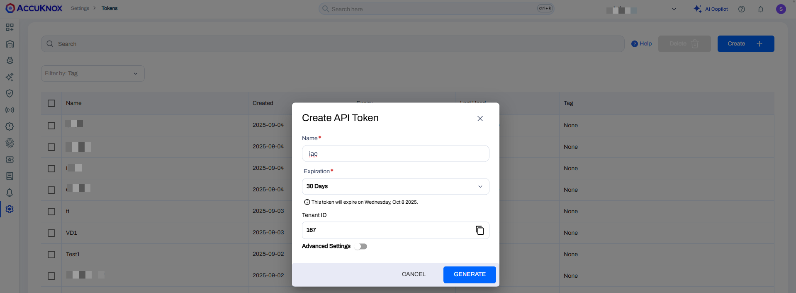
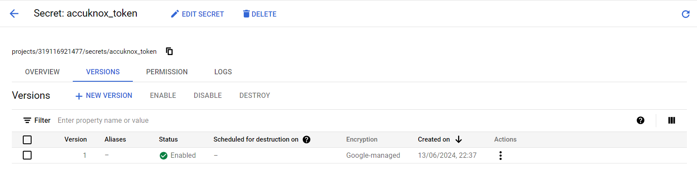
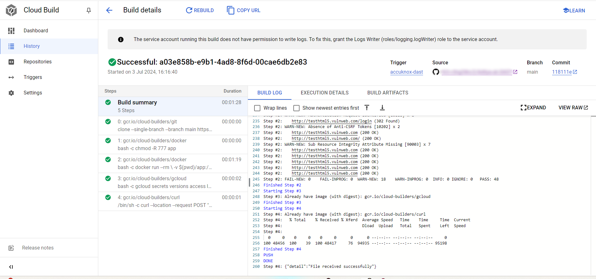
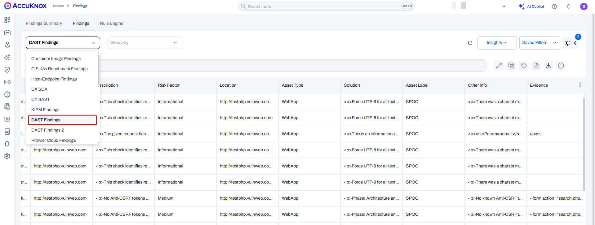
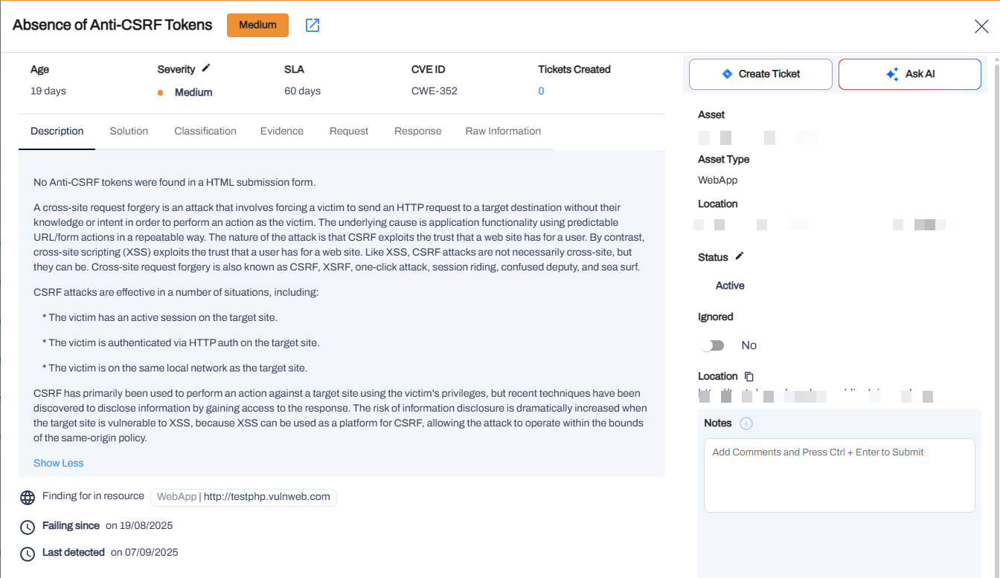
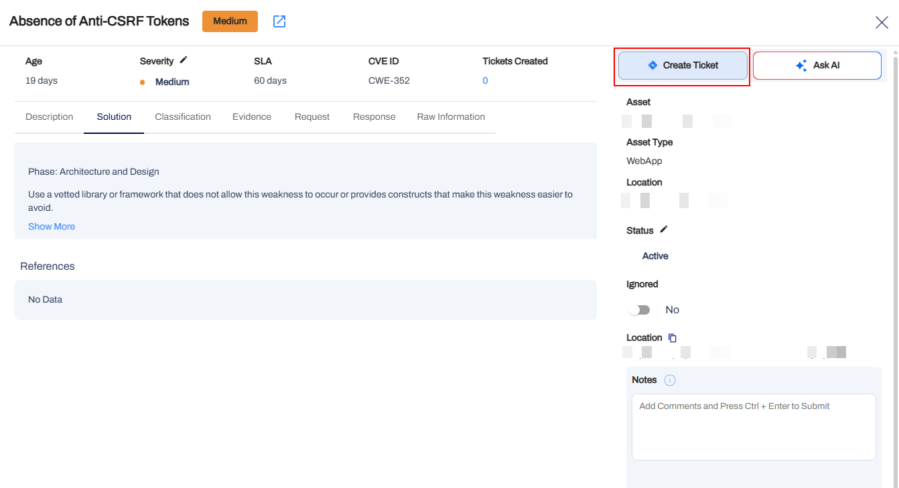
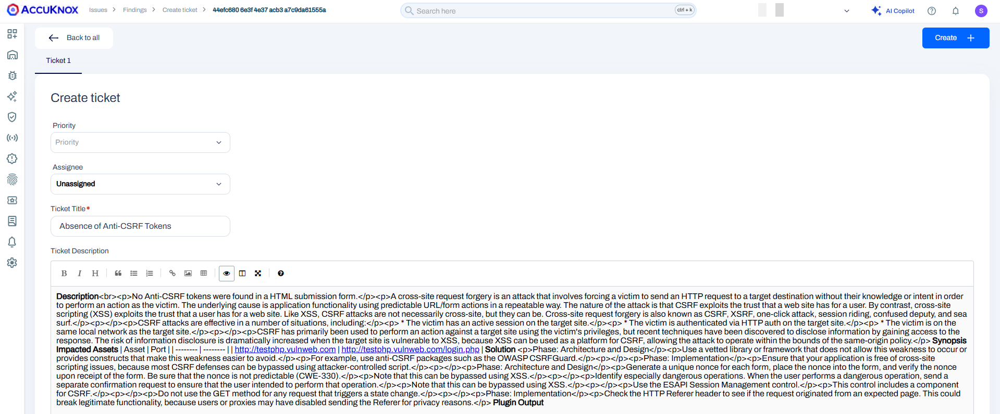

# Google Cloud DAST

To demonstrate the benefits of incorporating AccuKnox into a CI/CD pipeline using Google Cloud Build to enhance security, consider a specific scenario involving a Domain with known vulnerabilities. By integrating AccuKnox scanning into the pipeline, we can identify and resolve these security issues.


## **Pre-requisites**

- GCP Console Access

- AccuKnox UI Access

- Google Cloud build Pipeline

- Github/Google Cloud source repositories

## **Steps for integration**

**Step 1**: Log in to AccuKnox Saas, Navigate to Settings, and select Tokens to create an AccuKnox token for forwarding scan results to Saas



**Note:** Copy the token and create a Google Cloud secret for the token to be used as a secret in the pipeline. Also, copy the tenant ID value to be used in the Cloud Build YAML file.

**Step 2**: Add AccuKnox Tokens to Google Cloud Secret Manager:

- Add the following secrets:

    + ```AK_TOK```: The artifact token received from the AccuKnox management plane



**Step 3**: To integrate AccuKnox scans into your Google Cloud Build, set up a cloudbuild.yaml file in your repository with the following content:

```yaml
steps:
  # Step 1: Checkout code
  - name: 'gcr.io/cloud-builders/git'
    args: ['clone', '--single-branch', '--branch', 'main', '${_REPO_URL}', 'app']
  # Step 2: Set up Docker Environment and change permissions
  - name: 'gcr.io/cloud-builders/docker'
    entrypoint: 'bash'
    args:
      - '-c'
      - |
        chmod -R 777 app
  # Step 3: Run OWASP ZAP baseline scan
  - name: 'gcr.io/cloud-builders/docker'
    entrypoint: 'bash'
    args:
      - '-c'
      - |
        docker run --rm \
          -v $(pwd)/app:/zap/wrk \
          -w /zap/wrk \
          ghcr.io/zaproxy/zaproxy:stable \
          zap-baseline.py \
          -t {target-url} \
          -r scanreport.html \
          -x scanreport.xml \
          -J scanreport.json \
          -I
  - name: 'gcr.io/cloud-builders/gcloud'
    entrypoint: 'bash'
    args:
      - '-c'
      - |
        gcloud secrets versions access latest --secret=accuknox_token --format='get(payload.data)' | tr '_-' '/+' | base64 -d > /workspace/decrypted-data.txt
  # Step 5: Upload ZAP Scan Report
  - name: 'gcr.io/cloud-builders/curl'
    entrypoint: '/bin/sh'
    args:
      - '-c'
      - |
        curl --location --request POST "https://${_AK_URL}/api/v1/artifact/?tenant_id=${_TENANT_ID}&data_type=ZAP&save_to_s3=false" \
          --header "Tenant-Id: ${_TENANT_ID}" \
          --header "Authorization: Bearer $(cat /workspace/decrypted-data.txt)" \
          --form "file=@\"app/scanreport.json\""
# Substitutions for variables
substitutions:
  _AK_URL: "{cspm.<env-name>.accuknox.com}"
  _TENANT_ID: "{tenant-id}"
  _REPO_URL: "https://github.com/{user-name}/{repo-name}"  # Ensure this starts with http:// or https://
# Optional: Specify a Cloud Storage bucket for logs
logsBucket: "gs://{bucket-name}"
```

**Note**: In the YAML file above, you need to replace the value for the GitHub URL with the actual **user name** and **repository name**. Under substitution, replace "**AK URL**" with the applicable "cspm env-name" (e.g. demo/dev/stage/prod), replace **{taget-url}** with the target you want to scan, replace **"bucket name"** with your GCP bucket name, and replace **"Tenant id"** with your tenant id copied in the **Step 1**.

## **Before AccuKnox Scan**

Initially, the CI/CD pipeline does not include the AccuKnox scan. When you push the changes to the repository it does not perform any security checks, potentially **allowing security issues in the application**.

## **After AccuKnox Scan Integration**

After integrating AccuKnox into your CI/CD pipeline, the next push triggers the Google Cloudbuild workflow. The AccuKnox scan identifies the potential vulnerability in the domain URL.



To view the Results in AccuKnox Saas:

**Step 1**: After the workflow completes, navigate to the AccuKnox SaaS dashboard.

**Step 2**: Go to **Issues** > **Vulnerabilities** and select **Data Type** as **ZAP** to view the identified vulnerabilities.



**Step 3**: Click on the Vulnerability to view more details



**Step 4**: Fix the Vulnerability

To fix the Cross-Domain Misconfiguration, follow the instructions in the Solutions tab.



**Step 5**: Create a ticket for fixing the Cross-Domain Misconfiguration by selecting the Ticket Configuration and clicking on the Create Ticket icon.



**Step 6**: Review the Updated Results

- After fixing the vulnerability, please rerun the cloud build workflow.

- Once the workflow completes, navigate to the AccuKnox SaaS dashboard.

- Go to **Issues** > **Vulnerabilities** and select **Data Type** as **ZAP** to verify that the Cross-Domain Misconfiguration has been resolved.

## **Conclusion**

Google offers a complete ecosystem for CI/CD that includes Google Cloud Build, Google Cloud Registry, Google Cloud Repository, and Google Secret Manager. AccuKnox code scanning brings several benefits to the mix:

- AccuKnox DAST in a CI/CD pipeline Provides visibility over the potential security issues by scanning the Domain URL.

- From AccuKnox Saas users can view the findings and mitigate the CRITICAL/HIGH findings.

- Once the issues are resolved, users can trigger the scan again and observe the changes in the findings to ensure that the Domain URL is free from security issues

AccuKnox DAST also integrates seamlessly with most CI/CD pipeline tools, including Jenkins, GitHub, GitLab, Azure Pipelines, AWS CodePipelines, etc

- - -
[SCHEDULE DEMO](https://www.accuknox.com/contact-us){ .md-button .md-button--primary }