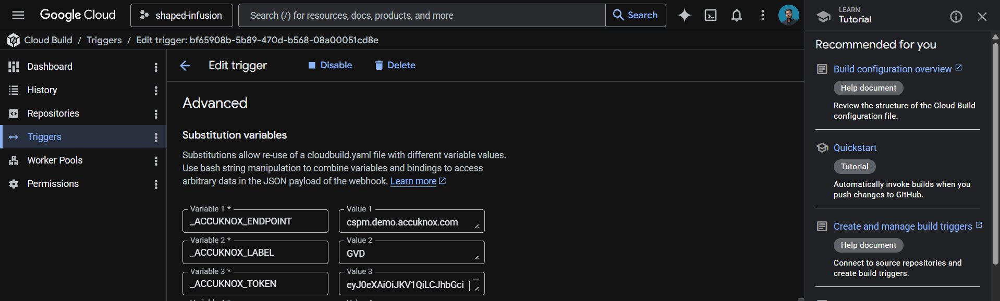
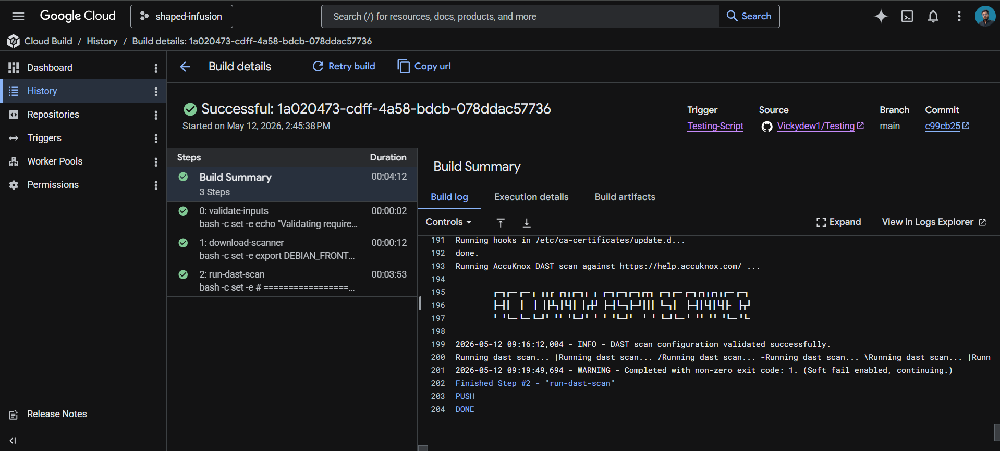

# Google Cloud Build DAST

Integrate AccuKnox DAST scanning into Google Cloud Build to catch runtime vulnerabilities in your live application before attackers do. The pipeline uses the AccuKnox ASPM Scanner CLI, runs in three steps, and uploads findings directly to your AccuKnox CSPM panel.

## **Prerequisites**

- GCP project with Cloud Build enabled

- AccuKnox SaaS access with permission to generate tokens

- A reachable target URL for the application you want to scan (staging or production)

- A GitHub, GitLab, Bitbucket, or Cloud Source Repository connected to Cloud Build

- A Cloud Build trigger pointing at the repository

## **Steps for integration**

### **Step 1: Generate an AccuKnox token**

Log in to AccuKnox SaaS. Navigate to **Settings**, then **Tokens** and create a new token.


Save these three values for use in Step 3:

| **Field** | **Where to find it** |
|---|---|
| Endpoint | Your AccuKnox CSPM URL, for example, `cspm.demo.accuknox.com` |
| Token | The token string shown after creation |
| Label | Any descriptive string you choose |

### **Step 2: Add the cloudbuild.yaml to your repository**

Drop the following file at the root of your repository as `cloudbuild.yaml`. The AccuKnox credentials come from the Cloud Build trigger config (Step 3). The DAST-specific values (target URL, scan script, severity threshold, soft-fail) are edited directly in step 3 of the YAML.

```yaml
# AccuKnox DAST — Google Cloud Build Pipeline

steps:

  # ---------------------------------------------------------------------------
  # Step 1: Validate required AccuKnox inputs (fail fast)
  # ---------------------------------------------------------------------------
  - id: validate-inputs
    name: ubuntu:24.04
    entrypoint: bash
    env:
      - ACCUKNOX_ENDPOINT=${_ACCUKNOX_ENDPOINT}
      - ACCUKNOX_TOKEN=${_ACCUKNOX_TOKEN}
      - ACCUKNOX_LABEL=${_ACCUKNOX_LABEL}
    args:
      - -c
      - |
        set -e
        echo "Validating required inputs..."
        if [ -z "$$ACCUKNOX_ENDPOINT" ] || [ -z "$$ACCUKNOX_TOKEN" ] || [ -z "$$ACCUKNOX_LABEL" ]; then
          echo "ERROR: _ACCUKNOX_ENDPOINT, _ACCUKNOX_TOKEN, and _ACCUKNOX_LABEL must be set!"
          exit 1
        fi
        echo "All required inputs present."

  # ---------------------------------------------------------------------------
  # Step 2: Download the AccuKnox ASPM Scanner CLI
  # ---------------------------------------------------------------------------
  - id: download-scanner
    name: ubuntu:24.04
    entrypoint: bash
    args:
      - -c
      - |
        set -e
        export DEBIAN_FRONTEND=noninteractive
        apt-get update -qq
        apt-get install -y -qq --no-install-recommends curl ca-certificates

        echo "Downloading AccuKnox ASPM Scanner v0.14.2..."
        curl -sSL https://github.com/accuknox/aspm-scanner-cli/releases/download/v0.14.2/accuknox-aspm-scanner \
          -o /workspace/accuknox-aspm-scanner
        chmod +x /workspace/accuknox-aspm-scanner
        echo "Scanner downloaded to /workspace/accuknox-aspm-scanner"

  # ---------------------------------------------------------------------------
  # Step 3: Run the DAST scan against the target URL and upload to CSPM
  # docker.io is installed here so the scanner can spawn the DAST scan container.
  # ---------------------------------------------------------------------------
  - id: run-dast-scan
    name: ubuntu:24.04
    entrypoint: bash
    env:
      - ACCUKNOX_ENDPOINT=${_ACCUKNOX_ENDPOINT}
      - ACCUKNOX_TOKEN=${_ACCUKNOX_TOKEN}
      - ACCUKNOX_LABEL=${_ACCUKNOX_LABEL}
    args:
      - -c
      - |
        set -e

        # ====================================================================
        # DAST-specific configuration — edit these values as needed
        # ====================================================================
        TARGET_URL="https://help.accuknox.com/"
        ZAP_SCAN_SCRIPT="zap-baseline.py"     # zap-baseline.py | zap-full-scan.py | zap-api-scan.py
        SEVERITY_THRESHOLD=""                 # leave empty, or set HIGH / MEDIUM / LOW
        SOFT_FAIL="true"                      # true to keep pipeline green on findings
        # ====================================================================

        # Install ca-certificates (HTTPS upload) and docker CLI (for the DAST scan container)
        export DEBIAN_FRONTEND=noninteractive
        apt-get update -qq
        apt-get install -y -qq --no-install-recommends ca-certificates docker.io

        # Pin the Docker client API version to match the Cloud Build host daemon.
        # Ubuntu 24.04 ships Docker 29.x (API 1.52) but Cloud Build runs Docker 20.10 (API 1.41).
        export DOCKER_API_VERSION=1.41

        # Validate the target URL is set
        if [ -z "$$TARGET_URL" ]; then
          echo "ERROR: TARGET_URL is empty. Edit the script to set the application URL to scan."
          exit 1
        fi

        # Resolve soft-fail flag
        SOFT_FAIL=$(echo "$$SOFT_FAIL" | tr -d ' \t\r\n')
        SOFT_FAIL_ARG=""
        if [ "$$SOFT_FAIL" = "true" ]; then
          SOFT_FAIL_ARG="--softfail"
        fi

        # Optional severity threshold
        SEVERITY_ARG=""
        if [ -n "$$SEVERITY_THRESHOLD" ]; then
          SEVERITY_ARG="--severity-threshold $$SEVERITY_THRESHOLD"
        fi

        # Run the DAST scan in container mode
        echo "Running AccuKnox DAST scan against $$TARGET_URL ..."
        /workspace/accuknox-aspm-scanner scan --keep-results $$SOFT_FAIL_ARG dast \
          --command "$$ZAP_SCAN_SCRIPT -t $$TARGET_URL -I" \
          --container-mode \
          $$SEVERITY_ARG

# =============================================================================
# Substitutions (only AccuKnox credentials — set these in the trigger UI)
#   _ACCUKNOX_ENDPOINT  -> accuknox_endpoint  (required)
#   _ACCUKNOX_TOKEN     -> accuknox_token     (required)
#   _ACCUKNOX_LABEL     -> accuknox_label     (required)
# =============================================================================
substitutions:
  _ACCUKNOX_ENDPOINT: ""
  _ACCUKNOX_TOKEN: ""
  _ACCUKNOX_LABEL: ""

options:
  logging: CLOUD_LOGGING_ONLY
  machineType: E2_HIGHCPU_8

# DAST scans take longer than SAST/IaC. Bumped to 1 hour.
timeout: 3600s
```

Before committing, edit the DAST-specific block in step 3 of the YAML to match your target:

| **Variable** | **What to set** |
|---|---|
| `TARGET_URL` | The live URL to scan, for example, `https://staging.myapp.com/` |
| `ZAP_SCAN_SCRIPT` | `zap-baseline.py` (default), `zap-full-scan.py`, or `zap-api-scan.py` |
| `SEVERITY_THRESHOLD` | Leave blank, or set `HIGH`, `MEDIUM`, or `LOW` |
| `SOFT_FAIL` | `true` to keep the pipeline green on findings, `false` to fail the build |

Commit and push the file to your repository.

### **Step 3: Configure the Cloud Build trigger**

Open Cloud Build in the GCP console. Create or edit a trigger pointing at your repository.

Under **Configuration**, select **Cloud Build configuration file** and point it at `cloudbuild.yaml`.

Under **Advanced**, then **Substitution variables**, add the three AccuKnox credentials:

| **Variable name** | **Value** |
|---|---|
| `_ACCUKNOX_ENDPOINT` | Your CSPM endpoint, for example, `cspm.demo.accuknox.com` |
| `_ACCUKNOX_TOKEN` | The token from Step 1 |
| `_ACCUKNOX_LABEL` | A label of your choice, for example, `dast-myapp` |



These values live in the trigger config rather than the YAML, which keeps your token out of git history.

Save the trigger. The next push to the watched branch runs the pipeline.

## **How the pipeline works**

| **Step** | **Purpose** |
|---|---|
| 1. validate-inputs | Fails the build in under a second if any AccuKnox credential is missing. Saves a wasted scanner download. |
| 2. download-scanner | Fetches the AccuKnox ASPM Scanner v0.14.2 binary into `/workspace`, which persists across Cloud Build steps. |
| 3. run-dast-scan | Installs Docker so the scanner can spawn the scanning container, runs the scan against your target URL, and uploads findings to AccuKnox CSPM. |



## **Choosing a scan type**

The scanner ships three scan scripts. Pick the one that fits your stage:

| **Script** | **What it does** | **Time** | **Use it for** |
|---|---|---|---|
| `zap-baseline.py` | Passive scan only. No attacks, just reads the responses. | ~5 min | Safe for production. Default. |
| `zap-full-scan.py` | Active scan with full attack suite (SQLi, XSS, etc.). | ~30+ min | Staging only. Never against production. |

For most CI use cases, the default baseline scan is the right choice. Switch to full-scan for nightly runs against staging environments.

## **Viewing results**

Open the AccuKnox CSPM panel. Filter findings by the label you set in `_ACCUKNOX_LABEL`. Each finding includes the affected URL, the OWASP category, severity, evidence (request/response snippet), and remediation guidance. Common findings for production sites include missing security headers (CSP, HSTS, X-Frame-Options), cookies without secure flags, and information disclosure.

## **Before the AccuKnox scan**

Without DAST integration, runtime vulnerabilities like XSS, SQL injection, broken authentication, and misconfigured security headers only get caught after deployment. By then, attackers may already be exploiting them. Static scans (SAST, SCA) won't catch issues that only appear when the application is running.

## **After AccuKnox scan integration**

Once the pipeline above is wired up, every push triggers a DAST scan against your target URL. The scanner probes the running application for vulnerabilities that static analysis cannot see. Findings appear in your AccuKnox CSPM panel with severity, affected URL, and remediation guidance, alongside your SAST, IaC, and container findings. Critical issues can fail the build by setting `SEVERITY_THRESHOLD` to `HIGH` and `SOFT_FAIL` to `false` in step 3 of the YAML.


## **Conclusion**

Google offers a complete ecosystem for CI/CD that includes Google Cloud Build, Google Cloud Registry, Google Cloud Repository, and Google Secret Manager. AccuKnox DAST scanning brings several benefits to the mix:

- AccuKnox DAST in a CI/CD pipeline provides visibility over the potential security issues by scanning the target URL.

- From AccuKnox SaaS users can view the findings and mitigate the CRITICAL/HIGH findings.

- Once the issues are resolved, users can trigger the scan again and observe the changes in the findings to ensure that the target URL is free from security issues.

AccuKnox DAST also integrates seamlessly with most CI/CD pipeline tools, including Jenkins, GitHub, GitLab, Azure Pipelines, AWS CodePipelines, etc.

- - -
[SCHEDULE DEMO](https://www.accuknox.com/contact-us){ .md-button .md-button--primary }
