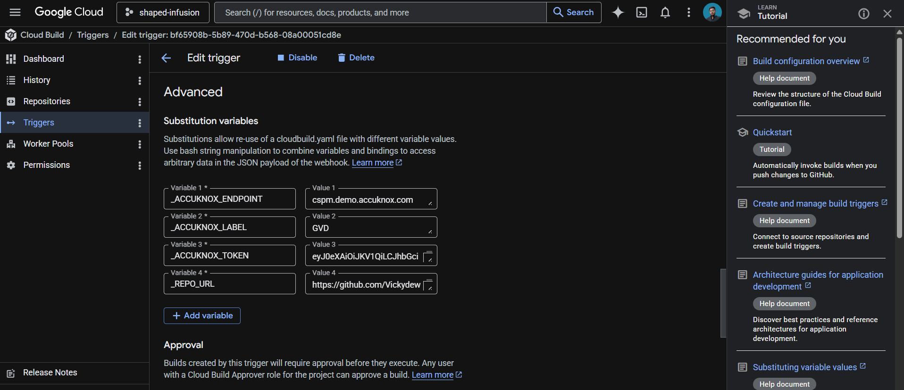
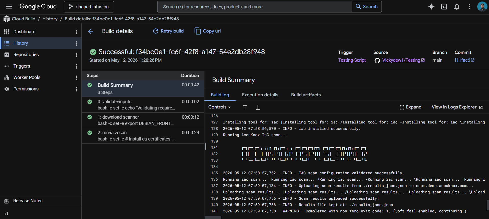
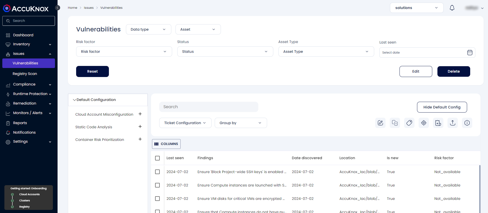
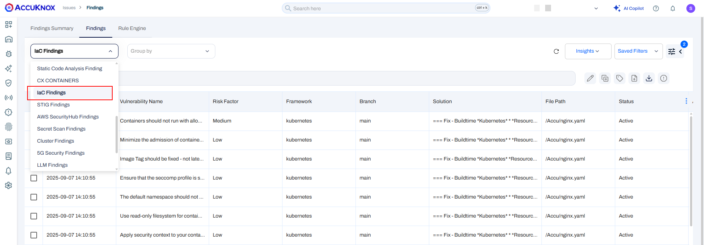
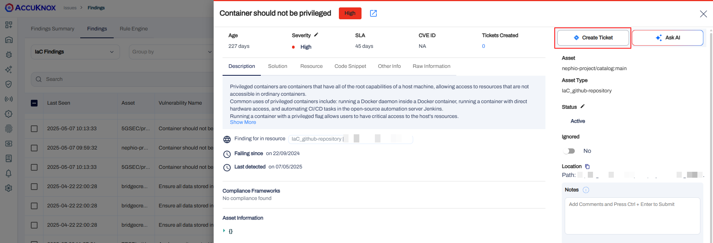
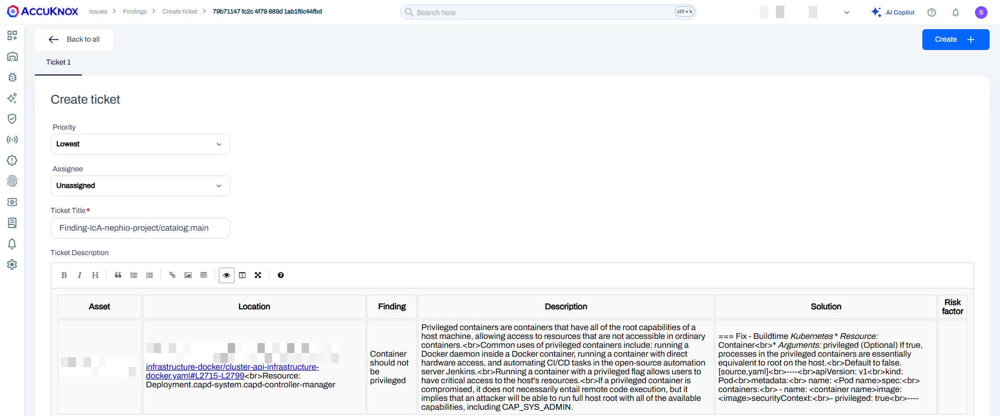
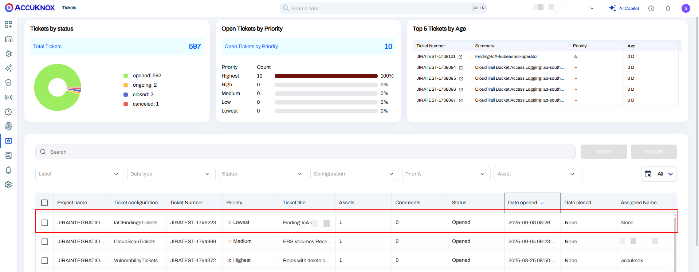

# Google Cloud Build IaC Scan

Integrate AccuKnox IaC scanning into Google Cloud Build to catch infrastructure misconfigurations before they hit production. The pipeline uses the AccuKnox ASPM Scanner CLI, runs in three steps, and uploads findings directly to your AccuKnox CSPM panel.

The scanner supports Terraform, CloudFormation, Kubernetes manifests, Helm charts, Dockerfiles, ARM templates, and Serverless framework configs. Common findings include public S3 buckets, overly permissive security groups, missing encryption at rest, privileged containers, and missing resource limits.

## **Prerequisites**

- GCP project with Cloud Build enabled

- AccuKnox SaaS access with permission to generate tokens

- A repository containing IaC files (Terraform, Kubernetes manifests, etc.) connected to Cloud Build

- A Cloud Build trigger pointing at the repository you want to scan

## **Steps for integration**

### **Step 1: Generate an AccuKnox token**

Log in to AccuKnox SaaS. Navigate to **Settings**, then **Tokens** and create a new token.


Save these three values for use in Step 3:

| **Field** | **Where to find it** |
|---|---|
| Endpoint | Your AccuKnox CSPM URL, for example, `cspm.demo.accuknox.com` |
| Token | The token string shown after creation |
| Label | Any descriptive string you choose |

### **Step 2: Add the cloudbuild.yaml to your repository**

Drop the following file at the root of your repository as `cloudbuild.yaml`.

```yaml
# AccuKnox IaC — Google Cloud Build Pipeline

steps:

  # ---------------------------------------------------------------------------
  # Step 1: Validate required inputs (fail fast)
  # ---------------------------------------------------------------------------
  - id: validate-inputs
    name: ubuntu:24.04
    entrypoint: bash
    env:
      - ACCUKNOX_ENDPOINT=${_ACCUKNOX_ENDPOINT}
      - ACCUKNOX_TOKEN=${_ACCUKNOX_TOKEN}
      - ACCUKNOX_LABEL=${_ACCUKNOX_LABEL}
    args:
      - -c
      - |
        set -e
        echo "Validating required inputs..."
        if [ -z "$$ACCUKNOX_ENDPOINT" ] || [ -z "$$ACCUKNOX_TOKEN" ] || [ -z "$$ACCUKNOX_LABEL" ]; then
          echo "ERROR: _ACCUKNOX_ENDPOINT, _ACCUKNOX_TOKEN, and _ACCUKNOX_LABEL must be set!"
          exit 1
        fi
        echo "All required inputs present."

  # ---------------------------------------------------------------------------
  # Step 2: Download the AccuKnox ASPM Scanner CLI
  # ---------------------------------------------------------------------------
  - id: download-scanner
    name: ubuntu:24.04
    entrypoint: bash
    args:
      - -c
      - |
        set -e
        export DEBIAN_FRONTEND=noninteractive
        apt-get update -qq
        apt-get install -y -qq --no-install-recommends curl ca-certificates

        echo "Downloading AccuKnox ASPM Scanner v0.14.2..."
        curl -sSL https://github.com/accuknox/aspm-scanner-cli/releases/download/v0.14.2/accuknox-aspm-scanner \
          -o /workspace/accuknox-aspm-scanner
        chmod +x /workspace/accuknox-aspm-scanner
        echo "Scanner downloaded to /workspace/accuknox-aspm-scanner"

  # ---------------------------------------------------------------------------
  # Step 3: Install the IaC scanner, run the IaC scan, upload to AccuKnox CSPM
  # Install + scan run in the same step because ~/.local/bin/accuknox/ does not
  # persist across Cloud Build steps — only /workspace is shared.
  # ---------------------------------------------------------------------------
  - id: run-iac-scan
    name: ubuntu:24.04
    entrypoint: bash
    env:
      - SOFT_FAIL=${_SOFT_FAIL}
      - ACCUKNOX_ENDPOINT=${_ACCUKNOX_ENDPOINT}
      - ACCUKNOX_TOKEN=${_ACCUKNOX_TOKEN}
      - ACCUKNOX_LABEL=${_ACCUKNOX_LABEL}
      - REPO_URL=${_REPO_URL}
      - BRANCH_NAME=${BRANCH_NAME}
    args:
      - -c
      - |
        set -e

        # Install ca-certificates so the scanner can upload over HTTPS
        export DEBIAN_FRONTEND=noninteractive
        apt-get update -qq
        apt-get install -y -qq --no-install-recommends ca-certificates

        # Install the IaC tool locally
        # Required because we are not using --container-mode
        echo "Installing IaC tool..."
        /workspace/accuknox-aspm-scanner tool install --type iac

        # Resolve soft-fail flag
        SOFT_FAIL=$(echo "$$SOFT_FAIL" | tr -d ' \t\r\n')
        SOFT_FAIL_ARG=""
        if [ "$$SOFT_FAIL" = "true" ]; then
          SOFT_FAIL_ARG="--softfail"
        fi

        # Optional repo-branch arg
        REPO_BRANCH_ARG=""
        if [ -n "$$BRANCH_NAME" ]; then
          REPO_BRANCH_ARG="--repo-branch $$BRANCH_NAME"
        fi

        # Fallback for missing REPO_URL
        if [ -z "$$REPO_URL" ]; then
          echo "WARNING: _REPO_URL substitution is empty."
        fi

        # Run the IaC scan
        echo "Running AccuKnox IaC scan..."
        /workspace/accuknox-aspm-scanner scan --keep-results $$SOFT_FAIL_ARG iac \
          --command "-d ." \
          --repo-url "$$REPO_URL" \
          $$REPO_BRANCH_ARG

# =============================================================================
# Substitutions
#   _ACCUKNOX_ENDPOINT  -> accuknox_endpoint  (required)
#   _ACCUKNOX_TOKEN     -> accuknox_token     (required)
#   _ACCUKNOX_LABEL     -> accuknox_label     (required)
#   _SOFT_FAIL          -> soft_fail          (optional, default "true")
#   _REPO_URL           -> repository URL     (optional)
# =============================================================================
substitutions:
  _ACCUKNOX_ENDPOINT: ""
  _ACCUKNOX_TOKEN: ""
  _ACCUKNOX_LABEL: ""
  _SOFT_FAIL: "true"
  _REPO_URL: ""

options:
  logging: CLOUD_LOGGING_ONLY
  machineType: E2_HIGHCPU_8

timeout: 1800s
```

Commit and push the file to your repository.

### **Step 3: Configure the Cloud Build trigger**

Open Cloud Build in the GCP console. Create or edit a trigger pointing at your repository.

Under **Configuration**, select **Cloud Build configuration file** and point it at `cloudbuild.yaml`.

Under **Advanced**, then **Substitution variables**, add:

| **Variable name** | **Value** |
|---|---|
| `_ACCUKNOX_ENDPOINT` | Your CSPM endpoint, for example, `cspm.demo.accuknox.com` |
| `_ACCUKNOX_TOKEN` | The token from Step 1 |
| `_ACCUKNOX_LABEL` | A label of your choice, for example, `iac-myapp` |
| `_REPO_URL` | Your repo URL, for example, `https://github.com/your-org/your-repo.git` |
| `_SOFT_FAIL` | *optional.* `true` (default) or `false` to fail the build on findings |



These values live in the trigger config rather than the YAML, which keeps your token out of git history.

Save the trigger. The next push to the watched branch runs the pipeline.

## **How the pipeline works**

| **Step** | **Purpose** |
|---|---|
| 1. validate-inputs | Fails the build in under a second if any required substitution is empty. Saves a wasted scanner download when the token is missing. |
| 2. download-scanner | Fetches the AccuKnox ASPM Scanner v0.14.2 binary into `/workspace`, which persists across Cloud Build steps. |
| 3. run-iac-scan | Installs the IaC scanning tool locally via the scanner CLI, runs the scan against the repo root, and uploads findings to AccuKnox CSPM. |



## **Viewing results**

Open the AccuKnox CSPM panel. Filter findings by the label you set in `_ACCUKNOX_LABEL`. Each finding includes the file path, line number, rule ID, severity, and remediation guidance. Typical IaC findings include unencrypted storage, missing logging configurations, public network access, and missing IAM constraints.

## **Before the AccuKnox scan**

Without IaC scanning in your pipeline, infrastructure misconfigurations only get caught after they're deployed (or worse, after they're exploited). Manual code review catches some issues, but humans miss things. Public S3 buckets, open security groups, and unencrypted databases routinely make it to production this way.

## **After AccuKnox scan integration**

Once the pipeline above is wired up, every push triggers an IaC scan. The scanner flags misconfigurations like public buckets, missing encryption, overly permissive IAM policies, and Kubernetes containers running as root before the change merges. Findings appear in your AccuKnox CSPM panel with severity, file location, and remediation guidance, alongside your SAST, container, and DAST findings. Critical issues can fail the build by toggling `_SOFT_FAIL` to `false`.


### **View Results Under AccuKnox SaaS**

**Step 1**: Once the scan is complete, users can go into the AccuKnox SaaS platform and navigate to **Issues** → **Vulnerabilities**, where they can find misconfigurations in their Infrastructure as Code.



**Step 2**: The user must select **IaC Scan** from the data type filter next to the findings



**Step 3**: Clicking on the misconfiguration opens up the ticket creation dialog box.



**Step 4**: Choose a ticket configuration and click the adjacent button to create a ticket for remediation.



**Step 5**: Click on **Create** to create the ticket, Once it is created it will be visible in your ticketing tool dashboard.

**Step 6**: After remediating the issue, rescan the Terraform script to ensure the misconfiguration has been fixed. Then, navigate to AccuKnox SaaS to view the updated findings.



## **Conclusion**

Google offers a complete ecosystem for CI/CD that includes Google Cloud Build, Google Cloud Registry, Google Cloud Repository, and Google Secret Manager. AccuKnox IaC scanning brings several benefits to the mix:

- IaC scanning in a CI/CD pipeline stops Security issues from reaching the cloud infrastructure.

- From AccuKnox SaaS users can view the findings and mitigate the CRITICAL/HIGH findings.

- Once the issues are resolved, users can trigger the scan again and observe the changes in the findings to ensure that the updated terraform script successfully deploys the cloud infrastructure.

AccuKnox IaC scanning also integrates seamlessly with most CI/CD pipeline tools, including Jenkins, GitHub, GitLab, Azure Pipelines, AWS CodePipelines, etc.

- - -
[SCHEDULE DEMO](https://www.accuknox.com/contact-us){ .md-button .md-button--primary }
