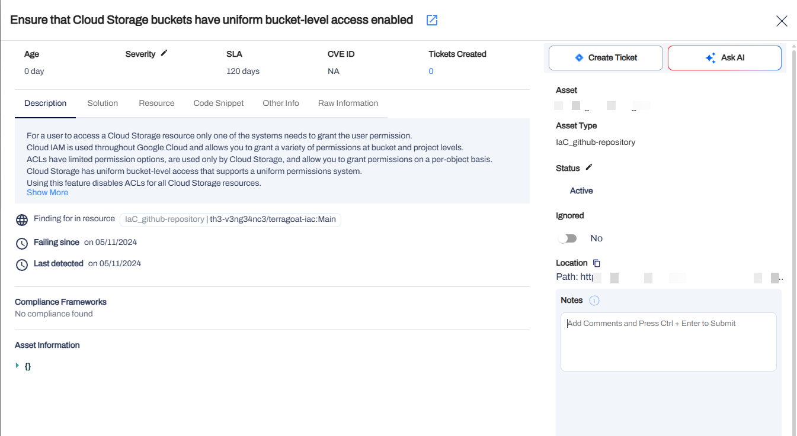
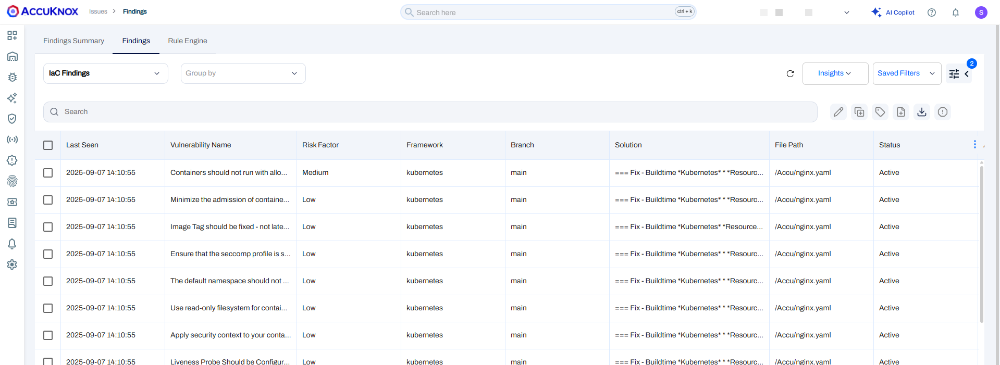
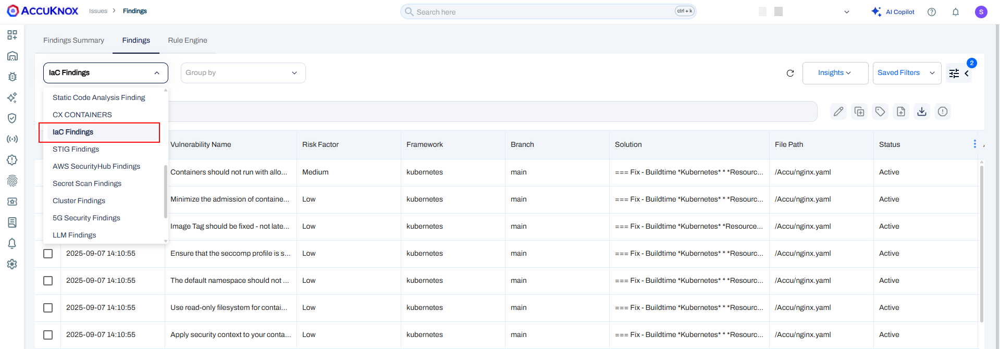
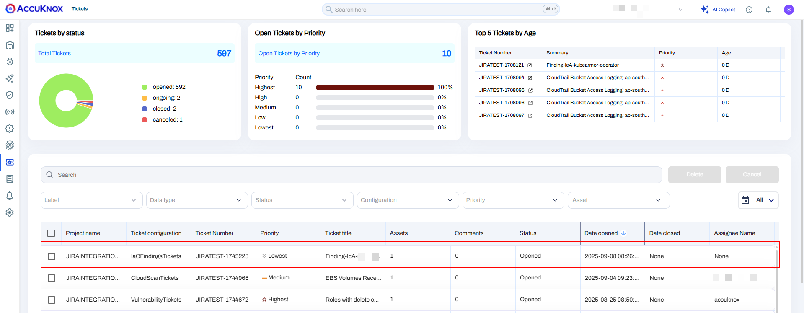

To illustrate the advantages of integrating AccuKnox into a CI/CD pipeline using Google Cloud Build to improve security, let's take a specific scenario involving infrastructure-as-code (IaC) configurations with known misconfigurations. By adding AccuKnox scanning to the pipeline, we can detect and address these security issues before deploying the infrastructure.

## **Pre-requisite**

- GCP Console Access

- AccuKnox IaC scan

- Google Cloud build Pipeline

- Terraform for Infrastructure management

- Github/Google Cloud source repositories

## **Steps for integration**

**Step 1**: Login to AccuKnox Saas, Navigate to Settings, and select Tokens to create an AccuKnox token for forwarding scan results to Saas


**Note**: Copy the token and create a Google Cloud secret for the token to be used as a secret in the pipeline. Also, copy the tenant ID value to be used in the Cloud Build YAML file.

**Step 2**: To integrate AccuKnox scans into your Google cloud build, set up a ```cloudbuild.yaml``` file in your repository with the following content:

```yaml
steps:
  # Step 1: Clone the GitHub repository
  - name: 'gcr.io/cloud-builders/git'
    entrypoint: 'bash'
    args:
      - '-c'
      - |
        git clone https://github.com/{user-name}/{repo-name}.git /workspace/AccuKnox_Iac
  # Step 2: Install Checkov and run the scan, saving the report in JSON format
  - name: 'python:3.8'
    entrypoint: 'bash'
    args:
      - '-c'
      - |
        pip install checkov && \
        checkov -d /workspace/AccuKnox_Iac --output json > /workspace/checkov_report.json || true
  # Step 3: Access the secret using gcloud and save it to a file
  - name: 'gcr.io/cloud-builders/gcloud'
    entrypoint: 'bash'
    args:
      - '-c'
      - |
        gcloud secrets versions access latest --secret=accuknox_token --format='get(payload.data)' | tr '_-' '/+' | base64 -d > /workspace/decrypted-data.txt
  # Step 4: Install jq and manipulate JSON report
  - name: 'ubuntu'
    entrypoint: 'bash'
    args:
      - '-c'
      - |
        apt-get update && apt-get install -y jq && \
        if [ "." = "${directory}" ] && [ -z "${file}" ]; then \
          jq --arg repoLink "${repository}" --arg branch "${branch}" \
             '. += [{"details": {"repo": $repoLink, "branch": $branch}}]' \
             /workspace/checkov_report.json > /workspace/results.json && \
          mv /workspace/results.json /workspace/checkov_report.json; \
        else \
          echo '[' > /workspace/results.json && \
          cat /workspace/checkov_report.json >> /workspace/results.json && \
          echo ']' >> /workspace/results.json && \
          jq --arg repoLink "${repository}" --arg branch "${branch}" \
             '. += [{"details": {"repo": $repoLink, "branch": $branch}}]' \
             /workspace/results.json > /workspace/tmp.json && \
          mv /workspace/tmp.json /workspace/checkov_report.json; \
        fi  # Removed unnecessary && here
  # Step 6: Push report to CSPM panel
  - name: 'gcr.io/cloud-builders/curl'
    entrypoint: 'bash'
    args:
      - '-c'
      - |
        ls -l /workspace/  # Verify file existence and permissions
        # Check if checkov_report.json exists before attempting to upload
        if [ -f /workspace/checkov_report.json ]; then
          curl --location --request POST "https://${_CSPM_URL}/api/v1/artifact/?tenant_id=${_TENANT_ID}&data_type=IAC&save_to_s3=false" \
            --header "Tenant-Id: ${_TENANT_ID}" \
            --header "Authorization: Bearer $(cat /workspace/decrypted-data.txt)" \
            --form "file=@/workspace/checkov_report.json"
        else
          echo "checkov_report.json not found in /workspace/ directory"
          exit 1
        fi
# Artifacts to store the Checkov report
artifacts:
  objects:
    location: 'gs://{bucket-name}/checkov-reports/'
    paths:
      - 'checkov_report.json'
      - 'results.json'  # Ensure results.json is included as an artifact
# Define substitutions
substitutions:
  _CSPM_URL: '{cspm.<env-name>.accuknox.com}'
  _TENANT_ID: '{xxx}'
  _BUCKET_NAME: 'gs://{bucket-name}'
# Define timeout for the entire pipeline
timeout: '1200s'  # 20 minutes
logsBucket: 'gs://{bucket-name}'
```

**Note**: In the YAML file above, you need to replace the value for the GitHub URL with the actual user name and repository name. Under substitution, replace "**CSPM URL**" with the applicable "cspm env-name" (e.g. demo or use ```"{cspm.accuknox.com}"``` if you are making use of a paid SaaS subscription), replace "**bucket name**" with your GCP bucket name, and replace "**Tenant ID**" with your tenant ID copied in the **Step 1**.

## **Before AccuKnox Scan**

Initially, the CI/CD pipeline does not include the AccuKnox scan. When you push the Terraform code above, it gets deployed without any security checks, potentially **allowing the storage bucket to access the public**

## **After AccuKnox Scan Integration**

After integrating AccuKnox into your CI/CD pipeline, the next push triggers the Google Cloudbuild Actions workflow. The AccuKnox scan identifies the misconfiguration with the Google Cloud Storage bucket:

```json
      {
          "check_id": "CKV_GCP_29",
          "bc_check_id": "BC_GCP_GCS_2",
          "check_name": "Ensure that Cloud Storage buckets have uniform bucket-level access enabled",
          "check_result": {
            "result": "FAILED",
            "evaluated_keys": [
              "uniform_bucket_level_access"
            ]
          },
          "code_block": [
            [
              8,
              "resource \"google_storage_bucket\" \"terraform_state\" {\n"
            ],
            [
              9,
              "  name          = \"${var.bucket_name}\"\n"
            ],
            [
              10,
              "  force_destroy = true\n"
            ],
            [
              11,
              "}\n"
            ]
          ],
          "file_path": "/code/06-create-cloud-storage/main.tf",
          "file_abs_path": "/workspace/AccuKnox_Iac/code/06-create-cloud-storage/main.tf",
          "repo_file_path": "/AccuKnox_Iac/code/06-create-cloud-storage/main.tf",
          "file_line_range": [
            8,
            11
          ],
          "resource": "google_storage_bucket.terraform_state",
          "evaluations": null,
          "check_class": "checkov.terraform.checks.resource.gcp.GoogleStorageBucketUniformAccess",
          "fixed_definition": null,
          "entity_tags": null,
          "caller_file_path": null,
          "caller_file_line_range": null,
          "resource_address": null,
          "severity": null,
          "bc_category": null,
          "benchmarks": null,
          "description": null,
          "short_description": null,
          "vulnerability_details": null,
          "connected_node": null,
          "guideline": "https://docs.prismacloud.io/en/enterprise-edition/policy-reference/google-cloud-policies/google-cloud-storage-gcs-policies/bc-gcp-gcs-2",
          "details": [],
          "check_len": null,
          "definition_context_file_path": "/workspace/AccuKnox_Iac/code/06-create-cloud-storage/main.tf",
          "breadcrumbs": {
            "name": [
              {
                "type": "variable",
                "name": "bucket_name",
                "path": "/workspace/AccuKnox_Iac/code/06-create-cloud-storage/vars.tf",
                "module_connection": false
              }
            ]
          }
      }
```

You can also access the same security finding on the AccuKnox SaaS UI



Under Google Codebuild History


### **View Results Under AccuKnox SaaS**

**Step 1**: Once the scan is complete, users can go into the AccuKnox SaaS platform and navigate to **Issues** → **Vulnerabilities**, where they can find misconfigurations in their Infrastructure as Code.



**Step 2**: The user must select **IaC Scan** from the data type filter next to the findings



**Step 3**: Clicking on the misconfiguration opens up the ticket creation dialog box.


**Step 4**: Choose a ticket configuration and click the adjacent button to create a ticket for remediation.


**Step 5**: Click on **Create** to create the ticket, Once it is created it will be visible in your ticketing tool dashboard.

**Step 6**: After remediating the issue, rescan the Terraform script to ensure the misconfiguration has been fixed. Then, navigate to AccuKnox SaaS to view the updated findings.



## **Conclusion**

Google offers a complete ecosystem for CI/CD that includes Google Cloud Build, Google Cloud Registry, Google Cloud Repository, and Google Secret Manager. AccuKnox IaC scanning brings several benefits to the mix:

- IaC scanning in a CI/CD pipeline stops Security issues from reaching the cloud infrastructure.

- From AccuKnox Saas users can view the findings and mitigate the CRITICAL/HIGH findings.

- Once the issues are resolved, users can trigger the scan again and observe the changes in the findings to ensure that the updated terraform script successfully deploys the cloud infrastructure.

AccuKnox IaC scanning also integrates seamlessly with most CI/CD pipeline tools, including Jenkins, GitHub, GitLab, Azure Pipelines, AWS CodePipelines, etc.

- - -
[SCHEDULE DEMO](https://www.accuknox.com/contact-us){ .md-button .md-button--primary }