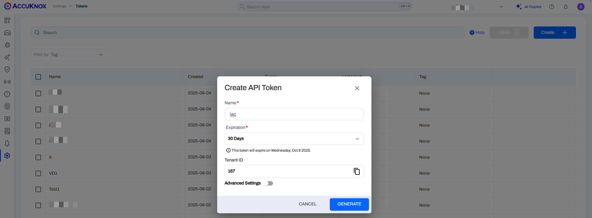
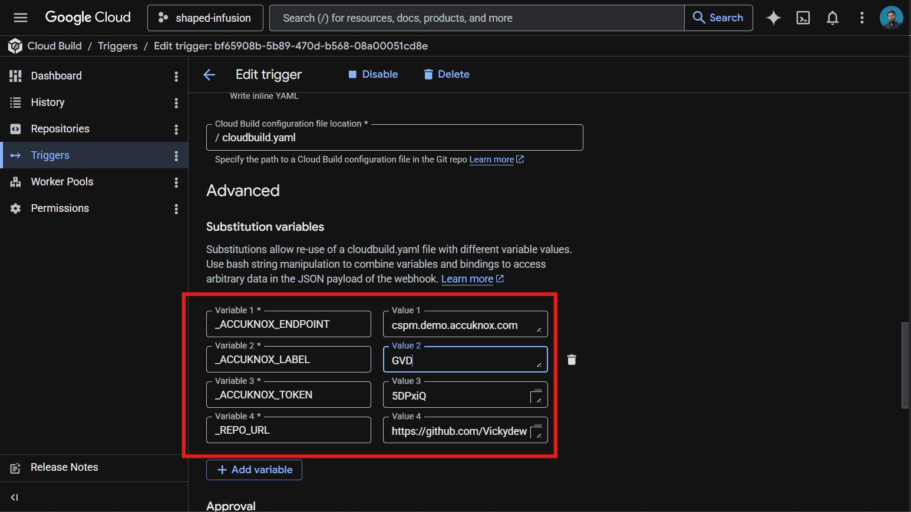
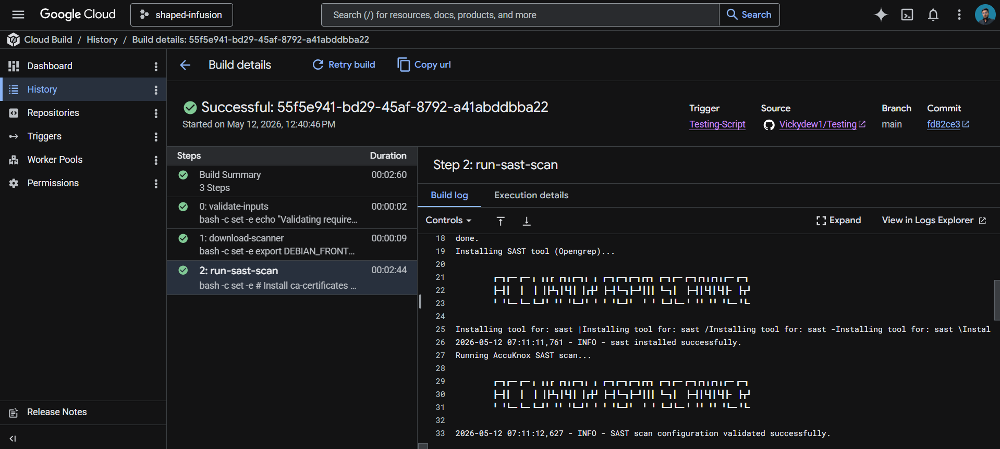
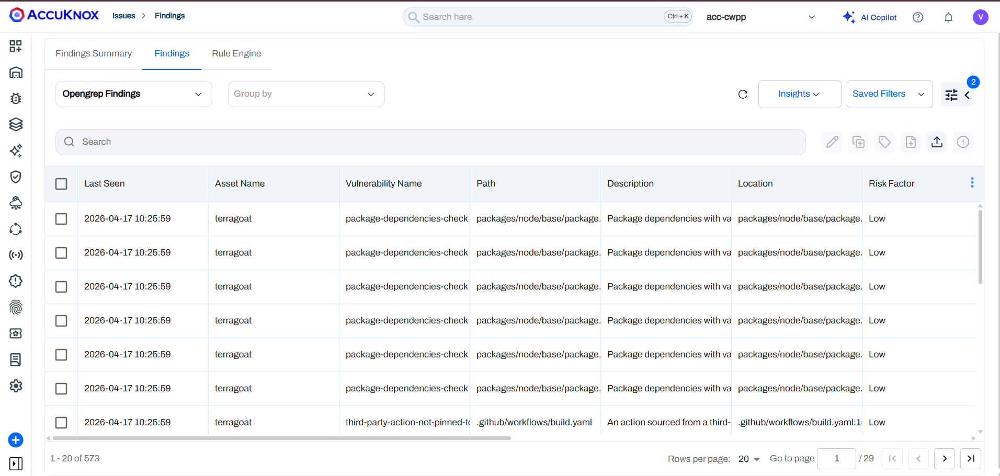
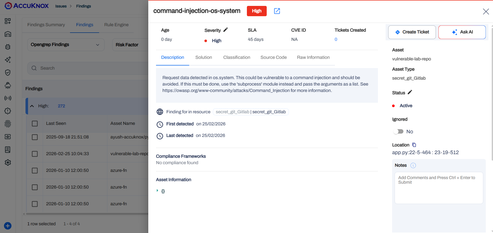
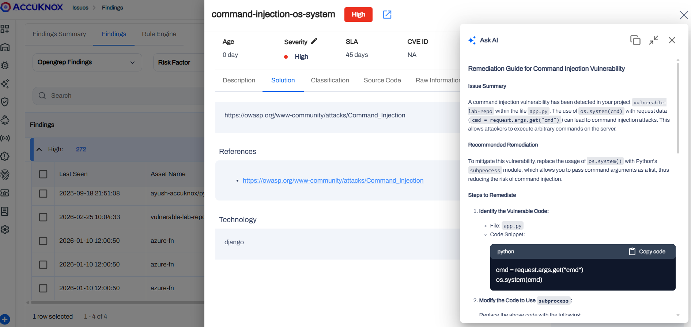
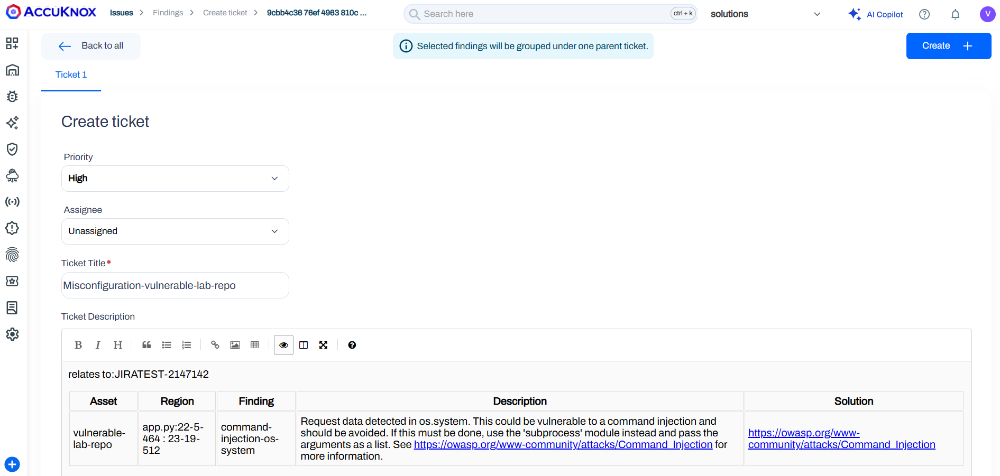

# Google Cloud Build SAST

Integrate AccuKnox SAST scanning into Google Cloud Build to catch source code vulnerabilities before they ship. The pipeline uses the AccuKnox ASPM Scanner CLI, runs in three steps, and uploads findings directly to your AccuKnox CSPM panel.

## **Prerequisites**

- GCP project with Cloud Build enabled

- AccuKnox SaaS access with permission to generate tokens

- A GitHub, GitLab, Bitbucket, or Cloud Source Repository connected to Cloud Build

- A Cloud Build trigger pointing at the repository you want to scan

## **Steps for integration**

### **Step 1: Generate an AccuKnox token**

Log in to AccuKnox SaaS. Navigate to **Settings**, then **Tokens** and create a new token.



Save these three values for use in Step 3:

| **Field** | **Where to find it** |
|---|---|
| Endpoint | Your AccuKnox CSPM URL, for example, `cspm.demo.accuknox.com` |
| Token | The token string shown after creation |
| Label | Any descriptive string you choose |

### **Step 2: Add the cloudbuild.yaml to your repository**

Drop the following file at the root of your repository as `cloudbuild.yaml`.

```yaml
# AccuKnox SAST — Google Cloud Build Pipeline

steps:

  # ---------------------------------------------------------------------------
  # Step 1: Validate required inputs (fail fast)
  # ---------------------------------------------------------------------------
  - id: validate-inputs
    name: ubuntu:24.04
    entrypoint: bash
    env:
      - ACCUKNOX_ENDPOINT=${_ACCUKNOX_ENDPOINT}
      - ACCUKNOX_TOKEN=${_ACCUKNOX_TOKEN}
      - ACCUKNOX_LABEL=${_ACCUKNOX_LABEL}
    args:
      - -c
      - |
        set -e
        echo "Validating required inputs..."
        if [ -z "$$ACCUKNOX_ENDPOINT" ] || [ -z "$$ACCUKNOX_TOKEN" ] || [ -z "$$ACCUKNOX_LABEL" ]; then
          echo "ERROR: _ACCUKNOX_ENDPOINT, _ACCUKNOX_TOKEN, and _ACCUKNOX_LABEL must be set!"
          exit 1
        fi
        echo "All required inputs present."

  # ---------------------------------------------------------------------------
  # Step 2: Download the AccuKnox ASPM Scanner CLI
  # ---------------------------------------------------------------------------
  - id: download-scanner
    name: ubuntu:24.04
    entrypoint: bash
    args:
      - -c
      - |
        set -e
        export DEBIAN_FRONTEND=noninteractive
        apt-get update -qq
        apt-get install -y -qq --no-install-recommends curl ca-certificates

        echo "Downloading AccuKnox ASPM Scanner v0.14.2..."
        curl -sSL https://github.com/accuknox/aspm-scanner-cli/releases/download/v0.14.2/accuknox-aspm-scanner \
          -o /workspace/accuknox-aspm-scanner
        chmod +x /workspace/accuknox-aspm-scanner
        echo "Scanner downloaded to /workspace/accuknox-aspm-scanner"

  # ---------------------------------------------------------------------------
  # Step 3: Run the AccuKnox SAST scan and upload to CSPM
  # ---------------------------------------------------------------------------
  - id: run-sast-scan
    name: ubuntu:24.04
    entrypoint: bash
    env:
      - SOFT_FAIL=${_SOFT_FAIL}
      - PIPELINE_ID=${BUILD_ID}
      - JOB_URL=https://console.cloud.google.com/cloud-build/builds/${BUILD_ID}?project=${PROJECT_ID}
      - ACCUKNOX_ENDPOINT=${_ACCUKNOX_ENDPOINT}
      - ACCUKNOX_TOKEN=${_ACCUKNOX_TOKEN}
      - ACCUKNOX_LABEL=${_ACCUKNOX_LABEL}
      - REPO_URL=${_REPO_URL}
      - COMMIT_SHA=${COMMIT_SHA}
    args:
      - -c
      - |
        set -e

        # Install ca-certificates so the scanner can upload over HTTPS
        export DEBIAN_FRONTEND=noninteractive
        apt-get update -qq
        apt-get install -y -qq --no-install-recommends ca-certificates

        # Install the SAST tool locally
        # Required because we are not using --container-mode
        echo "Installing SAST tool..."
        /workspace/accuknox-aspm-scanner tool install --type sast

        # Resolve soft-fail flag
        SOFT_FAIL=$(echo "$$SOFT_FAIL" | tr -d ' \t\r\n')
        SOFT_FAIL_ARG=""
        if [ "$$SOFT_FAIL" = "true" ]; then
          SOFT_FAIL_ARG="--softfail"
        fi

        # Fallbacks for manual builds (no trigger context)
        if [ -z "$$COMMIT_SHA" ]; then
          COMMIT_SHA="manual-$$PIPELINE_ID"
        fi
        if [ -z "$$REPO_URL" ]; then
          echo "WARNING: _REPO_URL substitution is empty."
        fi

        # Run the SAST scan
        echo "Running AccuKnox SAST scan..."
        /workspace/accuknox-aspm-scanner scan --keep-results $$SOFT_FAIL_ARG sast \
          --command "." \
          --repo-url "$$REPO_URL" \
          --commit-sha "$$COMMIT_SHA" \
          --pipeline-id "$$PIPELINE_ID" \
          --job-url "$$JOB_URL"

# =============================================================================
# Substitutions (map 1:1 to action.yaml inputs)
#   _ACCUKNOX_ENDPOINT  -> accuknox_endpoint  (required)
#   _ACCUKNOX_TOKEN     -> accuknox_token     (required)
#   _ACCUKNOX_LABEL     -> accuknox_label     (required)
#   _SOFT_FAIL          -> soft_fail          (optional, default "true")
#   _REPO_URL           -> repository URL     (optional)
# =============================================================================
substitutions:
  _ACCUKNOX_ENDPOINT: ""
  _ACCUKNOX_TOKEN: ""
  _ACCUKNOX_LABEL: ""
  _SOFT_FAIL: "true"
  _REPO_URL: ""

options:
  logging: CLOUD_LOGGING_ONLY
  machineType: E2_HIGHCPU_8

timeout: 1800s
```

Commit and push the file to your repository.

### **Step 3: Configure the Cloud Build trigger**

Open Cloud Build in the GCP console. Create or edit a trigger pointing at your repository.

Under **Configuration**, select **Cloud Build configuration file** and point it at `cloudbuild.yaml`.

Under **Advanced**, then **Substitution variables**, add:

| **Variable name** | **Value** |
|---|---|
| `_ACCUKNOX_ENDPOINT` | Your CSPM endpoint, for example, `cspm.demo.accuknox.com` |
| `_ACCUKNOX_TOKEN` | The token from Step 1 |
| `_ACCUKNOX_LABEL` | A label of your choice, for example, `sast-myapp` |
| `_REPO_URL` | Your repo URL, for example, `https://github.com/your-org/your-repo.git` |
| `_SOFT_FAIL` | *optional.* `true` (default) or `false` to fail the build on findings |



These values live in the trigger config rather than the YAML, which keeps your token out of git history.

Save the trigger. The next push to the watched branch runs the pipeline.

## **How the pipeline works**

| **Step** | **Purpose** |
|---|---|
| 1. validate-inputs | Fails the build in under a second if any required substitution is empty. Saves a wasted scanner download when the token is missing. |
| 2. download-scanner | Fetches the AccuKnox ASPM Scanner v0.14.2 binary into `/workspace`, which persists across Cloud Build steps. |
| 3. run-sast-scan | Installs the SAST tool locally via the scanner CLI, runs the scan against the repo root, and uploads findings to AccuKnox CSPM. |



## **Viewing results**

Open the AccuKnox CSPM panel. Filter findings by the label you set in `_ACCUKNOX_LABEL`. Each finding includes the file, line number, rule ID, and severity, with a direct link back to the offending Cloud Build run.

## **Before the AccuKnox scan**

Without SAST integration, source code vulnerabilities such as SQL injection, hardcoded credentials, or insecure deserialization slip through every push. The CI/CD pipeline builds and deploys the artifact whether the code is safe or not.

## **After AccuKnox scan integration**

Once the pipeline above is wired up, every push triggers the SAST scan. Issues like SQL injection patterns, weak crypto, or unsafe input handling are flagged within minutes. Findings appear in your AccuKnox CSPM panel with severity, file location, and remediation guidance. Critical issues can fail the build by toggling `_SOFT_FAIL` to `false`.


### **View the Results in AccuKnox SaaS**

**Step 1**: After the workflow completes, navigate to the AccuKnox SaaS dashboard.

**Step 2**: Go to **Issues** > **Findings** and select **OpenGrep Findings** to see identified vulnerabilities.



**Step 3**: Click on a vulnerability to view more details.



**Step 4**: Fix the Vulnerability

Follow the instructions in the **Solutions** tab to fix the vulnerability.



**Step 5**: Create a ticket for fixing the vulnerability by selecting a Ticket Configuration and clicking on the adjacent button.



**Step 6**: Review the Updated Results

- After fixing the vulnerability, rerun the Cloud Build pipeline.

- Navigate to the AccuKnox SaaS dashboard and verify that the vulnerability has been resolved.

## **Conclusion**

Google offers a complete ecosystem for CI/CD that includes Google Cloud Build, Google Cloud Registry, Google Cloud Repository, and Google Secret Manager. AccuKnox SAST scanning brings several benefits to the mix:

- Code scanning in a CI/CD pipeline stops security issues from reaching deployment.

- From AccuKnox SaaS, users can view the findings and mitigate the CRITICAL/HIGH findings.

- Once the issues are resolved, users can trigger the scan again and observe the changes in the findings to ensure that the updated code successfully passes security checks.

AccuKnox SAST also integrates seamlessly with most CI/CD pipeline tools, including Jenkins, GitHub, GitLab, Azure Pipelines, AWS CodePipelines, etc.

- - -
[SCHEDULE DEMO](https://www.accuknox.com/contact-us){ .md-button .md-button--primary }
