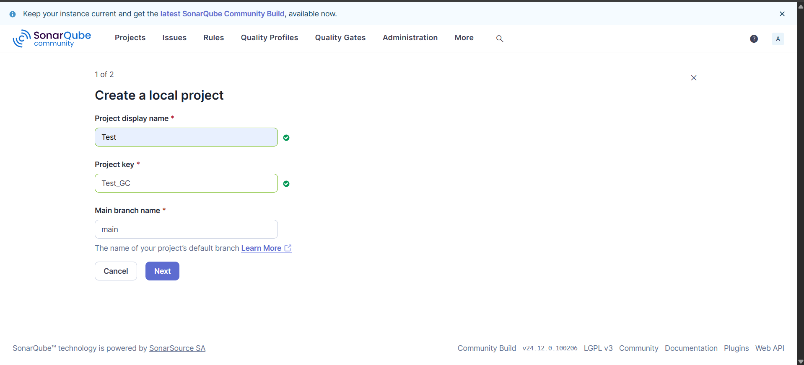
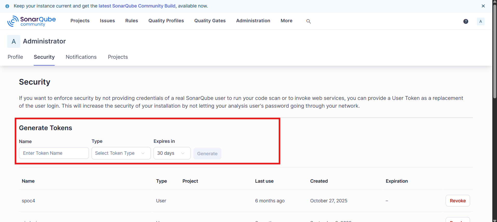
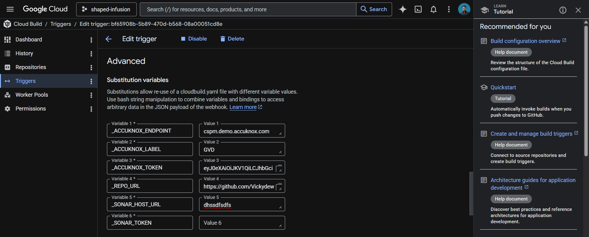
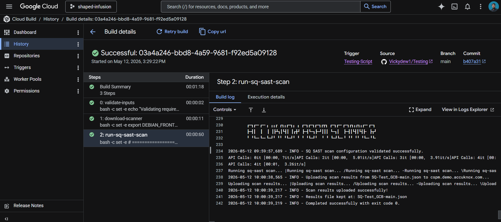
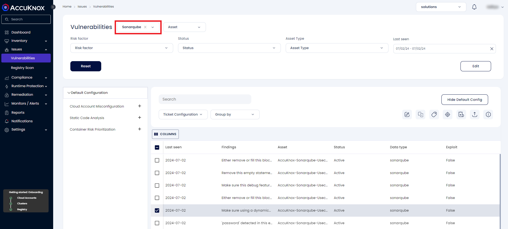
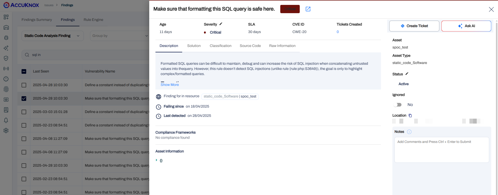
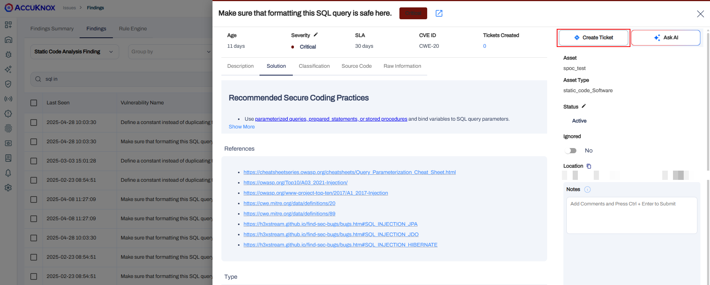
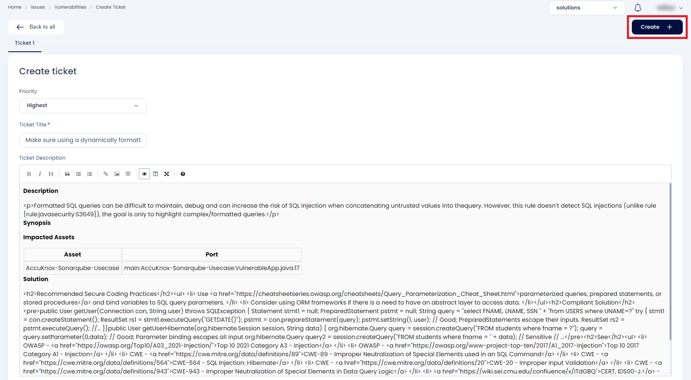

# Google Cloud Build SQ-SAST

Integrate AccuKnox SonarQube-based SAST scanning into Google Cloud Build to catch source code vulnerabilities flagged by the SonarQube ruleset. The pipeline uses the AccuKnox ASPM Scanner CLI to run the Sonar Scanner, then forwards findings directly to your AccuKnox CSPM panel.

## **Prerequisites**

- GCP project with Cloud Build enabled

- AccuKnox SaaS access with permission to generate tokens

- A SonarCloud or self-hosted SonarQube instance with a project already created

- A GitHub, GitLab, Bitbucket, or Cloud Source Repository connected to Cloud Build

- A Cloud Build trigger pointing at the repository you want to scan

## **Steps for integration**

### **Step 1: Gather your credentials**

You need credentials from two systems before configuring the pipeline.

**AccuKnox**

Log in to AccuKnox SaaS. Navigate to **Settings > Tokens**, then create a new token.


**SonarQube / SonarCloud**

Open your SonarQube instance or sonarcloud.io. Find the project you want to scan, then grab the project key (**Project Settings > Information**). Then, create an auth token under **My Account**, then **Security**. For SonarCloud, also note your organisation key.





Save these values for use in Step 3:

| **Field** | **Where to find it** |
|---|---|
| AccuKnox Endpoint | Your AccuKnox CSPM URL, for example, `cspm.demo.accuknox.com` |
| AccuKnox Token | The token string shown after creation |
| AccuKnox Label | Any descriptive string you choose |
| Sonar Project Key | Project Settings, then Information |
| Sonar Host URL | Your SonarQube URL or `https://sonarcloud.io` |
| Sonar Token | My Account, then Security, then Generate token |
| Sonar Organization | SonarCloud only, leave blank for self-hosted SonarQube |

### **Step 2: Add the cloudbuild.yaml to your repository**

Drop the following file at the root of your repository as `cloudbuild.yaml`.

```yaml
# =============================================================================
# AccuKnox SonarQube SAST (sq-sast) - Google Cloud Build Pipeline
# Runs a SonarQube/SonarCloud scan and fetches results into AccuKnox CSPM.
# =============================================================================

steps:

  # Step 1: Validate required inputs (fail fast)
  - id: validate-inputs
    name: ubuntu:24.04
    entrypoint: bash
    env:
      - ACCUKNOX_ENDPOINT=${_ACCUKNOX_ENDPOINT}
      - ACCUKNOX_TOKEN=${_ACCUKNOX_TOKEN}
      - ACCUKNOX_LABEL=${_ACCUKNOX_LABEL}
      - SONAR_PROJECT_KEY=${_SONAR_PROJECT_KEY}
      - SONAR_HOST_URL=${_SONAR_HOST_URL}
      - SONAR_TOKEN=${_SONAR_TOKEN}
    args:
      - -c
      - |
        set -e
        if [ -z "$$ACCUKNOX_ENDPOINT" ] || [ -z "$$ACCUKNOX_TOKEN" ] || [ -z "$$ACCUKNOX_LABEL" ]; then
          echo "ERROR: _ACCUKNOX_ENDPOINT, _ACCUKNOX_TOKEN, and _ACCUKNOX_LABEL must be set!"
          exit 1
        fi
        if [ -z "$$SONAR_PROJECT_KEY" ] || [ -z "$$SONAR_HOST_URL" ] || [ -z "$$SONAR_TOKEN" ]; then
          echo "ERROR: _SONAR_PROJECT_KEY, _SONAR_HOST_URL, and _SONAR_TOKEN must be set!"
          exit 1
        fi
        echo "All required inputs present."

  # Step 2: Download the AccuKnox ASPM Scanner CLI
  - id: download-scanner
    name: ubuntu:24.04
    entrypoint: bash
    args:
      - -c
      - |
        set -e
        export DEBIAN_FRONTEND=noninteractive
        apt-get update -qq
        apt-get install -y -qq --no-install-recommends curl ca-certificates

        curl -sSL https://github.com/accuknox/aspm-scanner-cli/releases/download/v0.14.2/accuknox-aspm-scanner \
          -o /workspace/accuknox-aspm-scanner
        chmod +x /workspace/accuknox-aspm-scanner

  # Step 3: Install Sonar Scanner, run the scan, upload results to AccuKnox CSPM
  - id: run-sq-sast-scan
    name: ubuntu:24.04
    entrypoint: bash
    env:
      - SOFT_FAIL=${_SOFT_FAIL}
      - SKIP_SONAR_SCAN=${_SKIP_SONAR_SCAN}
      - ACCUKNOX_ENDPOINT=${_ACCUKNOX_ENDPOINT}
      - ACCUKNOX_TOKEN=${_ACCUKNOX_TOKEN}
      - ACCUKNOX_LABEL=${_ACCUKNOX_LABEL}
      - SONAR_PROJECT_KEY=${_SONAR_PROJECT_KEY}
      - SONAR_HOST_URL=${_SONAR_HOST_URL}
      - SONAR_TOKEN=${_SONAR_TOKEN}
      - SONAR_ORGANIZATION=${_SONAR_ORGANIZATION}
      - REPO_URL=${_REPO_URL}
      - BRANCH_NAME=${BRANCH_NAME}
      - COMMIT_SHA=${COMMIT_SHA}
      - BUILD_ID=${BUILD_ID}
      - PROJECT_ID=${PROJECT_ID}
    args:
      - -c
      - |
        set -e

        export DEBIAN_FRONTEND=noninteractive
        apt-get update -qq
        apt-get install -y -qq --no-install-recommends ca-certificates default-jre-headless

        /workspace/accuknox-aspm-scanner tool install --type sq-sast

        SOFT_FAIL=$(echo "$$SOFT_FAIL" | tr -d ' \t\r\n')
        SOFT_FAIL_ARG=""
        if [ "$$SOFT_FAIL" = "true" ]; then
          SOFT_FAIL_ARG="--softfail"
        fi

        SKIP_SCAN_ARG=""
        if [ "$$SKIP_SONAR_SCAN" = "true" ]; then
          SKIP_SCAN_ARG="--skip-sonar-scan"
        fi

        SONAR_ORG_FLAG=""
        if [ -n "$$SONAR_ORGANIZATION" ]; then
          SONAR_ORG_FLAG="-Dsonar.organization=$$SONAR_ORGANIZATION"
        fi

        SONAR_CMD="-Dsonar.projectKey=$$SONAR_PROJECT_KEY -Dsonar.host.url=$$SONAR_HOST_URL -Dsonar.token=$$SONAR_TOKEN $$SONAR_ORG_FLAG"

        PIPELINE_URL="https://console.cloud.google.com/cloud-build/builds/$$BUILD_ID?project=$$PROJECT_ID"
        if [ -z "$$COMMIT_SHA" ]; then
          COMMIT_SHA="manual-$$BUILD_ID"
        fi

        BRANCH_ARG=""
        if [ -n "$$BRANCH_NAME" ]; then
          BRANCH_ARG="--branch $$BRANCH_NAME"
        fi

        /workspace/accuknox-aspm-scanner scan --keep-results $$SOFT_FAIL_ARG sq-sast \
          --command "$$SONAR_CMD" \
          $$SKIP_SCAN_ARG \
          --repo-url "$$REPO_URL" \
          $$BRANCH_ARG \
          --commit-sha "$$COMMIT_SHA" \
          --pipeline-url "$$PIPELINE_URL"

substitutions:
  _ACCUKNOX_ENDPOINT: ""
  _ACCUKNOX_TOKEN: ""
  _ACCUKNOX_LABEL: ""
  _SONAR_PROJECT_KEY: ""
  _SONAR_HOST_URL: ""
  _SONAR_TOKEN: ""
  _SONAR_ORGANIZATION: ""
  _REPO_URL: ""
  _SOFT_FAIL: "true"
  _SKIP_SONAR_SCAN: "false"

options:
  logging: CLOUD_LOGGING_ONLY
  machineType: E2_HIGHCPU_8

timeout: 3600s
```

Commit and push the file to your repository.

### **Step 3: Configure the Cloud Build trigger**

Open Cloud Build in the GCP console. Create or edit a trigger pointing at your repository.

Under **Configuration**, select **Cloud Build configuration file** and point it at `cloudbuild.yaml`.

Under **Advanced**, then **Substitution variables**, add:

| **Variable name** | **Value** |
|---|---|
| `_ACCUKNOX_ENDPOINT` | Your CSPM endpoint, for example, `cspm.demo.accuknox.com` |
| `_ACCUKNOX_TOKEN` | The AccuKnox token from Step 1 |
| `_ACCUKNOX_LABEL` | A label of your choice, for example, `sq-sast-myapp` |
| `_SONAR_PROJECT_KEY` | The SonarQube project key, for example, `my-org_my-repo` |
| `_SONAR_HOST_URL` | Your SonarQube URL, for example, `https://sonarcloud.io` |
| `_SONAR_TOKEN` | The SonarQube auth token from Step 1 |
| `_SONAR_ORGANIZATION` | *optional.* SonarCloud organization key. Leave blank for self-hosted SonarQube. |
| `_REPO_URL` | Your repo URL, for example, `https://github.com/your-org/your-repo.git` |
| `_SOFT_FAIL` | *optional.* `true` (default) or `false` to fail the build on findings |
| `_SKIP_SONAR_SCAN` | *optional.* `false` (default) or `true` to skip the Sonar scan and only fetch existing results |



These values live in the trigger config rather than the YAML, which keeps your tokens out of git history.

Save the trigger. The next push to the watched branch runs the pipeline.

## **How the pipeline works**

| **Step** | **Purpose** |
|---|---|
| 1. validate-inputs | Fails the build in under a second if any required AccuKnox or SonarQube credential is missing. Saves a wasted scanner download. |
| 2. download-scanner | Fetches the AccuKnox ASPM Scanner v0.14.2 binary into `/workspace`, which persists across Cloud Build steps. |
| 3. run-sq-sast-scan | Installs the SonarQube Scanner locally, runs the scan against your codebase, fetches the results from SonarQube, and uploads findings to AccuKnox CSPM. |



## **Skip the scan, fetch only**

If your SonarQube scan already runs in another pipeline (for example, a separate GitHub Action or a different Cloud Build trigger), you don't need this pipeline to run the scan again. Set `_SKIP_SONAR_SCAN` to `true`, and the AccuKnox scanner will pull the latest results from SonarQube and forward them to CSPM without rerunning anything.

For most setups, leave `_SKIP_SONAR_SCAN` as `false` so scan and upload happen in one go.

## **Viewing results**

Open the AccuKnox CSPM panel. Filter findings by the label you set in `_ACCUKNOX_LABEL`. Each finding includes the file, line number, SonarQube rule ID, severity, and a link back to both the Cloud Build run and the SonarQube issue.

## **Before the AccuKnox scan**

Without SonarQube SAST integration in your pipeline, code quality and security issues that SonarQube flags stay siloed in the SonarQube UI. Security teams using AccuKnox as their single pane of glass have to context-switch to SonarQube to triage these findings, and they don't appear alongside cloud, container, or IaC risks.

## **After AccuKnox scan integration**

Once the pipeline above is wired up, every push triggers the SonarQube scan and the results land in AccuKnox CSPM alongside findings from every other scanner. SQL injection, hardcoded credentials, insecure deserialization, and other SonarQube-flagged issues appear with severity, file location, and remediation guidance in one place. Critical issues can fail the build by toggling `_SOFT_FAIL` to `false`.


### **View the Results in AccuKnox SaaS**

**Step 1**: After the workflow completes, navigate to the AccuKnox SaaS dashboard.

**Step 2**: Go to **Issues** > **Vulnerabilities** and select **Data Type** as **SonarQube** to view the identified vulnerabilities, including the SQL Injection vulnerability in ```VulnerableApp.java```.



**Step 3**: Click on the Vulnerability to view more details



**Step 4**: Fix the Vulnerability

To fix the SQL Injection vulnerability, use prepared statements instead of concatenating user input directly into the SQL query as seen in the Solutions tab.



**Step 5**: Create a ticket for fixing the SQL Injection vulnerability by selecting a Ticket Configuration and clicking on the adjacent button.



**Step 6**: Review the Updated Results

- After fixing the vulnerability, rerun the cloud build workflow.

- Once the workflow completes, navigate to the AccuKnox SaaS dashboard.

- Go to **Issues** > **Vulnerabilities** and select **Data Type** as **SonarQube** to verify that the SQL Injection vulnerability has been resolved.

## **Conclusion**

Google offers a complete ecosystem for CI/CD that includes Google Cloud Build, Google Cloud Registry, Google Cloud Repository, and Google Secret Manager. AccuKnox code scanning brings several benefits to the mix:

- Code scanning in a CI/CD pipeline stops Security issues from reaching the deployment.

- From AccuKnox SaaS users can view the findings and mitigate the CRITICAL/HIGH findings.

- Once the issues are resolved, users can trigger the scan again and observe the changes in the findings to ensure that the updated code successfully deploys the application.

AccuKnox SAST also integrates seamlessly with most CI/CD pipeline tools, including Jenkins, GitHub, GitLab, Azure Pipelines, AWS CodePipelines, etc

- - -
[SCHEDULE DEMO](https://www.accuknox.com/contact-us){ .md-button .md-button--primary }
