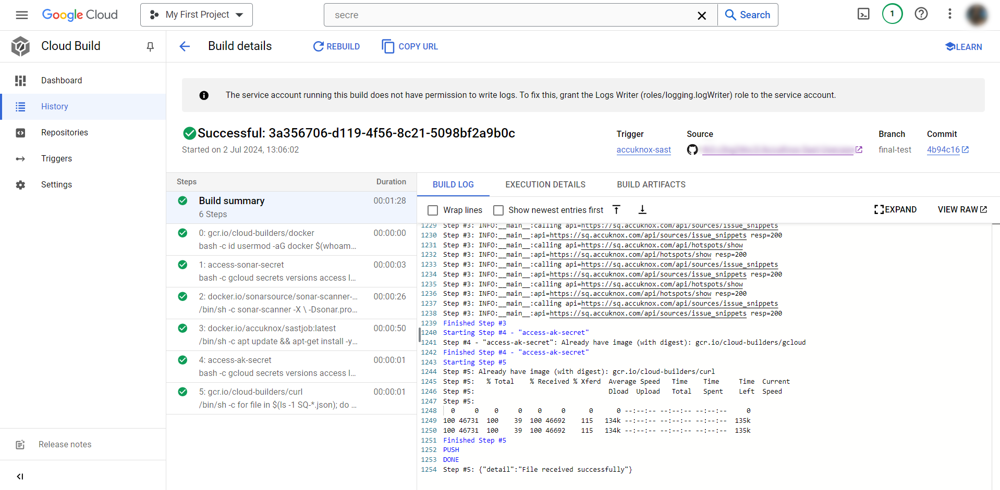
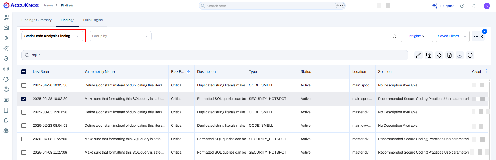
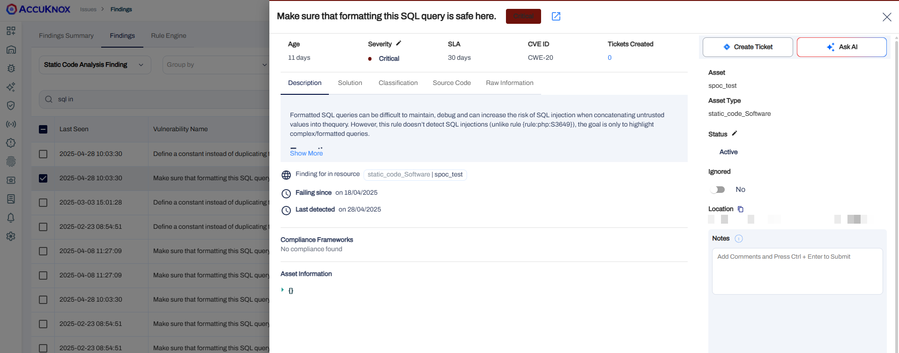
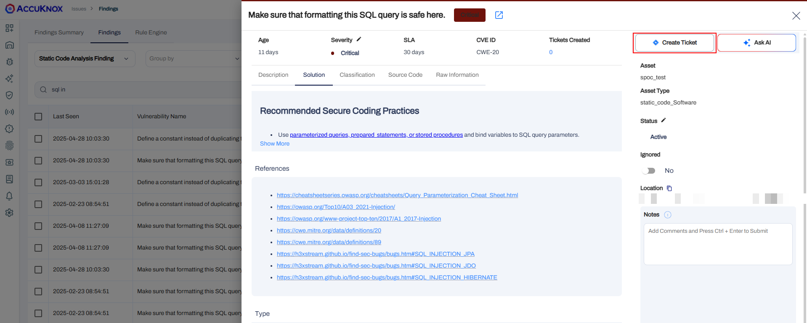
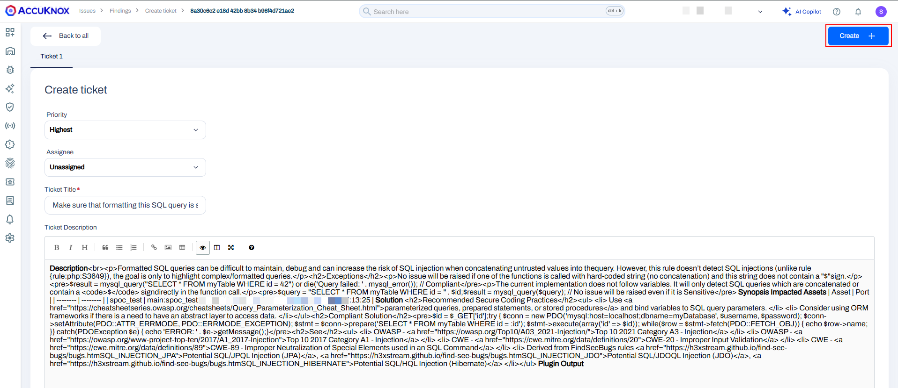

# Google Cloud Build SAST

To demonstrate the benefits of incorporating AccuKnox into a CI/CD pipeline using Google Cloud Build to enhance security, consider a specific scenario involving a Java application with known vulnerabilities. By integrating AccuKnox scanning into the pipeline, we can identify and resolve these security issues before deployment.

## **Pre-requisite**

- GCP Console Access

- AccuKnox UI Access

- Sonarqube deployment

- Google Cloud build Pipeline

- Github/Google Cloud source repositories

## **Steps for integration**

**Step 1**: Log in to AccuKnox Saas, Navigate to Settings, and select Tokens to create an AccuKnox token for forwarding scan results to Saas


**Note**: Copy the token and create a Google Cloud secret for the token to be used as a secret in the pipeline. Also, copy the tenant ID value to be used in the Cloud Build YAML file.

**Step 2**: Add SonarQube and AccuKnox Tokens to Google Cloud Secret Manager:

- Add the following secrets:

    + ```SONAR_TOKEN```: Your SonarQube project token.

    + ```AK_TOK```: The artifact token received from the AccuKnox management plane.

- Optionally add the following instead if specifying directly in file:

    + ```TENANT_ID```: Your AccuKnox Tenant ID.

    + ```AK_URL```: The AccuKnox URL (```cspm.accuknox.com```).

    + ```SQ_URL```: Your SonarQube URL.

**Step 3**: To integrate AccuKnox scans into your Google Cloud Build, set up a ```cloudbuild.yaml``` file in your repository with the following content:

```yaml
steps:
    # Step 1: Check Docker permissions and add user to docker group if necessary
  - name: 'gcr.io/cloud-builders/docker'
    entrypoint: 'bash'
    args:
      - '-c'
      - |
        id
        usermod -aG docker $(whoami) || true && chmod -R 777 /workspace # Add user to docker group (ignore if already added)
  - name: 'gcr.io/cloud-builders/gcloud'
    entrypoint: 'bash'
    args: [
      '-c',
      "gcloud secrets versions access latest --secret=sonarqube-token --format='get(payload.data)' | tr '_-' '/+' | base64 -d > /workspace/sonar-token.txt"
    ]
    id: 'access-sonar-secret'
  - name: 'docker.io/sonarsource/sonar-scanner-cli'
    entrypoint: '/bin/sh'
    args:
      - '-c'
      - |
        sonar-scanner -X \
          -Dsonar.projectKey={project-name} \
          -Dsonar.sources=. \
          -Dsonar.host.url=$_SONAR_HOST_URL \
          -Dsonar.login=$(cat /workspace/sonar-token.txt)
  - name: 'docker.io/accuknox/sastjob:latest'
    entrypoint: '/bin/sh'
    args:
      - '-c'
      - |
        apt update && apt-get install -y docker.io && docker run --rm \
          -e SQ_URL=$_SONAR_HOST_URL \
          -e SQ_AUTH_TOKEN=$(cat /workspace/sonar-token.txt) \
          -e REPORT_PATH=/app/data/ \
          -e SQ_PROJECTS="^{project-name}$" \
          -v $(pwd):/app/data/ \
          accuknox/sastjob:latest
  # Step 5: Access the secret using gcloud and save it to a file
  - name: 'gcr.io/cloud-builders/gcloud'
    entrypoint: 'bash'
    args: [
      '-c',
      "gcloud secrets versions access latest --secret=accuknox_token --format='get(payload.data)' | tr '_-' '/+' | base64 -d > /workspace/ak-token.txt"
    ]
    id: 'access-ak-secret'
  - name: 'gcr.io/cloud-builders/curl'
    entrypoint: '/bin/sh'
    args:
      - '-c'
      - |
        for file in $(ls -1 SQ-*.json); do
          curl --location --request POST "https://$_AK_URL/api/v1/artifact/?tenant_id=$_TENANT_ID&data_type=SQ&save_to_s3=false" \
            --header "Tenant-Id: $_TENANT_ID" \
            --header "Authorization: Bearer $(cat /workspace/ak-token.txt)" \
            --form "file=@\"$file\""
        done
substitutions:
  _SONAR_HOST_URL: "{Sonarqube_host_url}"
  _AK_URL: "{cspm.<env>.accuknox.com}"
  _TENANT_ID: "[tenant-id]"
logsBucket: "gs://{bucket-name}"
```

**Note**: In the YAML file above, you need to replace the value for the ```{project-name}``` with the Sonarqube project name and ```{Sonarqube_host_url}``` with the actual Sonarqube URL. Under substitution, replace ```"{cspm.<env>.accuknox.com}"``` with the applicable "cspm env-name" (e.g. demo or use ```"{cspm.accuknox.com}"``` if you are making use of a paid SaaS subscription), replace ```{bucket-name}``` with your GCP bucket name, and replace ```[tenant-id]``` with your tenant ID copied in the **Step 1**.

## **Before AccuKnox Scan**
Initially, the CI/CD pipeline does not include the AccuKnox scan. When you push the changes to the repository it gets deployed without any security checks, potentially **allowing the SQL Injection vulnerability in the application**

## **After AccuKnox Scan Integration**

After integrating AccuKnox into your CI/CD pipeline, the next push triggers the Google Cloudbuild Actions workflow. The AccuKnox scan identifies the SQL Injection vulnerability in the JAVA application



### **View the Results in AccuKnox Saas**

**Step 1**: After the workflow completes, navigate to the AccuKnox SaaS dashboard.

**Step 2**: Go to **Issues** > **Vulnerabilities** and select **Data Type** as **SonarQube** to view the identified vulnerabilities, including the SQL Injection vulnerability in ```VulnerableApp.java```.



**Step 3**: Click on the Vulnerability to view more details



**Step 4**: Fix the Vulnerability

To fix the SQL Injection vulnerability, use prepared statements instead of concatenating user input directly into the SQL query as seen in the Solutions tab.



**Step 5**: Create a ticket for fixing the SQL Injection vulnerability by selecting a Ticket Configuration and clicking on the adjacent button.



**Step 6**: Review the Updated Results

- After fixing the vulnerability, please rerun the cloud build workflow.

- Once the workflow completes, navigate to the AccuKnox SaaS dashboard.

- Go to **Issues** > **Vulnerabilities** and select **Data Type** as **SonarQube** to verify that the SQL Injection vulnerability has been resolved.

## **Conclusion**

Google offers a complete ecosystem for CI/CD that includes Google Cloud Build, Google Cloud Registry, Google Cloud Repository, and Google Secret Manager. AccuKnox code scanning brings several benefits to the mix:

- Code scanning in a CI/CD pipeline stops Security issues from reaching the deployment.

- From AccuKnox Saas users can view the findings and mitigate the CRITICAL/HIGH findings.

- Once the issues are resolved, users can trigger the scan again and observe the changes in the findings to ensure that the updated code successfully deploys the application.

AccuKnox SAST also integrates seamlessly with most CI/CD pipeline tools, including Jenkins, GitHub, GitLab, Azure Pipelines, AWS CodePipelines, etc

- - -
[SCHEDULE DEMO](https://www.accuknox.com/contact-us){ .md-button .md-button--primary }