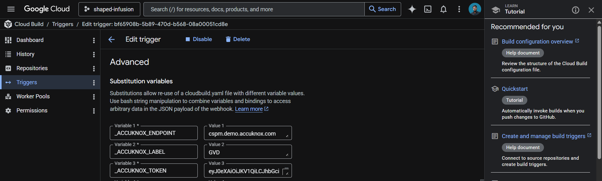
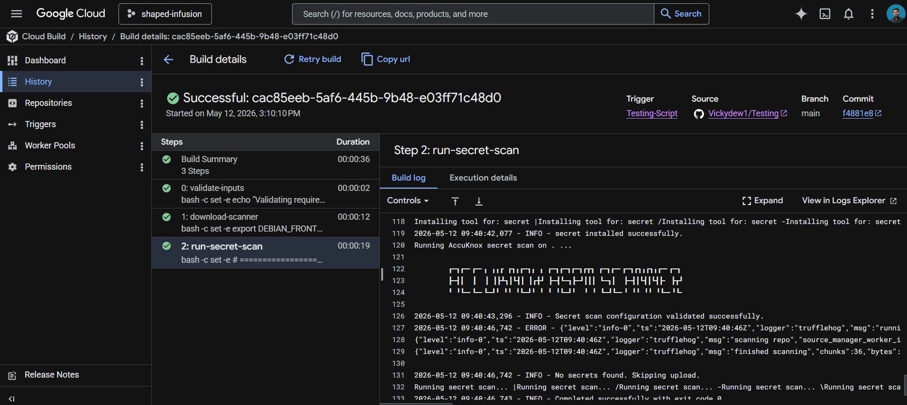

# Google Cloud Build Secret Scan

Integrate AccuKnox secret scanning into Google Cloud Build to catch leaked credentials, API keys, and tokens before they reach the wrong hands. The pipeline uses the AccuKnox ASPM Scanner CLI, runs in three steps, and uploads findings directly to your AccuKnox CSPM panel.

## **Prerequisites**

- GCP project with Cloud Build enabled

- AccuKnox SaaS access with permission to generate tokens

- A git repository connected to Cloud Build

- A Cloud Build trigger pointing at the repository you want to scan

## **Steps for integration**

### **Step 1: Generate an AccuKnox token**

Log in to AccuKnox SaaS. Navigate to **Settings**, then **Tokens** and create a new token.


Save these three values for use in Step 3:

| **Field** | **Where to find it** |
|---|---|
| Endpoint | Your AccuKnox CSPM URL, for example, `cspm.demo.accuknox.com` |
| Token | The token string shown after creation |
| Label | Any descriptive string you choose |

### **Step 2: Add the cloudbuild.yaml to your repository**

Drop the following file at the root of your repository as `cloudbuild.yaml`. The AccuKnox credentials come from the Cloud Build trigger config (Step 3). The secret-specific values (soft-fail, history depth, scan path) are edited directly in step 3 of the YAML.

```yaml
# =============================================================================
# AccuKnox Secret Scan — Google Cloud Build Pipeline
# =============================================================================

steps:

  # ---------------------------------------------------------------------------
  # Step 1: Validate required AccuKnox inputs (fail fast)
  # ---------------------------------------------------------------------------
  - id: validate-inputs
    name: ubuntu:24.04
    entrypoint: bash
    env:
      - ACCUKNOX_ENDPOINT=${_ACCUKNOX_ENDPOINT}
      - ACCUKNOX_TOKEN=${_ACCUKNOX_TOKEN}
      - ACCUKNOX_LABEL=${_ACCUKNOX_LABEL}
    args:
      - -c
      - |
        set -e
        echo "Validating required inputs..."
        if [ -z "$$ACCUKNOX_ENDPOINT" ] || [ -z "$$ACCUKNOX_TOKEN" ] || [ -z "$$ACCUKNOX_LABEL" ]; then
          echo "ERROR: _ACCUKNOX_ENDPOINT, _ACCUKNOX_TOKEN, and _ACCUKNOX_LABEL must be set!"
          exit 1
        fi
        echo "All required inputs present."

  # ---------------------------------------------------------------------------
  # Step 2: Download the AccuKnox ASPM Scanner CLI
  # ---------------------------------------------------------------------------
  - id: download-scanner
    name: ubuntu:24.04
    entrypoint: bash
    args:
      - -c
      - |
        set -e
        export DEBIAN_FRONTEND=noninteractive
        apt-get update -qq
        apt-get install -y -qq --no-install-recommends curl ca-certificates

        echo "Downloading AccuKnox ASPM Scanner v0.14.2..."
        curl -sSL https://github.com/accuknox/aspm-scanner-cli/releases/download/v0.14.2/accuknox-aspm-scanner \
          -o /workspace/accuknox-aspm-scanner
        chmod +x /workspace/accuknox-aspm-scanner
        echo "Scanner downloaded to /workspace/accuknox-aspm-scanner"

  # ---------------------------------------------------------------------------
  # Step 3: Install the secret-scanning tool, run the secret scan, upload to AccuKnox CSPM
  # ---------------------------------------------------------------------------
  - id: run-secret-scan
    name: ubuntu:24.04
    entrypoint: bash
    env:
      - ACCUKNOX_ENDPOINT=${_ACCUKNOX_ENDPOINT}
      - ACCUKNOX_TOKEN=${_ACCUKNOX_TOKEN}
      - ACCUKNOX_LABEL=${_ACCUKNOX_LABEL}
    args:
      - -c
      - |
        set -e

        # ====================================================================
        # Secret-specific configuration — edit these values as needed
        # ====================================================================
        SOFT_FAIL="true"                  # true to keep pipeline green on findings
        UNSHALLOW_HISTORY="true"         # true to scan full git history (slower)
        SCAN_PATH="."                     # path within /workspace to scan
        # ====================================================================

        # Install ca-certificates (HTTPS upload) and git (required by the secret-scanning tool)
        export DEBIAN_FRONTEND=noninteractive
        apt-get update -qq
        apt-get install -y -qq --no-install-recommends ca-certificates git

        # Optionally fetch full git history for deeper scanning
        if [ "$$UNSHALLOW_HISTORY" = "true" ]; then
          echo "Fetching full git history..."
          cd /workspace
          git fetch --unshallow || echo "Repo is already unshallow or unshallow failed; continuing."
        fi

        # Install the secret-scanning tool locally
        # Required because we are not using --container-mode
        echo "Installing secret scanning tool..."
        /workspace/accuknox-aspm-scanner tool install --type secret

        # Resolve soft-fail flag
        SOFT_FAIL=$(echo "$$SOFT_FAIL" | tr -d ' \t\r\n')
        SOFT_FAIL_ARG=""
        if [ "$$SOFT_FAIL" = "true" ]; then
          SOFT_FAIL_ARG="--softfail"
        fi

        # Run the secret scan
        echo "Running AccuKnox secret scan on $$SCAN_PATH ..."
        cd /workspace
        /workspace/accuknox-aspm-scanner scan --keep-results $$SOFT_FAIL_ARG secret \
          --command "git file://$$SCAN_PATH"

# =============================================================================
# Substitutions (only AccuKnox credentials — set these in the trigger UI)
#   _ACCUKNOX_ENDPOINT  -> accuknox_endpoint  (required)
#   _ACCUKNOX_TOKEN     -> accuknox_token     (required)
#   _ACCUKNOX_LABEL     -> accuknox_label     (required, e.g. "secret-myrepo")
# =============================================================================
substitutions:
  _ACCUKNOX_ENDPOINT: ""
  _ACCUKNOX_TOKEN: ""
  _ACCUKNOX_LABEL: ""

options:
  logging: CLOUD_LOGGING_ONLY
  machineType: E2_HIGHCPU_8

timeout: 1800s
```

Before committing, edit the secret-specific block in step 3 of the YAML to match your needs:

| **Variable** | **What to set** |
|---|---|
| `SOFT_FAIL` | `true` to keep the pipeline green on findings, `false` to fail the build |
| `UNSHALLOW_HISTORY` | `true` to scan the full git history (catches secrets in old commits), `false` to scan only the latest commit (faster) |
| `SCAN_PATH` | Path within `/workspace` to scan. Default `.` scans the entire repo. |

Commit and push the file to your repository.

### **Step 3: Configure the Cloud Build trigger**

Open Cloud Build in the GCP console. Create or edit a trigger pointing at your repository.

Under **Configuration**, select **Cloud Build configuration file** and point it at `cloudbuild.yaml`.

Under **Advanced**, then **Substitution variables**, add the three AccuKnox credentials:

| **Variable name** | **Value** |
|---|---|
| `_ACCUKNOX_ENDPOINT` | Your CSPM endpoint, for example, `cspm.demo.accuknox.com` |
| `_ACCUKNOX_TOKEN` | The token from Step 1 |
| `_ACCUKNOX_LABEL` | A label of your choice, for example, `secret-myrepo` |



These values live in the trigger config rather than the YAML, which keeps your token out of git history.

Save the trigger. The next push to the watched branch runs the pipeline.

## **How the pipeline works**

| **Step** | **Purpose** |
|---|---|
| 1. validate-inputs | Fails the build in under a second if any AccuKnox credential is missing. Saves a wasted scanner download. |
| 2. download-scanner | Fetches the AccuKnox ASPM Scanner v0.14.2 binary into `/workspace`, which persists across Cloud Build steps. |
| 3. run-secret-scan | Installs git and the secret scanning engine, fetches the full git history if requested, runs the scan, and uploads findings to AccuKnox CSPM. |



## **Shallow vs full history**

Cloud Build clones repositories at depth 1 by default, meaning only the latest commit is available. The scanner can only scan what it can see, so this is a real tradeoff:

| **Setting** | **Tradeoff** |
|---|---|
| `UNSHALLOW_HISTORY="false"` | Scans only HEAD. Fast (seconds). Catches new secrets as they land. Misses anything committed before the build was triggered. |
| `UNSHALLOW_HISTORY="true"` | Scans the full git history. Slower (varies by repo age). Catches old leaked credentials, including ones since deleted from current files. |

Recommended approach: run a one-time full-history scan when first onboarding the repo to flush out historical leaks, then switch to shallow scanning for ongoing CI. New secrets get caught at commit time, which is the high-value case.

## **Viewing results**

Open the AccuKnox CSPM panel. Filter findings by the label you set in `_ACCUKNOX_LABEL`. Each finding includes the detector type (AWS, GitHub, Slack, etc.), the file and line where the secret was found, the commit and author who introduced it, and a verification status that tells you whether the credential is still live.

## **Before the AccuKnox scan**

Without secret scanning, hardcoded credentials slip through code review, get pushed to public or private repositories, and sit there until someone notices, or until an attacker does. Even private repos leak through misconfigured forks, cloned developer laptops, and CI logs. The longer a secret stays committed, the more places it propagates.

## **After AccuKnox scan integration**

Once the pipeline above is wired up, every push triggers a secret scan. Detected secrets surface in your AccuKnox CSPM panel with verification status and full commit context, so security teams know what to rotate, where it leaked from, and how recently. Critical findings can fail the build by setting `SOFT_FAIL` to `false` in step 3 of the YAML.


## **Conclusion**

Google offers a complete ecosystem for CI/CD that includes Google Cloud Build, Google Cloud Registry, Google Cloud Repository, and Google Secret Manager. AccuKnox secret scanning brings several benefits to the mix:

- Secret scanning in a CI/CD pipeline catches leaked credentials before they can be exploited.

- From AccuKnox SaaS, users can view findings with verification status and rotate compromised secrets promptly.

- Once secrets are rotated and removed from the codebase, users can trigger the scan again to verify the repository is clean.

AccuKnox secret scanning also integrates seamlessly with most CI/CD pipeline tools, including Jenkins, GitHub, GitLab, Azure Pipelines, AWS CodePipelines, etc.

- - -
[SCHEDULE DEMO](https://www.accuknox.com/contact-us){ .md-button .md-button--primary }
