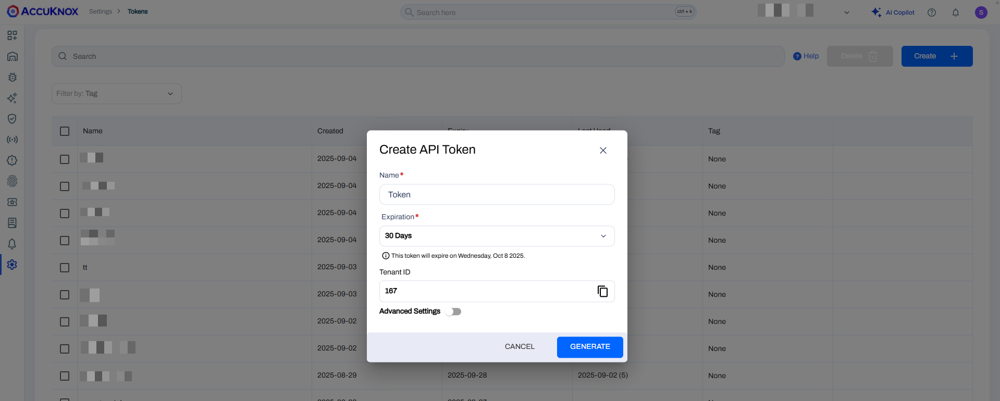
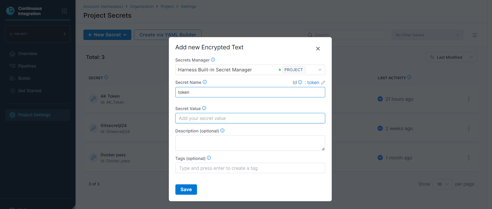

# Container Image Scan in Harness Pipeline

## Scenario

A build and deploy pipeline is already present in Harness. To improve security in the pipeline, the AccuKnox scan stage is added to perform a vulnerability scan of the container image before it is built/deployed. The scan can also be configured to fail the pipeline in case a vulnerability of specified severity/severities is found, ensuring that vulnerable images are not allowed to be used.

## Prereqisites

- Harness Account

- A Codebase with a Dockerfile

- AccuKnox Platform Access

## Steps for Integration

### On the AccuKnox platform

#### Generate token from the AccuKnox platform

1. Navigate to Settings → Tokens and click on Create Token



2. Click on Generate

3. Copy the Token and Tenant ID

#### Create a Label

1. Navigate to Settings → Labels


1. Click on the **Label +** button at the top right

2. Enter a unique identifier for the label in the Name and Filename Prefix fields

3. Click on **Save**

### On the Harness Platform

**Step 1**: Setup a Stage for the scan in the Harness Pipeline where the Dockerfile repository is integrated.

Make sure Clone Codebase is enabled.


**Step 2:** Create a Run step in the stage


In the Run step configuration,

- Select the shell as Bash

- Copy paste the below code into the Command box:

```docker
docker build -t ${repository_name}:${tag} -f ${dockerfile_context} .
curl -sfL $url | sh -s -- -b /usr/local/bin > /dev/null
docker run --rm -v /var/run/docker.sock:/var/run/docker.sock \
-v $HOME/Library/Caches:/root/.cache/ accuknox/accuknox-container-scan:latest image ${repository_name}:${tag} -f json --quiet > results.json
cat ./results.json
curl --location --request POST 'https://'"${endpoint}"'/api/v1/artifact/?tenant_id='"${tenant_id}"'&data_type=TR&save_to_s3=true&label_id='"${label_id}" --header 'Tenant-Id: '"${tenant_id}" --header 'Authorization: Bearer '"${token}" --form 'file=@"./results.json"'
severe=$(echo ${severity} | sed 's/,/\\|/g')
if [ ${exit_code} -eq 1 ];then
  if grep -qi "${severe}" results.json; then
    echo "\nAccuKnox Scan has halted the deployment because it detected vulnerabilities of severity ${severity}"
    exit 1
  else
    echo "\nAccuKnox Checks Passed"
  fi
fi
```

- Click on Apply Changes


**Step 3:** Add the AccuKnox token in Harness as a secret

- Navigate to Project Settings and click on Secrets


- Create a new Text Secret, with the AccuKnox token as the secret value. Also specify a Name for the Secret to be used in the pipeline



**Step 4:** Create variables to be passed to the Run step. The following variables have been set at Stage level in this example:

- `tenant_id` - The ID of the tenant from the AccuKnox Platform

- `token` - The token to authenticate with the AccuKnox platform. Use the id of the secret created in the previous step

- `label_id` - The Name of the label that was created in the AccuKnox platform

- `repository_name` - The name of the image in `repo/image` format

- `tag`- The tag of the image being built

- `dockerfile_context`- The path to `Dockerfile` within the codebase

- `exit_code`- Can be set to "1" to fail the pipeline when vulnerabilities are identified of the specified severity/severities

- `endpoint`- The AccuKnox platform endpoint (`cspm.demo.accuknox.com`). Remove demo if you are using a paid subscription of AccuKnox

- `severity`- Possible values are `UNKNOWN,LOW,MEDIUM,HIGH,CRITICAL`. Only vulnerabilities of specified severity will be reported. Can specify multiple values separated by commas.

The variables can be added by using the Variables option in the right bar (or) the below code block can be copied into the Stage level of the pipeline yaml and the values changed accordingly.

```yml
        variables:
          - name: tenant_id
            type: String
            description: "The ID of the tenant in AccuKnox"
            required: true
            value: "000"
          - name: token
            type: Secret
            description: "Token to authenticate with the AccuKnox Platform"
            required: true
            value: AK_Token
          - name: label_id
            type: String
            description: "The label name for identifying results in AccuKnox"
            required: true
            value: "LABEL"
          - name: repository_name
            type: String
            description: "The image name in repository/image format"
            required: true
            value: harness/test
          - name: tag
            type: String
            description: "The tag of the Docker image being built"
            required: true
            value: v1
          - name: exit_code
            type: String
            description: "Set exit code to 1 to fail the pipe or use 0 to ignore vulnerabilities"
            required: true
            value: "1"
          - name: dockerfile_context
            type: String
            description: "The path to Dockerfile in the codebase"
            required: true
            value: Dockerfile
          - name: endpoint
            type: String
            description: "The AccuKnox platform endpoint"
            required: true
            value: cspm.demo.accuknox.com
          - name: severity
            type: String
            description: "The severity of vulnerabilities to check. Values can be UNKNOWN,LOW,MEDIUM,HIGH,CRITICAL separated by commas"
            required: true
            value: UNKNOWN,LOW,MEDIUM,HIGH,CRITICAL
```

## Sample Use Case

Consider a scenario where any container image with critical vulnerabilities should not be allowed. This can be achieved through the AccuKnox Container Image scan by performing the following:

Step 1: Set the variables

- Set `exit_code`to `1` (Will not fail the pipeline if set to `0`)

- Set `severity`to `CRITICAL`


Step 2: Place the scan before the build and deploy step of the pipeline and Run the pipeline


It can be seen that the scan stage fails the deployment pipeline as the AccuKnox Container scan is run. The reason can be seen at the end of the Step logs:

`AccuKnox Scan has halted the deployment because it detected vulnerabilities of severity CRITICAL`

Navigate to Issues → Registry Scan to view the scan results on the AccuKnox Platform.


## Conclusion

Thus, AccuKnox can prevent the images with critical severity to be used in the pipeline. The results populated on the platform will provide insights into the vulnerabilities present in the image and any solutions if applicable. This information can then be used to fix the issues before deploying the application. Ultimately, this approach helps enforce Shift left security in the DevOps pipeline.
