# Harness DAST

This document outlines the steps to integrate AccuKnox DAST scanning into the Harness Pipeline. This will allow automating the scan to be triggered on events. The results from the scan will then be visible on the AccuKnox platform for management and resolution.

## Prerequisites

- Harness Pipeline

- AccuKnox Platform Access

## Integration Steps

### On the AccuKnox platform

**Step 1:** Navigate to Settings → Labels and click on the Add Label button.

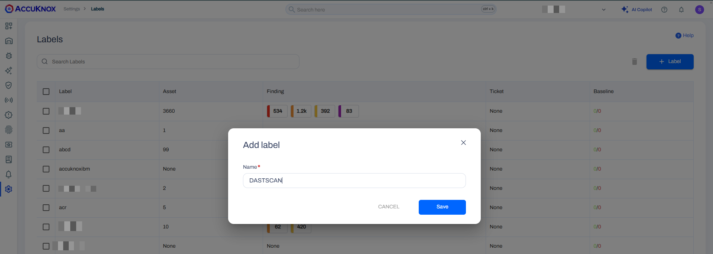

Enter a name for the label, use the same as the filename prefix and click on **Save**

**Step 2:** Go to Settings → Tokens then click on the **Create** button

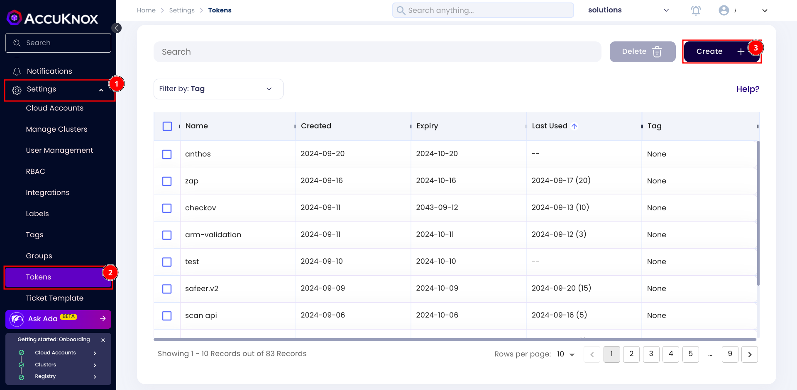

In the subsequent popup, provide a name for the token and click on **Generate**

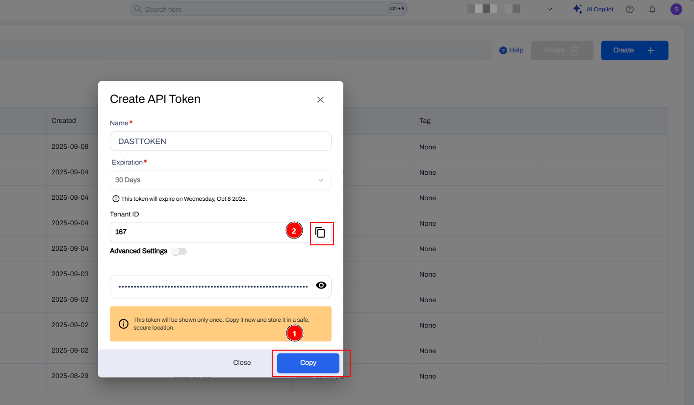

Copy the Tenant Id and click on **Copy** to fetch the API token. These values will be used in the Harness Pipeline.

### On Harness

**Step 1:** Create a secret in Harness to store the AccuKnox token.

Navigate to Project Settings → Click on **Secrets**

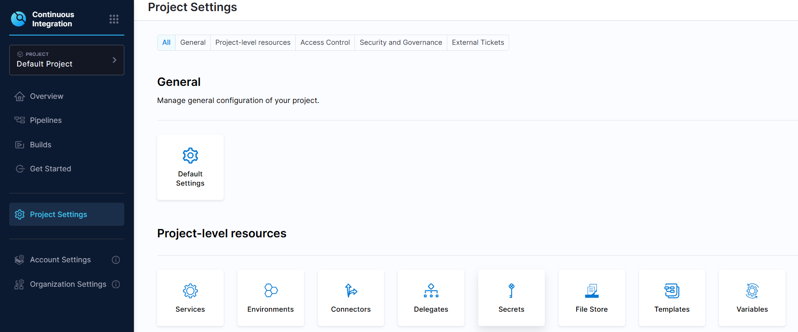

Select **New Secret** and click on **Text** in the dropdown

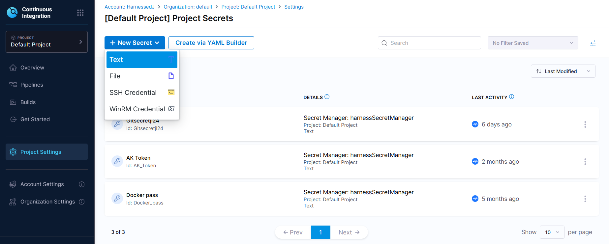

Enter a Name for the secret, paste the token copied from the AccuKnox platform as the secret value and click on **Save**


**Step 2:** Create a stage in the pipeline for the scanning

Navigate to an existing pipeline or create a new pipeline and add a Build Stage into the pipeline

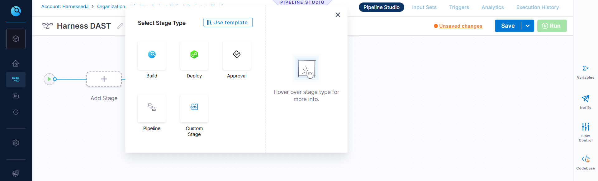

Provide a name and Set Up the Stage. (This doc assumes that the application has already been deployed on the environment and the endpoint is exposed)

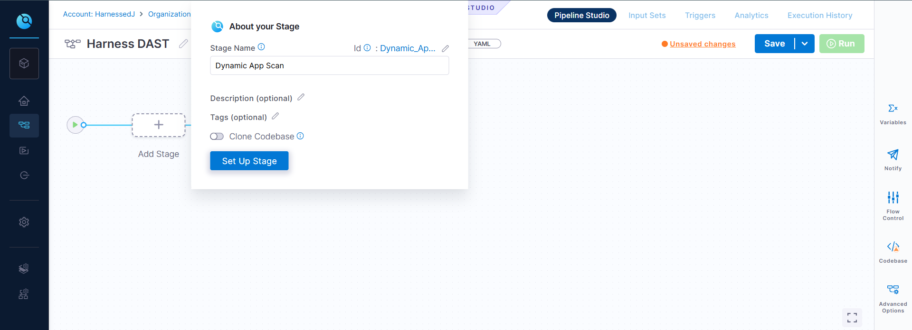

Select the infrastructure to run the scan and click on **continue**

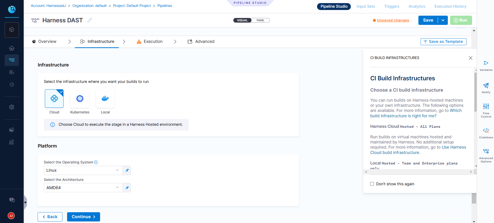

**Step 3:** Setup the scanner

Switch to YAML view and paste the below snippet at the end:

```yaml
          execution:
            steps:
              - step:
                  type: Run
                  name: Run_DAST
                  identifier: Run_DAST
                  spec:
                    shell: Sh
                    command: |-
                      mkdir -m 777 /harness/results
                      echo "TARGET_URL=<+stage.variables.TARGET_URL>" >> /harness/results/env.sh
                      docker run --rm -v /harness/results:/zap/wrk/:rw -t zaproxy/zap-stable zap-baseline.py \
                        -t "<+stage.variables.TARGET_URL>" \
                        -r scanreport.html \
                        -x scanreport.xml \
                        -J scanreport.json || alert_found="yes"
                      curl --location --request POST "<+stage.variables.ENDPOINT>/api/v1/artifact/?tenant_id=<+stage.variables.TENANT_ID>&data_type=ZAP&save_to_s3=true&label_id=<+stage.variables.LABEL>" \
                                  --header "Tenant-Id: <+stage.variables.TENANT_ID>" \
                                  --header "Authorization: Bearer <+stage.variables.ACCUKNOX_TOKEN>" \
                                  --form "file=@/harness/results/scanreport.json"
                      if [ "<+stage.variables.FAIL_ACTION>" -eq 1 ];then
                        if [ -n "$alert_found" ]; then
                          echo "Security alerts raised, pipeline will be halted"
                          exit 1
                        else
                          echo "Scan has passed"
                        fi
                      fi
        variables:
          - name: TARGET_URL
            type: String
            description: "The target URL to be scanned"
            required: true
            value: ""
          - name: ENDPOINT
            type: String
            description: "The AccuKnox endpoint to forward the results"
            required: true
            value: https://cspm.demo.accuknox.com
          - name: TENANT_ID
            type: String
            description: "The tenant ID fetched from AccuKnox platform"
            required: true
            value: "167"
          - name: ACCUKNOX_TOKEN
            type: Secret
            description: "The API Token fetched from AccuKnox platform"
            required: true
            value: AK_Token
          - name: LABEL
            type: String
            description: "The name of the label generated from the AccuKnox platform"
            required: true
            value: ""
          - name: FAIL_ACTION
            type: String
            description: "Fails the pipeline on discovering issues if set to '1'. No action if set to '0'"
            required: true
            value: "0"
```

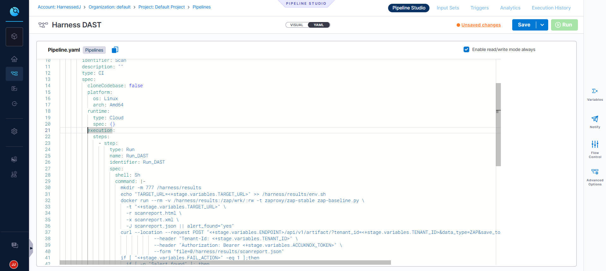

**Step 4:** Set the variables for scanning

Click on variables to the right and set the value of the variables:

- `TARGET_URL`: The target URL to be scanned

- `ENDPOINT`: The AccuKnox endpoint to forward the results. (Set to AccuKnox Endpoint `https://cspm.accuknox.com`. Eg. For `app.demo.accuknox.com`, this is set to `https://cspm.demo.accuknox.com`)

- `TENANT_ID`: The tenant ID fetched from AccuKnox platform

- `ACCUKNOX_TOKEN`: The API Token fetched from AccuKnox platform. (Set to the secret that was created in the first step)

- `LABEL`: The name of the label generated from the AccuKnox platform

- `FAIL_ACTION`: Fails the pipeline on discovering issues if set to '1'. No action if set to '0'

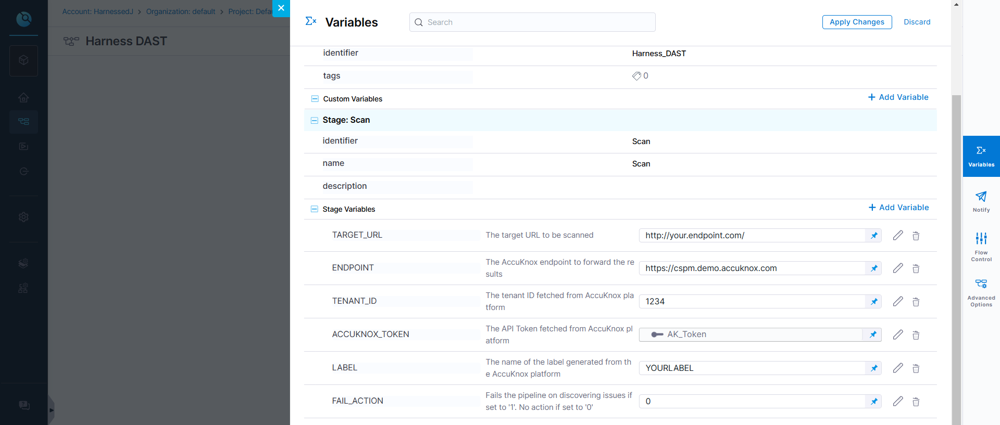

After confirming the variables, click on **Apply Changes** and **Save**

## Pipeline Execution

The pipeline has now been configured, click on Run to trigger the scan. Since the `FAIL_ACTION`is set to 0, the pipeline has succeeded without isssues.

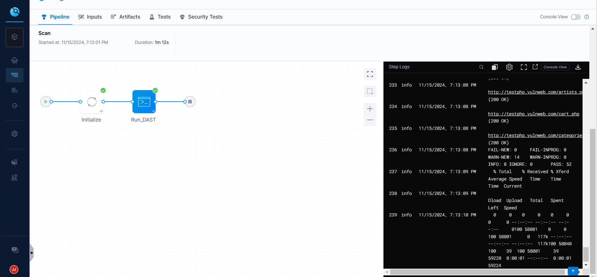

If the `FAIL_ACTION`is set to 1, then the pipeline fails with the message `"Security alerts raised, pipeline will be halted"` on identifying any issues in the scan.

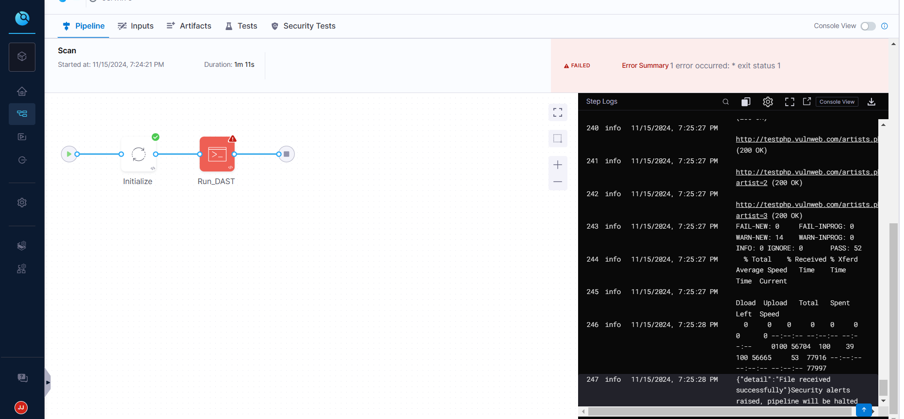

## View Results

To view the scan results on the AccuKnox platform, navigate to Issues → Findings and select DAST Findings from the Findings Type dropdown filter.

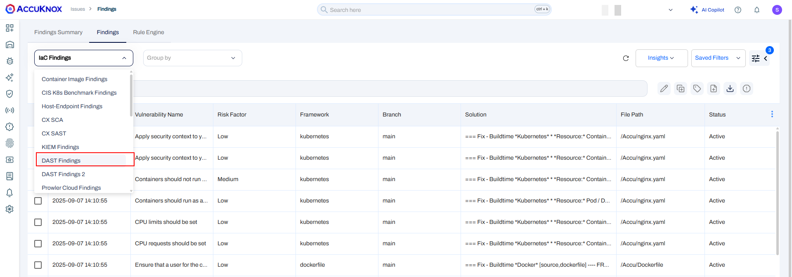
