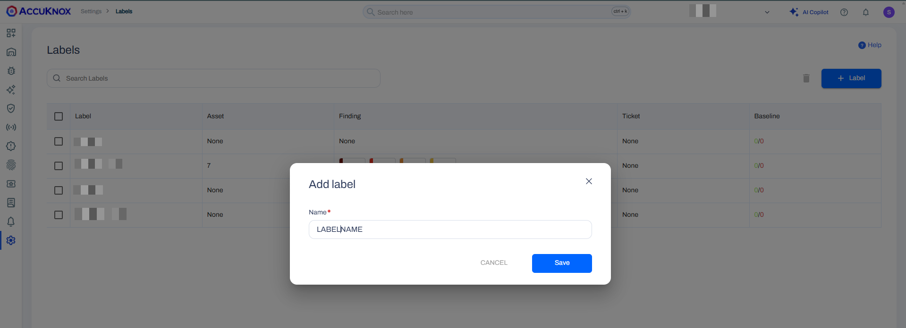
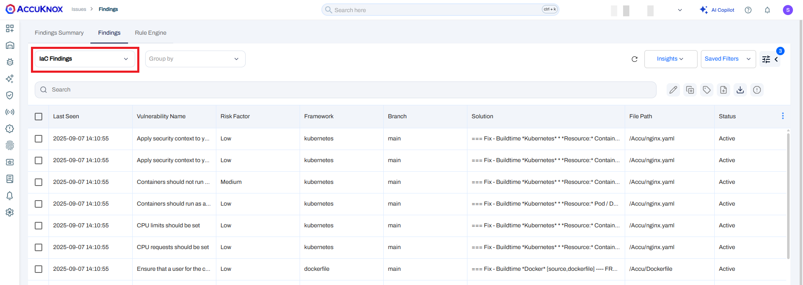

# IaC Scan in Harness CI

## Scenario

A build and deploy pipeline is already present in Harness. To improve security in the pipeline, the AccuKnox scan stage is added to perform a scan of the IaC files before the infrastructure is deployed. The scan can also be configured to fail the pipeline in case a security misconfiguration is identifies, ensuring that vulnerable resources are not deployed.

## Prerequisites

- Harness Account

- A Codebase with IaC files

- AccuKnox Platform Access

## Steps for Integration

### On the AccuKnox platform

#### Generate token

1. Navigate to Settings → Tokens and click on Create Token

2. Click on Generate

3. Copy the Token and Tenant ID

#### Create Label

1. Navigate to Settings → Labels

2. Click on the **Label +** button at the top right

3. Enter a unique identifier for the label in the Name and Filename Prefix fields

4. Click on **Save**

### On the Harness Platform

**Step 1:** Add the AccuKnox token in Harness as a secret

- Navigate to Project Settings and click on Secrets

- Create a new Text Secret, with the AccuKnox token as the secret value. Also specify a Name for the Secret to be used in the pipeline

**Step 2**: Setup a Stage for the scan in the Harness Pipeline where the IaC files repository is integrated.

Make sure Clone Codebase is enabled.

**Step 3:** Create a Plugin step in the stage

On the Plugin Step configuration,

- Enter a **Name** for the plugin step

- In the **Image** field enter the following: `accuknox/harness-iac-plugin:v1`

- Click on **Optional Configuration** and add the following Keys and Values:

  - **repo_id:** The name of the repository in the format `https://repo_url.com/username/reponame`

  - **branch:** The branch of the repo to be scanned

  - **endpoint:** `cspm.accuknox.com` (Will differ based on the platform. Eg. For the demo platform, the endpoint is `cspm.demo.accuknox.com`)

  - **tenant_id:** The tenant id copied from AccuKnox platform

  - **label:** The label name copied from AccuKnox platform

  - **token:** The secret used to store the token referred by format `<+secrets.getValue("Secret_Name")>`

**Optional Variables:**

- The following keys and values can be used as per requirements and are not mandatory:

  - **directory:** To specify the root directory containing the IaC files. Defaults to `/harness` which is where the cloned repository is mounted.

  - **hard_fail:** Set to '1' to fail the pipeline when any issues are detected.

  - **output_path:** The path where the results will be stored. Defaults to `/results`

  - **quiet:** For the Console output, display only failed checks

  - **compact:** For the Console output, do not display code blocks

  - **skip_framework**: Filter scan to skip specific IaC frameworks. Add multiple frameworks using spaces. For example, "terraform kubernetes".
  - **Possible values**: bitbucket_pipelines, argo_workflows, arm, bicep, cloudformation, dockerfile, github_configuration, github_actions, gitlab_configuration, gitlab_ci, bitbucket_configuration, helm, json, yaml, kubernetes, kustomize, openapi, sca_package, sca_image, secrets, serverless, terraform, terraform_plan

  - **skip_path:** Path (file or directory) to skip, using regular expression logic, relative to the current working directory.

After specifying the required variables, click on **Apply Changes.**

## Sample Use Case

Consider a scenario where the resources are being provisioned in the production environment. To make sure that there are no secuity issues in production, we would like to stop the deployment if any issues are detected in the IaC files. In this scenario, the IaC scanner will be integrated into the pipeline before the deployment phase with the `hard_fail` value set to 1.

Now, when the pipeline runs, the scanner checks for issues in the IaC file and is any issues are identified, it stops the pipeline with the message:

`Failed checks identified, pipeline hard fail is initiated`

To view the failed checks that need to be resolved, navigate to Issues → Findings on the AccuKnox platform and select the IaC Findings filter.

### Conclusion

Thus, AccuKnox can prevent the IaC files with security issues to be deployed into production, preventing potential exposure. The results populated on the platform will provide insights into the issues and any associated solutions if applicable. This information can then be used to fix the issues before deploying the resources in a secure manner. Ultimately, this approach helps enforce Shift left security in the DevOps pipeline.
