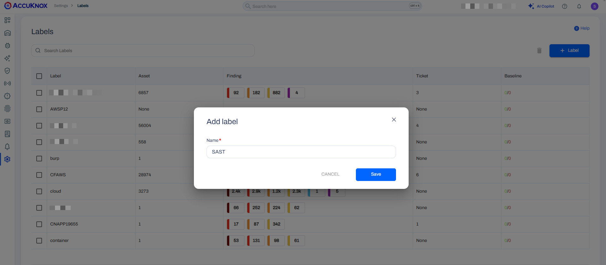
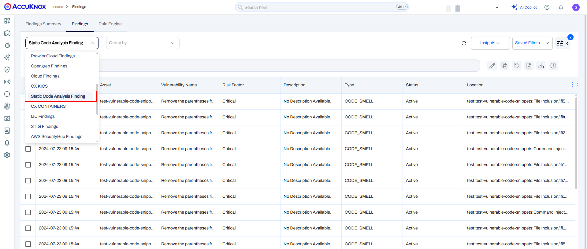

# Integrating Harness SAST with AccuKnox CNAPP

This document outlines the steps to integrate AccuKnox SAST scanning into the Harness Pipeline. This will allow automating the scan to be triggered on events. The results from the scan will then be visible on the AccuKnox platform for management and resolution.

## Prerequisites

- Harness Pipeline

- SonarQube Instance with access from Harness Pipeline

- AccuKnox Platform Access

## Integration Steps

### On the AccuKnox platform

**Step 1:** Navigate to Settings → Labels and click on the Add Label button.



Enter a name for the label, use the same as the filename prefix and click on **Save**

**Step 2:** Go to Settings → Tokens then click on the **Create** button


In the subsequent popup, provide a name for the token and click on **Generate**


Copy the Tenant Id and click on **Copy** to fetch the API token. These values will be used in the Harness Pipeline.

### On SonarQube

**Step 1:** Create a new local project on SonarQube and note the project key. [Reference docs](https://docs.sonarsource.com/sonarqube/latest/project-administration/creating-and-importing-projects/ "https://docs.sonarsource.com/sonarqube/latest/project-administration/creating-and-importing-projects/")

**Step 2:** Generate SonarQube User Token following the instructions in the official [sonarqube docs](https://docs.sonarsource.com/sonarqube/latest/user-guide/managing-tokens/ "https://docs.sonarsource.com/sonarqube/latest/user-guide/managing-tokens/"). Note the token generated.

### On Harness

**Step 1:** Create secrets in Harness to store the AccuKnox token and the SonarQube token.

Navigate to Project Settings → Click on **Secrets**


Select **New Secret** and click on **Text** in the dropdown


Enter a Name for the secret, paste the token copied from the AccuKnox platform as the secret value and click on **Save**


Create another secret with the same method for the token generated from SonarQube


**Step 2:** Create a stage in the pipeline for the scanning

Navigate to an existing pipeline or create a new pipeline and add a Build Stage into the pipeline


Clone the codebase that needs to be scanned


Select the infrastructure to run the scan and click on **Continue.**

**Step 3:** Setup the scanner

Switch to the YAML view and paste the below snippet at the end:

```yaml
          execution:
            steps:
              - step:
                  type: Run
                  name: AccuKnox_SAST
                  identifier: SAST_Scan
                  spec:
                    shell: Bash
                    command: |-
                      docker run --rm -e SONAR_HOST_URL="<+stage.variables.SQ_URL>" -e SONAR_SCANNER_OPTS="-Dsonar.projectKey="<+stage.variables.SQ_PROJECT>" -Dsonar.qualitygate.wait="<+stage.variables.QUALITY_GATE>"" -e SONAR_TOKEN="<+stage.variables.SQ_TOKEN>" -v "$(pwd):/usr/src" sonarsource/sonar-scanner-cli || Quality_Gate="Failed"
                      docker run --rm -e SQ_URL="<+stage.variables.SQ_URL>" -e SQ_AUTH_TOKEN="<+stage.variables.SQ_TOKEN>" -e SQ_PROJECTS="<+stage.variables.SQ_PROJECT>" -e REPORT_PATH=/app/data -v $(pwd):/app/data accuknox/sastjob:latest
                      for file in `ls -1 SQ-*.json`; do
                        curl --location --request POST "<+stage.variables.ENDPOINT>/api/v1/artifact/?tenant_id=<+stage.variables.TENANT_ID>&data_type=SQ&save_to_s3=true&label_id=<+stage.variables.LABEL>" \
                                  --header "Tenant-Id: <+stage.variables.TENANT_ID>" \
                                  --header "Authorization: Bearer <+stage.variables.ACCUKNOX_TOKEN>" \
                                  --form "file=@/harness/$file"
                      done
                      if [ "<+stage.variables.QUALITY_GATE>" -eq 1 ];then
                        if [ "$Quality_Gate" == "Failed" ]; then
                          echo "Quality Gate has failed, pipeline will be halted"
                          exit 1
                        else
                          echo "Quality Gate passed"
                        fi
                      fi
        variables:
          - name: SQ_URL
            type: String
            description: "The URL to access the SonarQube deployment"
            required: true
            value: https://your.sonarqube.com/
          - name: ENDPOINT
            type: String
            description: "The AccuKnox endpoint to forward the results"
            required: true
            value: https://cspm.demo.accuknox.com
          - name: TENANT_ID
            type: String
            description: "The tenant ID fetched from AccuKnox platform"
            required: true
            value: ""
          - name: ACCUKNOX_TOKEN
            type: Secret
            description: "The API Token fetched from AccuKnox platform"
            required: true
            value: ""
          - name: LABEL
            type: String
            description: "The name of the label generated from the AccuKnox platform"
            required: true
            value: ""
          - name: SQ_TOKEN
            type: Secret
            description: "The token generated from the SonarQube Platform"
            required: true
            value: ""
          - name: SQ_PROJECT
            type: String
            description: "The name/key of the project created in SonarQube"
            required: true
            value: ""
          - name: QUALITY_GATE
            type: String
            description: "Set to 'true' to fail the pipeline when Quality Gate fails. No action if set to 'false'"
            required: true
            value: "false"
```


**Step 4:** Set the variables for scanning

Click on variables to the right and set the value of the variables:

- `SQ_URL`: The URL to access the SonarQube deployment

- `ENDPOINT`: The AccuKnox endpoint to forward the results. (Set to AccuKnox Endpoint `https://cspm.accuknox.com`. Eg. For `app.demo.accuknox.com`, this is set to `https://cspm.demo.accuknox.com`)

- `TENANT_ID`: The tenant ID fetched from AccuKnox platform

- `ACCUKNOX_TOKEN`: The API Token fetched from AccuKnox platform. (Set to the secret that was created in the first step)

- `LABEL`: The name of the label generated from the AccuKnox platform

- `QUALITY_GATE`: Fails the pipeline if Quality Gate fails when set to 'true'. No action if set to 'false'

- `SQ_TOKEN`: The token generated from the SonarQube Platform

- `SQ_PROJECT`: The name/key of the project created in SonarQube


After confirming the variables, click on **Apply Changes** and **Save**

## Pipeline Execution

The pipeline has now been configured, click on Run to trigger the scan. Since the `QUALITY_GATE` has passed, the pipeline has succeeded without isssues.


If the `QUALITY_GATE` has failed, then the pipeline will be halted with the message `Quality Gate has failed, pipeline will be halted`

To run the pipeline successfully irrespective of quality gate status, set the `QUALITY_GATE` variable to `false`.

## View Results

To view the scan results on the AccuKnox platform, navigate to Issues → Findings and select Static Code Analysis Findings from the Findings Type dropdown filter.


