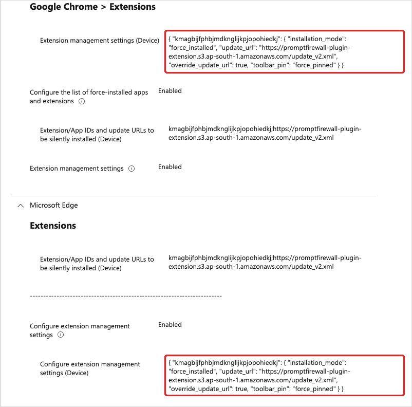
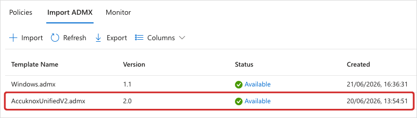
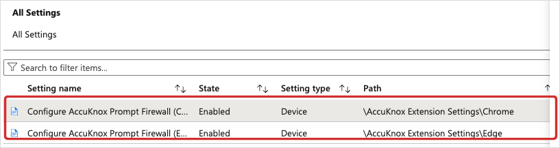
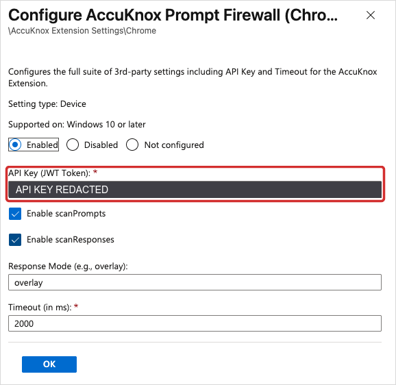

# Silent plugin rollout with Microsoft Intune

Microsoft Intune installs the AccuKnox Prompt Firewall extension on a managed device without asking the user. Intune also pushes the API key, so nobody has to open the extension settings and paste a token. A user cannot remove the extension once the policy applies.

This page covers Chrome and Edge on Windows, and Chrome on macOS. To install the plugin on one machine by hand instead, follow the [Chrome integration guide](chrome-browser-integration.md) or the [Edge integration guide](edge-browser-integration.md).

## What this page does not cover

- **Edge on macOS.** The macOS profile below targets Chrome only.
- **Firefox.** Install it per device with the [Firefox integration guide](firefox-browser-integration.md).
- **Personal or unmanaged devices.** Intune only reaches a device that is enrolled in your tenant.

## Prerequisites

- An Intune account with permission to create device configuration profiles
- An AccuKnox API key. Generate one under **AI Security > Integrations**, as shown in [Step 1 of the Chrome guide](chrome-browser-integration.md#step-1-create-a-new-integration)
- The AccuKnox `.admx` template file and its matching `.adml` language file, for Windows
- The AccuKnox `.mobileconfig` profile, for macOS
- `[confirm where a customer downloads the .admx, .adml and .mobileconfig files]`

Chrome and Edge use the same extension identity.

| Item | Value |
|---|---|
| Extension ID | `kmagbijfphbjmdknglijkpjopohiedkj` |
| Update URL | `https://promptfirewall-plugin-extension.s3.ap-south-1.amazonaws.com/update_v2.xml` |

!!! warning "The API key is a secret"
    The key is a JWT token that reaches your AccuKnox tenant. Keep it inside Intune. Do not paste it into a shared document, a ticket, or a screenshot.

## Windows rollout for Chrome and Edge

Windows takes three profiles. The first installs the extension. The second profile uploads the AccuKnox templates. The third sends the API key and the scan settings.

### Step 1. Force install the extension

The Settings catalog carries the browser extension policies for both Chrome and Edge, so one profile covers both.

1. Open the [Microsoft Intune admin center](https://intune.microsoft.com).
2. Go to **Devices > Configuration** and click **Create profile**.
3. Select **Windows 10 and later** as the platform.
4. Select **Settings catalog** as the profile type.
5. Add the **Extension management settings** setting for Google Chrome.
6. Add the same setting for Microsoft Edge.
7. Set both settings to **Enabled**.
8. Paste this configuration string into the value box of each one.

    ```json
    { "kmagbijfphbjmdknglijkpjopohiedkj": { "installation_mode": "force_installed", "update_url": "https://promptfirewall-plugin-extension.s3.ap-south-1.amazonaws.com/update_v2.xml", "override_update_url": true, "toolbar_pin": "force_pinned" } }
    ```

9. Assign the profile to your Windows device groups and save.

`force_installed` blocks the user from removing the extension. `force_pinned` keeps the AccuKnox icon visible on the toolbar.



### Step 2. Import the ADMX and ADML templates

The Settings catalog has no fields for the AccuKnox API key. Those fields arrive with the AccuKnox administrative template, so upload it before you create the configuration profile.

1. Go to **Devices > Configuration** and open the **Import ADMX** tab. Some tenants list the same page under **Tenant administration > Custom ADMX**.
2. Click **Import**.
3. Upload the AccuKnox `.admx` file and its matching `.adml` language file.
4. Wait for **Status** to read **Available**.

An upload can stay in a pending state. That usually means the `.adml` language file is missing, or that it does not match the `.admx` file.



### Step 3. Push the API key and the scan settings

1. Go to **Devices > Configuration** and click **Create profile**.
2. Select **Windows 10 and later** as the platform.
3. Select **Imported Administrative templates** as the profile type.
4. Name the profile, for example `AccuKnox Extension Configuration`.
5. Search the settings list for `Configure AccuKnox Prompt Firewall`.
6. Open the Chrome entry, at the path `\AccuKnox Extension Settings\Chrome`.
7. Set the policy to **Enabled** and fill the fields listed below.
8. Repeat steps 6 and 7 for the Edge entry, at `\AccuKnox Extension Settings\Edge`.
9. Assign the profile to your Windows device groups and save.

| Field | Value |
|---|---|
| API Key (JWT Token) | Your AccuKnox token. The field is required. |
| Enable scanPrompts | Check it to scan what the user sends to the model. |
| Enable scanResponses | Check it to scan what the model sends back. |
| Response Mode (e.g., overlay) | `overlay` |
| Timeout (in ms) | `2000`. The field is required. |

The policy applies to Windows 10 or later. Both the Chrome entry and the Edge entry read **Enabled**, with a setting type of **Device**. A device setting applies to every user on that machine.





## macOS rollout for Chrome

macOS reads no ADMX file, so the whole rollout arrives as one custom configuration profile. A single `.mobileconfig` file carries both parts. The `ExtensionInstallForcelist` payload installs the extension and stops the user from removing it. The settings payload carries the API key and the timeout.

1. Check that your `.mobileconfig` file contains both payloads.
2. Go to **Devices > macOS > Configuration profiles**.
3. Click **Create profile**.
4. Select **Templates** as the profile type, then select **Custom**.
5. Name the profile, for example `AccuKnox Prompt Firewall - Mac Chrome Settings`.
6. Upload the `.mobileconfig` file into the configuration payload box.
7. Review the settings, assign the profile to your macOS device groups, and click **Save**.

## Confirm the rollout worked

Pick one enrolled device and open Chrome or Edge on it. The AccuKnox icon sits on the toolbar, because `force_pinned` puts it there.

Click the icon. Look for a green status dot next to **AccuKnox Prompt Firewall**. The dot means the extension reached your tenant with the key from Intune. Send a test prompt in ChatGPT, Claude, GitHub Copilot, or Gemini. Then open **AI Security > Request Log** in AccuKnox and find the matching entry. The [Chrome integration guide](chrome-browser-integration.md#step-5-verify-the-connection) shows what the popup and the log look like.
