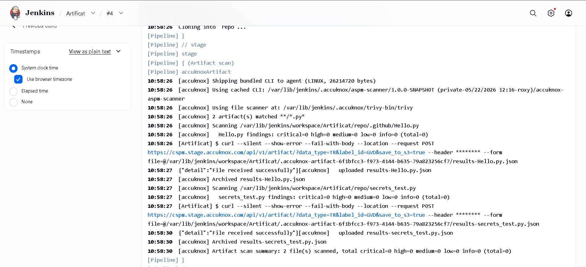

# Multi-Artifact (SCA) Scanning in Jenkins

This guide adds a multi-artifact SCA stage to a Jenkins pipeline. Every file matching a glob (jars, binaries, archives, package lockfiles) is scanned individually for known CVEs and uploaded to AccuKnox under `/api/v1/artifact/`.

## Prerequisites

- A Jenkins controller (`2.387.3 LTS` or newer) with at least one build agent.
- An AccuKnox SaaS account with a tenant / label you can upload findings to.
- Network egress from the Jenkins agent to the AccuKnox control plane (or a mirrored scanner image for air-gapped agents).
- Build artifacts (jars, wheels, archives, etc.) available in the Jenkins workspace by the time the stage runs.

## Step 1: Install the AccuKnox ASPM Plugin

See [Installing the AccuKnox ASPM Jenkins Plugin](jenkins-installation.md) for the one-time plugin installation steps.

## Step 2: Configure Jenkins credentials and global settings

- Store the AccuKnox token as a Jenkins **Secret text** credential.
- Set the endpoint, label, and token credential on the global config.

## Step 3: Define the Jenkins Pipeline

```groovy
// AccuKnox Artifact scan, standalone Jenkinsfile.
//
// For each file matching FILES, runs a CVE scan and uploads the report
// to AccuKnox /api/v1/artifact/. Use for fat-jars, binaries, archives.

pipeline {
  agent any

  parameters {
    string(name: 'REPO_URL',
           defaultValue: 'https://github.com/Vickydew1/Testing.git',
           description: 'Repo that contains the binaries to scan.')

    string(name: 'FILES',
           defaultValue: '**/*.py*',
           description: 'Glob pattern (Ant-style) for the artifacts to scan. e.g. repo/build/**/*.jar')

    string(name: 'SEVERITY_THRESHOLD',
           defaultValue: 'CRITICAL',
           description: 'Comma-separated severities that fail the build.')

    booleanParam(name: 'SOFT_FAIL',
                 defaultValue: true,
                 description: 'true (default) = run and upload, build stays green; false = fail build on matching severities.')
  }

  options {
    timestamps()
    timeout(time: 30, unit: 'MINUTES')
    disableConcurrentBuilds()
  }

  environment {
    REPO_URL = "${params.REPO_URL}"
  }

  stages {
    stage('Checkout') {
      steps {
        sh '''
          set -eu
          rm -rf repo
          git clone --depth=1 "$REPO_URL" repo
        '''
      }
    }

    stage('Artifact scan') {
      steps {
        accuknoxArtifact(files: params.FILES,
                         severityThreshold: params.SEVERITY_THRESHOLD,
                         softFail: params.SOFT_FAIL)
      }
    }
  }
}
```

## Pipeline inputs

=== "Step parameters"

    | Parameter | Description | Required | Default |
    |------|------|------|------|
    | `files` | Ant-style glob, e.g. `build/**/*.jar`. Each match is scanned individually. | yes | *required* |
    | `severityThreshold` | CSV of severities that fail the build. | no | `HIGH,CRITICAL` |
    | `softFail` | `true` = advisory only; `false` = fail build on matching severities. | no | `true` |
    | `scannerPath` | Path to a pre-installed file-scanning binary (air-gapped). | no | *(auto-discover)* |

=== "Common knobs"

    Every `accuknox*` step accepts these:

    | Parameter | Default | Notes |
    |------|------|------|
    | `endpoint` | from global config | Control-plane host (no scheme). Per-step override. |
    | `label` | from global config | Becomes the `label_id` on the upload. |
    | `credentialsId` | from global config | Jenkins credential ID holding the AccuKnox bearer token. |
    | `skipUpload` | `false` | Run the scanner but don't upload. Useful for dry runs. |
    | `keepResults` | `true` | Keep results JSON on the agent and archive it as a build artifact. |
    | `containerMode` | `false` | Run the scanner inside Docker on the agent. |
    | `cliPath` | `auto` | Path to a pre-staged `accuknox-aspm-scanner` binary (air-gapped use). |

## Without AccuKnox vs With AccuKnox

=== "Without AccuKnox"

    Scan results land as per-artifact JSON files in the workspace. You must aggregate and review them by hand.

=== "With AccuKnox"

    Each artifact is uploaded under `/api/v1/artifact/` and grouped in the AccuKnox console, where CVE and package context is enriched and tickets can be opened directly from a finding.

*Figure 1. Multi-artifact SCA findings on AccuKnox.*


## Viewing Results in AccuKnox

Once the Jenkins job uploads its reports, the findings are available in the AccuKnox SaaS console.

1. Log in to the AccuKnox console and switch to the tenant whose label you configured in Jenkins.
2. Open **Issues → Findings**, and filter by **SCA**.
3. Click any finding to inspect the affected component, CVE, and the recommended remediation.
4. Use the **ASK AI** button on a finding for an LLM-generated explanation and patch suggestion.
5. Create a ticket directly from the finding to track remediation.
6. Re-run the Jenkins job after upgrading the artifact. The finding flips to **Resolved** on the next ingest.

## Conclusion

Wiring multi-artifact SCA scanning into Jenkins via the AccuKnox ASPM plugin gives you continuous, automated detection of vulnerable libraries on every build. Combine it with the other scan types ([SAST](jenkins-sast.md), [IaC](jenkins-iac-scan.md), [Secret](jenkins-secret-scan.md), [Container](jenkins-container-scan.md), [SBOM](jenkins-sbom.md)) to get full-coverage ASPM directly from your pipelines.
