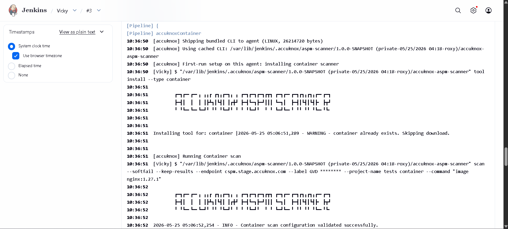

# Container Image Scanning in Jenkins

This guide adds a Container scan stage to a Jenkins pipeline using the **AccuKnox ASPM Scanner** plugin. The scanner pulls the image from a registry, runs SCA on it, and uploads findings to AccuKnox.

## Prerequisites

- A Jenkins controller (`2.387.3 LTS` or newer) with at least one build agent.
- An AccuKnox SaaS account with a tenant / label you can upload findings to.
- Network egress from the Jenkins agent to the AccuKnox control plane (or a mirrored scanner image for air-gapped agents).
- Registry credentials configured on the Jenkins agent if you scan a private image.
- Docker available on the agent if you set `containerMode: true`.

## Step 1: Install the AccuKnox ASPM Plugin

See [Installing the AccuKnox ASPM Jenkins Plugin](jenkins-installation.md) for the one-time plugin installation steps.

## Step 2: Configure Jenkins credentials and global settings

- Store the AccuKnox token as a Jenkins **Secret text** credential.
- Set the endpoint, label, and token credential on the global config.

## Step 3: Define the Jenkins Pipeline

```groovy
pipeline {
  agent any

  parameters {
    string(
      name: 'IMAGE_NAME',
      defaultValue: 'testing-app:latest',
      description: 'Docker image name to build and scan'
    )
    string(
      name: 'SEVERITY_THRESHOLD',
      defaultValue: 'HIGH,CRITICAL',
      description: 'Comma-separated severities that fail the build'
    )
    booleanParam(
      name: 'SOFT_FAIL',
      defaultValue: true,
      description: 'true = build stays green; false = fail build on findings'
    )
  }

  options {
    timestamps()
    timeout(time: 30, unit: 'MINUTES')
    disableConcurrentBuilds()
  }

  stages {
    stage('Checkout') {
      steps {
        sh '''
          set -eu
          rm -rf repo
          git clone --depth=1 https://github.com/Vickydew1/Testing.git repo
        '''
      }
    }

    stage('Build Docker Image') {
      steps {
        dir('repo') {
          sh '''
            docker build -t testing-app .
          '''
        }
      }
    }

    stage('Container Scan') {
      steps {
        accuknoxContainer(
          image: params.IMAGE_NAME,
          severityThreshold: params.SEVERITY_THRESHOLD,
          softFail: params.SOFT_FAIL
        )
      }
    }
  }
}
```

## Pipeline inputs

=== "Step parameters"

    | Parameter | Description | Required | Default |
    |------|------|------|------|
    | `image` | Image reference, e.g. `nginx:1.27.1` or `registry.local/app:1.0`. | yes | *required* |
    | `severityThreshold` | CSV of severities that fail the build. | no | `HIGH,CRITICAL` |
    | `softFail` | `true` = advisory only; `false` = fail build on matching severities. | no | `false` |
    | `containerMode` | Run the scanner inside Docker on the agent. | no | `false` |
    | `scanImage` | Air-gapped: mirrored scanner image to use. | no | *(unset)* |

=== "Common knobs"

    Every `accuknox*` step accepts these:

    | Parameter | Default | Notes |
    |------|------|------|
    | `endpoint` | from global config | Control-plane host (no scheme). Per-step override. |
    | `label` | from global config | Becomes the `label_id` on the upload. |
    | `credentialsId` | from global config | Jenkins credential ID holding the AccuKnox bearer token. |
    | `skipUpload` | `false` | Run the scanner but don't upload. Useful for dry runs. |
    | `keepResults` | `true` | Keep results JSON on the agent and archive it as a build artifact. |
    | `containerMode` | `false` | Run the scanner inside Docker on the agent. |
    | `cliPath` | `auto` | Path to a pre-staged `accuknox-aspm-scanner` binary (air-gapped use). |

## Without AccuKnox vs With AccuKnox

=== "Without AccuKnox"

    The container scanner produces a long JSON report. Gating is left as an exercise for the pipeline author.

=== "With AccuKnox"

    The plugin uploads results, applies severity gating, and exposes per-image findings in the AccuKnox console with package / CVE context and remediation links.

*Figure 1. Container findings in the AccuKnox console.*


## Viewing Results in AccuKnox

Once the Jenkins job uploads its report, the findings are available in the AccuKnox SaaS console.

1. Log in to the AccuKnox console and switch to the tenant whose label you configured in Jenkins.
2. Open **Issues → Findings**, and filter by **Container**.
3. Click any finding to inspect the affected package, CVE, and the recommended remediation.
4. Use the **ASK AI** button on a finding for an LLM-generated explanation and patch suggestion.
5. Create a ticket directly from the finding to track remediation.
6. Re-run the Jenkins job after upgrading the base image or package. The finding flips to **Resolved** on the next ingest.

## Conclusion

Wiring Container scanning into Jenkins via the AccuKnox ASPM plugin gives you continuous, automated detection of issues on every build, with a single pane of glass in the AccuKnox console for triage, ticketing, and verification. Combine it with the other scan types ([SAST](jenkins-sast.md), [IaC](jenkins-iac-scan.md), [Secret](jenkins-secret-scan.md), [SBOM](jenkins-sbom.md), [SCA](jenkins-artifact-scan.md)) to get full-coverage ASPM directly from your pipelines.
