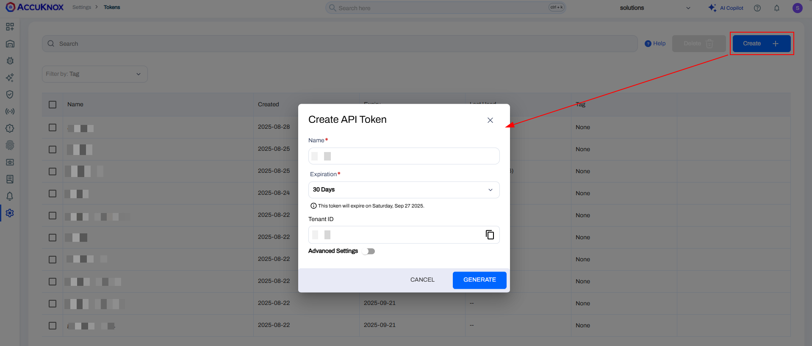
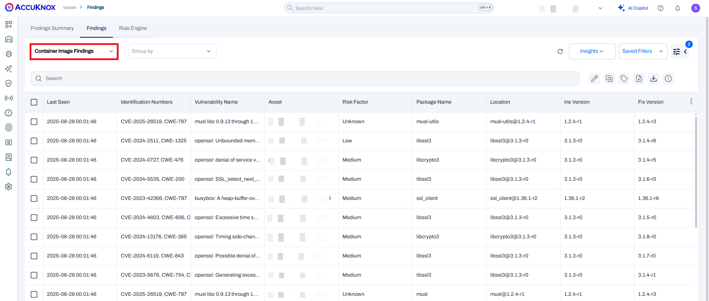

# Jenkins Container Scan

The AccuKnox Container Scan Jenkins Plugin is designed to integrate AccuKnox's container scanning capabilities into your Jenkins pipelines. This plugin allows you to perform container image scans and automatically upload the results to AccuKnox SaaS.

## Features

- **Container Image Scans**: Scan Docker images for vulnerabilities.

- **Severity Levels**: Specify the severity levels to be scanned.

- **Automatic Results Upload**: Upload scan results to AccuKnox SaaS for centralized management and reporting.

- **Exit Code Handling**: Specify exit codes as 0 to pass the build and 1 to fail the build having specified vulnerabilities of high, medium, etc.

- **Repository and Branch Information**: Include repository and branch information in the scan results for better traceability.

## Installation

### Current Installation Method

1. Download the plugin in `.hpi` format from [here](https://drive.google.com/file/d/1kRGPW_-gFfMio8xsFfuk0Jzmnapyk7kz/view?usp=sharing "https://drive.google.com/file/d/1kRGPW_-gFfMio8xsFfuk0Jzmnapyk7kz/view?usp=sharing").

2. Navigate to the Jenkins dashboard.
   

3. Go to **Manage Jenkins > Manage Plugins**.
   

4. Click on the **Advanced** tab.

5. In the **Deploy Plugin** section, click **Choose File** and select the downloaded `.hpi` file.
   

6. Click **Deploy** to install the plugin.
   

7. Restart Jenkins if required.

## Configuration

### Job Configuration

1. Open the configuration page of your Jenkins job.


2. Under the **Build** section, click on **Add build step** and select **AccuKnox Container Scan**.


### Parameters

The plugin provides the following parameters:

- **Image Name**: The name of the Docker image to be scanned.

- **Image Tag**: The tag of the Docker image to be scanned (default is "latest").

- **Exit Code**: The exit code(default is 0).

- **Tenant ID**: The tenant ID for AccuKnox API.

- **AccuKnox Token**: The access token for authenticating with AccuKnox.

- **Label**: The label for AccuKnox SaaS.

- **Severity**: The severity levels to be scanned (default is "UNKNOWN,LOW,MEDIUM,HIGH,CRITICAL").

### Token Generation from AccuKnox SaaS and Viewing Tenant ID

1. Navigate to **Tokens** within the **Settings** section in the sidebar.


2. Click on **Create Token**: After clicking on 'Create Token,' the Tenant ID will be visible.


3. Click on **Generate**.


### Example Configuration

Here is an example of how to configure the plugin in your Jenkins job:

1. Add a new build step and select **AccuKnox Container Scan**.

2. Configure the parameters:

    - **Image Name**: your-image-name

    - **Image Tag**: latest

    - **Exit Code**: 0

    - **Tenant ID**: your-tenant-id

    - **AccuKnox Token**: your-access-token

    - **Label**: your-label

    - **Severity**: UNKNOWN,LOW,MEDIUM,HIGH,CRITICAL

## Running the Scan

When you run the Jenkins job, the plugin will:

1. Print the configuration parameters to the Jenkins console output.

2. Validate the provided AccuKnox Token and Tenant ID.

3. Execute the AccuKnox container scan using the specified parameters.

4. Upload the scan results to AccuKnox SaaS.

5. Mark the build as failed if the scan or upload process encounters errors (unless soft fail is enabled).

### Sample Console Output

```bash
accuknox-image-scan running...
AccuKnox Container Scan executed. Output is suppressed.
Pushing results to AccuKnox SaaS...
Scan results uploaded successfully.
Build completed successfully.
Finished: SUCCESS
```

### Viewing Findings

To view the findings in AccuKnox SaaS, navigate to **Issues -> Findings** and select 'Container Findings'.



## Troubleshooting

### Missing AccuKnox Token or Tenant ID

- Ensure both fields are filled in the job configuration.

- Verify the accuracy of the provided credentials.

### Scan Failure

- Check the Jenkins console output for detailed error messages.

- Ensure the specified image name and tag exist and are accessible.

### Upload Failure

- Verify network connectivity to the AccuKnox SaaS endpoint.

- Check the accuracy of the Tenant ID and AccuKnox Token.
