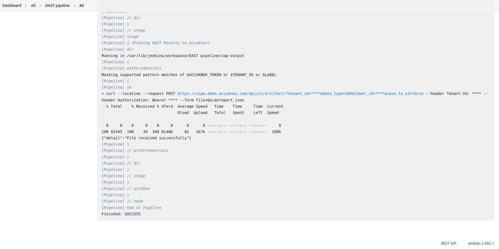
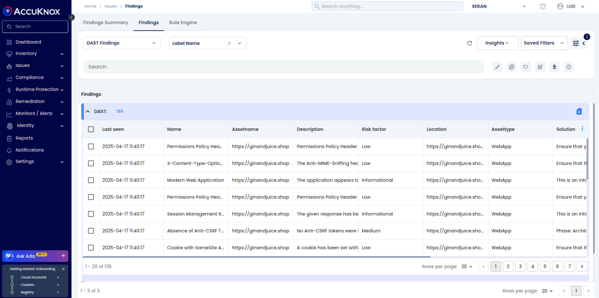

# AccuKnox DAST Integration in Jenkins (Pipeline Method)

## Prerequisites

### Required from AccuKnox Console

✅ Store these values in Jenkins Credentials Manager.

- Tenant ID
- Token
- Label ID

### ⚙ Required Tools on Jenkins VM

- Docker (installed and running)
- Jenkins with pipeline support
- Internet access to pull AccuKnox DAST container image

---

## What is TARGET_URL?

The `TARGET_URL` is the address of the web application that will be scanned using AccuKnox DAST. It can be:

- A public application (e.g., https://ginandjuice.shop/)
- An internal or local application accessible from the Jenkins agent

🔒 Ensure the Jenkins agent and Docker container can access this URL.

```groovy
environment {
    TARGET_URL = 'https://ginandjuice.shop/'
}
```

---

## Jenkins Pipeline Script

```groovy
pipeline {
    agent any

    environment {
        TARGET_URL = 'https://ginandjuice.shop/' // Your target app URL
    }

    stages {
        stage('AccuKnox DAST Scan') {
            steps {
                dir("${env.WORKSPACE}") {
                    script {
                        sh '''
                            mkdir -p zap-output && chmod 777 zap-output
                            docker run --rm -v "$PWD/zap-output:/zap/wrk/:rw" -t zaproxy/zap-stable zap-baseline.py \
                                -t $TARGET_URL \
                                -J scanreport.json \
                                -I
                        '''
                    }
                }
            }
        }

        stage('Pushing DAST Results to AccuKnox') {
            steps {
                dir("${env.WORKSPACE}/zap-output") {
                    withCredentials([
                        string(credentialsId: 'accuknox-token', variable: 'ACCUKNOX_TOKEN'),
                        string(credentialsId: 'tenant-id', variable: 'TENANT_ID'),
                        string(credentialsId: 'label_dast', variable: 'LABEL')
                    ]) {
                        sh '''
                            curl --location --request POST \
"https://cspm.demo.accuknox.com/api/v1/artifact/?tenant_id=$TENANT_ID&data_type=ZAP&label_id=$LABEL&save_to_s3=false" \
                                --header "Tenant-Id: $TENANT_ID" \
                                --header "Authorization: Bearer $ACCUKNOX_TOKEN" \
                                --form "file=@scanreport.json"
                        '''
                    }
                }
            }
        }
    }
}
```

---

## Jenkins Credentials Setup

| Credential ID  | Description                           |
| -------------- | ------------------------------------- |
| accuknox-token | Token generated from AccuKnox Console |
| tenant-id      | Tenant ID from AccuKnox Console       |
| label_dast     | Label ID for the DAST scan            |

📝 Refer to:

- [How to Create Tokens in AccuKnox](https://help.accuknox.com/how-to/how-to-create-tokens/)
- [How to Create Labels in AccuKnox](https://help.accuknox.com/how-to/how-to-create-labels/)

---

## Output Files

After a successful scan, the following file is created:

- `zap-output/scanreport.json` → Contains the DAST vulnerability scan results
  This report is sent to the AccuKnox Console for visualization and triaging.

### Console Output



## View Results in AccuKnox

After the pipeline executes successfully:

1. Go to AccuKnox Console
2. Navigate to **Issues → Findings**
3. Filter using the selected label to view DAST findings



---

## Optional Cleanup (Post-Scan)

If needed, clean up the workspace after upload:

```bash
sh 'rm -f zap-output/scanreport.json'
```
