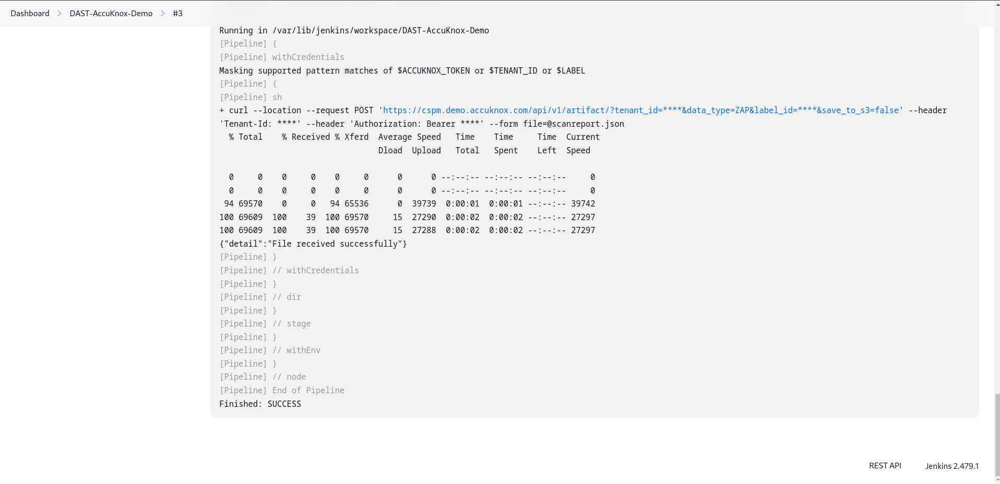
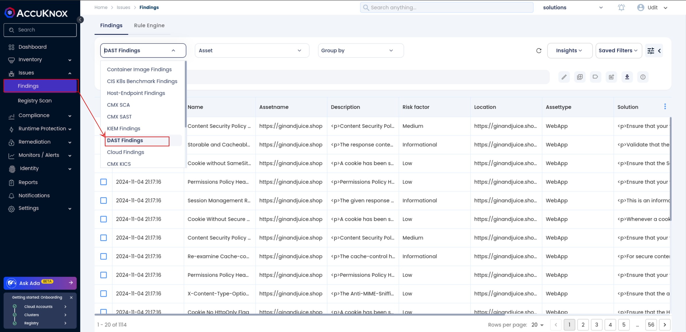
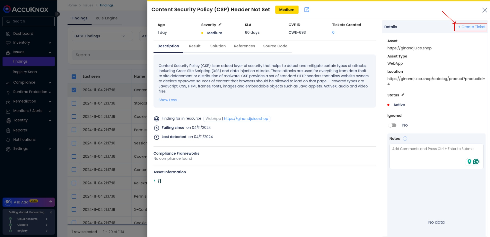

# Jenkins DAST

This document provides the steps to integrate AccuKnox DAST (Dynamic Application Security Testing) with a Jenkins CI/CD pipeline. By incorporating AccuKnox DAST into the pipeline, you can detect vulnerabilities and security issues in web applications before they reach production.

## Prerequisites

- **AccuKnox UI access** to view DAST findings and manage configurations.

- **Jenkins access** to set up and run the DAST pipeline.

## **Step 1: Generate AccuKnox Token**

1. Log into your AccuKnox account.

2. Go to **Settings > Tokens** and click on the **Create** button.


3. Provide a name for the token and click **Generate**.


4. Copy the generated token and the **Tenant ID**.


## **Step 2: Create a Label in AccuKnox**

Labels in AccuKnox help group similar findings together.

1. Navigate to **Settings > Labels** and click **Create Label**.


2 . Save the label and note it down.

## **Step 3: Jenkins Pipeline Configuration for DAST Integration**

Add the following Jenkins pipeline code to your Jenkins job configuration. This pipeline uses OWASP ZAP to scan the target URL for vulnerabilities, then uploads the scan results to AccuKnox.

```groovy
pipeline {
    agent any
    environment {
        TARGET_URL = '<https://ginandjuice.shop/'>
    }
    stages {
        stage('OWASP ZAP Scan') {
            steps {
                dir('/var/lib/jenkins/workspace/DAST-AccuKnox-Demo') {
                    script {
                        // Run OWASP ZAP as a Docker container
                        sh '''
                            docker run --rm -v /var/lib/jenkins/workspace/DAST-AccuKnox-Demo/:/zap/wrk/:rw -t zaproxy/zap-stable zap-baseline.py \
                                -t ${TARGET_URL} \
                                -J scanreport.json \
                                -I
                        '''
                    }
                }
            }
        }
        stage('Pushing DAST Results to AccuKnox') {
            steps {
                dir("${WORKSPACE}") {
                    withCredentials([
                        string(credentialsId: 'accuknox-token', variable: 'ACCUKNOX_TOKEN'),
                        string(credentialsId: 'tenant-id', variable: 'TENANT_ID'),
                        string(credentialsId: 'label_dast', variable: 'LABEL')
                    ]) {
                        sh '''
                            curl --location --request POST "<https://cspm.demo.accuknox.com/api/v1/artifact/?tenant_id=$TENANT_ID&data_type=ZAP&label_id=$LABEL&save_to_s3=false>" \
                                --header "Tenant-Id: $TENANT_ID" \
                                --header "Authorization: Bearer $ACCUKNOX_TOKEN" \
                                --form "file=@scanreport.json"
                        '''
                    }
                }
            }
        }
    }
}
```

### Explanation of Stages

- **OWASP ZAP Scan**: Runs an OWASP ZAP scan on the target URL (`<https://ginandjuice.shop/`)> using the zap-baseline.py script. The scan results are saved in a JSON file, `scanreport.json`.

- **Pushing DAST Results to AccuKnox**: Uploads the JSON scan report to AccuKnox using a secure API request, which includes the AccuKnox token, tenant ID, and label ID.

## **Step 4: Configure Secrets in Jenkins**

1. Go to **Jenkins > Manage Jenkins > Manage Credentials**.


1. Add the following credentials:

    - **accuknox-token**: The AccuKnox token was generated in Step 1.

    - **tenant-id**: AccuKnox Tenant ID.

    - **label_dast**: AccuKnox Label ID created in Step 2.


## **Step 5: Run the Pipeline**

1. Save and run the pipeline in Jenkins.

2. Monitor the pipeline stages to ensure OWASP ZAP scans the target URL and the results are uploaded to AccuKnox.

### Console Output after successful execution



## **Step 6: View DAST Findings in AccuKnox**

1. Log in to the AccuKnox platform.

2. Go to **Issues > Findings** and select **DAST Findings** to view the results of the DAST scan.


3. Click on any finding for detailed information. You can also create a ticket for further action.

