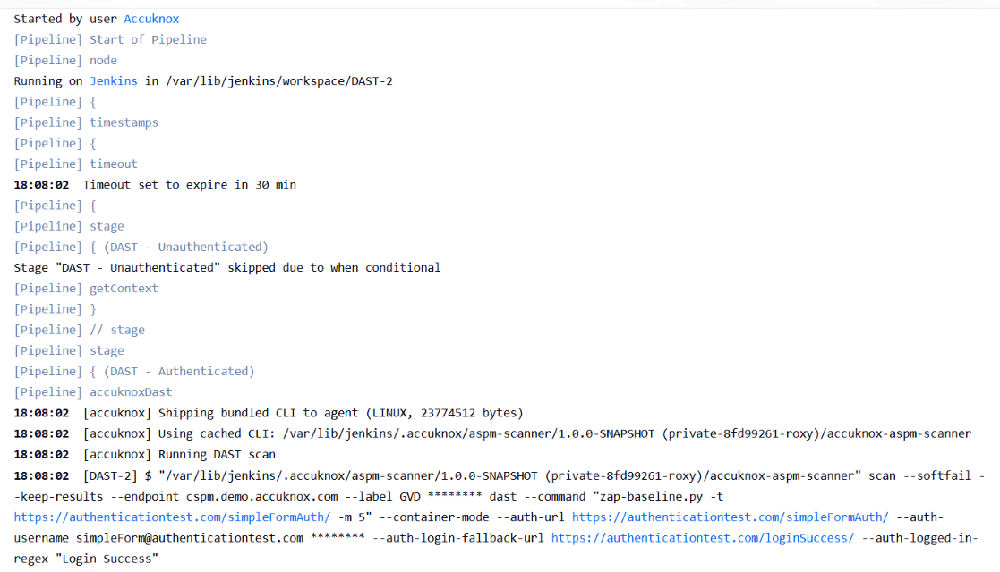
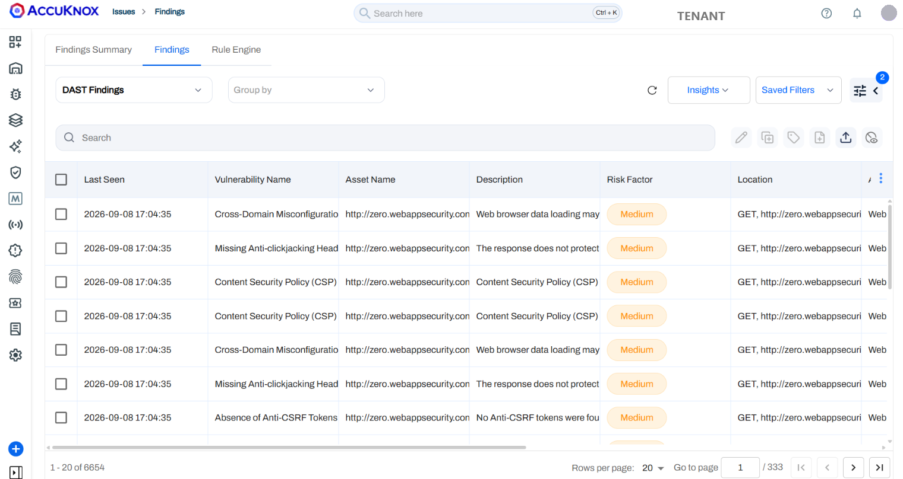

# Integrating DAST in Jenkins

This guide walks through configuring a Jenkins pipeline that uses the **AccuKnox ASPM Scanner** plugin to perform Dynamic Application Security Testing (DAST) against a running web application. The scan runs on the build agent and the findings are automatically forwarded to AccuKnox for centralized triage.

DAST tests a live URL. It catches what static analysis cannot see, such as a missing security header, a reflected parameter, or a session that survives logout. The pipeline below runs two independent scans. The unauthenticated scan covers pages a logged-out visitor reaches. The authenticated scan logs in first and covers everything behind the login form.

## Prerequisites

- A Jenkins controller (`2.387.3 LTS` or newer) with at least one build agent.
- An AccuKnox SaaS account with a label you can upload findings to.
- Network egress from the Jenkins agent to the target application URL and to the AccuKnox control plane.

## Step 1: Install the AccuKnox ASPM plugin

Install `accuknox-aspm.hpi` via **Manage Jenkins → Plugins → Advanced**. See [Installing the AccuKnox ASPM Jenkins Plugin](jenkins-installation.md) for the full walk-through with screenshots.

## Step 2: Configure Jenkins credentials and global settings

- Store your AccuKnox bearer token as a Jenkins **Secret text** credential.
- Under **Manage Jenkins → System → AccuKnox ASPM**, set the control-plane endpoint and select the token credential.
- Store the login password for the authenticated scan as a second **Secret text** credential. The `accuknoxDast` step reads it by credential ID, so the password never appears in the Jenkinsfile.

!!! warning "LABEL has no global default"
    Unlike the other `accuknox*` steps, `accuknoxDast` does not fall back to a globally configured label. Supply `LABEL` as a pipeline parameter on every run, or the upload fails.

## Step 3: Define the Jenkins pipeline

Create a Pipeline job and paste the snippet below as the script. Both stages are gated behind a boolean parameter, so you can run either scan or both from the same job.

```groovy
// AccuKnox DAST scan, standalone Jenkinsfile.
//
// Two optional stages: unauthenticated and authenticated.
// Toggle RUN_UNAUTH_SCAN / RUN_AUTH_SCAN at build time to run either or both.

pipeline {
  agent any

  parameters {
    booleanParam(name: 'RUN_UNAUTH_SCAN',
                 defaultValue: false,
                 description: 'Run the unauthenticated scan against TARGET_URL.')

    string(name: 'TARGET_URL',
           defaultValue: '',
           description: 'Live URL for the unauthenticated scan.')

    booleanParam(name: 'RUN_AUTH_SCAN',
                 defaultValue: true,
                 description: 'Run the authenticated scan.')

    string(name: 'AUTH_TARGET_URL',
           defaultValue: '',
           description: 'Live URL for the authenticated scan. Used only when RUN_AUTH_SCAN is true.')

    string(name: 'AUTH_URL',
           defaultValue: '',
           description: 'Login page URL. Required when RUN_AUTH_SCAN is true.')

    string(name: 'AUTH_USERNAME',
           defaultValue: 'simpleForm@authenticationtest.com',
           description: 'Login username/email. Required when RUN_AUTH_SCAN is true.')

    string(name: 'AUTH_PASSWORD_CREDENTIAL',
           defaultValue: '',
           description: 'Jenkins Secret text credential ID holding the login password.')

    string(name: 'AUTH_LOGIN_FALLBACK_URL',
           defaultValue: '',
           description: 'Optional. Post-login page used to verify a successful login.')

    string(name: 'AUTH_LOGGED_IN_REGEX',
           defaultValue: 'Login Success',
           description: 'Optional. Pattern matched against a response to confirm login succeeded.')

    string(name: 'SEVERITY_THRESHOLD',
           defaultValue: 'HIGH,CRITICAL',
           description: 'Comma-separated severities that fail the build.')

    booleanParam(name: 'SOFT_FAIL',
                 defaultValue: true,
                 description: 'true (default) = advisory only; false = fail build on matching severities.')

    string(name: 'LABEL',
           defaultValue: 'GVD',
           description: 'AccuKnox label the results are associated with. No global default, required here.')
  }

  options {
    timestamps()
    timeout(time: 30, unit: 'MINUTES')
    disableConcurrentBuilds()
  }

  stages {
    stage('DAST - Unauthenticated') {
      when { expression { params.RUN_UNAUTH_SCAN } }
      steps {
        accuknoxDast(dastCommand: "zap-baseline.py -t ${params.TARGET_URL} -m 5",
                     severityThreshold: params.SEVERITY_THRESHOLD,
                     softFail: params.SOFT_FAIL,
                     label: params.LABEL)
      }
    }

    stage('DAST - Authenticated') {
      when { expression { params.RUN_AUTH_SCAN } }
      steps {
        accuknoxDast(dastCommand: "zap-baseline.py -t ${params.AUTH_TARGET_URL} -m 5",
                     authUrl: params.AUTH_URL,
                     authUsername: params.AUTH_USERNAME,
                     authPasswordCredentialsId: params.AUTH_PASSWORD_CREDENTIAL,
                     authLoginFallbackUrl: params.AUTH_LOGIN_FALLBACK_URL,
                     authLoggedInRegex: params.AUTH_LOGGED_IN_REGEX,
                     severityThreshold: params.SEVERITY_THRESHOLD,
                     softFail: params.SOFT_FAIL,
                     label: params.LABEL)
      }
    }
  }

  post {
    always {
      echo "Results are attached to this build as accuknox-dast-results.json per stage that ran."
    }
    failure {
      echo "Upload failed? Check Manage Jenkins > System > AccuKnox ASPM for endpoint/token, " +
           "and confirm LABEL is set, it has no global default."
    }
  }
}
```

## Pipeline inputs

=== "Build parameters"

    | Parameter | Description | Required | Default |
    |------|------|------|------|
    | `RUN_UNAUTH_SCAN` | Run the unauthenticated scan against `TARGET_URL`. | no | `false` |
    | `TARGET_URL` | Live URL for the unauthenticated scan. | when `RUN_UNAUTH_SCAN` is `true` | *(empty)* |
    | `RUN_AUTH_SCAN` | Run the authenticated scan. | no | `true` |
    | `AUTH_TARGET_URL` | Live URL for the authenticated scan. | when `RUN_AUTH_SCAN` is `true` | *(empty)* |
    | `AUTH_URL` | Login page URL, for example `https://example.com/login`. | when `RUN_AUTH_SCAN` is `true` | *(empty)* |
    | `AUTH_USERNAME` | Login username or email. | when `RUN_AUTH_SCAN` is `true` | `simpleForm@authenticationtest.com` |
    | `AUTH_PASSWORD_CREDENTIAL` | Jenkins **Secret text** credential ID holding the login password. | when `RUN_AUTH_SCAN` is `true` | *(empty)* |
    | `AUTH_LOGIN_FALLBACK_URL` | Post-login page used to verify a successful login. | no | *(empty)* |
    | `AUTH_LOGGED_IN_REGEX` | Pattern matched against a response to confirm login succeeded. | no | `Login Success` |
    | `SEVERITY_THRESHOLD` | CSV of severities that fail the build. | no | `HIGH,CRITICAL` |
    | `SOFT_FAIL` | `true` = advisory only; `false` = fail build on matching severities. | no | `true` |
    | `LABEL` | AccuKnox label the results are associated with. | yes | `GVD` |

=== "Step parameters"

    Arguments accepted by the `accuknoxDast` step itself.

    | Parameter | Default | Notes |
    |------|------|------|
    | `dastCommand` | *(none)* | Full scanner command string, for example `zap-baseline.py -t <url> -m 5`. |
    | `authUrl` | *(none)* | Login page URL. Authenticated scans only. |
    | `authUsername` | *(none)* | Login username. Authenticated scans only. |
    | `authPasswordCredentialsId` | *(none)* | Jenkins credential ID holding the password. Authenticated scans only. |
    | `authLoginFallbackUrl` | *(none)* | Post-login URL used to verify a successful login. |
    | `authLoggedInRegex` | *(none)* | Regex matched in a response to validate login success. |
    | `severityThreshold` | from build parameter | CSV of severities that fail the build. |
    | `softFail` | from build parameter | `true` = advisory only; `false` = gate the build on threshold breaches. |
    | `label` | from build parameter | AccuKnox label. Required, no global default. |

## Step 4: Run the job and read the console output

Click **Build with Parameters**, set `AUTH_TARGET_URL`, `AUTH_URL` and `AUTH_PASSWORD_CREDENTIAL`, then click **Build**. The console log names the stage that its `when` condition skipped, prints the scanner command as it was assembled, and masks the token and the password.

*Figure 1. Console output for a run where the unauthenticated stage was skipped and the authenticated stage ran.*


The results JSON is archived on the build as `accuknox-dast-results.json`, one file per stage that ran.

## Without AccuKnox vs with AccuKnox

=== "Without AccuKnox"

    A DAST scan produces a local JSON report on the agent. Engineers open the build artifact and read it by hand, or wire up a dashboard themselves. Nothing tells them which findings are new since the last build.

=== "With AccuKnox"

    The plugin forwards the same report to your AccuKnox tenant. Each finding is tied to its URL and parameter, deduplicated across builds, and carries a ticket you can raise from the console. Soft-fail and hard-fail gating is enforced from the same step.

*Figure 2. DAST findings on the AccuKnox console, filtered to the DAST data type.*


## Viewing results in AccuKnox

Once the Jenkins job uploads its report, the findings are available in the AccuKnox SaaS console.

1. Log in to the AccuKnox console and switch to the tenant whose label you configured in Jenkins.
2. Open **Issues → Findings**, and filter by the **DAST Findings** data type and the label used in the pipeline.
3. Click any finding to inspect the URL, the parameter, the alert type, the CWE, and the recommended remediation.
4. Use the **ASK AI** button on a finding for an LLM-generated explanation and patch suggestion.
5. Create a ticket directly from the finding to track remediation.
6. Re-run the Jenkins job after fixing the issue. The finding flips to **Resolved** on the next ingest.

## Combine DAST with the other Jenkins scans

DAST tests the running application, so it finds nothing in code that never ships and nothing in an image that is never deployed. Pair it with the scan types that cover those: [SAST](jenkins-sast.md), [IaC](jenkins-iac-scan.md), [Secret](jenkins-secret-scan.md), [Container](jenkins-container-scan.md), [SBOM](jenkins-sbom.md) and [SCA](jenkins-artifact-scan.md). All of them upload to the same tenant, so a single Findings view covers the pipeline end to end.
