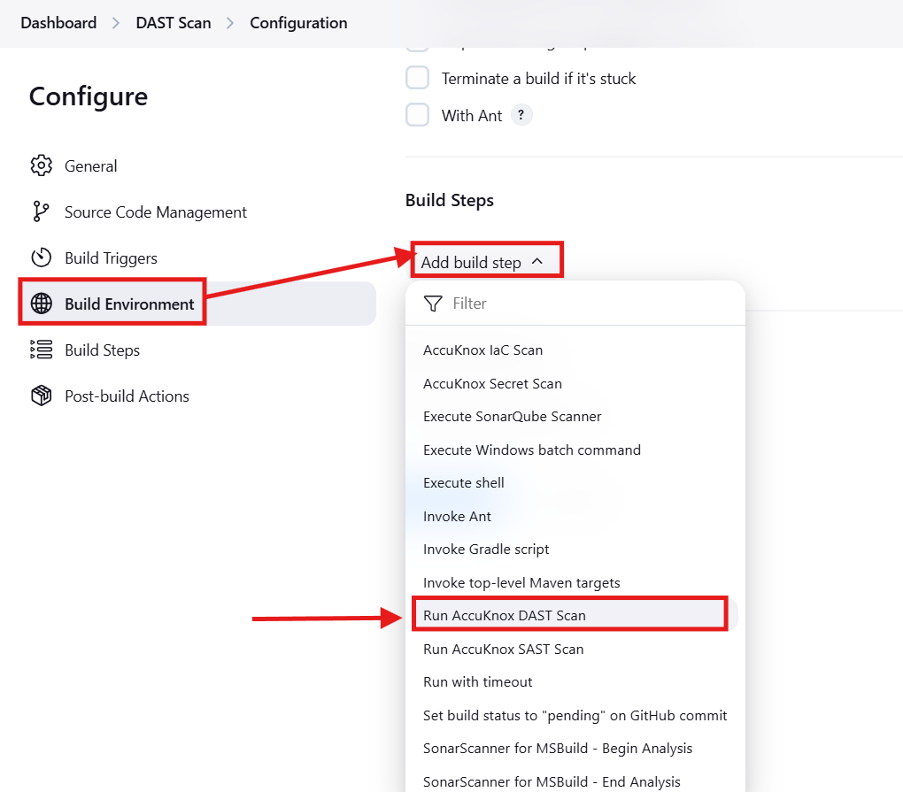
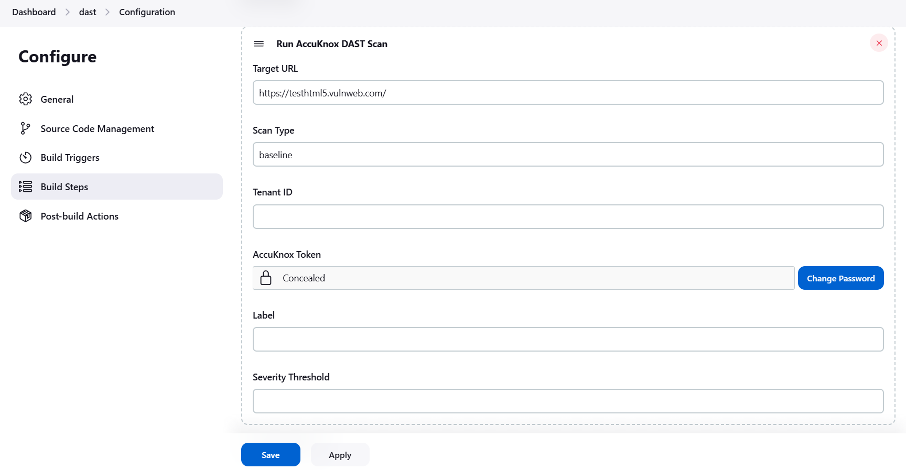

# Setting Up Jenkins DAST with AccuKnox for Code Testing

## Overview

The **AccuKnox DAST Jenkins Plugin** simplifies integrating dynamic application security testing (DAST) into Jenkins pipelines. This plugin allows you to perform ZAP-based scans on target URLs and seamlessly upload the results to AccuKnox SaaS for centralized investigation and analysis.

## Key Features

- **Automated DAST Scans**: Perform **Baseline** or **Full Scans** on target URLs directly from your Jenkins pipelines.

- **Seamless Integration with AccuKnox**: Upload scan results to **AccuKnox SaaS**, enabling centralized management of DAST findings alongside SAST, IaC, and container security findings.

- **Customizable Build Parameters**: Define parameters like target URL, scan type, severity thresholds, and AccuKnox authentication details.

## Installation

1. Download the plugin in `.hpi` format from [here](https://drive.google.com/file/d/1wgRtCiCTqx30CT_Si54NL9ikeYWkwMbl/view?usp=sharing "https://drive.google.com/file/d/1wgRtCiCTqx30CT_Si54NL9ikeYWkwMbl/view?usp=sharing").

2. Navigate to the Jenkins dashboard.

3. Go to **Manage Jenkins > Manage Plugins**.
   

4. Under the **Advanced** tab:

5. Click **Choose File** and select the downloaded `.hpi` file.
   
   

6. Click **Deploy** to install the plugin.
   

7. Restart Jenkins if required.


## Configuration

### Job Configuration

1. Open the configuration page of your Jenkins job.

2. Under the **Build** section:

   - Click **Add build step**.

   - Select **Run AccuKnox DAST Scan**.



### Plugin Parameters:

The plugin provides the following configuration options:

| **Parameter**          | **Description**                                                | **Example**           |
| ---------------------- | -------------------------------------------------------------- | --------------------- |
| **Target URL**         | URL of the web application to scan.                            | `https://example.com` |
| **Scan Type**          | Type of scan: baseline or full-scan.                           | `full-scan`           |
| **Tenant ID**          | Tenant ID associated with your AccuKnox account.               | `my-tenant-id`        |
| **AccuKnox Token**     | Authentication token for AccuKnox SaaS.                        | `my-accuknox-token`   |
| **Label**              | A label to tag the scan results in AccuKnox SaaS.              | `build-123`           |
| **Severity Threshold** | Minimum severity level to trigger build failures (e.g., High). | `High`                |



## Token Generation for AccuKnox

To generate the **AccuKnox Token** and obtain the **Tenant ID**:

1. Log in to AccuKnox.

2. Navigate to **Settings** > **Tokens** and create an AccuKnox token.

3. Copy the generated token and store it securely for later use. For detailed steps, refer to [How to Create Tokens](https://help.accuknox.com/how-to/how-to-create-tokens/ "https://help.accuknox.com/how-to/how-to-create-tokens/").

## Running the Scan

When you run the Jenkins job:

1. **DAST Scan Execution**:

   - The plugin performs a DAST scan (baseline or full) on the target URL.

   - Results are saved as a `report.json` file in the workspace.

2. **Uploading Results to AccuKnox SaaS**:

   - The `report.json` file is uploaded to the specified AccuKnox tenant using the provided credentials.

### Sample Console Output:

```sh
Running AccuKnox DAST Scan...
ZAP output: [ZAP Scan Logs]
Uploading DAST scan results to AccuKnox...
Results uploaded successfully.
```

## Troubleshooting

1. **Missing AccuKnox Token or Tenant ID**:

   - Ensure both fields are provided in the Jenkins job configuration.

   - Verify their accuracy in the AccuKnox SaaS dashboard.

2. **Scan Failure**:

   - Check the Jenkins console output for ZAP-specific errors.

   - Verify that the target URL is accessible and not blocking scan requests.

3. **Upload Failure**:

   - Verify network connectivity to the **AccuKnox SaaS** endpoint.

   - Double-check the **Tenant ID** and **AccuKnox Token**.

   - Ensure the `report.json` file is generated correctly before uploading.

## Conclusion

The **AccuKnox DAST Jenkins Plugin** simplifies the process of integrating dynamic application security testing into your CI/CD pipeline. By seamlessly combining ZAP-based scans with AccuKnox SaaS, you can ensure vulnerabilities are identified and managed in a centralized manner, improving the overall security posture of your application.

For further assistance, contact the AccuKnox support team or refer to the [AccuKnox Documentation](https://www.accuknox.com/ "https://www.accuknox.com/").
