# Jenkins IaC Scan Plugin

The AccuKnox IaC Scan Jenkins Plugin is designed to integrate AccuKnox's Infrastructure as Code (IaC) scanning capabilities into your Jenkins pipelines. This plugin allows you to perform IaC scans using Checkov and automatically upload the results to AccuKnox SaaS.

## Features

- **Directory and File Scans:** Scan specific directories or files for infrastructure misconfigurations.

- **Framework Support:** Supports scanning multiple frameworks including Terraform, CloudFormation, Kubernetes, and more.

- **Soft Fail Option:** Continue the build process even if the scan fails.

- **Automatic Results Upload:** Upload scan results to AccuKnox SaaS for centralized management and reporting.

- **Repository and Branch Information:** Include repository and branch information in the scan results for better traceability.

## Installation

### Current Installation Method

1. Download the plugin in `.hpi` format from [here](https://drive.google.com/file/d/1C6v8dovJ2wg83ULvs1_YGhWtX3VpeV1n/view?usp=sharing "https://drive.google.com/file/d/1C6v8dovJ2wg83ULvs1_YGhWtX3VpeV1n/view?usp=sharing").

2. Navigate to the Jenkins dashboard.

3. Go to `Manage Jenkins` > `Manage Plugins`.

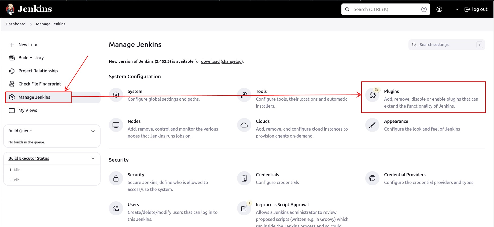

4. Click on the `Advanced` tab.

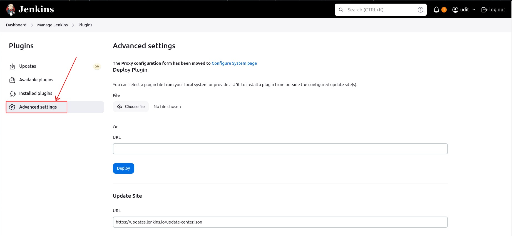

5. In the `Deploy Plugin` section, click `Choose File` and select the downloaded `.hpi` file.

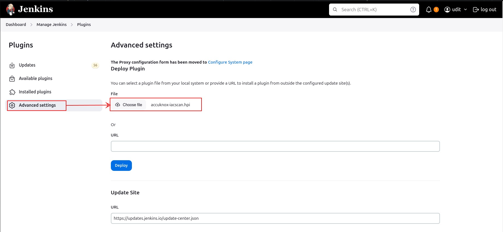

6. Click `Deploy` to install the plugin.

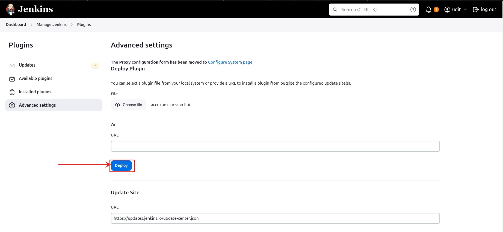

7. Restart Jenkins if required.

### Future Availability

!!! info "Upcoming Release"
    The AccuKnox IaC Scan Jenkins Plugin will be published to the Jenkins Marketplace by August 15th. After this date, you will be able to install the plugin directly from the Jenkins Plugin Manager.

## Configuration

### Job Configuration

1. Open the configuration page of your Jenkins job.

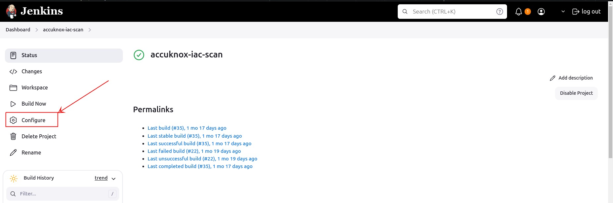

2. Under the `Build` section, click on `Add build step` and select `AccuKnox IaC Scan`.

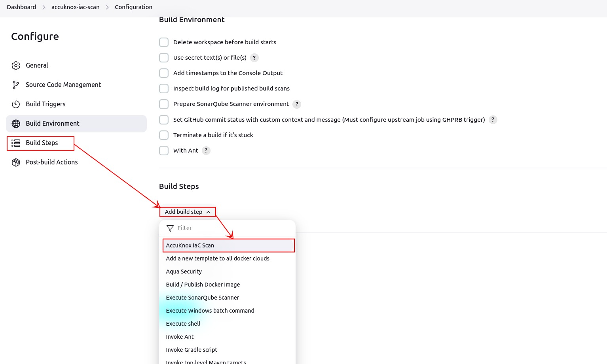

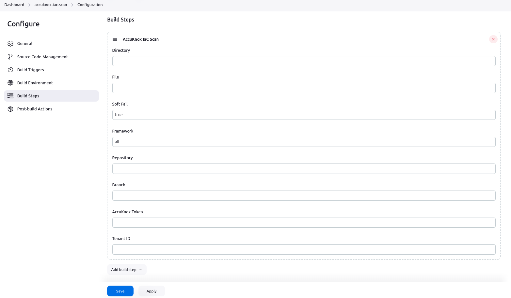

## Usage

### Parameters

The plugin provides the following parameters:

- **Directory:** The directory to be scanned.

- **Soft Fail:** Whether to continue the build process if the scan fails.

- **Tenant ID:** The tenant ID for the AccuKnox API.

- **AccuKnox Token:** The access token for authenticating with AccuKnox.

- **Framework:** The framework to be used for scanning (default is `all`).

- **File:** Specific file to be scanned (optional).

- **Repository:** URL of the repository being scanned.

- **Branch:** Branch name of the repository.

**Token Generation from Accuknox SaaS and Viewing Tenant ID which will be used in the AccuKnox IaC Scan Plugin**

Navigate to Tokens within the Settings section in the sidebar:

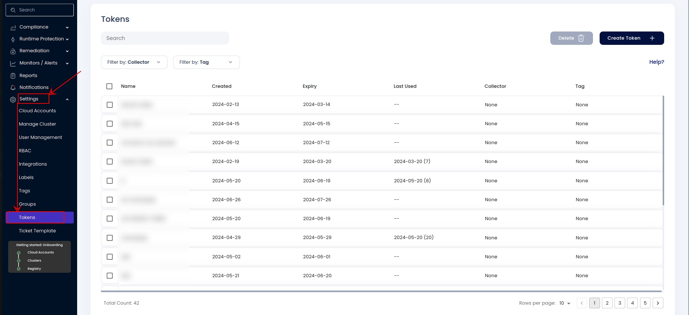

Click on Create Token: After clicking on 'Create Token,' the Tenant ID will be visible.

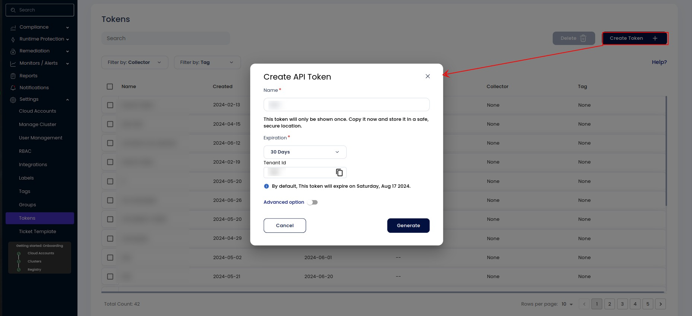

Click on Generate:

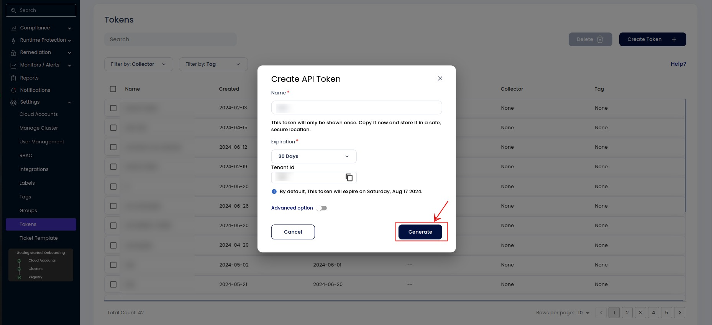

### Example Configuration

Here is an example of how to configure the plugin in your Jenkins job:

1. Add a new build step and select `AccuKnox IaC Scan`.

2. Configure the parameters:
    - **Directory:** `src`

    - **Soft Fail:** `true`

    - **Tenant ID:** `your-tenant-id`

    - **AccuKnox Token:** `your-access-token`

    - **Framework:** `terraform`

    - **File:** `main.tf`

    - **Repository:** `https://github.com/your-repo.git`

    - **Branch:** `main`

### Running the Scan

When you run the Jenkins job, the plugin will:

1. Print the configuration parameters to the Jenkins console output.
2. Validate the provided AccuKnox Token and Tenant ID.
3. Execute the Checkov scan using the specified parameters.
4. Upload the scan results to AccuKnox SaaS.
5. Mark the build as failed if the scan or upload process encounters errors (unless `soft fail` is enabled).

### Sample Console Output

```sh
Starting AccuKnox IaC scan.
Directory: src
Framework: terraform
Soft Fail: true
File: main.tf
Tenant ID: your-tenant-id
AccuKnox Token: Provided
Repository: https://github.com/your-repo.git
Branch: main
Running AccuKnox IaC scan...
AccuKnox IaC scan completed successfully.
Pushing results to AccuKnox SaaS...
Scan results uploaded successfully.
Build completed successfully.
```

**To view the findings in the AccuKnox SaaS, go to issues → findings → select 'IaC findings'**

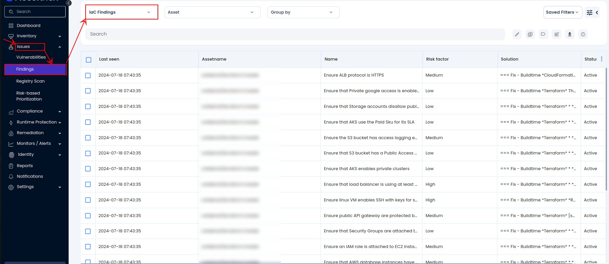

## Troubleshooting

**Missing AccuKnox Token or Tenant ID**

- Ensure both fields are filled in the job configuration.
- Verify the accuracy of the provided credentials.

**Scan Failure**

- Check the Jenkins console output for detailed error messages.
- Ensure the specified directory or file exists and is accessible.

**Upload Failure**

- Verify network connectivity to the AccuKnox SaaS endpoint.
- Check the accuracy of the Tenant ID and AccuKnox Token.
