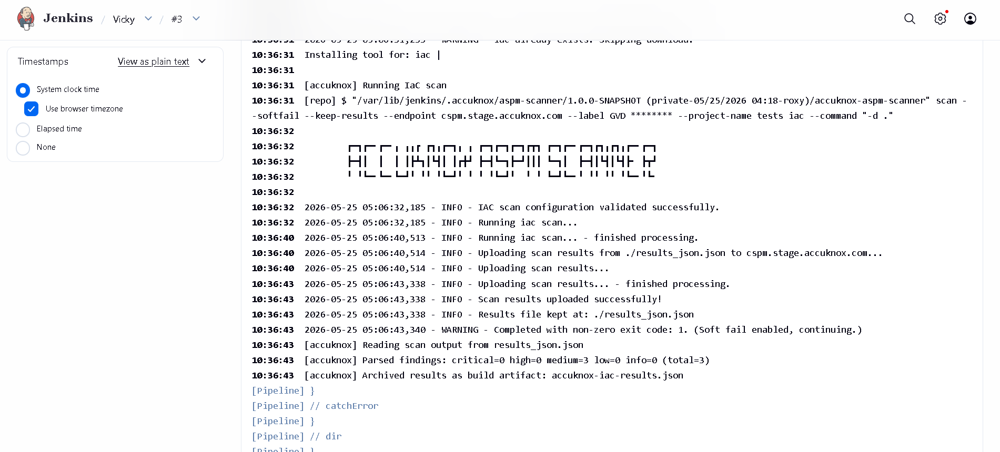

# IaC Scanning in Jenkins

This guide configures a Jenkins pipeline that scans Infrastructure-as-Code (Terraform, CloudFormation, Kubernetes manifests, Helm charts, ARM templates, Dockerfiles) using the **AccuKnox ASPM Scanner** plugin, with results auto-forwarded to AccuKnox.

## Prerequisites

- A Jenkins controller (`2.387.3 LTS` or newer) with at least one build agent.
- An AccuKnox SaaS account with a tenant / label you can upload findings to.
- Network egress from the Jenkins agent to the AccuKnox control plane (or a mirrored scanner image for air-gapped agents).

## Step 1: Install the AccuKnox ASPM Plugin

See [Installing the AccuKnox ASPM Jenkins Plugin](jenkins-installation.md) for the one-time plugin installation steps.

## Step 2: Configure Jenkins credentials and global settings

- Add the AccuKnox token as a Jenkins **Secret text** credential.
- Under **Manage Jenkins → System → AccuKnox ASPM**, set the endpoint, label, and select the token credential.

## Step 3: Define the Jenkins Pipeline

```groovy
// AccuKnox IaC scan, standalone Jenkinsfile.
//
// Clones a repo, runs accuknoxIac inside it. Detects Terraform, CloudFormation,
// Kubernetes manifests, Helm charts, ARM templates, etc.

pipeline {
  agent any

  parameters {
    string(name: 'REPO_URL',
           defaultValue: 'https://github.com/Vickydew1/Testing.git',
           description: 'Git repo to clone and scan.')

    string(name: 'DIRECTORY',
           defaultValue: '.',
           description: 'Directory inside the repo to scan for IaC files.')

    string(name: 'SEVERITY_THRESHOLD',
           defaultValue: 'HIGH,CRITICAL',
           description: 'Comma-separated severities that fail the build.')

    booleanParam(name: 'SOFT_FAIL',
                 defaultValue: true,
                 description: 'true (default) = run and upload, build stays green; false = fail build on matching severities.')
  }

  options {
    timestamps()
    timeout(time: 20, unit: 'MINUTES')
    disableConcurrentBuilds()
  }

  environment {
    REPO_URL = "${params.REPO_URL}"
  }

  stages {
    stage('Checkout') {
      steps {
        sh '''
          set -eu
          rm -rf repo
          git clone --depth=1 "$REPO_URL" repo
        '''
      }
    }

    stage('IaC') {
      steps {
        dir('repo') {
          accuknoxIac(directory: params.DIRECTORY,
                      severityThreshold: params.SEVERITY_THRESHOLD,
                      softFail: params.SOFT_FAIL)
        }
      }
    }
  }
}
```

## Pipeline inputs

=== "Step parameters"

    | Parameter | Description | Required | Default |
    |------|------|------|------|
    | `directory` | Path inside the workspace to scan. | no | `.` |
    | `severityThreshold` | CSV of severities that fail the build. | no | `HIGH,CRITICAL` |
    | `softFail` | `true` = advisory only; `false` = fail build on matching severities. | no | `false` |
    | `repoUrl` / `repoBranch` | Pass-through metadata for the AccuKnox upload. | no | *(unset)* |

=== "Common knobs"

    Every `accuknox*` step accepts these:

    | Parameter | Default | Notes |
    |------|------|------|
    | `endpoint` | from global config | Control-plane host (no scheme). Per-step override. |
    | `label` | from global config | Becomes the `label_id` on the upload. |
    | `credentialsId` | from global config | Jenkins credential ID holding the AccuKnox bearer token. |
    | `skipUpload` | `false` | Run the scanner but don't upload. Useful for dry runs. |
    | `keepResults` | `true` | Keep results JSON on the agent and archive it as a build artifact. |
    | `containerMode` | `false` | Run the scanner inside Docker on the agent. |
    | `cliPath` | `auto` | Path to a pre-staged `accuknox-aspm-scanner` binary (air-gapped use). |

## Without AccuKnox vs With AccuKnox

=== "Without AccuKnox"

    Checkov or similar IaC scanners produce a JSON report locally; engineers must manually inspect or wire up dashboards to surface results.

=== "With AccuKnox"

    The plugin forwards the IaC report to AccuKnox, where findings are tied to their files and resources, deduplicated across builds, and ticketable from the console.

*Figure 1. IaC findings rendered in the AccuKnox console.*


## Viewing Results in AccuKnox

Once the Jenkins job uploads its report, the findings are available in the AccuKnox SaaS console.

1. Log in to the AccuKnox console and switch to the tenant whose label you configured in Jenkins.
2. Open **Issues → Findings**, and filter by the data type that matches the scan (SAST, IaC, Secret, Container, SBOM, SCA).
3. Click any finding to inspect the file, line, CWE, and the recommended remediation.
4. Use the **ASK AI** button on a finding for an LLM-generated explanation and patch suggestion.
5. Create a ticket directly from the finding to track remediation.
6. Re-run the Jenkins job after fixing the issue. The finding flips to **Resolved** on the next ingest.

## Conclusion

Wiring IaC scanning into Jenkins via the AccuKnox ASPM plugin gives you continuous, automated detection of issues on every build, with a single pane of glass in the AccuKnox console for triage, ticketing, and verification. Combine it with the other scan types ([SAST](jenkins-sast.md), [Secret](jenkins-secret-scan.md), [Container](jenkins-container-scan.md), [SBOM](jenkins-sbom.md), [SCA](jenkins-artifact-scan.md)) to get full-coverage ASPM directly from your pipelines.
