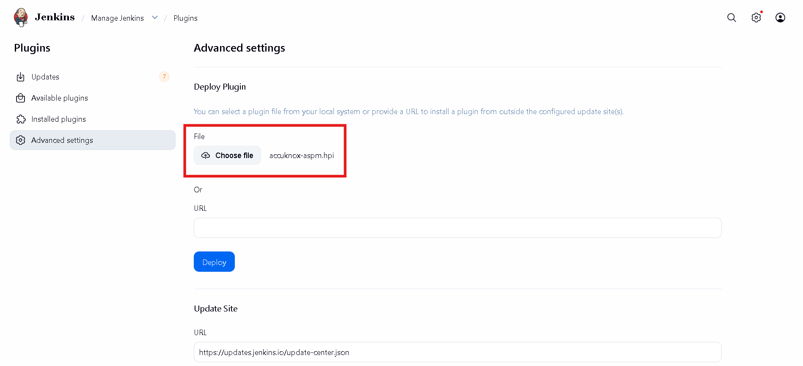
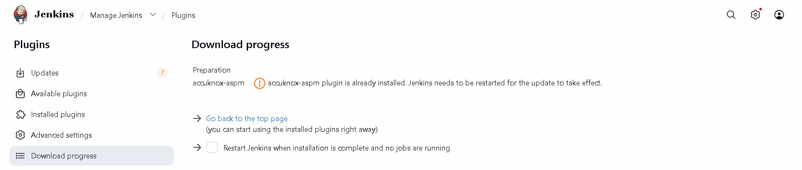
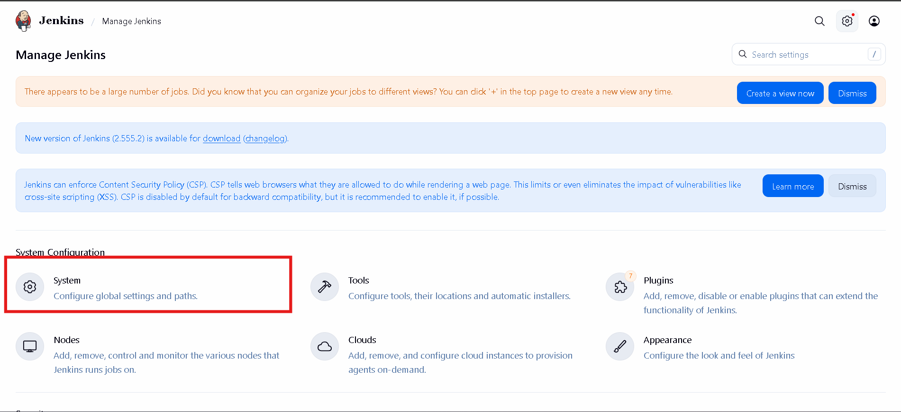
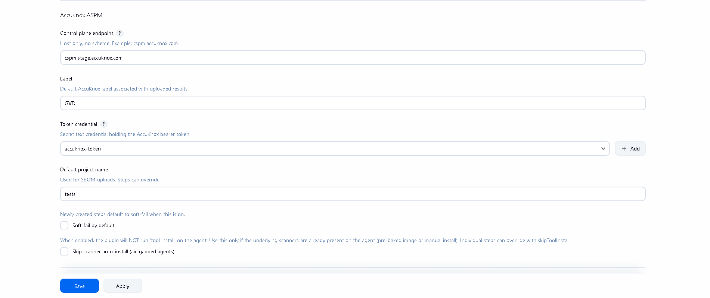
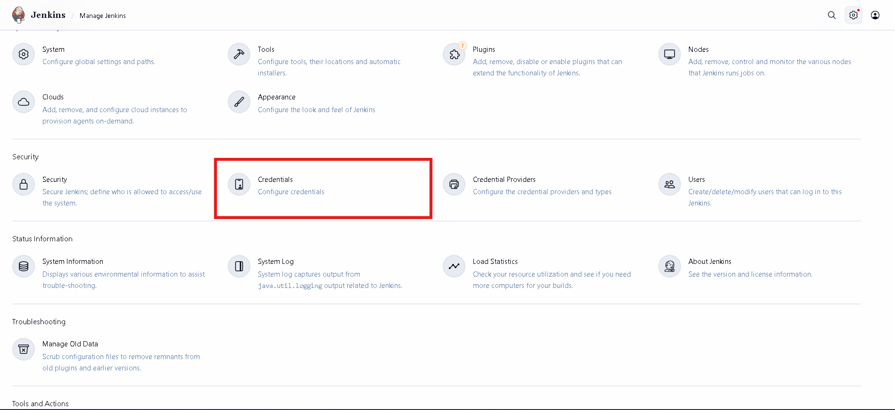
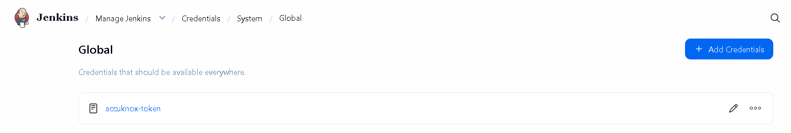

# Installing ASPM Jenkins Plugin

This page walks through the one-time installation and global configuration of the **AccuKnox ASPM Scanner** plugin in Jenkins. Once finished, every per-scan integration (SAST, IaC, Secret, Container, SBOM, SCA) can be wired up in just a few lines of Pipeline code.

## Prerequisites

- A Jenkins controller (`2.387.3 LTS` or newer) with at least one build agent.
- An AccuKnox SaaS account with a tenant / label you can upload findings to.
- Network egress from the Jenkins agent to the AccuKnox control plane (or a mirrored scanner image for air-gapped agents).
- Administrator access to Jenkins (`Manage Jenkins` / `Manage Plugins` / `System Configuration`).
- The built artifact `accuknox-aspm.hpi` (or the published plugin).
- Download `accuknox-aspm.hpi` from https://accuknox-onprem-artifacts.s3.us-east-2.amazonaws.com/accuknox-aspm.hpi if you do not already have the file.

## 1. Deploy the `.hpi` to Jenkins

1. Go to **Manage Jenkins → Plugins → Advanced settings** (top-right).
2. Under **Deploy Plugin**, click **Choose File** and pick `accuknox-aspm.hpi`.
3. Click **Deploy**, tick **Restart Jenkins when installation is complete**, and wait for Jenkins to come back up.
4. After restart, open **Manage Jenkins → Plugins → Installed** and confirm **AccuKnox ASPM Scanner** is listed.

*Figure 1. Manage Plugins, Advanced settings.*

*Figure 2. Uploading `accuknox-aspm.hpi`.*

## 2. Generate an AccuKnox API token

1. Log in to the AccuKnox SaaS console.
2. Navigate to **Settings → Tokens**.
3. Click **Create Token**, give it a descriptive name (e.g. `jenkins-ci`), and copy the bearer token shown once.

!!! warning "Copy the token immediately"
    The bearer token is shown only once. Store it somewhere safe before leaving the page.

For step-by-step screenshots, see [How to Create Tokens](../how-to/how-to-create-tokens.md).

## 3. Store the token as a Jenkins credential

1. Open **Manage Jenkins** and click **Credentials** under **Security**.
2. Select **System → Global credentials → Add Credentials**.
3. **Kind**: `Secret text`.
4. **Secret**: paste the AccuKnox bearer token from the previous step.
5. **ID**: use a memorable identifier such as `accuknox-token`. You will reference this from the global plugin config.
6. Click **Save**.

*Figure 3. Manage Jenkins → Security → Credentials.*

*Figure 4. Global credentials with `accuknox-token` added.*

## 4. Configure the plugin globally

Back on **Manage Jenkins**, open **System** (under **System Configuration**) and scroll to the **AccuKnox ASPM** section. Fill in the fields:

| Field | Example | Notes |
|------|------|------|
| Control plane endpoint | `cspm.accuknox.com` | Host only, no `https://` prefix. |
| Label | `your-tenant-label` | Becomes `label_id` on every upload. |
| Token credential | `accuknox-token` | ID of the credential created in step 3. |
| Default project name | *(optional)* | Used by image-SBOM uploads when not set per step. |
| Soft-fail by default | off | Leave unticked unless every step should default to advisory. |
| Skip scanner auto-install | off | Tick only for air-gapped agents. |

*Figure 5. Manage Jenkins → System Configuration → System.*

*Figure 6. AccuKnox ASPM global configuration filled in.*

## 5. (Optional) Create the SBOM project on AccuKnox

If you plan to use the `accuknoxSbom` step, the project name you pass must already exist on AccuKnox with classifier `container`. Create it from the AccuKnox console under **Projects → Add Project**.

## 6. Pick your scan

The plugin ships pipeline steps for every common scan type. Pick a guide:

- :material-code-tags-check: **[SAST](jenkins-sast.md)**

    Static Application Security Testing on source code.

- :material-shield-search: **[IaC Scan](jenkins-iac-scan.md)**

    Terraform, CloudFormation, Kubernetes, Helm, ARM, Dockerfile.

- :material-key-variant: **[Secret Scan](jenkins-secret-scan.md)**

    Walks full git history for committed secrets.

- :material-docker: **[Container Scan](jenkins-container-scan.md)**

    Pull and scan registry images for known CVEs.

- :material-file-tree: **[SBOM](jenkins-sbom.md)**

    Generate a CycloneDX SBOM for a container image.

- :material-package-variant: **[Multi-Artifact (SCA)](jenkins-artifact-scan.md)**

    Glob-scan jars, wheels, binaries, lockfiles.

## Next steps

You now have a working AccuKnox ASPM plugin on Jenkins. From any pipeline you can drop in a single `accuknox*` step and have results flow to the AccuKnox console for triage, ticketing, and verification.
