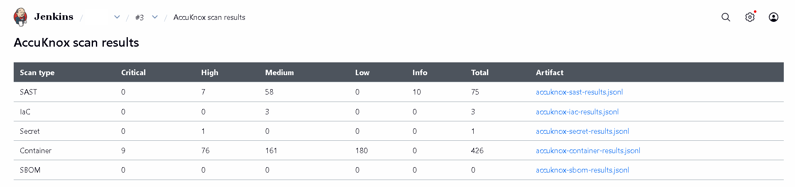

# Jenkins Integrations

The **AccuKnox ASPM Scanner** plugin wires AccuKnox security scans directly into Jenkins pipelines. Install the plugin once (download `accuknox-aspm.hpi` from https://accuknox-aspm.s3.us-east-2.amazonaws.com/accuknox-aspm.hpi), configure your token globally, then drop a single `accuknox*` pipeline step into any Jenkinsfile. All findings flow to the AccuKnox console for triage, ticketing, and verification.

::cards:: cols=3

- title: Installation
  content: One-time plugin install and global config.
  image: ./cicd-icons/jenkins.png
  url: /integrations/jenkins-installation/
- title: SAST
  content: Static Application Security Testing on source code.
  image: ./cicd-icons/sast.svg
  url: /integrations/jenkins-sast/
- title: IaC Scan
  content: Terraform, CloudFormation, Kubernetes, Helm, ARM.
  image: ./cicd-icons/iac.svg
  url: /integrations/jenkins-iac-scan/
- title: Secret Scan
  content: Walks full git history for committed secrets.
  image: ./cicd-icons/secret-scan.svg
  url: /integrations/jenkins-secret-scan/
- title: Container Scan
  content: Pull and scan registry images for known CVEs.
  image: ./cicd-icons/container.svg
  url: /integrations/jenkins-container-scan/
- title: SBOM
  content: Generate a CycloneDX SBOM for a container image.
  image: ./cicd-icons/aspm-container-scan.svg
  url: /integrations/jenkins-sbom/
- title: Multi-Artifact (SCA)
  content: Glob-scan jars, wheels, binaries, lockfiles.
  image: ./cicd-icons/sast.svg
  url: /integrations/jenkins-artifact-scan/

::/cards::
