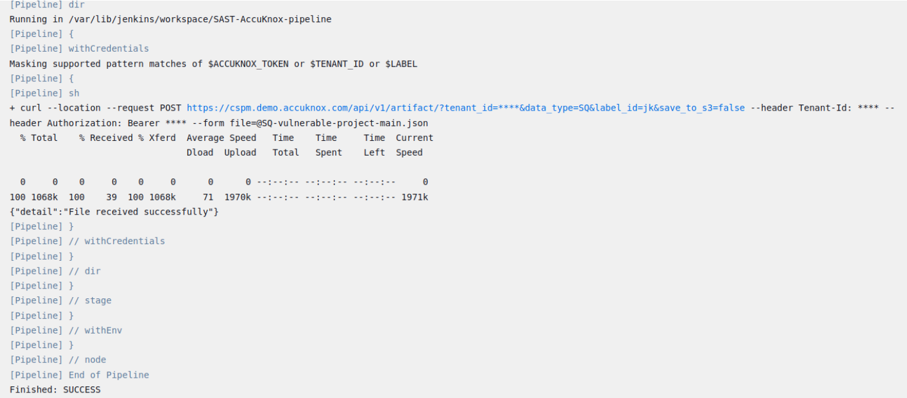
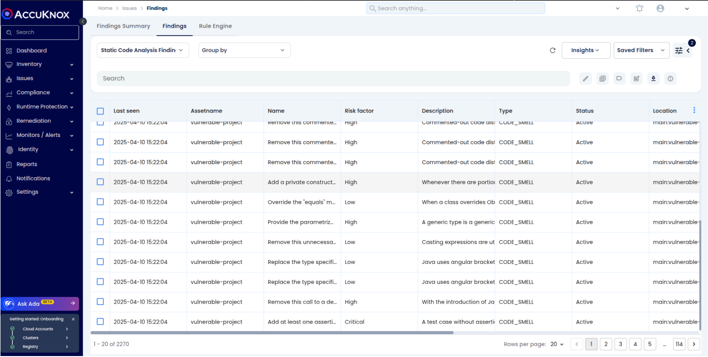

# SonarQube and Jenkins Integration

This document provides instructions for integrating SonarQube with Jenkins and AccuKnox. Refer to [this documentation](https://docs.sonarsource.com/sonarqube-server/10.6/analyzing-source-code/ci-integration/jenkins-integration/global-setup/) for SonarQube <> Jenkins integration.

## Prerequisites

### From AccuKnox Console:

- **Label**: [Label Creation](https://help.accuknox.com/how-to/how-to-create-labels/?h=label)
- **Tenant**: [Tenant](https://help.accuknox.com/how-to/how-to-create-tokens/?h=token)
- **Token**: [Token Creation](https://help.accuknox.com/how-to/how-to-create-tokens/?h=token)
- **User Token**: [Token Creation](https://docs.sonarsource.com/sonarqube-server/10.1/user-guide/user-account/generating-and-using-tokens/)

### From SonarQube:

- Required credentials for integration.

> **Note**: Store the above values in the Jenkins credentials manager.

---

## Jenkins Pipeline Script

Add the following lines after the SonarQube analysis stage in the Jenkins pipeline script. These steps are required to fetch results from SonarQube and send them from the Jenkins VM to the AccuKnox Console.

> **Note**: Update the `credentialsId` according to the ID you have created for your use.

### Example: AccuKnox SAST Job Stage

```groovy
stage('Run AccuKnox-sastjob') {
    steps {
        dir(WORKSPACE_DIR) {
            withCredentials([string(credentialsId: 'sonarqube', variable: 'SQ_AUTH_TOKEN')]) {
                sh '''
                docker run --rm \
                -e SQ_URL=https://sq.accuknox.com/ \
                -e SQ_AUTH_TOKEN=$SQ_AUTH_TOKEN \
                -e REPORT_PATH=/app/data/ \
                -e SQ_PROJECTS=^vulnerable-project$ \
                -v $PWD:/app/data/ \
                accuknox/sastjob:1.0
                '''
            }
        }
    }
}
```

---

### Example: Pushing Results to AccuKnox

```groovy
stage('Pushing results to AccuKnox') {
    steps {
        dir(WORKSPACE_DIR) {
            withCredentials([
                string(credentialsId: 'accuknox-token', variable: 'ACCUKNOX_TOKEN'),
                string(credentialsId: 'tenant-id', variable: 'TENANT_ID'),
                string(credentialsId: 'label', variable: 'LABEL')
            ]) {
                sh '''
                for file in SQ-*.json; do
                    curl --location --request POST \
                    "https://cspm.demo.accuknox.com/api/v1/artifact/?tenant_id=$TENANT_ID&data_type=SQ&label_id=$LABEL&save_to_s3=false" \
                    --header "Tenant-Id: $TENANT_ID" \
                    --header "Authorization: Bearer $ACCUKNOX_TOKEN" \
                    --form "file=@$file"
                done
                '''
            }
        }
    }
}
```

### Details of AccuKnox-sastjob stage in Jenkins

```sh
rm -f SQ-*.json # Remove existing reports
docker run --rm -it \
-e SQ_URL=http://35.188.10.229:9000 \
-e SQ_AUTH_TOKEN=<AUTH-TOKEN> \
-e SQ_PROJECTS="^nimbus$" \
-e SQ_ORG="accuknox" /* needed for sonarcloud.io */ \
-e REPORT_PATH=/app/data/ \
-v $PWD:/app/data/ \
accuknox/sastjob:1.0.3
```

This will create a bunch of SQ-\*.json files, one for every project/component found in the SonarQube server.

---

## Configuration Details

| Variable        | Sample Value                | Description                         |
| --------------- | --------------------------- | ----------------------------------- |
| `SQ_URL`        | `http://35.188.10.229:9000`, `https://sonarcloud.io/` | SonarQube server URL                |
| `SQ_AUTH_TOKEN` | `squ_token`                 | SonarQube user authentication token |
| `SQ_PROJECTS`   | `^nimbus$`                  | Projects/components to scan         |
| `SQ_ORG`        | `accuknox`                  | Required for SonarCloud enterprise  |
| `REPORT_PATH`   | `/app/data/`                | Path to store the report JSON files |

> **Note**: Variables marked with `*` are mandatory configuration options.

---

## Complete Jenkins Pipeline Script Example

Repository used for testing: [GitHub Repository](https://github.com/udit-uniyal/Devops)
Branch: `main`

```groovy
pipeline {
    agent any
    environment {
        MAVEN_HOME = "${WORKSPACE}/apache-maven-3.9.4"
        WORKSPACE_DIR = "${WORKSPACE}"
        PROJECT_DIR = "${WORKSPACE}/addressbook/addressbook_main"
    }
    stages {
        stage('CHECKOUT') {
            steps {
                checkout scmGit(
                    branches: [[name: '*/main']],
                    extensions: [],
                    userRemoteConfigs: [[url: 'https://github.com/udit-uniyal/Devops.git']]
                )
            }
        }

        stage('Install Maven Build Tool') {
            steps {
                dir(WORKSPACE_DIR) {
                    sh '''
                    wget https://dlcdn.apache.org/maven/maven-3/3.9.4/binaries/apache-maven-3.9.4-bin.tar.gz
                    tar -xzvf apache-maven-3.9.4-bin.tar.gz
                    '''
                }
            }
        }

        stage('Compile Application') {
            steps {
                dir(PROJECT_DIR) {
                    sh '${MAVEN_HOME}/bin/mvn compile'
                }
            }
        }

        stage('Test Application') {
            steps {
                dir(PROJECT_DIR) {
                    sh '${MAVEN_HOME}/bin/mvn test'
                }
            }
        }

        stage('SonarQube Analysis') {
            steps {
                dir(PROJECT_DIR) {
                    withSonarQubeEnv('Sonarqube') {
                        sh '${MAVEN_HOME}/bin/mvn clean verify sonar:sonar -Dsonar.projectKey=vulnerable-project'
                    }
                }
            }
        }

        stage('Run AccuKnox-sastjob') {
            steps {
                dir(WORKSPACE_DIR) {
                    withCredentials([string(credentialsId: 'sonarqube', variable: 'SQ_AUTH_TOKEN')]) {
                        sh '''
                        docker run --rm \
                        -e SQ_URL=https://sq.accuknox.com/ \
                        -e SQ_AUTH_TOKEN=$SQ_AUTH_TOKEN \
                        -e REPORT_PATH=/app/data/ \
                        -e SQ_PROJECTS=^vulnerable-project$ \
                        -v $PWD:/app/data/ \
                        accuknox/sastjob:1.0
                        '''
                    }
                }
            }
        }

        stage('Pushing results to AccuKnox') {
            steps {
                dir(WORKSPACE_DIR) {
                    withCredentials([
                        string(credentialsId: 'accuknox-token', variable: 'ACCUKNOX_TOKEN'),
                        string(credentialsId: 'tenant-id', variable: 'TENANT_ID'),
                        string(credentialsId: 'label', variable: 'LABEL')
                    ]) {
                        sh '''
                        for file in SQ-*.json; do
                            curl --location --request POST \
                            "https://cspm.demo.accuknox.com/api/v1/artifact/?tenant_id=$TENANT_ID&data_type=SQ&label_id=$LABEL&save_to_s3=false" \
                            --header "Tenant-Id: $TENANT_ID" \
                            --header "Authorization: Bearer $ACCUKNOX_TOKEN" \
                            --form "file=@$file"
                        done
                        '''
                    }
                }
            }
        }
    }
}
```



---

## Viewing Findings in AccuKnox Console

Navigate to **Issues > Findings > Findings** in the AccuKnox Console to view the results.


