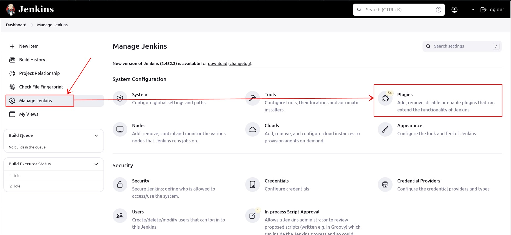
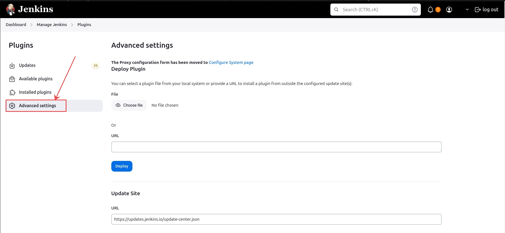
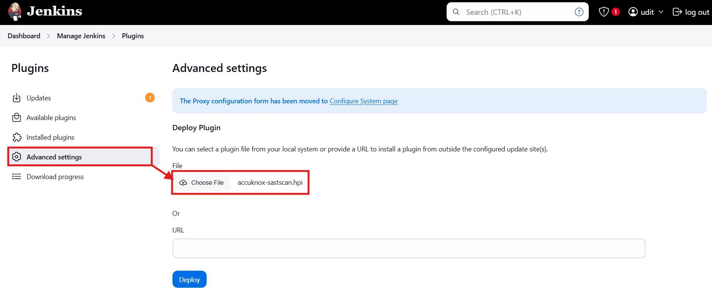
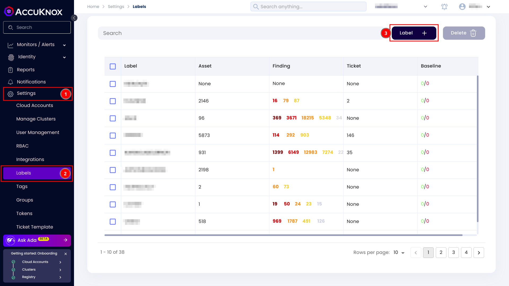
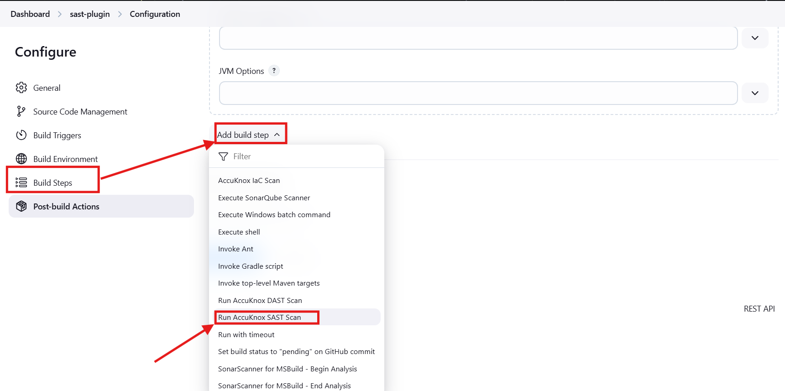
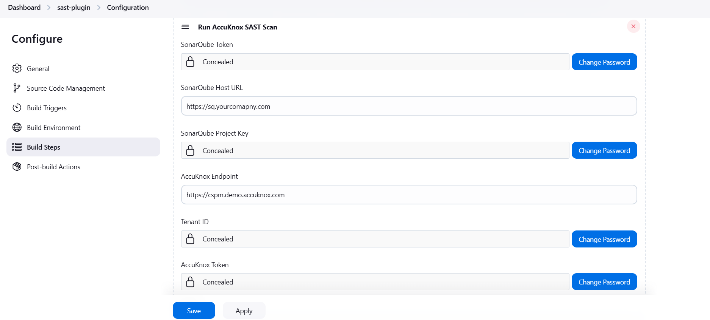
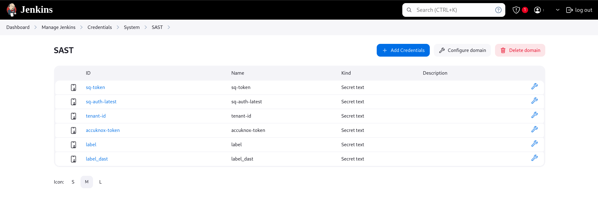
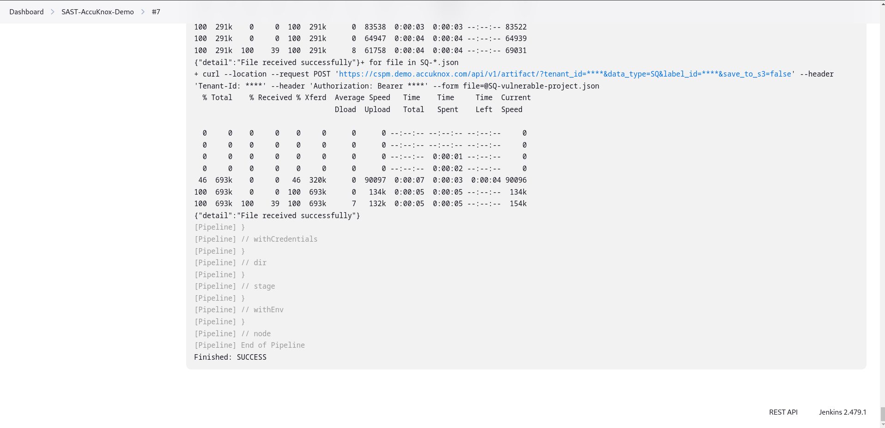
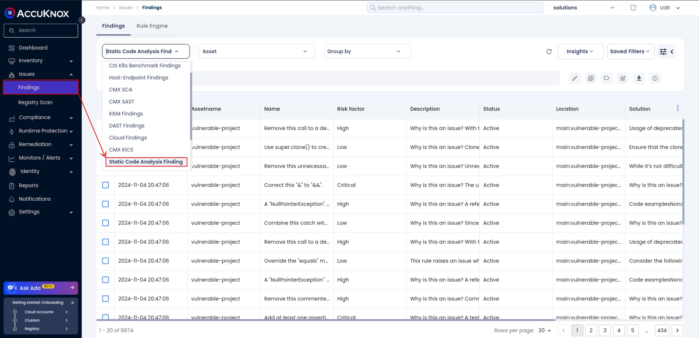
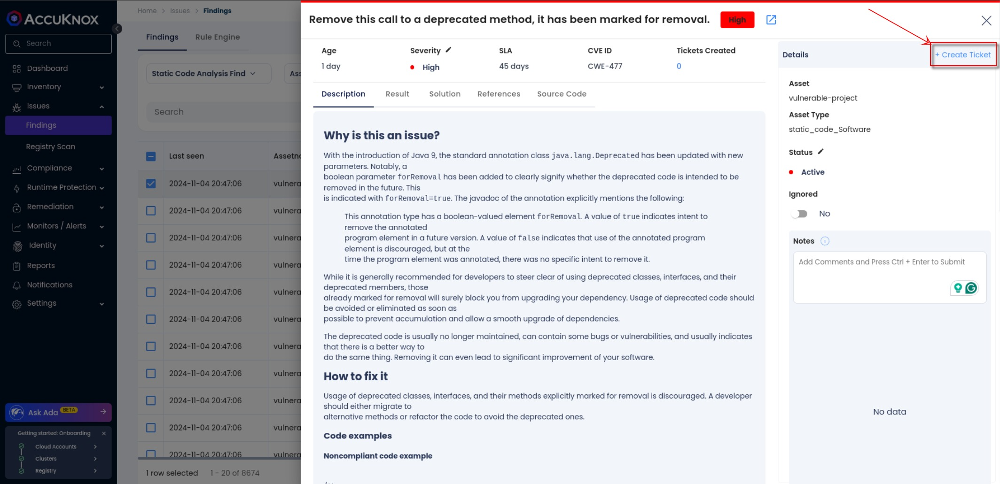

# Jenkins SAST

By integrating AccuKnox SAST with Jenkins, you can identify and resolve security vulnerabilities proactively during the CI/CD process. This guide provides step-by-step instructions for configuring the integration.

## **Prerequisites**

- **AccuKnox Account:** Ensure you have access to the AccuKnox UI.

- **Jenkins Access:** Ensure Jenkins is installed and configured.

- **SonarQube Access:** Access to SonarQube for scanning.

### **Step 1: Generate AccuKnox API Token**

1. Log into your AccuKnox account.

2. Go to **Settings > Tokens** and click on the **Create** button.


3. Provide a name for the token and click **Generate**.


4. Copy the generated token and the **Tenant ID**.


### **Step 2: Create a Label in AccuKnox**

Labels in AccuKnox help group similar findings together.

1. Navigate to **Settings > Labels** and click **Create Label**.


2. Save the label and note it down.

### **Step 3: Generate SonarQube Token**

1. In SonarQube, Under Administrator > Security > Generate Tokens.

2. Generate user token and copy it.


### **Step 4: Configure Secrets in Jenkins**

1. Go to **Jenkins > Manage Jenkins > Manage Credentials**.


2. Add the following credentials as secrets:

    - **TENANT_ID:** Your AccuKnox tenant ID.

    - **ACCUKNOX_TOKEN:** The AccuKnox API token was created from AccuKnox SaaS.

    - **LABEL:** The label name was created in AccuKnox.

    - **SQ_AUTH_TOKEN:** SonarQube token.


### **Step 5: Configure Jenkins Pipeline**

Create a Jenkins pipeline with the following stages to run a SAST scan and upload findings to AccuKnox.

```groovy
pipeline {
    agent any
    environment {
        MAVEN_HOME = '/var/lib/jenkins/workspace/SAST-AccuKnox-Demo/apache-maven-3.9.4'
        WORKSPACE_DIR = '/var/lib/jenkins/workspace/SAST-AccuKnox-Demo'
        PROJECT_DIR = "$WORKSPACE_DIR/addressbook/addressbook_main"
    }
    stages {
        stage('CHECKOUT') {
            steps {
                checkout scmGit(branches: [[name: '*/main']], extensions: [], userRemoteConfigs: [[url: '<https://github.com/udit-uniyal/Devops.git']])>
            }
        }
        stage('Install Maven Build Tool') {
            steps {
                sh 'wget <https://dlcdn.apache.org/maven/maven-3/3.9.4/binaries/apache-maven-3.9.4-bin.tar.gz'>
                sh 'tar -xzvf $WORKSPACE_DIR/apache-maven-3.9.4-bin.tar.gz'
            }
        }
        stage('Compile Application') {
            steps {
                dir(PROJECT_DIR) {
                    sh '$MAVEN_HOME/bin/mvn compile'
                }
            }
        }
        stage('Test Application') {
            steps {
                dir(PROJECT_DIR) {
                    sh '$MAVEN_HOME/bin/mvn test'
                }
            }
        }
        stage('SonarQube Analysis') {
            steps {
                dir(PROJECT_DIR) {
                    withSonarQubeEnv(credentialsId: 'sq-auth-latest', installationName: 'sonarqube-scan') {
                        sh "$MAVEN_HOME/bin/mvn clean verify sonar:sonar -Dsonar.projectKey=vulnerable-project"
                    }
                }
            }
        }
        stage('Run Docker Container') {
            steps {
                dir(WORKSPACE_DIR) {
                    withCredentials([string(credentialsId: 'sq-token', variable: 'SQ_AUTH_TOKEN')]) {
                        sh '''
                            docker run --rm \
                              -e SQ_URL=<https://sq.accuknox.com/> \
                              -e SQ_AUTH_TOKEN=$SQ_AUTH_TOKEN \
                              -e REPORT_PATH=/app/data/ \
                              -e SQ_PROJECTS="^vulnerable-project$" \
                              -v $PWD:/app/data/ \
                             accuknox/sastjob:latest
                        '''
                    }
                }
            }
        }
        stage('Pushing results to AccuKnox') {
            steps {
                dir(WORKSPACE_DIR) {
                    withCredentials([
                        string(credentialsId: 'accuknox-token', variable: 'ACCUKNOX_TOKEN'),
                        string(credentialsId: 'tenant-id', variable: 'TENANT_ID'),
                        string(credentialsId: 'label', variable: 'LABEL')
                    ]) {
                        sh '''
                            for file in SQ-*.json; do
                                curl --location --request POST "<https://cspm.demo.accuknox.com/api/v1/artifact/?tenant_id=$TENANT_ID&data_type=SQ&label_id=$LABEL&save_to_s3=false>" \
                                     --header "Tenant-Id: $TENANT_ID" \
                                     --header "Authorization: Bearer $ACCUKNOX_TOKEN" \
                                     --form "file=@$file"
                            done
                        '''
                    }
                }
            }
        }
    }
}
```

### **Pipeline Explanation**

- **CHECKOUT**: Fetches code from the Git repository.

- **Install Maven Build Tool**: Installs Maven for building the project.

- **Compile Application**: Compiles the application source code.

- **Test Application**: Runs tests on the application code.

- **SonarQube Analysis**: Analyzes the code with SonarQube.

- **Pushing results to AccuKnox**: Uploads SAST findings to AccuKnox.

**Jenkins console output after successful execution:**


### **Step 6: View Findings in AccuKnox**

1. Go to **AccuKnox > Issues > Findings**.

2. Select **Static Code Analysis Findings** to see your results.


3. Click on a finding for more details and use the **Create Ticket** button to create a ticket.

