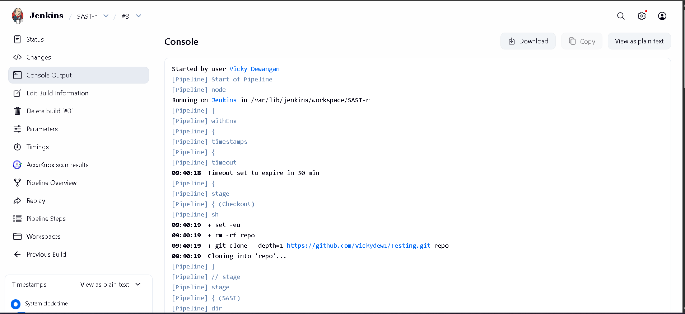
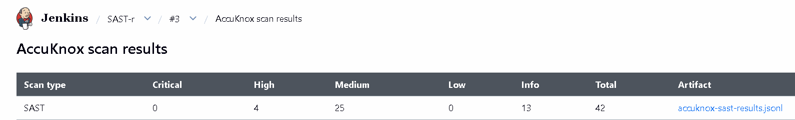

# Integrating SAST in Jenkins

This guide walks through configuring a Jenkins pipeline that uses the **AccuKnox ASPM Scanner** plugin to perform Static Application Security Testing (SAST). Findings are produced on the agent and automatically forwarded to AccuKnox for centralized triage.

## Prerequisites

- A Jenkins controller (`2.387.3 LTS` or newer) with at least one build agent.
- An AccuKnox SaaS account with a label you can upload findings to.
- Network egress from the Jenkins agent to the AccuKnox control plane (or a mirrored scanner image for air-gapped agents).

## Step 1: Install the AccuKnox ASPM Plugin

Install `accuknox-aspm.hpi` via **Manage Jenkins → Plugins → Advanced**. See [Installing the AccuKnox ASPM Jenkins Plugin](jenkins-install.md) for the full walk-through with screenshots.

## Step 2: Configure Jenkins credentials and global settings

- Store your AccuKnox bearer token as a Jenkins **Secret text** credential.
- Under **Manage Jenkins → System → AccuKnox ASPM**, set the control-plane endpoint, label, and select the token credential.

## Step 3: Define the Jenkins Pipeline

Create a Pipeline job and paste the snippet below as the script.

!!! info "Git metadata is auto-detected"
    The `accuknoxSast` step auto-detects the git remote URL, the commit SHA, and the branch from the workspace. You only need to set them explicitly if your checkout isn't a real git tree.

```groovy
// AccuKnox SAST scan, standalone Jenkinsfile.
//
// Clones a repo, runs accuknoxSast inside it, uploads to AccuKnox.
// Git remote URL / branch / commit SHA are auto-detected from the workspace.
// You only need to set them explicitly if your checkout isn't a real git tree.

pipeline {
  agent any

  parameters {
    string(
      name: 'REPO_URL',
      defaultValue: 'https://github.com/Vickydew1/Testing.git',
      description: 'Git repo to clone and scan (https URL, public or with embedded token)'
    )
    string(
      name: 'TARGET',
      defaultValue: '.',
      description: 'Path inside the repo to scan'
    )
    string(
      name: 'SEVERITY_THRESHOLD',
      defaultValue: 'HIGH,CRITICAL',
      description: 'Comma-separated severities that fail the build (e.g. CRITICAL, HIGH,CRITICAL).'
    )
    booleanParam(
      name: 'SOFT_FAIL',
      defaultValue: true,
      description: 'true (default) = run and upload, build stays green; false = fail build on matching severities.'
    )
  }

  options {
    timestamps()
    timeout(time: 30, unit: 'MINUTES')
    disableConcurrentBuilds()
  }

  environment {
    REPO_URL = "${params.REPO_URL}"
  }

  stages {
    stage('Checkout') {
      steps {
        sh '''
          set -eu
          rm -rf repo
          git clone --depth=1 "$REPO_URL" repo
        '''
      }
    }

    stage('SAST') {
      steps {
        dir('repo') {
          accuknoxSast(
            target: params.TARGET,
            severityThreshold: params.SEVERITY_THRESHOLD,
            softFail: params.SOFT_FAIL
          )
        }
      }
    }
  }
}
```

## Pipeline inputs

=== "Step parameters"

    | Parameter | Description | Required | Default |
    |------|------|------|------|
    | `target` | Path inside the workspace to scan. | no | `.` |
    | `severityThreshold` | CSV of severities that fail the build. | no | `HIGH,CRITICAL` |
    | `softFail` | `true` = advisory only; `false` = fail build on matching severities. | no | `false` |
    | `aiAnalysis` | Enable AccuKnox AI (codeassure) analysis on selected severities. | no | `false` |
    | `repoUrl` / `commitSha` / `commitRef` | Override auto-detected git metadata. | no | *(auto-detected)* |

=== "Common knobs"

    Every `accuknox*` step accepts these:

    | Parameter | Default | Notes |
    |------|------|------|
    | `endpoint` | from global config | Control-plane host (no scheme). Per-step override. |
    | `label` | from global config | Becomes the `label_id` on the upload. |
    | `credentialsId` | from global config | Jenkins credential ID holding the AccuKnox bearer token. |
    | `skipUpload` | `false` | Run the scanner but don't upload. Useful for dry runs. |
    | `keepResults` | `true` | Keep results JSON on the agent and archive it as a build artifact. |
    | `containerMode` | `false` | Run the scanner inside Docker on the agent. |
    | `cliPath` | `auto` | Path to a pre-staged `accuknox-aspm-scanner` binary (air-gapped use). |

## Without AccuKnox vs With AccuKnox

=== "Without AccuKnox"

    A raw SAST scan runs on the agent and produces a JSON report. Reviewing that report is a manual step. Engineers have to copy it out of the build artifacts and inspect it locally.

=== "With AccuKnox"

    The plugin uploads the same report to your AccuKnox tenant, where findings are normalized, deduplicated, ticketed, and tracked across builds. Soft-fail / hard-fail gating is enforced from the same step.

*Figure 1. SAST findings on the AccuKnox console.*


*Figure 2. Drilling into a single SAST finding.*


## Viewing Results in AccuKnox

Once the Jenkins job uploads its report, the findings are available in the AccuKnox SaaS console.

1. Log in to the AccuKnox console and switch to the tenant whose label you configured in Jenkins.
2. Open **Issues → Findings**, and filter by **SAST**.
3. Click any finding to inspect the file, line, CWE, and the recommended remediation.
4. Use the **ASK AI** button on a finding for an LLM-generated explanation and patch suggestion.
5. Create a ticket directly from the finding to track remediation.
6. Re-run the Jenkins job after fixing the issue. The finding flips to **Resolved** on the next ingest.

## Conclusion

Wiring SAST into Jenkins via the AccuKnox ASPM plugin gives you continuous, automated detection of issues on every build, with a single pane of glass in the AccuKnox console for triage, ticketing, and verification. Combine it with the other scan types ([IaC](jenkins-iac-scan.md), [Secret](jenkins-secret-scan.md), [Container](jenkins-container-scan.md), [SBOM](jenkins-sbom.md), [SCA](jenkins-artifact-scan.md)) to get full-coverage ASPM directly from your pipelines.
