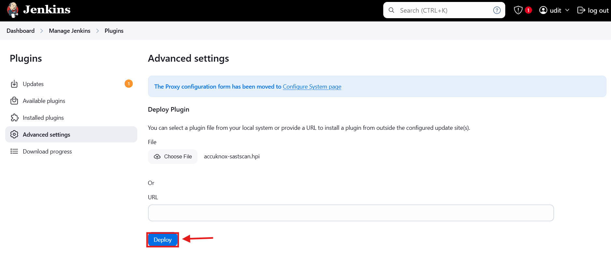
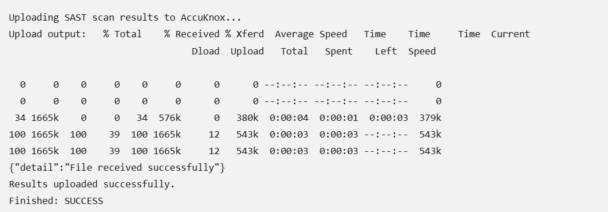

# Jenkins SAST

The **AccuKnox SAST Jenkins Plugin** simplifies integrating SonarQube-based Static Application Security Testing (SAST) with Jenkins pipelines. This plugin facilitates fetching project-specific reports from SonarQube and sending the results to AccuKnox SaaS for centralized investigation and analysis.

## Key Features

- **Fetch SonarQube Reports**: Retrieve detailed SAST reports for specific projects from SonarQube within Jenkins.

- **Seamless Integration with AccuKnox**: Upload fetched results to AccuKnox SaaS, a centralized dashboard for SAST, DAST, and other findings.

- **Customizable Build Parameters**: Define parameters such as SonarQube URL, project keys, and AccuKnox tokens.

## Installation

1. Download the plugin in `.hpi` format from [here](https://drive.google.com/file/d/1-GfUr_8Llv9izr1Vx4zW8CPw0-gg1IRm/view?usp=sharing "https://drive.google.com/file/d/1-GfUr_8Llv9izr1Vx4zW8CPw0-gg1IRm/view?usp=sharing").

2. Navigate to the Jenkins dashboard.

3. Go to **Manage Jenkins > Manage Plugins**.
   

4. In the **Advanced** tab, click **Choose File** and select the downloaded `.hpi` file.
   


5. Click **Deploy** to install the plugin.
   

6. Restart Jenkins if required.

## Configuration

### Job Configuration

1. Open the configuration page of your Jenkins job.

2. Under the **Build** section, click on **Add build step** and select **Run AccuKnox SAST Scan**.


### Plugin Parameters

The plugin provides the following configuration options:

- **SonarQube Token**: The authentication token for SonarQube.

- **SonarQube Host URL**: The URL of your SonarQube server.

- **SonarQube Project Key**: The key for the SonarQube project to scan.

- **AccuKnox Endpoint**: The AccuKnox API endpoint.

- **Tenant ID**: The tenant ID associated with your AccuKnox account.

- **AccuKnox Token**: The access token used to authenticate with AccuKnox.

- **Label**: A label for the scan to associate the scan results with a particular context or feature.

#### Example Configuration

```
SonarQube Token: my-sonar-token
SonarQube Host URL: https://sonarqube.example.com
SonarQube Project Key: example-project
AccuKnox Endpoint: https://api.accuknox.com
Tenant ID: my-tenant-id
AccuKnox Token: my-accuknox-token
Label: build-123
```


### Token Generation for AccuKnox

To generate the **AccuKnox Token** and obtain the **Tenant ID**:

1. Log in to AccuKnox.

2. Navigate to **Settings** > **Tokens** and create an AccuKnox token.

3. Copy the generated token and store it securely for later use. For detailed steps, refer to [How to Create Tokens](https://help.accuknox.com/how-to/how-to-create-tokens/ "https://help.accuknox.com/how-to/how-to-create-tokens/").

## Running the Scan

Once configured, when you run the Jenkins job, the plugin will:

1. Validate the provided **SonarQube Token** and **SonarQube Host URL**.

2. Fetch the results from sonarqube using the specified project key.

3. Upload the results to AccuKnox SaaS for further processing and visibility.

### Sample Console Output



## Troubleshooting

### 1. **Missing SonarQube Token or Host URL**

- Ensure both the **SonarQube Token** and **SonarQube Host URL** are provided in the Jenkins job configuration.

- Verify the accuracy of the provided credentials.

### 2. **Scan Failure**

- Check the Jenkins console output for error details.

- Ensure the SonarQube server is reachable from Jenkins and the project key is correct.

### 3. **Upload Failure**

- Verify network connectivity to the AccuKnox SaaS endpoint.

- Double-check the **Tenant ID** and **AccuKnox Token** to ensure they are accurate.

- Ensure the scan results are generated properly before attempting to upload.

## SonarQube Setup

Before running the **AccuKnox SAST Jenkins Plugin**, ensure your SonarQube is correctly configured. Follow the instructions from the [SonarQube Jenkins integration documentation](https://docs.sonarsource.com/sonarqube-server/9.7/analyzing-source-code/scanners/jenkins-extension-sonarqube/ "https://docs.sonarsource.com/sonarqube-server/9.7/analyzing-source-code/scanners/jenkins-extension-sonarqube/") for setting up SonarQube in Jenkins. This includes:

1. Installing the SonarQube Scanner Plugin for Jenkins.

2. Configuring SonarQube server details in **Manage Jenkins > Configure System**.

3. Adding the **SonarQube Scanner** as a build step in your Jenkins pipeline.

## Conclusion

Once the **AccuKnox SAST Jenkins Plugin** is set up, it seamlessly integrates SonarQube scans into Jenkins pipelines and sends the results to AccuKnox SaaS for centralized management. This ensures that security issues are captured and addressed during the CI/CD pipeline, enhancing the security posture of your application.
