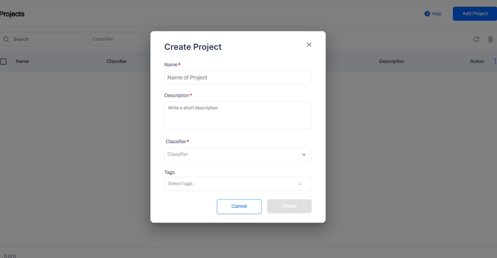
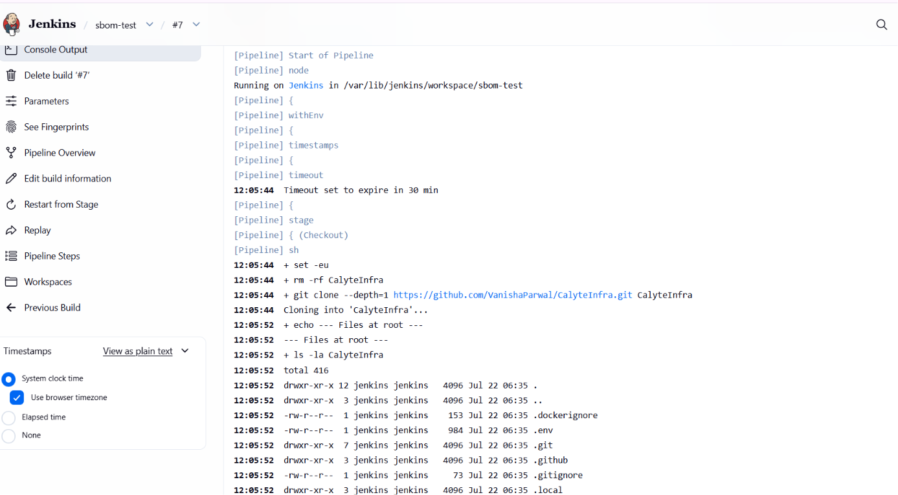
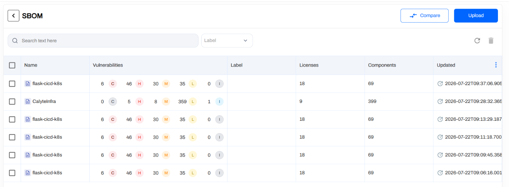

# Generating Filesystem SBOMs in Jenkins

This guide adds an SBOM (Software Bill of Materials) stage to a Jenkins pipeline using the **AccuKnox ASPM Scanner** plugin. A CycloneDX SBOM is generated from a Git repository's filesystem and uploaded to AccuKnox under a named project.

## Prerequisites

- A Jenkins controller (`2.387.3 LTS` or newer) with at least one build agent.
- An AccuKnox SaaS account with a tenant / label you can upload findings to.
- Network egress from the Jenkins agent to the AccuKnox control plane (or a mirrored scanner image for air-gapped agents).
- An AccuKnox project pre-created with classifier `application`. The SBOM upload fails otherwise.

## Step 1: Install the AccuKnox ASPM Plugin

See [Installing the AccuKnox ASPM Jenkins Plugin](jenkins-installation.md) for the one-time plugin installation steps.

## Step 2: Configure Jenkins and pre-create the SBOM project

- Store the AccuKnox token as a Jenkins **Secret text** credential.
- Set the endpoint, label, and token credential on the global config.
- On the AccuKnox console, go to **Projects → Add Project** and create the project name you plan to pass as `projectName`, with classifier `application`.



## Step 3: Define the Jenkins Pipeline

```groovy
// AccuKnox filesystem SBOM generation, standalone Jenkinsfile.
//
// Clones a Git repo, generates a CycloneDX SBOM from its filesystem, and
// uploads it to AccuKnox. PROJECT_NAME is what the SBOM is attached to in
// the AccuKnox UI.

pipeline {
  agent any

  parameters {
    string(name: 'REPO_URL',
           defaultValue: 'https://github.com/YOUR_USER/YOUR_REPO.git',
           description: 'Git repo to clone and SBOM.')

    booleanParam(name: 'REPO_IS_PRIVATE',
                 defaultValue: false,
                 description: 'Tick if the repo is private.')

    string(name: 'REPO_BRANCH',
           defaultValue: 'main',
           description: 'Branch to clone.')

    string(name: 'PROJECT_NAME',
           defaultValue: 'SBOM',
           description: 'AccuKnox project to receive the SBOM.')

    string(name: 'ENDPOINT',
           defaultValue: 'cspm.accuknox.com',
           description: 'AccuKnox control plane host, no scheme.')

    string(name: 'LABEL',
           defaultValue: 'jenkins-sbom',
           description: 'Label to tag the SBOM.')

    string(name: 'ACCUKNOX_CREDENTIAL',
           defaultValue: 'ACCUKNOX_TOKEN',
           description: 'Jenkins credential ID for AccuKnox token.')

    string(name: 'GITHUB_CREDENTIAL',
           defaultValue: 'github_creds',
           description: 'Jenkins credential ID for GitHub PAT.')
  }

  options {
    timestamps()
    timeout(time: 30, unit: 'MINUTES')
    disableConcurrentBuilds()
  }

  environment {
    REPO_DIR = "${params.REPO_URL.tokenize('/').last() - '.git'}"
  }

  stages {
    stage('Checkout - public repo') {
      when { expression { !params.REPO_IS_PRIVATE } }
      steps {
        sh """
          set -eu
          rm -rf "${env.REPO_DIR}"
          git clone --depth=1 --branch "${params.REPO_BRANCH}" "${params.REPO_URL}" "${env.REPO_DIR}"
        """
      }
    }

    stage('Checkout - private repo') {
      when { expression { params.REPO_IS_PRIVATE } }
      steps {
        script { sh "rm -rf ${env.REPO_DIR}" }
        dir(env.REPO_DIR) {
          git branch: params.REPO_BRANCH,
              url: params.REPO_URL,
              credentialsId: params.GITHUB_CREDENTIAL
        }
      }
    }

    stage('SBOM') {
      steps {
        dir(env.REPO_DIR) {
          knoxctlSbom(path: '.',
                      projectName: params.PROJECT_NAME,
                      endpoint: params.ENDPOINT,
                      label: params.LABEL,
                      credentialsId: params.ACCUKNOX_CREDENTIAL)
        }
      }
    }
  }
}
```

## Pipeline inputs

Every parameter, its default value, and whether you need to change it before running.

| Parameter | Default | Change | Notes |
|------|------|------|------|
| `REPO_URL` | `https://github.com/YOUR_USER/YOUR_REPO.git` | Yes, always | Set to the Git repo you want to scan. |
| `REPO_IS_PRIVATE` | `false` | Only if private | Tick when scanning a private repo, uses `GITHUB_CREDENTIAL`. |
| `REPO_BRANCH` | `main` | Only if different | Change to `master` or your actual branch if not `main`. |
| `PROJECT_NAME` | `SBOM` | Only if named differently | Must match the project you created in AccuKnox. |
| `ENDPOINT` | `cspm.accuknox.com` | If on different tenant | Use `cspm.demo.accuknox.com`, `cspm.stag.accuknox.com`, or your customer subdomain. |
| `LABEL` | `jenkins-sbom` | Only if named differently | Must match the label you created in AccuKnox. |
| `ACCUKNOX_CREDENTIAL` | `ACCUKNOX_TOKEN` | Only if named differently | Case-sensitive, must match Jenkins credential ID exactly. |
| `GITHUB_CREDENTIAL` | `github_creds` | Only if private + named differently | Used only when `REPO_IS_PRIVATE=true`. |

## Without AccuKnox vs With AccuKnox

=== "Without AccuKnox"

    An SBOM JSON file is left on the agent. Asset inventory and vulnerability matching are someone else's problem.

=== "With AccuKnox"

    The CycloneDX SBOM is shipped to AccuKnox and attached to the named project, where it powers asset inventory, supply-chain queries, and the runtime correlation views.

*Figure 1. SBOM attached to a project on AccuKnox.*


## Viewing Results in AccuKnox

Once the Jenkins job uploads its SBOM, the project view is updated in the AccuKnox SaaS console.

1. Log in to the AccuKnox console and switch to the tenant whose label you configured in Jenkins.
2. Open **Projects** and pick the project name you passed as `projectName`.
3. Inspect the components, licenses, and supply-chain graph attached to the SBOM.
4. Cross-reference components with CVEs via the asset inventory.
5. Re-run the Jenkins job whenever the repo changes. The latest SBOM replaces the previous one on the project.



## Conclusion

Wiring filesystem SBOM generation into Jenkins via the AccuKnox ASPM plugin gives you continuous, automated supply-chain visibility on every build, straight from your repository's source tree. Combine it with the other scan types ([SAST](jenkins-sast.md), [IaC](jenkins-iac-scan.md), [Secret](jenkins-secret-scan.md), [Container](jenkins-container-scan.md), [SCA](jenkins-artifact-scan.md)) for full-coverage ASPM directly from your pipelines. To add CBOM and AIBOM in the same pipeline, see [xBOM](jenkins-xbom.md).
