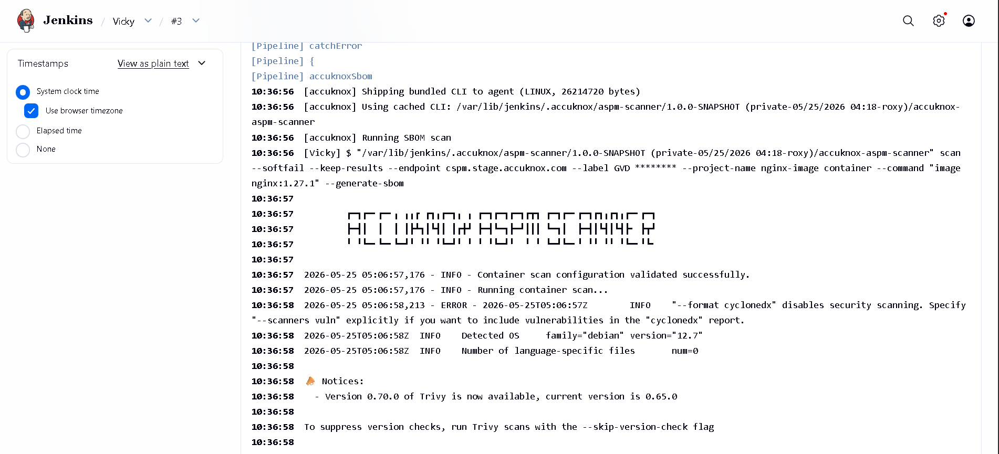

# Generating Container SBOMs in Jenkins

This guide adds an SBOM (Software Bill of Materials) stage to a Jenkins pipeline using the **AccuKnox ASPM Scanner** plugin. A CycloneDX SBOM is generated for a container image and uploaded to AccuKnox under a named project.

## Prerequisites

- A Jenkins controller (`2.387.3 LTS` or newer) with at least one build agent.
- An AccuKnox SaaS account with a tenant / label you can upload findings to.
- Network egress from the Jenkins agent to the AccuKnox control plane (or a mirrored scanner image for air-gapped agents).
- An AccuKnox project pre-created with classifier `container`. The SBOM upload fails otherwise.

## Step 1: Install the AccuKnox ASPM Plugin

See [Installing the AccuKnox ASPM Jenkins Plugin](jenkins-installation.md) for the one-time plugin installation steps.

## Step 2: Configure Jenkins and pre-create the SBOM project

- Store the AccuKnox token as a Jenkins **Secret text** credential.
- Set the endpoint, label, and token credential on the global config.
- On the AccuKnox console, go to **Projects → Add Project** and create the project name you plan to pass as `projectName`, with classifier `container`.

## Step 3: Define the Jenkins Pipeline

```groovy
// AccuKnox SBOM generation, standalone Jenkinsfile.
//
// Generates a CycloneDX SBOM for a container image and uploads it to AccuKnox.
// PROJECT_NAME is what the SBOM is attached to in the AccuKnox UI.

pipeline {
  agent any

  parameters {
    string(name: 'IMAGE',
           defaultValue: 'nginx:1.27.1',
           description: 'Container image to generate SBOM for.')

    string(name: 'PROJECT_NAME',
           defaultValue: 'jenkins-sbom-demo',
           description: 'Project name to associate the SBOM with on AccuKnox.')

    booleanParam(name: 'SOFT_FAIL',
                 defaultValue: true,
                 description: 'SBOM has no per-finding severity; SOFT_FAIL=true is the sensible default.')

    booleanParam(name: 'CONTAINER_MODE',
                 defaultValue: false,
                 description: 'Run the scanner inside Docker (requires Docker on the agent).')
  }

  options {
    timestamps()
    timeout(time: 20, unit: 'MINUTES')
    disableConcurrentBuilds()
  }

  stages {
    stage('SBOM') {
      steps {
        accuknoxSbom(image: params.IMAGE,
                     projectName: params.PROJECT_NAME,
                     softFail: params.SOFT_FAIL,
                     containerMode: params.CONTAINER_MODE)
      }
    }
  }
}
```

## Pipeline inputs

=== "Step parameters"

    | Parameter | Description | Required | Default |
    |------|------|------|------|
    | `image` | Container image reference. | yes | *required* |
    | `projectName` | AccuKnox project (classifier `container`) to attach the SBOM to. | yes (or via global) | *(global default)* |
    | `softFail` | SBOM has no per-finding severity; `true` is the sensible default. | no | `true` |
    | `containerMode` | Run the scanner inside Docker on the agent. | no | `false` |
    | `scanImage` | Air-gapped: mirrored scanner image to use. | no | *(unset)* |

=== "Common knobs"

    Every `accuknox*` step accepts these:

    | Parameter | Default | Notes |
    |------|------|------|
    | `endpoint` | from global config | Control-plane host (no scheme). Per-step override. |
    | `label` | from global config | Becomes the `label_id` on the upload. |
    | `credentialsId` | from global config | Jenkins credential ID holding the AccuKnox bearer token. |
    | `skipUpload` | `false` | Run the scanner but don't upload. Useful for dry runs. |
    | `keepResults` | `true` | Keep results JSON on the agent and archive it as a build artifact. |
    | `containerMode` | `false` | Run the scanner inside Docker on the agent. |
    | `cliPath` | `auto` | Path to a pre-staged `accuknox-aspm-scanner` binary (air-gapped use). |

## Without AccuKnox vs With AccuKnox

=== "Without AccuKnox"

    An SBOM JSON file is left on the agent. Asset inventory and vulnerability matching are someone else's problem.

=== "With AccuKnox"

    The CycloneDX SBOM is shipped to AccuKnox and attached to the named project, where it powers asset inventory, supply-chain queries, and the runtime correlation views.

*Figure 1. SBOM attached to a project on AccuKnox.*


## Viewing Results in AccuKnox

Once the Jenkins job uploads its SBOM, the project view is updated in the AccuKnox SaaS console.

1. Log in to the AccuKnox console and switch to the tenant whose label you configured in Jenkins.
2. Open **Projects** and pick the project name you passed as `projectName`.
3. Inspect the components, licenses, and supply-chain graph attached to the SBOM.
4. Cross-reference components with CVEs via the asset inventory.
5. Re-run the Jenkins job whenever the image is rebuilt. The latest SBOM replaces the previous one on the project.

## Conclusion

Wiring SBOM generation into Jenkins via the AccuKnox ASPM plugin gives you continuous, automated supply-chain visibility on every build. Combine it with the other scan types ([SAST](jenkins-sast.md), [IaC](jenkins-iac-scan.md), [Secret](jenkins-secret-scan.md), [Container](jenkins-container-scan.md), [SCA](jenkins-artifact-scan.md)) to get full-coverage ASPM directly from your pipelines.
