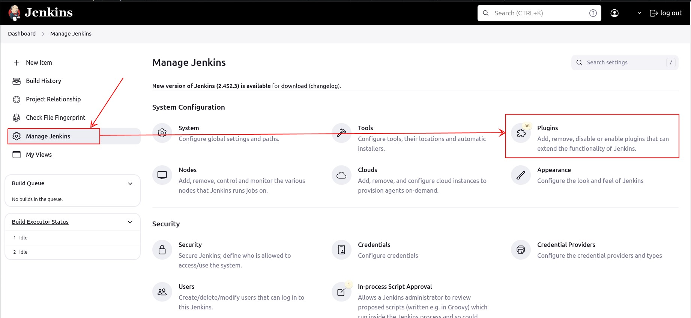
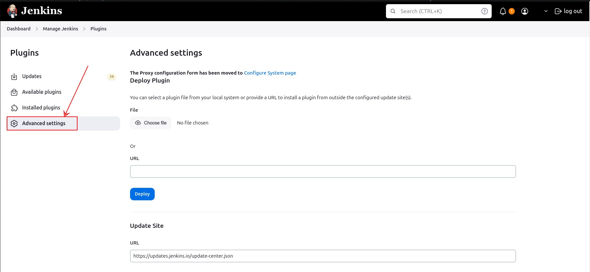
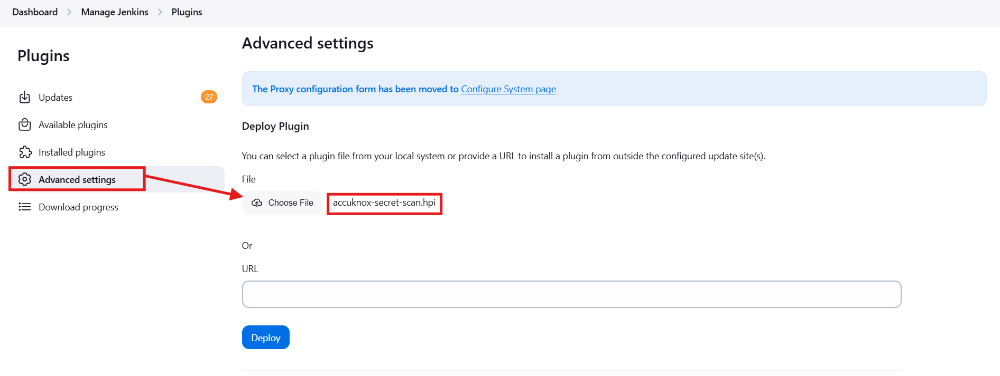
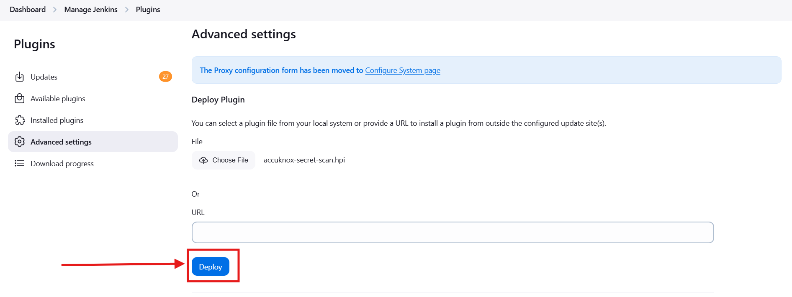
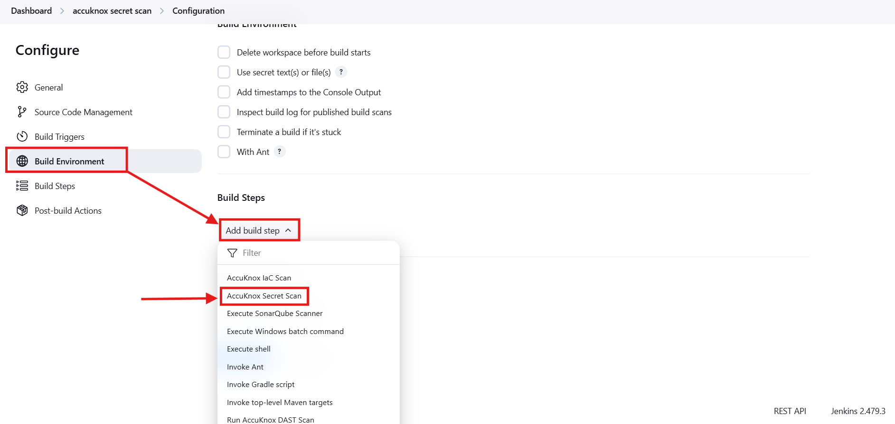
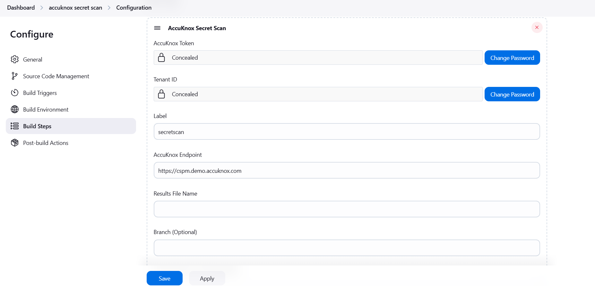

# Jenkins Secret Scanning Integration

## Overview

The **AccuKnox Secret Scanning Jenkins Plugin** simplifies integrating secret scanning into Jenkins pipelines. This plugin uses TruffleHog to detect sensitive data such as API keys, tokens, and secrets in the source code. The detected secrets are then uploaded to **AccuKnox SaaS** for centralized visibility and management.

## Key Features

1. **Secret Detection with TruffleHog**: Scan repositories for sensitive information using TruffleHog.

2. **Results Upload**: Seamlessly upload scan results to AccuKnox SaaS for centralized monitoring.

3. **Customizable Parameters**: Configure scanning options, including excluded paths, branch selection, and additional TruffleHog arguments.

## Installation

### Current Installation Method

1. **Download the Plugin**:

   - Download the `.hpi` file for the plugin from your internal repository or the provided location.

2. **Install the Plugin**:

   - Navigate to the **Jenkins Dashboard**.

   - Go to **Manage Jenkins** > **Manage Plugins**.



- Select the **Advanced** tab and upload the `.hpi` file using the **Choose File** option.





- Click **Deploy** to install the plugin.



- Restart Jenkins if prompted.

## Configuration

### Job Configuration

1. **Add Build Step**:

   - Open the Jenkins job configuration.

   - Under the **Build** section, click **Add build step** and select **AccuKnox Secret Scan**.

   

2. **Configure Plugin Parameters**:

   - The plugin provides the following configuration options:

     - **Token**: AccuKnox API token for authentication.

     - **Tenant ID**: Your AccuKnox tenant ID.

     - **Label**: A label to associate the scan with specific context.

     - **Endpoint**: AccuKnox API endpoint.

     - **Results Path**: Path to save TruffleHog results (default: `trufflehog-results.json`).

     - **Fail on Secrets**: Mark the build as failed if secrets are detected.

     - **Branch**: The branch of the repository to scan.

     - **Exclude Paths**: Paths to exclude from the scan.

     - **Additional Arguments**: Custom arguments to pass to TruffleHog.

   

## Running the Scan

1. **Execution**:

   - Once configured, trigger the Jenkins job.

   - The plugin:

     - Runs a Secret scan in the workspace.

     - Saves the results to the specified path.

     - If secrets are found, uploads the results to AccuKnox CSPM.

2. **Sample Console Output**:

```sh
Starting AccuKnox Secret Scan...
AccuKnox Secret Scan is running...
Secrets found. Uploading results to AccuKnox CSPM...
AccuKnox CSPM upload successful.
```

## Troubleshooting

### 1. No Results Found

- If no secrets are detected:

  - Verify that the source repository contains test secrets.

  - Check the excluded paths and branch configuration.

### 2. API Upload Failure

- Verify the AccuKnox API endpoint is correctly configured.

- Ensure the AccuKnox Token and Tenant ID are accurate.

- Check network connectivity to the AccuKnox SaaS endpoint.

### 3. Command Errors

- Ensure the TruffleHog Docker image is accessible from the Jenkins environment.

- Check workspace permissions and Docker installation.

## Example Configuration

| **Parameter**       | **Example Value**          |
| ------------------- | -------------------------- |
| **Token**           | `my-accuknox-token`        |
| **Tenant ID**       | `my-tenant-id`             |
| **Label**           | `secret-scan-build-123`    |
| **Endpoint**        | `https://api.accuknox.com` |
| **Results Path**    | `trufflehog-results.json`  |
| **Branch**          | `main`                     |
| **Exclude Paths**   | `node_modules, tests`      |
| **Additional Args** | `--regex --max-depth 2`    |

## Token Generation for AccuKnox

To generate the **AccuKnox Token** and obtain the **Tenant ID**:

1. Log in to AccuKnox.

2. Navigate to **Settings** > **Tokens** and create an AccuKnox token.

3. Copy the generated token and store it securely for later use. For detailed steps, refer to [How to Create Tokens](https://help.accuknox.com/how-to/how-to-create-tokens/ "https://help.accuknox.com/how-to/how-to-create-tokens/").

## Conclusion

By integrating the **AccuKnox Secret Scanning Jenkins Plugin** into your CI/CD pipeline, you ensure that sensitive information is identified and securely managed during development. The plugin streamlines secret scanning, centralizes findings in AccuKnox SaaS, and helps strengthen your organization's security posture.
