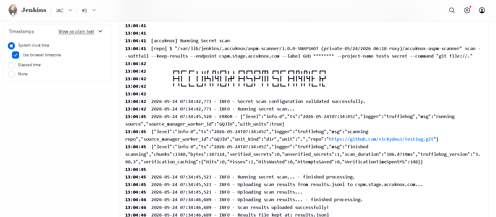
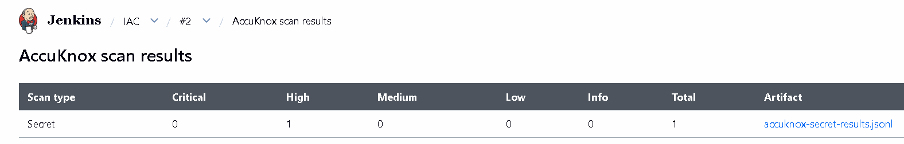

# Secret Scanning in Jenkins

This guide adds a Secret scan stage to a Jenkins pipeline using the **AccuKnox ASPM Scanner** plugin. The scanner walks the full git history of the checked-out repo to find committed secrets and uploads results to AccuKnox.

## Prerequisites

- A Jenkins controller (`2.387.3 LTS` or newer) with at least one build agent.
- An AccuKnox SaaS account with a tenant / label you can upload findings to.
- Network egress from the Jenkins agent to the AccuKnox control plane (or a mirrored scanner image for air-gapped agents).
- Use a **full git clone** (no `--depth=1`). The secret scanner walks the commit history.

!!! warning "Shallow clones miss history"
    `git clone --depth=1` only fetches the latest commit. Secrets that were added and later removed will not be detected. Always use a full clone for the Secret stage.

## Step 1: Install the AccuKnox ASPM Plugin

See [Installing the AccuKnox ASPM Jenkins Plugin](jenkins-install.md) for the one-time plugin installation steps.

## Step 2: Configure Jenkins credentials and global settings

- Store the AccuKnox token as a Jenkins **Secret text** credential.
- Set the endpoint, label, and token credential on the global config screen.

## Step 3: Define the Jenkins Pipeline

```groovy
// AccuKnox Secret scan, standalone Jenkinsfile.
//
// Clones a repo and scans its git history for committed secrets.
// SECRET_COMMAND must point at a git working tree the scanner can read.

pipeline {
  agent any

  parameters {
    string(name: 'REPO_URL',
           defaultValue: 'https://github.com/Vickydew1/Testing.git',
           description: 'Git repo to clone and scan.')

    string(name: 'SECRET_COMMAND',
           defaultValue: 'git file://.',
           description: 'Secret scanner command. Default scans the current dir as a git repo.')

    string(name: 'SEVERITY_THRESHOLD',
           defaultValue: 'HIGH,CRITICAL',
           description: 'Comma-separated severities that fail the build.')

    booleanParam(name: 'SOFT_FAIL',
                 defaultValue: true,
                 description: 'true (default) = run and upload, build stays green; false = fail build on matching severities.')
  }

  options {
    timestamps()
    timeout(time: 20, unit: 'MINUTES')
    disableConcurrentBuilds()
  }

  environment {
    REPO_URL = "${params.REPO_URL}"
  }

  stages {
    stage('Checkout') {
      steps {
        sh '''
          set -eu
          rm -rf repo
          git clone "$REPO_URL" repo   # full history, secret scan reads it
        '''
      }
    }

    stage('Secret') {
      steps {
        dir('repo') {
          accuknoxSecret(secretCommand: params.SECRET_COMMAND,
                         severityThreshold: params.SEVERITY_THRESHOLD,
                         softFail: params.SOFT_FAIL)
        }
      }
    }
  }
}
```

## Pipeline inputs

=== "Step parameters"

    | Parameter | Description | Required | Default |
    |------|------|------|------|
    | `secretCommand` | Passed verbatim to the secret scanner. Default scans the current dir as a git repo. | no | `git file://.` |
    | `severityThreshold` | CSV of severities that fail the build. | no | `HIGH,CRITICAL` |
    | `softFail` | `true` = advisory only; `false` = fail build on matching severities. | no | `false` |

=== "Common knobs"

    Every `accuknox*` step accepts these:

    | Parameter | Default | Notes |
    |------|------|------|
    | `endpoint` | from global config | Control-plane host (no scheme). Per-step override. |
    | `label` | from global config | Becomes the `label_id` on the upload. |
    | `credentialsId` | from global config | Jenkins credential ID holding the AccuKnox bearer token. |
    | `skipUpload` | `false` | Run the scanner but don't upload. Useful for dry runs. |
    | `keepResults` | `true` | Keep results JSON on the agent and archive it as a build artifact. |
    | `containerMode` | `false` | Run the scanner inside Docker on the agent. |
    | `cliPath` | `auto` | Path to a pre-staged `accuknox-aspm-scanner` binary (air-gapped use). |

## Severity model

The underlying secret scanner doesn't classify findings by severity, so the plugin counts every secret as a **HIGH** finding. Committed secrets are inherently high-risk.

!!! info "Default behavior"
    With `severityThreshold = 'HIGH,CRITICAL'` any detected secret fails the build. Set `'CRITICAL'` only if you explicitly want to allow them through.

## Without AccuKnox vs With AccuKnox

=== "Without AccuKnox"

    Secret-scan output is left as a JSONL file in the workspace. You have to manually inspect or wire downstream tooling.

=== "With AccuKnox"

    Findings are uploaded and grouped by repo, commit, and rule. The AccuKnox console provides remediation guidance and ticketing.

*Figure 1. Secret findings in the AccuKnox console.*


*Figure 2. Drilling into a single secret finding.*


## Viewing Results in AccuKnox

Once the Jenkins job uploads its report, the findings are available in the AccuKnox SaaS console.

1. Log in to the AccuKnox console and switch to the tenant whose label you configured in Jenkins.
2. Open **Issues → Findings**, and filter by **Secret**.
3. Click any finding to inspect the file, line, and the recommended remediation.
4. Use the **ASK AI** button on a finding for an LLM-generated explanation and patch suggestion.
5. Create a ticket directly from the finding to track remediation.
6. Re-run the Jenkins job after rotating the secret. The finding flips to **Resolved** on the next ingest.

## Conclusion

Wiring Secret scanning into Jenkins via the AccuKnox ASPM plugin gives you continuous, automated detection on every build, with a single pane of glass in the AccuKnox console for triage, ticketing, and verification. Combine it with the other scan types ([SAST](jenkins-sast.md), [IaC](jenkins-iac-scan.md), [Container](jenkins-container-scan.md), [SBOM](jenkins-sbom.md), [SCA](jenkins-artifact-scan.md)) to get full-coverage ASPM directly from your pipelines.
