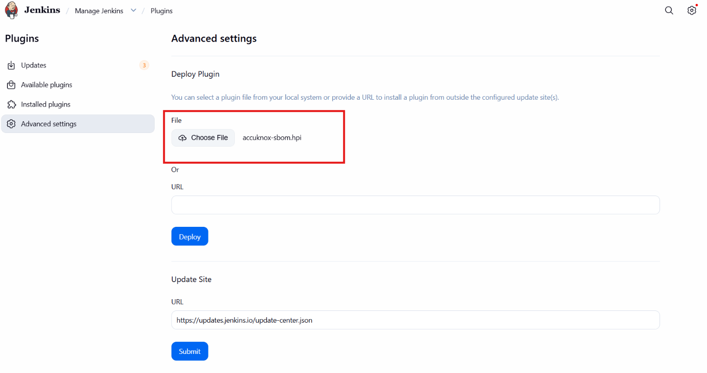
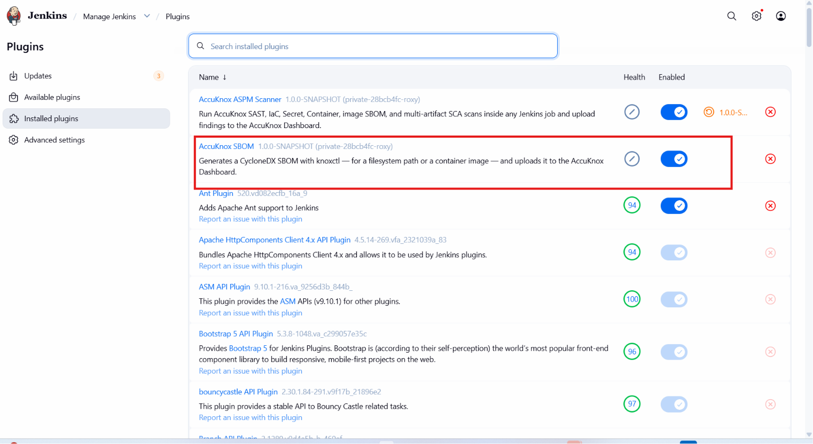
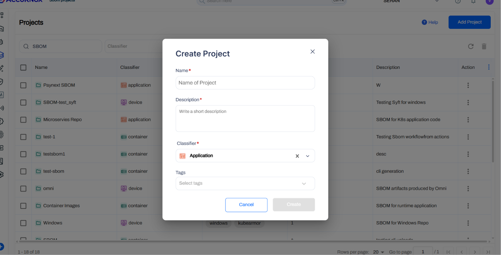
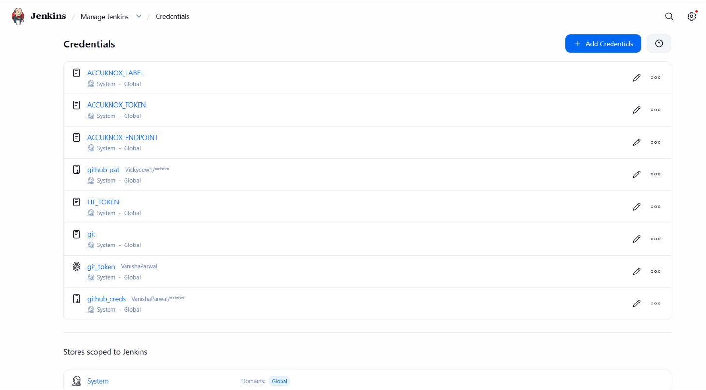
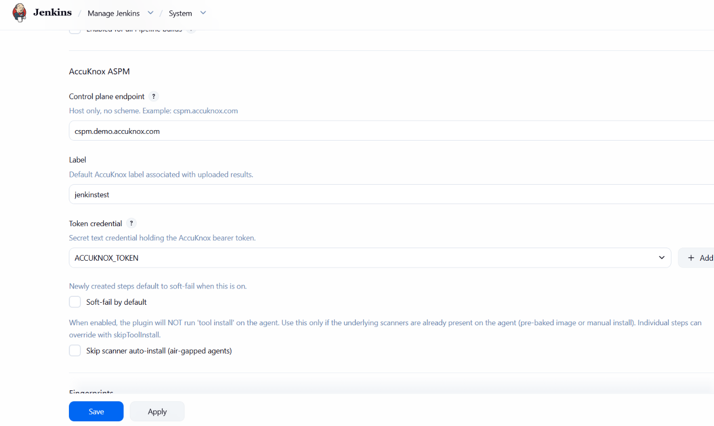
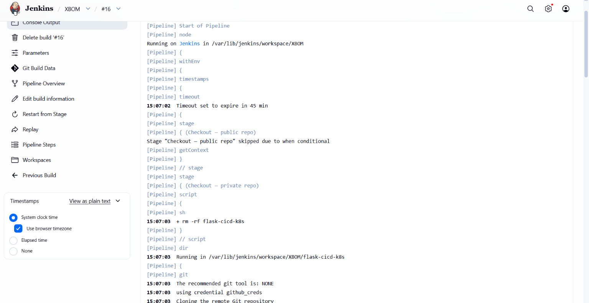
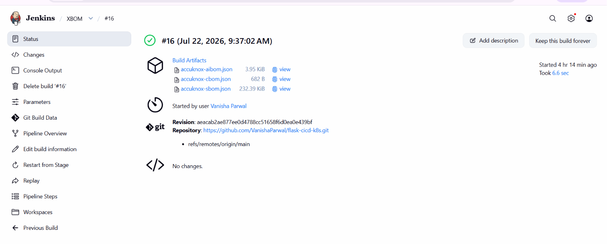
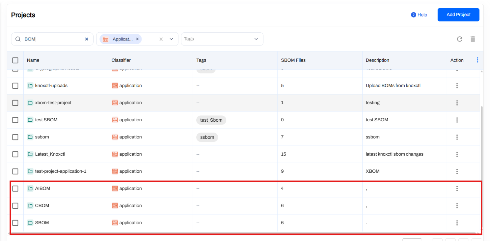

# xBOM (SBOM + CBOM + AIBOM) for Jenkins

Run all three AccuKnox bills of materials in one pipeline:

- **SBOM**: Software Bill of Materials. Packages and versions.
- **CBOM**: Cryptographic Bill of Materials. Algorithms, key sizes, protocols, libraries.
- **AIBOM**: AI/ML Bill of Materials. Model metadata pulled from HuggingFace.

Running all three against the same codebase gives complete supply-chain visibility: what is in your dependencies, what crypto you use, and what AI models you consume. Each BOM uploads to its own AccuKnox project.

## Prerequisites

- Jenkins `2.426.3` or newer, already deployed.
- Admin access to Jenkins.
- An AccuKnox SaaS tenant with admin login.
- A Git repo (public or private) to scan.
- A HuggingFace account with a Read access token (for AIBOM). For gated models like Meta Llama, your account must have accepted the model license on huggingface.co.
- The AccuKnox xBOM plugin `.hpi` file.

## Step 1: Deploy the .hpi to Jenkins

1. Download the plugin: [`accuknox-sbom.hpi`](https://accuknox-onprem-artifacts.s3.us-east-2.amazonaws.com/accuknox-sbom.hpi)
2. Log into Jenkins and navigate to **Manage Jenkins → Plugins → Advanced settings** tab.

    

3. Under **Deploy Plugin**, choose the `accuknox-sbom.hpi` file you downloaded and click **Deploy**.
4. Restart Jenkins when the upload finishes so the new steps register.
5. Verify at **Manage Jenkins → Plugins → Installed plugins** by searching `AccuKnox`.

    

## Step 2: Generate an AccuKnox API Token

Log into your AccuKnox SaaS tenant. Navigate to **Settings → Tokens → Create Token**. Copy the value shown on screen. It is shown only once.

## Step 3: Create a Label

Navigate to **Settings → Labels → Add Label**. Name it something like `jenkinstest`. Every BOM this pipeline uploads is tagged with this label.

## Step 4: Create Three AccuKnox Projects

xBOM uploads to three separate projects, one per BOM type. Navigate to **SBOM → Projects** and create:

| Project name | Classifier |
|------|------|
| `SBOM` | `application` |
| `CBOM` | `application` |
| `AIBOM` | `application` |



## Step 5: Generate a HuggingFace Token

For AIBOM, you need a HuggingFace token so `knoxctl` can query model metadata. Create a **Read** access token at [huggingface.co/settings/tokens](https://huggingface.co/settings/tokens).

## Step 6: Generate a GitHub PAT (Only If Scanning a Private Repo)

For SBOM and CBOM, scanning a private repository requires a GitHub Personal Access Token with repo read access.

## Step 7: Store All Credentials in Jenkins

Navigate to **Manage Jenkins → Credentials → System → Global credentials (unrestricted)**. Add three credentials (or two if your repo is public):

- **AccuKnox token**: Kind `Secret text`, Secret is the AccuKnox token from Step 2, ID `ACCUKNOX_TOKEN`
- **HuggingFace token**: Kind `Secret text`, Secret is the `hf_...` token from Step 5, ID `HF_TOKEN`
- **GitHub PAT** (private repos only): Kind `Username with password`, Username is your GitHub username, Password is the `ghp_...` token from Step 6, ID `github_creds`



## Step 8: Configure the Plugin Globally

Navigate to **Manage Jenkins → System** and scroll to the AccuKnox ASPM section.

- **Control plane endpoint**: your AccuKnox host (e.g. `cspm.demo.accuknox.com`).
- **Label**: `<your-label>`.
- **Token credential**: select `<your-token>`.
- Click **Save**.



## Step 9: Create the Pipeline Job

**Dashboard → New Item.** Name it `xbom-pipeline`, select **Pipeline**, click **OK**. Scroll to the Pipeline section, set Definition to **Pipeline script**, and paste the Jenkinsfile below.

```groovy
// AccuKnox xBOM generation, standalone Jenkinsfile.
//
// Generates SBOM, CBOM, and AIBOM for a codebase and uploads each to its
// own AccuKnox project.

pipeline {
  agent any

  parameters {
    string(name: 'REPO_URL',
           defaultValue: 'https://github.com/YOUR_USER/YOUR_REPO.git',
           description: 'Git repo for SBOM and CBOM. Public or private.')

    booleanParam(name: 'REPO_IS_PRIVATE',
                 defaultValue: false,
                 description: 'Tick if the repo is private.')

    string(name: 'REPO_BRANCH',
           defaultValue: 'main',
           description: 'Branch to clone.')

    booleanParam(name: 'RUN_SBOM',  defaultValue: true, description: 'Software BOM.')
    booleanParam(name: 'RUN_CBOM',  defaultValue: true, description: 'Cryptographic BOM.')
    booleanParam(name: 'RUN_AIBOM', defaultValue: true, description: 'AI/ML BOM.')

    string(name: 'SBOM_PROJECT',  defaultValue: 'SBOM',   description: "Classifier 'application'.")
    string(name: 'CBOM_PROJECT',  defaultValue: 'CBOM',   description: "Classifier 'application'.")
    string(name: 'AIBOM_PROJECT', defaultValue: 'AIBOM',  description: "Classifier 'application'.")

    string(name: 'AIBOM_MODEL',
           defaultValue: 'meta-llama/Meta-Llama-3-8B',
           description: 'HuggingFace model ID.')

    booleanParam(name: 'HF_MODEL_IS_GATED',
                 defaultValue: true,
                 description: 'Tick if the HF model is gated.')

    string(name: 'ENDPOINT',
           defaultValue: 'cspm.demo.accuknox.com',
           description: 'AccuKnox control plane host, no scheme.')

    string(name: 'LABEL',
           defaultValue: 'jenkinstest',
           description: 'Label to tag the BOMs with.')

    string(name: 'ACCUKNOX_CREDENTIAL',
           defaultValue: 'ACCUKNOX_TOKEN',
           description: 'Jenkins credential ID for AccuKnox token.')

    string(name: 'GITHUB_CREDENTIAL',
           defaultValue: 'github_creds',
           description: 'Jenkins credential ID for GitHub PAT.')

    string(name: 'HF_CREDENTIAL',
           defaultValue: 'HF_TOKEN',
           description: 'Jenkins credential ID for HuggingFace token.')
  }

  options {
    timestamps()
    timeout(time: 45, unit: 'MINUTES')
    disableConcurrentBuilds()
  }

  environment {
    REPO_DIR = "${params.REPO_URL.tokenize('/').last() - '.git'}"
  }

  stages {
    stage('Checkout - public repo') {
      when { expression { (params.RUN_SBOM || params.RUN_CBOM) && !params.REPO_IS_PRIVATE } }
      steps {
        sh """
          set -eu
          rm -rf "${env.REPO_DIR}"
          git clone --depth=1 --branch "${params.REPO_BRANCH}" "${params.REPO_URL}" "${env.REPO_DIR}"
        """
      }
    }

    stage('Checkout - private repo') {
      when { expression { (params.RUN_SBOM || params.RUN_CBOM) && params.REPO_IS_PRIVATE } }
      steps {
        script { sh "rm -rf ${env.REPO_DIR}" }
        dir(env.REPO_DIR) {
          git branch: params.REPO_BRANCH,
              url: params.REPO_URL,
              credentialsId: params.GITHUB_CREDENTIAL
        }
      }
    }

    stage('SBOM') {
      when { expression { params.RUN_SBOM } }
      steps {
        dir(env.REPO_DIR) {
          knoxctlSbom(path: '.',
                      projectName: params.SBOM_PROJECT,
                      endpoint: params.ENDPOINT,
                      label: params.LABEL,
                      credentialsId: params.ACCUKNOX_CREDENTIAL)
        }
      }
    }

    stage('CBOM') {
      when { expression { params.RUN_CBOM } }
      steps {
        dir(env.REPO_DIR) {
          knoxctlCbom(path: '.',
                      projectName: params.CBOM_PROJECT,
                      endpoint: params.ENDPOINT,
                      label: params.LABEL,
                      credentialsId: params.ACCUKNOX_CREDENTIAL)
        }
      }
    }

    stage('AIBOM - HuggingFace public') {
      when { expression { params.RUN_AIBOM && !params.HF_MODEL_IS_GATED } }
      steps {
        knoxctlAibom(source: 'huggingface',
                     model: params.AIBOM_MODEL,
                     projectName: params.AIBOM_PROJECT,
                     endpoint: params.ENDPOINT,
                     label: params.LABEL,
                     credentialsId: params.ACCUKNOX_CREDENTIAL)
      }
    }

    stage('AIBOM - HuggingFace gated') {
      when { expression { params.RUN_AIBOM && params.HF_MODEL_IS_GATED } }
      steps {
        withCredentials([string(credentialsId: params.HF_CREDENTIAL, variable: 'HF_TOKEN')]) {
          knoxctlAibom(source: 'huggingface',
                       model: params.AIBOM_MODEL,
                       projectName: params.AIBOM_PROJECT,
                       endpoint: params.ENDPOINT,
                       label: params.LABEL,
                       credentialsId: params.ACCUKNOX_CREDENTIAL)
        }
      }
    }
  }

  post {
    always {
      echo "BOMs attached: SBOM (if run), CBOM (if run), AIBOM (if run)."
    }
  }
}
```

Click **Save**.

## Pipeline Parameters Reference

Every parameter, its default value, and whether you need to change it before running.

=== "Repository parameters"

    | Parameter | Default | Change | Notes |
    |------|------|------|------|
    | `REPO_URL` | `https://github.com/YOUR_USER/YOUR_REPO.git` | Yes, always | Git repo to scan for SBOM and CBOM. |
    | `REPO_IS_PRIVATE` | `false` | Only if private | Tick when scanning a private repo, uses `GITHUB_CREDENTIAL`. |
    | `REPO_BRANCH` | `main` | Only if different | Change to `master` or your actual branch if not `main`. |

=== "What to run"

    | Parameter | Default | Notes |
    |------|------|------|
    | `RUN_SBOM` | `true` | Untick to skip the SBOM stage. |
    | `RUN_CBOM` | `true` | Untick to skip the CBOM stage. |
    | `RUN_AIBOM` | `true` | Untick to skip the AIBOM stage. |

=== "AccuKnox projects"

    | Parameter | Default | Notes |
    |------|------|------|
    | `SBOM_PROJECT` | `SBOM` | Must match project in AccuKnox (classifier `application`). |
    | `CBOM_PROJECT` | `CBOM` | Must match project in AccuKnox (classifier `application`). |
    | `AIBOM_PROJECT` | `AIBOM` | Must match project in AccuKnox (classifier `application`). |

=== "AIBOM model"

    | Parameter | Default | Change | Notes |
    |------|------|------|------|
    | `AIBOM_MODEL` | `meta-llama/Meta-Llama-3-8B` | If scanning a different model | HuggingFace model ID. Confirmed working with `HF_TOKEN`. |
    | `HF_MODEL_IS_GATED` | `true` | Untick for public models | Ticked routes through the gated stage (uses `HF_CREDENTIAL`). |

=== "AccuKnox connection"

    | Parameter | Default | Notes |
    |------|------|------|
    | `ENDPOINT` | `cspm.demo.accuknox.com` | Use your tenant's control-plane host, no scheme. |
    | `LABEL` | `jenkinstest` | Must match the label created in AccuKnox. |

=== "Credential IDs"

    | Parameter | Default | Notes |
    |------|------|------|
    | `ACCUKNOX_CREDENTIAL` | `ACCUKNOX_TOKEN` | Case-sensitive, must match Jenkins credential ID exactly. |
    | `GITHUB_CREDENTIAL` | `github_creds` | Used only when `REPO_IS_PRIVATE=true`. |
    | `HF_CREDENTIAL` | `HF_TOKEN` | Used only when `HF_MODEL_IS_GATED=true`. |

## Step 10: Run the Pipeline

Click **Build with Parameters** in the left sidebar. Update the parameters marked *Yes, always* in the tables above. Leave the rest as defaults. Click **Build**.



Watch **Console Output** and the **Stage View** for:

- Checkout completing
- SBOM generated → HTTP 200 upload
- CBOM generated → HTTP 200 upload
- AIBOM generated → HTTP 200 upload
- `Finished: SUCCESS`



## Step 11: Verify in AccuKnox

Log into AccuKnox SaaS and navigate to **SBOM**. Filter by classifier `application`. You will see three entries, one for each BOM type. Click any entry to inspect components:

- **SBOM**: all packages from lockfiles, with CVEs.
- **CBOM**: every crypto algorithm, key size, and library detected in source.
- **AIBOM**: the AI model card, with provenance, size, and license.



## Conclusion

Wiring xBOM generation into Jenkins gives you SBOM, CBOM, and AIBOM from a single pipeline run, covering supply chain, cryptography, and AI/ML models without stitching together separate tools. Combine it with the other scan types ([SAST](jenkins-sast.md), [IaC](jenkins-iac-scan.md), [Secret](jenkins-secret-scan.md), [Container](jenkins-container-scan.md), [SCA](jenkins-artifact-scan.md)) to get full-coverage ASPM directly from your pipelines.
