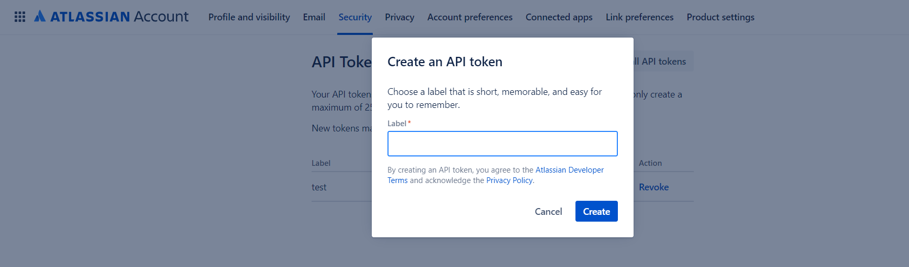
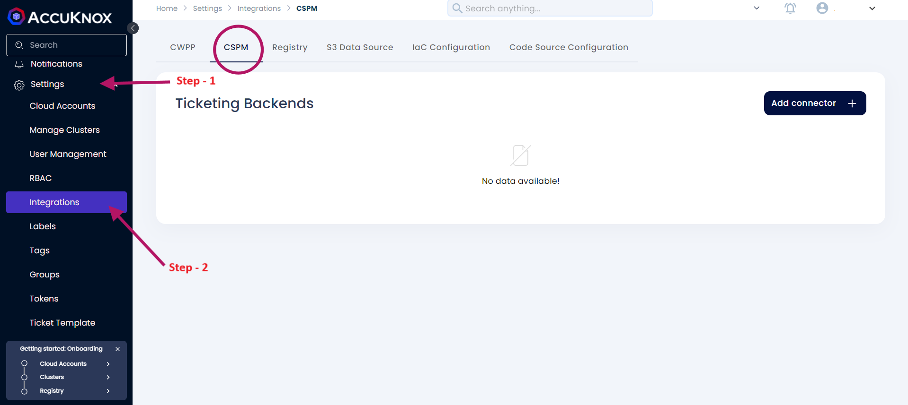
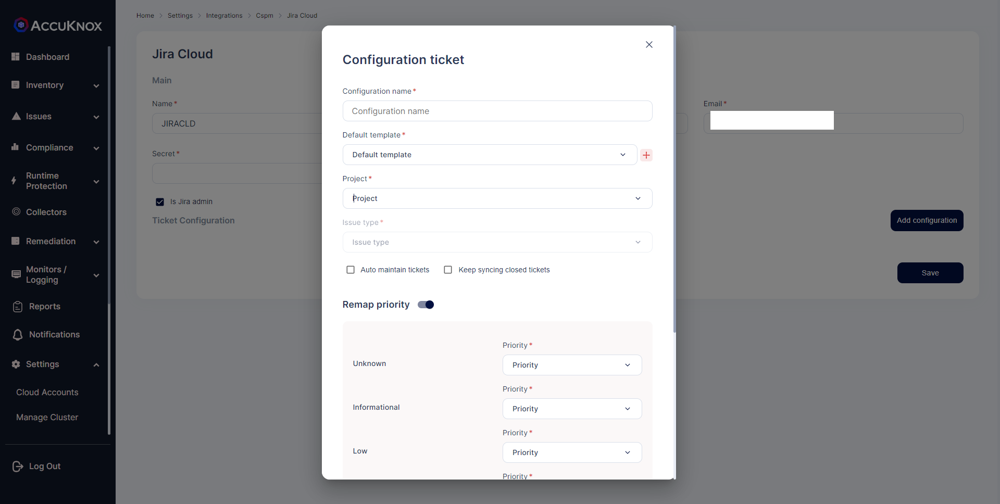

# Jira Cloud Integration

Integrate AccuKnox with Jira and receive AccuKnox alert notifications in your Jira accounts. With this integration, you can automate the process of generating Jira tickets with your existing security workflow.

To set up this integration, you need to coordinate with your Jira administrator and gather the inputs needed to enable communication between AccuKnox and Jira.

## **Prerequisites**

+ You need a Jira Site URL , Email, UserID & API token, Project key for this integration.
+ To create JIRA token go to https://id.atlassian.com/manage-profile/security/api-tokens, and click on **create API token**.


+ Add a label to identify the token.
+ Click Create to generate token.



??? "JIRA integration for CWPP"

    #### **Steps to Integrate:**
    + Go to Channel Integration.
    + Click integrate now on JIRA

    

    + Enter the following details to configure JIRA.

      + **Integration Name:** Enter the name for the integration. You can set any name. e.g.,``` Test JIRA ```
      + **Site:** Enter the site name of your organisation. e.g., ``` https://jiratest.atlassian.net/ ```
      + **User Email:** Enter your Jira account email address here.e.g., ``` jira@organisation.com ```
      + **Token:** Enter the generated Token here from ``` https://id.atlassian.com/manage-profile/security/api-tokens. .e.g., kRVxxxxxxxxxxxxx39 ```
      + **User ID:** Enter your Jira user ID here. You can visit people section and search your name to see the User ID. For more details check here. e.g., ``` 5bbxxxxxxxxxx0103780 ```
      + **Project ID:** Enter your Project key here, each project in an organisation starts with some keyvalue and is case sensitive. Breakdown of a jira ticket to identify Project ID: ``` https://[JIRA-SITE]/browse/[PROJECT ID]-1414 ```, e.g., ``` DEVSECOPS ```
      + **Issue Summary:** Enter the summary for the JIRA tickets to be viewed in each JIRA tickets created. e.g., ``` Issue generated form High Severity Incidents on onboarded cluster. ```
      + **Issue Type:** You can choose from the dropdown. i.e., ``` Story and Bug ```
    + Click **Test** to check if the entered details are being validated, If you receive Test Successful, you have entered a valid JIRA credentials.

    + Click **Save** to save the Integration.

??? "JIRA integration for CSPM"
    #### **Steps to Integrate:**
    + Navigate to the **Integration** section under the **Settings** tab.
    + Select **CSPM** from the available options.

    

    + Click **Add Connection**, then choose **Jira Cloud** from the dropdown under **Type**.

    

    

    + Click **Next**.

    Enter the following details to configure JIRA:

    + **Integration Name**: Provide a name for the integration (customize as desired). e.g., `Test JIRA`
    + **Service Desk URL**: Enter your organization’s Jira site URL. e.g., `https://jiratest.atlassian.net/`
    + **User Email**: Enter the email address associated with your Jira account. e.g., `jira@organisation.com`
    + **Secret**: Enter the generated Token from [here](https://id.atlassian.com/manage-profile/security/api-tokens). e.g., `kRVxxxxxxxxxxxxx39`

    

    **Now Setup Ticket Configuration**

    + Click on the Jira ticketing backend to add configuration.

    

    Here, enter the following details:

      + **Configuration Name**: Provide a name for this configuration. This name will be visible while creating tickets.
      + **Default Template**: Choose a predefined template based on your requirements, or create a custom template tailored to your needs.
      + **Project Name**: From the list, select the Jira project where tickets will be created.
      + **Issue Type**: Select an issue type that categorizes the work (e.g., task, sub-task, bug, story).

    **Mandatory/Custom Fields**

      Each issue type includes various mandatory or custom fields that are critical to the overall management of issues within a project.

      + **Issue Type**: Task
      + **Components**: Defines the component(s) involved in the task, e.g., UI, Backend, Database.
      + **Project**: The project to which the task is assigned (e.g., CNAPP, CSPM).
      + **Fix Versions**: Indicates the version(s) in which the task is planned to be completed.
      + **Priority**: Determines the urgency of the task (e.g., Low, Medium, High, Critical).
      + **Affects Versions**: Specifies the versions impacted by the task.

    

    + **Auto Maintain Tickets**: Automatically manages ticket statuses to keep them updated without manual intervention.
    + **Keep Syncing Closed Tickets**: Ensures closed tickets are continuously synced for real-time accuracy across systems.

    + **Remap Priority**: Assign a priority level based on your preferences.

    **Comment Analysis**

    + **Comment Analysis Overview** It helps automatically categorize comments to track issue progress and manage exceptions. **Regex (Regular Expressions)** can be used to identify patterns within comments.
    + **Key Fields**
        + **Regex**: A regular expression used to filter comments.
            + **Example**: `waiting for approval|needs revision`
        + **Status Options**
            - **Active**: Issue is currently being worked on.
            - **Fixed**: Issue has been resolved.
            - **In-Progress**: Ongoing work is noted in comments.
            - **Exception Request**: Flags comments requesting special handling.
            - **Potential**: Indicates a potential issue for further review.
            - **Wait for 3rd Party**: Delays due to external dependencies.
            - **Duplicate**: Marks comments indicating the issue is a duplicate.
    + **Use Cases**
        - **Progress Tracking**: Automatically update status to **In-Progress** for relevant comments.
        - **Duplicate Issues**: Flag duplicates based on comments like "duplicate of issue #123".
        - **Exceptions**: Identify special requests through comments.

    + Implementing **Comment Analysis** provides streamlines issue management and enhances visibility into project status.

    
    + Click **Save**.

    

    + For more ticketing templates, [refer to this](ticket-template.md).

Your Jira Cloud is now integrated, and you can configure alert triggers for JIRA.

## Jira Assignee Support

Users can now add Jira ticket Assignee as well when they create the ticket for any particular vulnerability or misconfiguration from the AccuKnox SaaS itself. To do this the users must follow the following steps:

**Step 1:** Users first need to integrate their jira cloud using the instructions [here ](https://help.accuknox.com/integrations/jira-cloud/#integration-of-jira)

**Step 2:** After the integration the Users need to create the Configuration for the integration. For this users need to select the Integration->CSPM->jira Integration-> Add configuration


**Step 3:** Now when the users select the project name in the Ticket configuration the assignee users will be listed. The users can select any name and save the ticket configuration after filling all other necessary fields. 


From now on the users can create the ticket with this particular configuration so that the ticket will be created with the assignee set to the name that  was selected during the configuration.

If the users want to change the assignee during the ticket creation that can also be done by clicking on the assignee section as shown below
- - -
[SCHEDULE DEMO](https://www.accuknox.com/contact-us){ .md-button .md-button--primary }