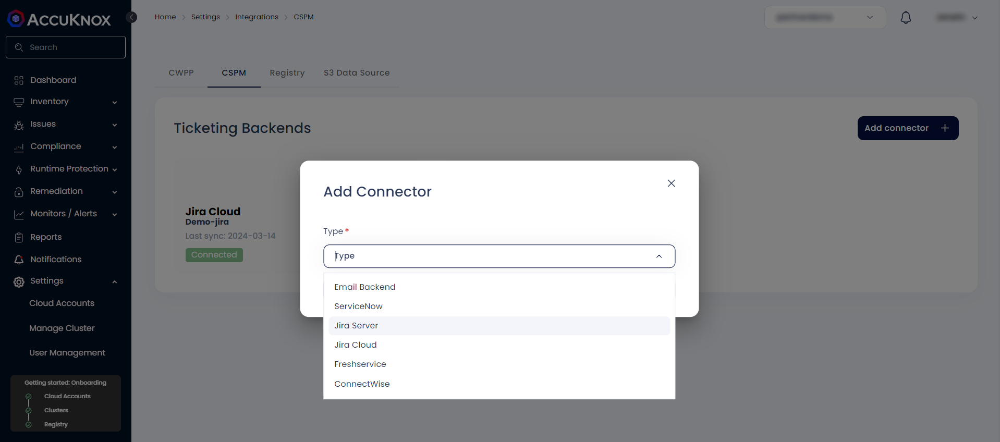
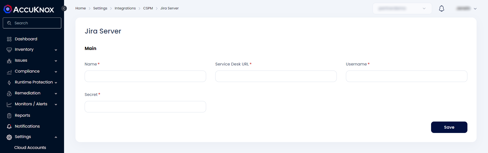
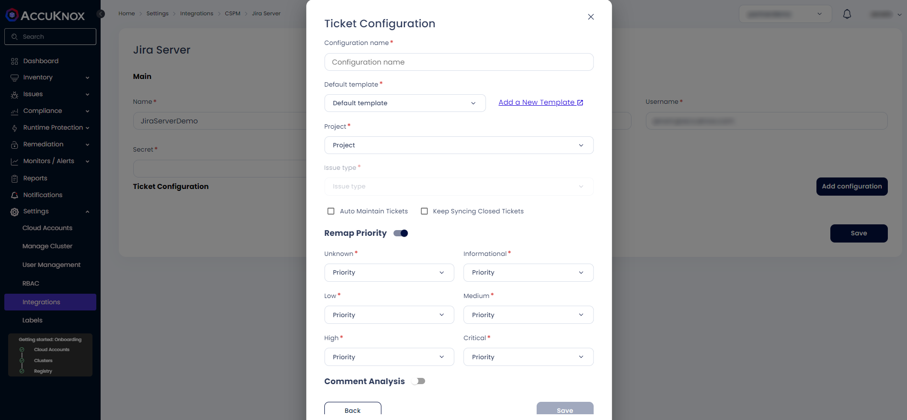

## Jira Integration

Integrate AccuKnox with Jira and receive AccuKnox alert notifications in your Jira accounts. With this integration, you can automate the process of generating Jira tickets with your existing security workflow.

To set up this integration, you need to coordinate with your Jira administrator and gather the inputs needed to enable communication between AccuKnox and Jira.

### Integration of JIRA:

#### **Prerequisites**

+ You need a Jira Site URL , Email, UserID & API token, Project key for this integration.
+ To create JIRA token go to https://id.atlassian.com/manage-profile/security/api-tokens, and click on **create API token**.

#### **Steps to Integrate:**
+ Go to Channel Integration → CSPM.
+ Click on add connector and select JIRA Server




Enter the following details to configure JIRA.

+ **Integration Name:** Enter the name for the integration. You can set any name. e.g.,``` Test JIRA ```
+ **Service Desk URL:** Enter the site name of your organisation. e.g., ``` https://jiratest.atlassian.net/ ```
+ **Username:** Enter your Jira account email address here.e.g., ``` jira@organisation.com ```
+ **Secret:** Enter the generated Token here from ``` https://id.atlassian.com/manage-profile/security/api-tokens.``` .e.g., ```kRVxxxxxxxxxxxxx39 ```



Click on the Jira ticketing backend to add configuration.

Here Enter the following details:

+ **Configuration name:** this name will be displayed under ticket configuration while creating tickets.
+ **Default template:** to specify the of data that this configuration will be used for making tickets.
+ **Project name:** From the list of project select the project where you want your tickets to be created.
+ **Issue Type:** You can choose from the dropdown.
+ Fill the priority mapping according to your choice and press **Save**.

You can now configure Tickets to be created on JIRA.

- - -
[SCHEDULE DEMO](https://www.accuknox.com/contact-us){ .md-button .md-button--primary }