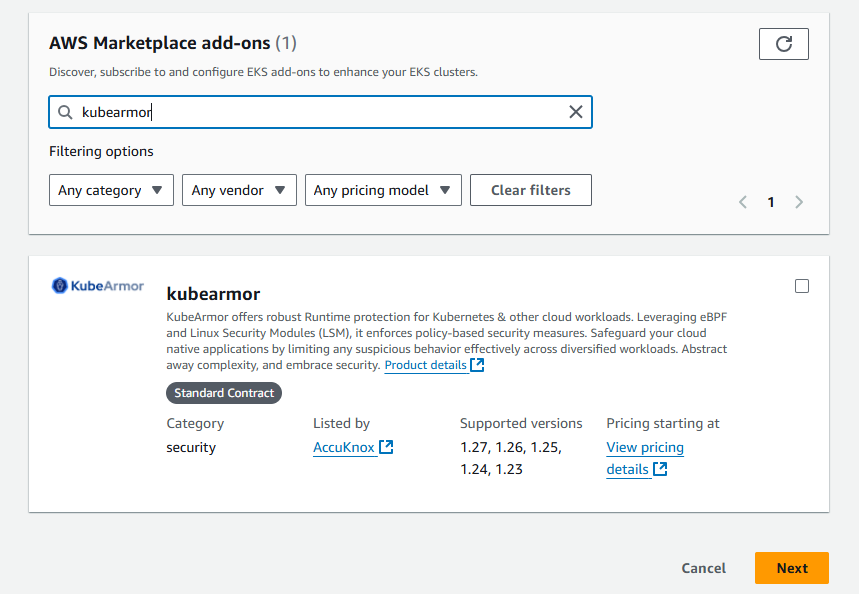

---
hide:
  - toc
---

Amazon Elastic Kubernetes Service (Amazon EKS) is a managed Kubernetes service provided by Amazon Web Services (AWS) which simplifies the process of running Kubernetes clusters by handling the underlying infrastructure and operational aspects. KubeArmor’s integration with EKS can provide a user with a tool that can enforce security policies for them at the pod level as well as at the node level. Users can restrict all events related to network, process and file using these policies. 

In this article you will understand how to install KubeArmor on your EKS cluster using Amazon EKS add-on method. 

## From AWS Console

Once you've subscribed to Kubearmor on AWS Marketplace and completed the on-screen setup, you'll be directed to the Amazon EKS console. To begin in the Amazon EKS console, navigate to your EKS clusters and click on the "Add-ons" tab. From there, select "Get more add-ons" to locate the KubeArmor EKS add-ons in the cluster settings of your existing EKS clusters. You can use the search bar to find "KubeArmor" and then follow the on-screen instructions to enable the Kubearmor add-on for your Amazon EKS cluster.



## From AWS-CLI

To enable the Kubearmor add-on for your Amazon EKS cluster, follow these steps:

Open your workspace and execute the command below. 
Make sure to replace `$YOUR_CLUSTER_NAME` and `$AWS_REGION` with the actual name of your Amazon EKS cluster and its respective AWS region.

```shell
aws eks create-addon --addon-name accuknox_KubeArmor --cluster-name $YOUR_CLUSTER_NAME --region $AWS_REGION
```

You'll receive a response with information about the add-on's status, like its name, cluster name, and version. 
The add-on will be in the "CREATING" status initially.

To check the installation status of the Kubearmor add-on, use the following command:

```shell
aws eks describe-addon --addon-name accuknox_KubeArmor --cluster-name $YOUR_CLUSTER_NAME --region $AWS_REGION
```

Once the add-on becomes active, its status will change to "ACTIVE." 
This command will provide details similar to those in the response above, including the status, version, and creation date.


To disable the Kubearmor add-on, you can execute the following command from AWS CLI

```shell
aws eks delete-addon --addon-name accuknox_KubeArmor --cluster-name $YOUR_CLUSTER_NAME --region $AWS_REGION
```

- - - 
[SCHEDULE DEMO](https://www.accuknox.com/contact-us){ .md-button .md-button--primary }