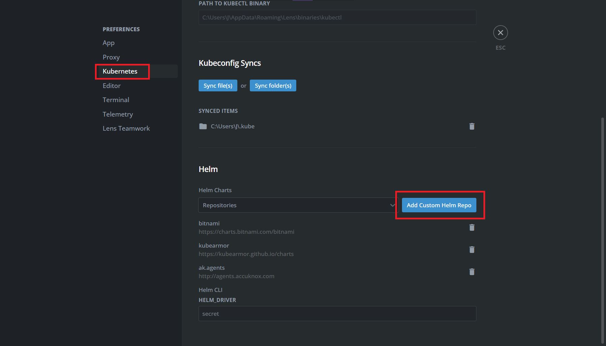
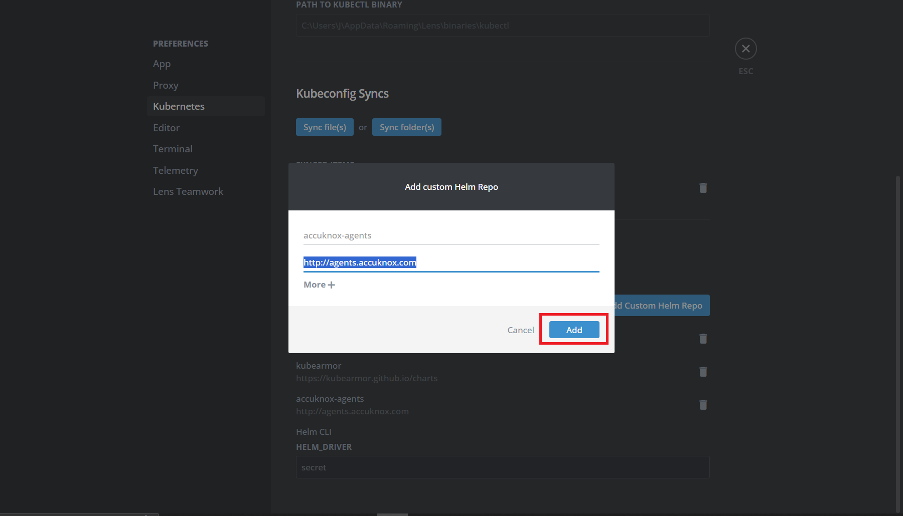
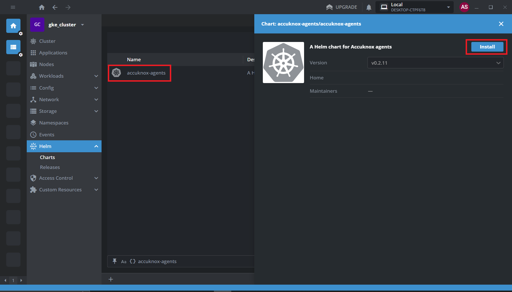
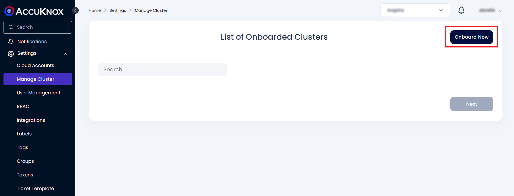
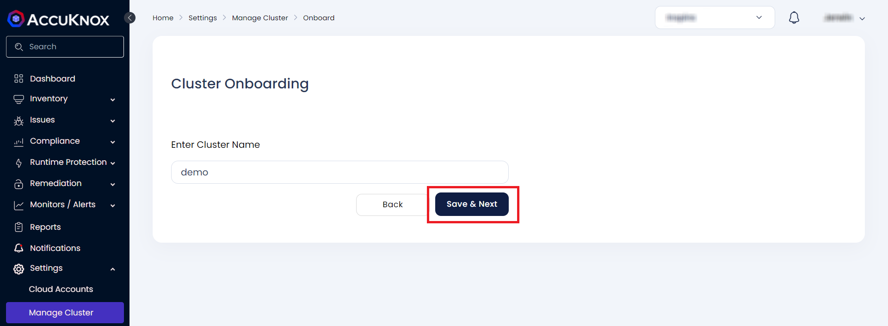
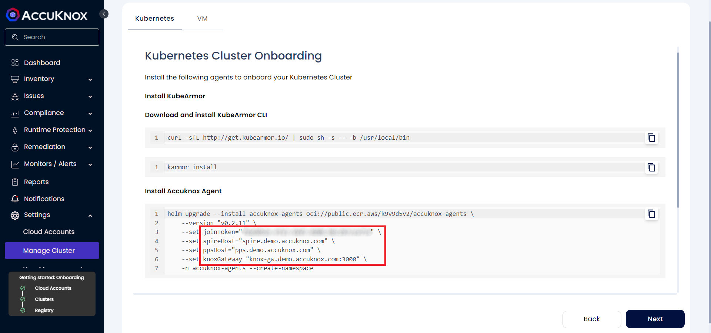
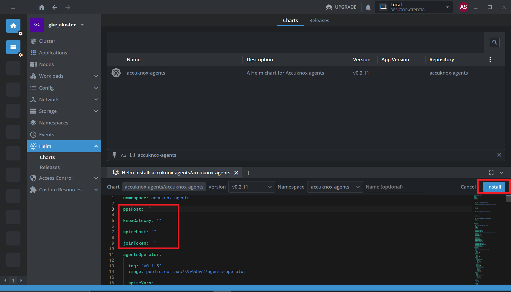
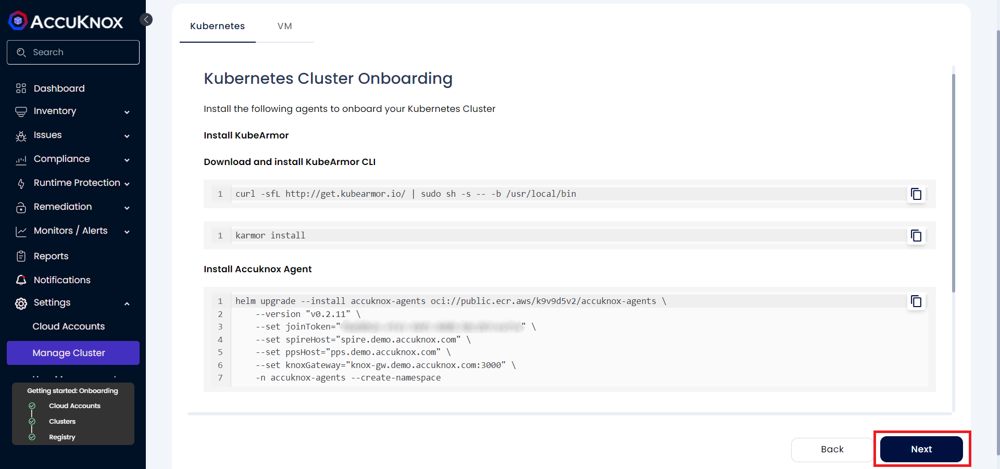

# Mirantis Lens Integration with AccuKnox

To deploy the AccuKnox agents through Lens and onboard to AccuKnox SaaS,

**Step 1**: Navigate to File → Preferences or press Ctrl+Comma to open the Preferences menu and select the Kubernetes tab.



**Step 2**: Click on “Add Custom Helm Repo” and enter the following info:

- Name: accuknox-agents
- URL: ```http://agents.accuknox.com```

Click on Add



**Step 3**: Navigate to your cluster on Lens, goto Helm → Charts and search accuknox-agents. Select the “accuknox-agents” chart and click on Install. (Press ctrl+R to reload if you can’t find it)



**Step 4**: On the AccuKnox SaaS, Navigate to Settings → Manage Cluster and click on “Onboard now”



**Step 5**: In the next screen, enter a name for the cluster and click on “Save and Next”



**Step 6**: Now, scroll down to view the helm chart values for onboarding the cluster. Copy these values to use in the Helm Chart installation in Lens



**Step 7**: Copy the following values from the AccuKnox SaaS and paste in Helm Chart values in Lens:

```sh
joinToken="<token-from-saas>"
spireHost="spire.demo.accuknox.com"
ppsHost="pps.demo.accuknox.com"
knoxGateway="knox-gw.demo.accuknox.com:3000"
```
Click on Install



**Step 8**: Wait for a few minutes for all the AccuKnox agents to be up. Then click on Next in the AccuKnox SaaS to view your workloads.



The cluster has been onboarded to AccuKnox SaaS successfully.