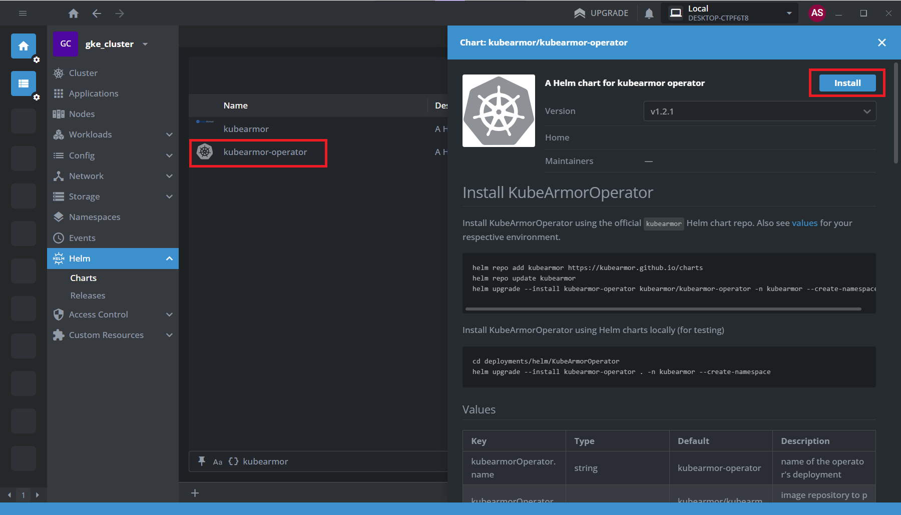
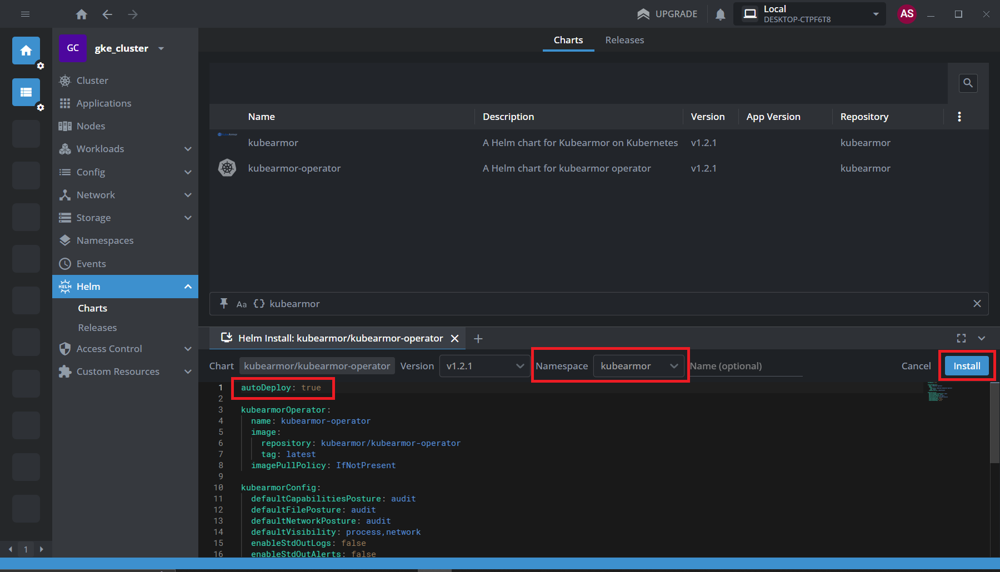
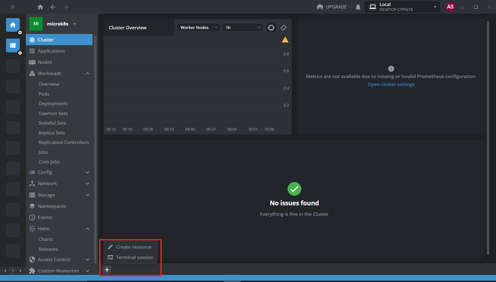
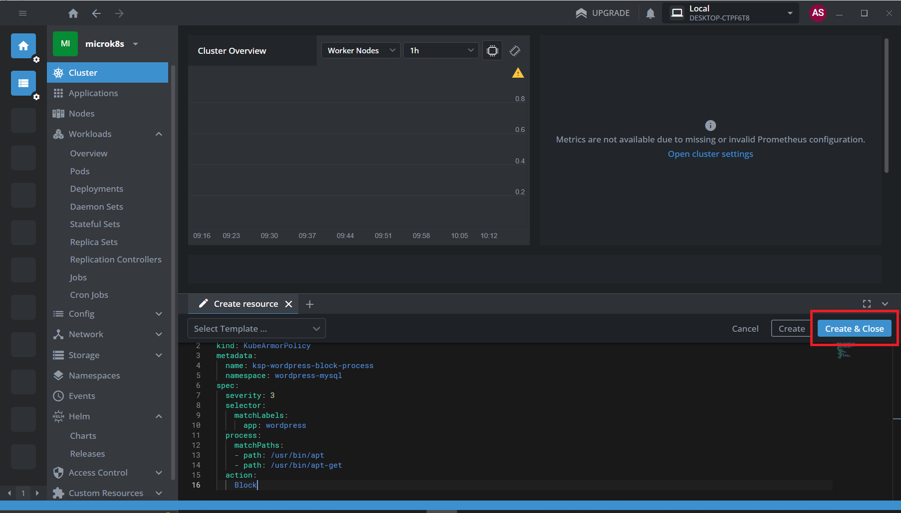
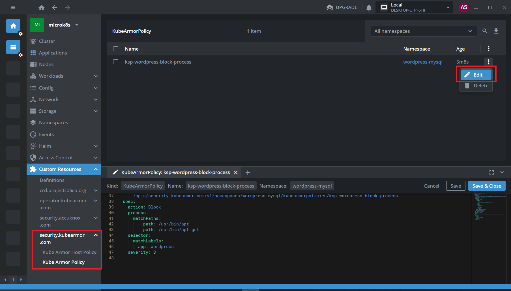

# Lens Integration with KubeArmor
Follow the below steps to add the KubeArmor helm chart to Lens and deploy it,

**Step 1**: Navigate to File → Preferences or press Ctrl+Comma to open the Preferences menu and select the Kubernetes tab.


**Step 2**: Click on “Add Custom Helm Repo” and enter the following info:

- Name: kubearmor
- URL: ```https://kubearmor.github.io/charts```

Click on Add


**Step 3**: Navigate to your cluster on Lens, goto Helm → Charts and search KubeArmor. Select the “kubearmor-operator” and click on Install. (Press ctrl+R to reload if you can’t find it)



**Step 4**: In the Helm chart tab that opens, do the following:

- Set the value ```autoDeploy: true```
- Select a namespace to deploy, i.e. kubearmor

Finally click on Install



Wait for the operator to finish deploying the necessary components. This will deploy KubeArmor on the cluster with the default options.

## Sample Use Case

For this example, we are making use of a Wordpress-mysql deployment which can be started using the below command:

```sh
kubectl apply -f https://raw.githubusercontent.com/kubearmor/KubeArmor/main/examples/wordpress-mysql/wordpress-mysql-deployment.yaml
```

To demonstrate, here we will make use of the policy below to prevent the execution of ```apt``` binary:

```sh
apiVersion: security.kubearmor.com/v1
kind: KubeArmorPolicy
metadata:
  name: ksp-wordpress-block-process
  namespace: wordpress-mysql
spec:
  severity: 3
  selector:
    matchLabels:
      app: wordpress
  process:
    matchPaths:
    - path: /usr/bin/apt
    - path: /usr/bin/apt-get
  action:
    Block
```
This policy is created based on NIST guidelines which specify that package management processes should not be allowed to execute inside a container at production. KubeArmor can help enforce this by denying the execution of these binaries.

**Step 1**: Apply the policy by opening a "create resource" tab(Press the + button at the bottom)



**Step 2**: Copy the policy from above and paste into the tab. Then click on Create & Close to apply the policy.



**Step 3**: Open a terminal session using the + button and exec inside the container

Get the container name:
```sh
kubectl get pods -n wordpress-mysql
```
Now exec into the wordpress container by specifying its name identified from the previous command:
```sh
kubectl exec -it -n wordpress-mysql <wordpress-pod-name> -- bash
```
**Step 4**: Try executing ```apt``` inside the container

Sample Output:
```sh
PS C:\Users\User> kubectl exec -it wordpress-64f98f8759-k6dt2 -n wordpress-mysql -- bash
root@wordpress-64f98f8759-k6dt2:/var/www/html# apt
bash: /usr/bin/apt: Permission denied
root@wordpress-64f98f8759-k6dt2:/var/www/html#
```

The permission is denied since we have applied a policy to block the execution of apt binary.

The applied policy can be found by navigating to Custom Resources → security.kubearmor.com → Kube Armor Policy. From here, the policy can be edited as required or removed.



More information about the structure of policies and some examples can be found in <a href="https://docs.kubearmor.io/kubearmor/documentation/security_policy_specification" target="_blank">KubeArmor Docs</a>