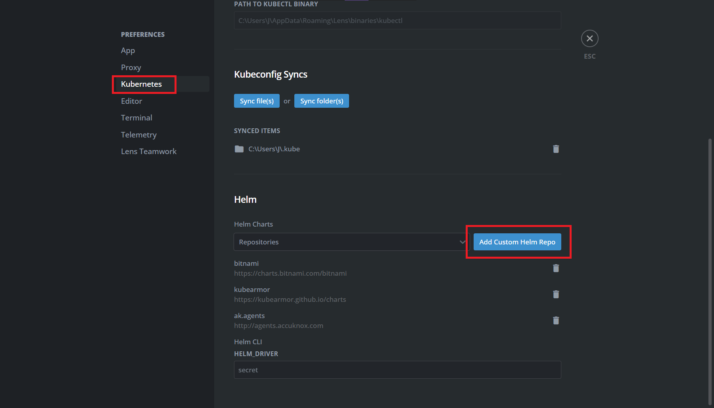
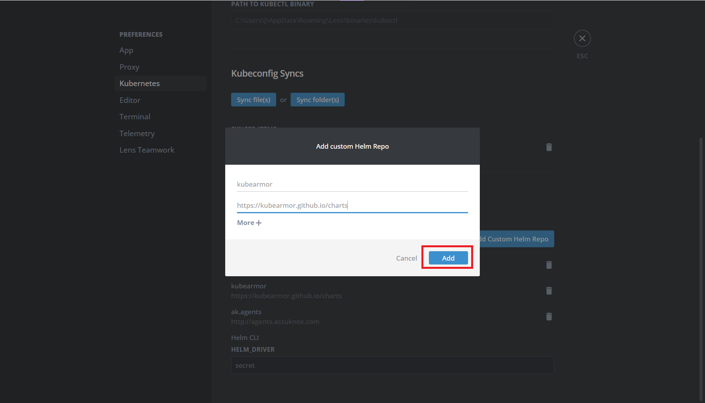

---
hide:
  - toc
---

Follow the below steps to add the KubeArmor helm chart to Lens and deploy it,

**Step 1**: Navigate to File → Preferences or press Ctrl+Comma to open the Preferences menu and select the Kubernetes tab.



**Step 2**: Click on “Add Custom Helm Repo” and enter the following info:

- Name: kubearmor
- URL: ```https://kubearmor.github.io/charts```

Click on Add



**Step 3**: Navigate to your cluster on Lens, goto Helm → Charts and search KubeArmor. Select the “kubearmor-operator” and click on Install. (Press ctrl+R to reload if you can’t find it)


**Step 4**: In the Helm chart tab that opens, do the following:

- Set the value ```autoDeploy: true```
- Select a namespace to deploy, i.e. kubearmor

Finally click on Install


Wait for the operator to finish deploying the necessary components. This will deploy KubeArmor on the cluster with the default options.