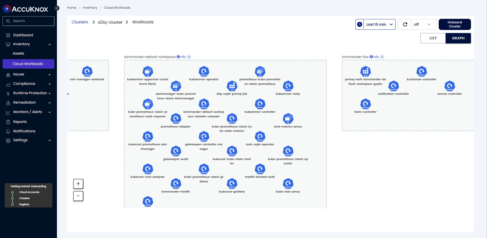

# Nutanix Installation with KubeArmor

AccuKnox runtime security for Kubernetes aids in discovering the application behavior of your workload and offers the capability to enforce security policies. AccuKnox automatically detects and suggests Behavioral Policies based on application observability, such as file system access for processes and processes that are accessing the network.

AccuKnox leverages KubeArmor to implement runtime security policies, utilizing eBPF and LSMs (SELinux, BPF LSM, AppArmor). LSMs serve as a checkpoint based on the applied policies, scrutinizing all events and system calls against these policies before they interact with kernel objects. KubeArmor ensures that any event not compliant with the policies is prevented from executing in the userspace, thus maintaining a secure environment for your applications to operate.

AccuKnox offers the subsequent enterprise functionalities to enhance runtime security:

- Auto-Discovered Behavioural Policies
- Recommendation of Hardening Policies based on compliance framework - MITRE, NIST, PCI-DSS, CIS
- Inventory View of Application
- Network Graph View of the Application
- Network micro-segmentation in the application
- Hardening of the Secrets Managers like Hashicorp Vault, CyberArk Conjur
- GitOps-based Version Control for Policy Lifecycle Management
- Rollback of recently changed Policy governing App Behavior
- On-the-fly detection of change in App Behavior through Policies
- Multi-tenant, Multi-Cluster, RBAC for user management
- Comprehensive Dashboard across workloads running in Managed/Unmanaged Cluster, Containerized environment, VM or Baremetal
- Integration with Registries for Container Image Vuln Scan
- Telemetry aggregation (Process executed, File accessed, Network connections made) and Alerts events (Audit, Block)
- Integration to SIEM for security events and Notification tool

The utilization of the following AccuKnox agents assists in delivering the enterprise features:

**Agents operator**: It will detect the environment of the k8s that is installed and based on that, it will pull all the AccuKnox Agents for Installation.

**Discovery Engine**: AccuKnox Discovery Engine leverages the pod visibility provided by KubeArmor to automatically generate System and Network Policies.

**Feeder Service**: The feeder service sends information from the Client Cluster to the AccuKnox SaaS Control Plane. Feeder Service is an agent that runs on every node, collects telemetry/alert events from source systems and messages, and emits them to the Messaging Cluster for Storage and Analysis.

**Policy Enforcement Agent**: AccuKnox’s Policy Enforcement Agent enforces the policies by leveraging KubeArmor. The policy not only keeps track of the policies but is capable of doing tasks such as applying policies, denying policies, updating policies, and deleting the policies.

**Shared Informer Agent**: Shared Informer Agent watches all the changes occurring in Kubernetes entities such as Pods, Nodes, Namespaces, Endpoints, and Services.

## **Before you Begin**

This procedure requires the following items and configurations:

- A fully configured and running Amazon EKS cluster with administrative privileges.

- The current version of DKP Enterprise is <a href="https://docs.d2iq.com/dkp/2.7/kommander-installations-by-environment" target="_blank">installed</a> on your cluster.

- Ensure you have installed ```kubectl``` in your Management cluster.

In this case, we will be using D2iQ managed cluster created from the D2iQ console, You can use user attached cluster as well


## **Steps to onboard cluster**

**Step 1**: When the cluster is provisioned successfully > click on **Actions** from the upper right corner download the KubeConfig and export it to kubeconfig environment variable


```sh
export KUBECONFIG=dkp-aditya-kubeconfig.yaml
```

**Step 2**: From the application catalog enable **KubeArmor**


**Step 3**: Login to AccuKnox Saas > Navigate to settings and click on manage clusters


**Step 4**: Click on **Onboard Now** to onboard a new cluster and In the next screen give a name to your cluster then click on **Save & Next**


**Step 5**: In the onboarding steps skip the first step as we have already added “KubeArmor” from the DKP catalog, Follow the “Install AccuKnox Agents” to onboard your cluster


**Step 6**: Copy the command and execute it in CLI

```sh
helm upgrade --install accuknox-agents oci://public.ecr.aws/k9v9d5v2/accuknox-agents --version "v0.2.12" --set joinToken="38d851ba-2660-4aa3-b488-0cfb666bdb5e" --set spireHost="spire.demo.accuknox.com" --set ppsHost="pps.demo.accuknox.com" --set knoxGateway="knoxgw.demo.accuknox.com:3000" -n accuknox-agents --create-namespace
Release "accuknox-agents" does not exist. Installing it now.
Pulled: public.ecr.aws/k9v9d5v2/accuknox-agents:v0.2.12
Digest: sha256:0bccba7c90fd5b844c84010613941da1938020336fa50c6ed9b1d045c37bb8ea
NAME: accuknox-agents
LAST DEPLOYED: Tue Apr 23 11:11:21 2024
NAMESPACE: accuknox-agents
STATUS: deployed
REVISION: 1
TEST SUITE: None
```

**Step 7**: Verify if all the agents are up and running

```sh
kubectl get po -n accuknox-agents
NAME                                        READY   STATUS    RESTARTS   AGE
agents-operator-6cf7ccb7c4-zl58p            1/1     Running   0          3m18s
discovery-engine-86c7fcc48c-bgvg8           5/5     Running   0          3m18s
feeder-service-78bfcc75bb-xxfqt             1/1     Running   0          2m45s
policy-enforcement-agent-7c9cddddf6-6rwv7   1/1     Running   0          2m44s
shared-informer-agent-787465dc55-wlzm8      1/1     Running   0          2m43s
```

The agents are up and running.

## **Expected Outcome**

After the Onboarding Process is complete user can utilize the following features of AccuKnox SaaS to protect their cloud workload at runtime:

### **Cloud Workloads**

Users can view all the workloads within the cluster through the cloud workload graph view.



### **Application Behavior**

AccuKnox SaaS monitors cluster workload behavior using KubeArmor and AccuKnox Agents, installed as DaemonSets. Information is collected at the pod-level granularity, allowing users to access details for each pod across various namespaces. Workload behavior is presented through both list and graphical views


### **List view**

In the list view, users can access the selected pod's application behavior through three types of lists:

**File Observability**: This list provides information about file access occurring inside the pod. It includes details such as which process is accessing which file within the pod. Additionally, it indicates the status of the access, whether it's allowed, audited, or denied.

**Process Observability**: This list displays the processes executing within the pod, along with information about which pods or containers are executing those processes. It also provides details about processes that are blocked from execution within the pod.

**Network Observability**: Network Observability presents the ingress and egress connections entering and leaving the pod. It offers information regarding port numbers, the source of ingress connections, and the destination to which egress connections are intended.


### **CWPP Dashboard**

The AccuKnox CWPP Dashboard offers a comprehensive overview of runtime protection for clusters through various informative widgets. These widgets include:

- **Alerts Summary**: Provides a summarized count of alerts generated in the cluster or a specific namespace. Details include total alerts, blocked alerts (from system block policies), and audited alerts (from audit policies).

- **Compliance Summary**: Displays the compliance benchmarks applied to the cluster/namespace through KubeArmor's hardening policies. Presents information about MITRE, NIST, CIS, PCI-DSS benchmarks.

- **Compliance Alerts**: Graphically represents compliance alerts generated in the cluster/namespace, using distinct color coding for various compliance benchmarks like MITRE, NIST, PCI-DSS, etc.

- **Namespace Severity**: Offers a summary of attack severity attempted in the different namespaces within the cluster.

- **Top 10 Policies by Alerts Count**: Presents a graphical representation of the top 10 policies for which alerts are generated in the cluster/namespace. Useful for identifying high-alert generating policies.

- **Namespace Alerts**: Displays alerts specific to the selected namespace within the cluster, providing detailed information about the alerts.

- **Pod Alerts**: Offers insights into alerts originating from the pods running within the cluster/namespace.

- **Alert-based Operations**: Graphically represents alert-triggering operations such as file access, process blocks, and audits, giving users an overview of the types of alerts generated.

- **Alerts based on Severity**: Provides information on attack severity levels that were mitigated by the runtime protection policies within the chosen cluster/namespace.


### **Policy Enforcement**

The Policies section provides users with information about the runtime protection policies applied in the cluster. These policies are categorized as Discovered, Active, Inactive, Pending, Hardening, and more. Users can view policies based on the cluster, namespace, and policy type selected using the filters displayed on the page.

AccuKnox offers the option to view policies related to a specific namespace and workload. In addition to discovered and hardening policies, users can also create custom policies using the policy editor tool.


### **Monitoring Logs**

AccuKnox CNAPP Solution provides comprehensive visibility of the cloud assets with the help of Dashboards and logs/alerts. AccuKnox’s open-source KubeArmor can forward policy-related logs/alerts to the SaaS. Also, it can forward the container logs that are present in the workloads. Logs are generated in real time based on certain conditions/rules you configure on the security policies. You will get logs from four different components.


The Log Detail contents vary depending on the selected component type of the log event.


### **SIEM/Notification Integration**

Users can use the Feeder service agent to pass the logs to other SIEM tools like Splunk, ELK, Rsyslog, etc.., Users can also forward the logs from AccuKnox SaaS using the channel integration option to these SIEM tools. Users can integrate with various SIEM and ticketing tools like Splunk, Rsyslog, AWS CloudWatch, Elastic Search, Slack, and Jira.


- - -
[SCHEDULE DEMO](https://www.accuknox.com/contact-us){ .md-button .md-button--primary }