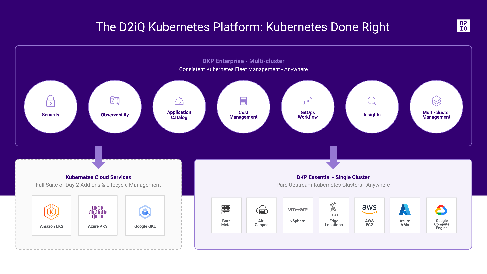
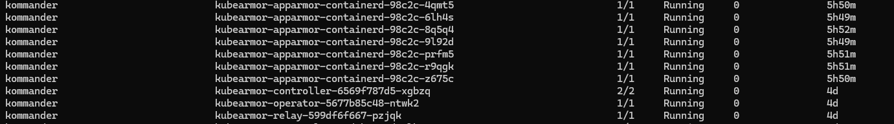
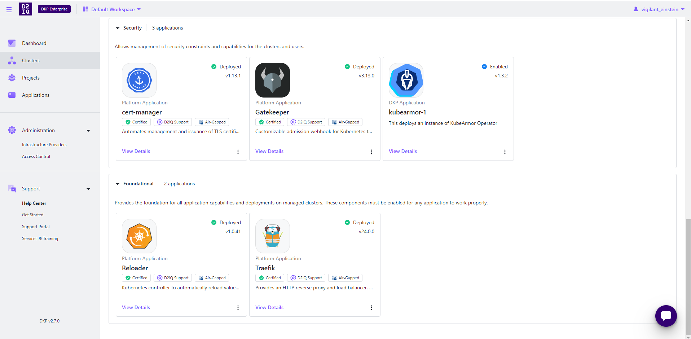

# Nutanix Installation with KubeArmor

## Introducing the D2iQ Kubernetes Platform (DKP)

As the leading independent Kubernetes Management Platform in production, the D2iQ Kubernetes Platform (DKP) provides a holistic approach and a complete set of enterprise-grade technologies, services, training, and support to build and run applications in production at scale. Built around the open-source Cluster API, the new version of DKP becomes the single, centralized point of control for an organization’s application infrastructure, empowering organizations to more easily deploy, manage, and scale Kubernetes workloads in Day 2 production environments



## Deploying D2iQ Kubernetes Platform on AWS Cloud

### Pre-requisites

1. Latest DKP Binary
2. DKP Enterprise License key
3. Hands-on experience with AWS services like CloudFormation, EC2, IAM, etc.
4. Follow the <a href="https://docs.d2iq.com/dkp/2.7/day-0-basic-installs-by-infrastructure" target="_blank">official documentation for DKP deployment</a>

Once, DKP deployment is done, Activate the enterprise license from the UI

## DKP Application catalog

Catalog applications are any third-party or open-source applications that appear in the Catalog. These applications are deployed to be used for customer workloads.

D2iQ provides <a hred="https://docs.d2iq.com/dkp/2.7/workspace-dkp-applications" target="_blank">DKP Catalog Applications</a> for use in your environment.


We will be adding KubeArmor to the DKP application catalog.

## Introducing KubeArmor - An Open-Source policy enforcement engine

KubeArmor is a cloud-native runtime security enforcement system that restricts the behavior (such as process execution, file access, and networking operations) of pods, containers, and nodes (VMs) at the system level.

KubeArmor leverages Linux security modules (LSMs) such as AppArmor, SELinux, or BPF-LSM to enforce the user-specified policies. KubeArmor generates rich alerts/telemetry events with container/pod/namespace identities by leveraging eBPF.

[KubeArmor Github](https://github.com/kubearmor/KubeArmor)


### Steps to add KubeArmor to DKP Catalog

1. Create a <a href="https://docs.d2iq.com/dkp/2.7/create-a-git-repository" target="_blank">git-repository</a>
2. Set the Git Repository <a href="https://docs.d2iq.com/dkp/2.7/git-repository-structure" target="_blank">Directory Structure</a>

Use the following basic directory structure for your git repository:

```sh
├── helm-repositories
│   ├── <helm repository 1>
│   │   ├── kustomization.yaml
│   │   └── <helm repository name>.yaml
│   └── <helm repository 2>
│       ├── kustomization.yaml
│       └── <helm repository name>.yaml
└── services
    ├── <app name>
    │   ├── <app version1> # semantic version of the app helm chart. e.g., 1.2.3
    │   │   ├── defaults
    │   │   │   ├── cm.yaml
    │   │   │   └── kustomization.yaml
    │   │   ├── <app name>.yaml
    │   │   └── kustomization.yaml
    │   ├── <app version2> # another semantic version of the app helm chart. e.g., 2.3.4
    │   │   ├── defaults
    │   │   │   ├── cm.yaml
    │   │   │   └── kustomization.yaml
    │   │   ├── <app name>.yaml
    │   │   └── kustomization.yaml
    │   └── metadata.yaml
    └── <another app name>
    ...
```

Refer to the KubeArmor Git repository for the DKP Catalog <a href="https://github.com/th3-v3ng34nc3/kubearmor/" target="_blank">**Link**</a>

**Note**: Please remember to fill out the <a href="https://docs.d2iq.com/dkp/2.7/workspace-application-metadata" target="_blank">metadata.yaml</a> with the application details that will be visible on the UI.

### Enable KubeArmor from the Workspace Catalog

#### Prerequisites

- Determine the name of the workspace where you wish to perform the deployments. You can use the ```dkp get workspaces``` command to see the list of workspace names and their corresponding namespaces.

- Set the ```WORKSPACE_NAMESPACE``` environment variable to the name of the workspace’s namespace where the cluster is attached:

```sh
export WORKSPACE_NAMESPACE=<workspace_namespace>
```

#### Steps to enable

**Step 1**: Get the list of available applications to enable using the following command:

```sh
kubectl get apps -n kommander
```

Sample:

```sh
kubectl get apps -n kommander --kubeconfig cluster.conf
NAME                  APP ID          APP VERSION   AGE
elasticsearch-2.0.0   elasticsearch   2.0.0         3d22h
gitlab-5.7.0          gitlab          5.7.0         3d22h
keycloak-15.1.0       keycloak        15.1.0        3d22h
kubearmor-1.3.2       kubearmor       1.3.2         3d22h
linkerd-2.13.4        linkerd         2.13.4        3d22h
linkerd-2.13.5        linkerd         2.13.5        3d22h
weave-gitops-0.11.0   weave-gitops    0.11.0        3d22h
weave-gitops-0.12.0   weave-gitops    0.12.0        3d22h
weave-gitops-0.18.0   weave-gitops    0.18.0        3d22h
weave-gitops-0.32.0   weave-gitops    0.32.0        3d22h
```

**Step 2**: Deploy KubeArmor from the list with an ```AppDeployment``` resource.

**Step 3**: Within the ```AppDeployment```, define the ```appRef``` to specify which ```App``` will be enabled:

```sh
cat <<EOF | kubectl apply -f -
apiVersion: apps.kommander.d2iq.io/v1alpha3
kind: AppDeployment
metadata:
name: my-custom-app
namespace: ${WORKSPACE_NAMESPACE}    //kommander
spec:
appRef:
    name: kubearmor-1.3.2
    kind: App
EOF
```

### Verify Applications

After completing the previous steps, your applications are enabled. Connect to the attached cluster and check the ```HelmReleases``` to verify the deployments:

```sh
kubectl get helmreleases -n kommander
```

**Output**:

```sh
kubectl get helmreleases -n kommander --kubeconfig cluster.conf
NAME                            AGE     READY   STATUS
ai-navigator-cluster-info-api   8d      True    Release reconciliation succeeded
centralized-grafana             8d      True    Release reconciliation succeeded
centralized-kubecost            8d      True    Release reconciliation succeeded
cluster-observer-2360587938     8d      True    Release reconciliation succeeded
dex                             8d      True    Release reconciliation succeeded
dex-k8s-authenticator           8d      True    Release reconciliation succeeded
dkp-insights-management         8d      True    Release reconciliation succeeded
gatekeeper                      8d      True    Release reconciliation succeeded
gatekeeper-proxy-mutations      8d      True    Release reconciliation succeeded
gitea                           8d      True    Release reconciliation succeeded
grafana-logging                 8d      True    Release reconciliation succeeded
grafana-loki                    8d      True    Release reconciliation succeeded
karma                           8d      True    Release reconciliation succeeded
karma-traefik                   8d      True    Release reconciliation succeeded
karma-traefik-certs             8d      True    Release reconciliation succeeded
kommander                       8d      True    Release reconciliation succeeded
kommander-appmanagement         8d      True    Release reconciliation succeeded
kommander-operator              8d      True    Release reconciliation succeeded
kommander-ui                    8d      True    Release reconciliation succeeded
kube-oidc-proxy                 8d      True    Release reconciliation succeeded
kube-prometheus-stack           8d      True    Release reconciliation succeeded
kubearmor-operator              3d23h   True    Release reconciliation succeeded
kubecost                        8d      True    Release reconciliation succeeded
kubecost-thanos-traefik         8d      True    Release reconciliation succeeded
kubecost-traefik-certs          8d      True    Release reconciliation succeeded
kubefed                         8d      True    Release reconciliation succeeded
kubernetes-dashboard            8d      True    Release reconciliation succeeded
kubetunnel                      8d      True    Release reconciliation succeeded
logging-operator                8d      True    Release reconciliation succeeded
logging-operator-logging        8d      True    Release reconciliation succeeded
object-bucket-claims            8d      True    Release reconciliation succeeded
prometheus-adapter              8d      True    Release reconciliation succeeded
prometheus-thanos-traefik       8d      True    Release reconciliation succeeded
prometheus-traefik-certs        8d      True    Release reconciliation succeeded
reloader                        8d      True    Release reconciliation succeeded
rook-ceph                       8d      True    Release reconciliation succeeded
rook-ceph-cluster               8d      True    Release reconciliation succeeded
thanos                          8d      True    Release reconciliation succeeded
traefik                         8d      True    Release reconciliation succeeded
traefik-forward-auth-mgmt       8d      True    Release reconciliation succeeded
velero                          8d      True    Release reconciliation succeeded
```

#### Verify from the UI


Check the status of Kubearmor pods using

```sh
kubectl get po -A -n kommander
```

Sample:

```sh
kubectl get po -A -n kommander --kubeconfig cluster.conf
```



All the pods are running now we can enforce KubeArmor to a sample application

## Applying KubeArmor Policy

**Step 1**: User needs to access the Cluster to apply the following KubeArmor policy.

```sh
apiVersion: security.kubearmor.com/v1
kind: KubeArmorPolicy
metadata:
name: harden-mysql-pkg-mngr-exec
namespace: wordpress-mysql
spec:
action: Block
message: Alert! Execution of package management process inside container is denied
process:
    matchPaths:
    - path: /usr/bin/apt
    - path: /usr/bin/apt-get
    - path: /bin/apt-get
    - path: /sbin/apk
    - path: /bin/apt
    - path: /usr/bin/dpkg
    - path: /bin/dpkg
    - path: /usr/bin/gdebi
    - path: /bin/gdebi
    - path: /usr/bin/make
    - path: /bin/make
    - path: /usr/bin/yum
    - path: /bin/yum
    - path: /usr/bin/rpm
    - path: /bin/rpm
    - path: /usr/bin/dnf
    - path: /bin/dnf
    - path: /usr/bin/pacman
    - path: /usr/sbin/pacman
    - path: /bin/pacman
    - path: /sbin/pacman
    - path: /usr/bin/makepkg
    - path: /usr/sbin/makepkg
    - path: /bin/makepkg
    - path: /sbin/makepkg
    - path: /usr/bin/yaourt
    - path: /usr/sbin/yaourt
    - path: /bin/yaourt
    - path: /sbin/yaourt
    - path: /usr/bin/zypper
    - path: /bin/zypper
selector:
    matchLabels:
    app: mysql
severity: 5
tags:
- NIST
- NIST_800-53_CM-7(4)
- SI-4
- process
- NIST_800-53_SI-4
```

Save the policy as a  “**.yaml**” file.

**Step 2**: Apply the policy from the cluster:

```sh
kubectl apply -f mysql.yaml -n wordpress-mysql --kubeconfig cluster.conf
kubearmorpolicy.security.kubearmor.com/harden-mysql-pkg-mngr-exec created
```

**Step 3**: Violating the Policy

To violate the Above policy users need to exec into the MySQL pod under the WordPress-MySQL namespace

```sh
kubectl exec -it mysql-74775b4bf4-mfdcr -n wordpress-mysql --kubeconfig cluster.conf -- bash
```

Try to make use of the package manager

```sh
root@mysql-74775b4bf4-mfdcr:/# apt-get update
bash: /usr/bin/apt-get: Permission denied
root@mysql-74775b4bf4-mfdcr:/# apt upgrade
bash: /usr/bin/apt: Permission denied
```

**Step 4**: Policy logs

To see the Policy Logs the users must navigate to the Cluster CLI and execute the following command to watch the logs. Violate the policy after executing from MySQL pod

```sh
karmor logs
```

Sample Output:

```sh
karmor logs --kubeconfig cluster.conf
local port to be used for port forwarding kubearmor-relay-599df6f667-pzjqk: 32890
Created a gRPC client (localhost:32890)
Checked the liveness of the gRPC server
Started to watch alerts
== Alert / 2024-04-01 11:12:56.921907 ==
ClusterName: default
HostName: ip-10-0-122-67
NamespaceName: wordpress-mysql
PodName: mysql-74775b4bf4-mfdcr
Labels: app=mysql
ContainerName: mysql
ContainerID: befbef6b9371eac5d3966f40f87593829e6f1a820f2454bbd13e656f0b5bbdab
ContainerImage: docker.io/library/mysql:5.6@sha256:20575ecebe6216036d25dab5903808211f1e9ba63dc7825ac20cb975e34cfcae
Type: MatchedPolicy
PolicyName: harden-mysql-pkg-mngr-exec
Severity: 5
Message: Alert! Execution of package management process inside container is denied
Source: /bin/bash
Resource: /usr/bin/apt-get update
Operation: Process
Action: Block
Data: syscall=SYS_EXECVE
Enforcer: AppArmor
Result: Permission denied
ATags: [NIST NIST_800-53_CM-7(4) SI-4 process NIST_800-53_SI-4]
Cwd: /
HostPID: 770816
HostPPID: 270053
Owner: map[Name:mysql Namespace:wordpress-mysql Ref:Deployment]
PID: 196
PPID: 188
ParentProcessName: /bin/bash
ProcessName: /usr/bin/apt-get
TTY: pts0
Tags: NIST,NIST_800-53_CM-7(4),SI-4,process,NIST_800-53_SI-4
UID: 0
```

## Testing the Integration on User attached EKS cluster

This procedure requires the following items and configurations:

- A fully configured and running Amazon <a href="<https://aws.amazon.com/eks/>" target="_blank"a>EKS cluster</a> with administrative privileges.

- The current version of DKP Enterprise is <a href="https://docs.d2iq.com/dkp/2.7/kommander-installations-by-environment" target="_blank">installed</a> on your cluster.

- Ensure you have installed kubectl in your Management cluster.

- Follow the <a href="https://docs.d2iq.com/dkp/2.7/eks-attach-a-cluster" target="_blank">official guide</a> to attach a EKS cluster.

### Installing KubeArmor

Follow the same steps that we followed while deploying KubeArmor in the management cluster

1. Create Git repository
2. Deploy KubeArmor from the apps list with an ```AppDeployment``` resource.
3. Verify the deployment from the UI



KubeArmor is enabled under Default Workspace in the attached EKS cluster and all the pods are running


### Applying KubeArmor Policy

**Step 1**: The user needs to go to the cluster to apply the following KubeArmor Policy

```sh
apiVersion: security.kubearmor.com/v1
kind: KubeArmorPolicy
metadata:
name: harden-mysql-pkg-mngr-exec
namespace: wordpress-mysql
spec:
action: Block
message: Alert! Execution of package management process inside container is denied
process:
    matchPaths:
    - path: /usr/bin/apt
    - path: /usr/bin/apt-get
    - path: /bin/apt-get
    - path: /sbin/apk
    - path: /bin/apt
    - path: /usr/bin/dpkg
    - path: /bin/dpkg
selector:
    matchLabels:
    app: mysql
severity: 5
tags:
- NIST
- NIST_800-53_CM-7(4)
- SI-4
- process
- NIST_800-53_SI-4
```

Save the policy as a  “**.yaml**” file.

**Step 2**: Apply the policy from the cluster:

```sh
kubectl apply -f mysql.yaml --kubeconfig dkp-eks-kubeconfig.conf
kubearmorpolicy.security.kubearmor.com/harden-mysql-pkg-mngr-exec created
```

**Step 3**: Violating the Policy

To violate the Above policy users need to exec into the MySQL pod under the WordPress-MySQL namespace

```sh
kubectl exec -it mysql-768cb6b7bd-txbvh -n wordpress-mysql --kubeconfig dkp-eks-kubeconfig.conf -- bash
```

Try to execute the blocked binary

```sh
root@mysql-768cb6b7bd-txbvh:/# apt-get
bash: /usr/bin/apt-get: Permission denied
```

**Step 4**: Policy logs

To see the Policy Logs the users must navigate to the Cluster CLI and give the following command and then violate the policy from MySQL pod

```sh
karmor logs --kubeconfig dkp-eks-kubeconfig.conf
```

Sample Output:

```sh
karmor logs --kubeconfig dkp-eks-kubeconfig.conf
local port to be used for port forwarding kubearmor-relay-6b59fbf77f-f8g2m: 32859
Created a gRPC client (localhost:32859)
Checked the liveness of the gRPC server
Started to watch alerts
== Alert / 2024-04-05 17:11:16.812423 ==
ClusterName: default
HostName: ip-10-0-120-36.ec2.internal
NamespaceName: wordpress-mysql
PodName: mysql-768cb6b7bd-txbvh
Labels: app=mysql
ContainerName: mysql
ContainerID: 42b044cdd51b2e01f106a14fc6e06cf2d5d786fe1b24e3212e2425821f50111f
ContainerImage: docker.io/library/mysql:5.6@sha256:20575ecebe6216036d25dab5903808211f1e9ba63dc7825ac20cb975e34cfcae
Type: MatchedPolicy
PolicyName: harden-mysql-pkg-mngr-exec
Severity: 5
Message: Alert! Execution of package management process inside container is denied
Source: /bin/bash
Resource: /usr/bin/apt-get
Operation: Process
Action: Block
Data: lsm=SECURITY_BPRM_CHECK
Enforcer: BPFLSM
Result: Permission denied
ATags: [NIST NIST_800-53_CM-7(4) SI-4 process NIST_800-53_SI-4]
Cwd: /
HostPID: 21015
HostPPID: 20531
Owner: map[Name:mysql Namespace:wordpress-mysql Ref:Deployment]
PID: 167
PPID: 160
ParentProcessName: /bin/bash
ProcessName: /usr/bin/apt-get
Tags: NIST,NIST_800-53_CM-7(4),SI-4,process,NIST_800-53_SI-4
UID: 0
```

**Note**: Once the KubeArmor is added to the DKP default application catalog a user can directly enable it from the UI
